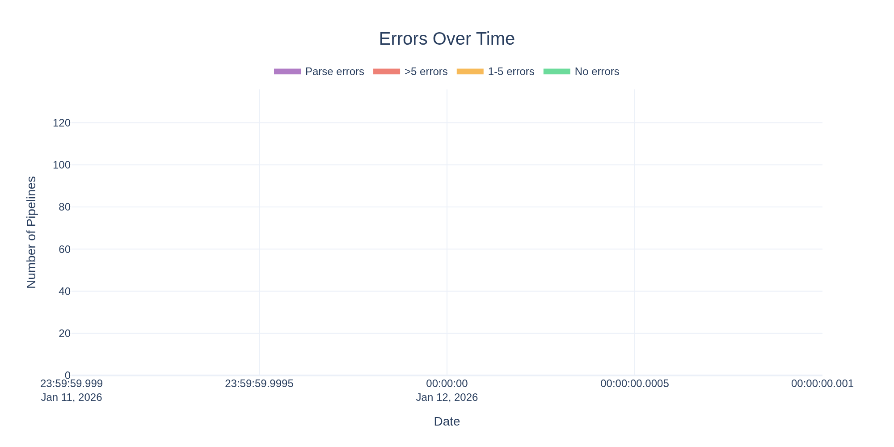
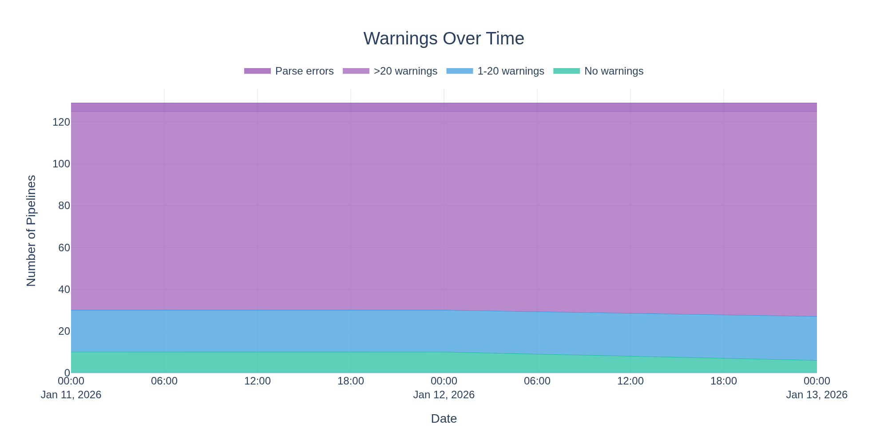

# nf-core Strict Syntax Health Report

This repository tracks the health of nf-core pipelines with respect to Nextflow's _strict syntax_ linting.

The [Nextflow docs](https://www.nextflow.io/docs/latest/strict-syntax.html) describes the differences from standard Nextflow syntax and includes many examples to help with migration and fixing errors.
Strict syntax is backwards compatible with existing Nextflow code, but enforces stricter rules to catch common errors and improve code quality.

The goal is for all nf-core pipelines to run without errors using strict syntax.

> [!IMPORTANT]
> See the [nf-core blog post](https://nf-co.re/blog/2025/nextflow_syntax_nf-core_roadmap) for details on the migration timeline.
> **Fixing all errors from `nextflow lint` will be a requirement by early spring 2026.**

- **Last updated:** 2026-01-13 11:13:53 UTC
- **Nextflow version:** 25.12.0-edge
- **Total:** 4 parse errors, 3355 errors, 9505 warnings across 129 pipelines
- **Zero errors:** 13 pipelines (10.1%)

## Trends

### Errors



### Warnings



## Results

| Pipeline                                                                              | Parse Error | Errors | Warnings |                       Lint Output                       |
| ------------------------------------------------------------------------------------- | :---------: | -----: | -------: | :-----------------------------------------------------: |
| :x: [airrflow](https://github.com/nf-core/airrflow)                                   |     Yes     |      - |        - |         [View](lint_results/airrflow_lint.txt)          |
| :x: [deepmodeloptim](https://github.com/nf-core/deepmodeloptim)                       |     Yes     |      - |        - |      [View](lint_results/deepmodeloptim_lint.txt)       |
| :x: [pixelator](https://github.com/nf-core/pixelator)                                 |     Yes     |      - |        - |         [View](lint_results/pixelator_lint.txt)         |
| :x: [sarek](https://github.com/nf-core/sarek)                                         |     Yes     |      - |        - |           [View](lint_results/sarek_lint.txt)           |
| :x: [oncoanalyser](https://github.com/nf-core/oncoanalyser)                           |     No      |    305 |      102 |       [View](lint_results/oncoanalyser_lint.txt)        |
| :x: [eager](https://github.com/nf-core/eager)                                         |     No      |    121 |      380 |           [View](lint_results/eager_lint.txt)           |
| :x: [deepmutscan](https://github.com/nf-core/deepmutscan)                             |     No      |    121 |      118 |        [View](lint_results/deepmutscan_lint.txt)        |
| :x: [rnaseq](https://github.com/nf-core/rnaseq)                                       |     No      |     89 |      284 |          [View](lint_results/rnaseq_lint.txt)           |
| :x: [hicar](https://github.com/nf-core/hicar)                                         |     No      |     89 |      122 |           [View](lint_results/hicar_lint.txt)           |
| :x: [genomeannotator](https://github.com/nf-core/genomeannotator)                     |     No      |     85 |      148 |      [View](lint_results/genomeannotator_lint.txt)      |
| :x: [evexplorer](https://github.com/nf-core/evexplorer)                               |     No      |     75 |       53 |        [View](lint_results/evexplorer_lint.txt)         |
| :x: [scnanoseq](https://github.com/nf-core/scnanoseq)                                 |     No      |     74 |      140 |         [View](lint_results/scnanoseq_lint.txt)         |
| :x: [diseasemodulediscovery](https://github.com/nf-core/diseasemodulediscovery)       |     No      |     69 |       80 |  [View](lint_results/diseasemodulediscovery_lint.txt)   |
| :x: [viralintegration](https://github.com/nf-core/viralintegration)                   |     No      |     66 |       13 |     [View](lint_results/viralintegration_lint.txt)      |
| :x: [metatdenovo](https://github.com/nf-core/metatdenovo)                             |     No      |     64 |      157 |        [View](lint_results/metatdenovo_lint.txt)        |
| :x: [cageseq](https://github.com/nf-core/cageseq)                                     |     No      |     62 |       69 |          [View](lint_results/cageseq_lint.txt)          |
| :x: [phageannotator](https://github.com/nf-core/phageannotator)                       |     No      |     59 |       98 |      [View](lint_results/phageannotator_lint.txt)       |
| :x: [atacseq](https://github.com/nf-core/atacseq)                                     |     No      |     56 |      205 |          [View](lint_results/atacseq_lint.txt)          |
| :x: [variantcatalogue](https://github.com/nf-core/variantcatalogue)                   |     No      |     55 |       48 |     [View](lint_results/variantcatalogue_lint.txt)      |
| :x: [demultiplex](https://github.com/nf-core/demultiplex)                             |     No      |     54 |       67 |        [View](lint_results/demultiplex_lint.txt)        |
| :x: [readsimulator](https://github.com/nf-core/readsimulator)                         |     No      |     53 |       49 |       [View](lint_results/readsimulator_lint.txt)       |
| :x: [metaboigniter](https://github.com/nf-core/metaboigniter)                         |     No      |     52 |      123 |       [View](lint_results/metaboigniter_lint.txt)       |
| :x: [imcyto](https://github.com/nf-core/imcyto)                                       |     No      |     52 |       14 |          [View](lint_results/imcyto_lint.txt)           |
| :x: [spinningjenny](https://github.com/nf-core/spinningjenny)                         |     No      |     50 |        9 |       [View](lint_results/spinningjenny_lint.txt)       |
| :x: [rnasplice](https://github.com/nf-core/rnasplice)                                 |     No      |     49 |      190 |         [View](lint_results/rnasplice_lint.txt)         |
| :x: [chipseq](https://github.com/nf-core/chipseq)                                     |     No      |     47 |      181 |          [View](lint_results/chipseq_lint.txt)          |
| :x: [radseq](https://github.com/nf-core/radseq)                                       |     No      |     45 |       42 |          [View](lint_results/radseq_lint.txt)           |
| :x: [meerpipe](https://github.com/nf-core/meerpipe)                                   |     No      |     44 |       84 |         [View](lint_results/meerpipe_lint.txt)          |
| :x: [omicsgenetraitassociation](https://github.com/nf-core/omicsgenetraitassociation) |     No      |     44 |       30 | [View](lint_results/omicsgenetraitassociation_lint.txt) |
| :x: [viralrecon](https://github.com/nf-core/viralrecon)                               |     No      |     43 |       98 |        [View](lint_results/viralrecon_lint.txt)         |
| :x: [callingcards](https://github.com/nf-core/callingcards)                           |     No      |     41 |      168 |       [View](lint_results/callingcards_lint.txt)        |
| :x: [pathogensurveillance](https://github.com/nf-core/pathogensurveillance)           |     No      |     40 |      486 |   [View](lint_results/pathogensurveillance_lint.txt)    |
| :x: [riboseq](https://github.com/nf-core/riboseq)                                     |     No      |     40 |      181 |          [View](lint_results/riboseq_lint.txt)          |
| :x: [lncpipe](https://github.com/nf-core/lncpipe)                                     |     No      |     40 |      176 |          [View](lint_results/lncpipe_lint.txt)          |
| :x: [genomeskim](https://github.com/nf-core/genomeskim)                               |     No      |     40 |       13 |        [View](lint_results/genomeskim_lint.txt)         |
| :x: [coproid](https://github.com/nf-core/coproid)                                     |     No      |     38 |       58 |          [View](lint_results/coproid_lint.txt)          |
| :x: [circdna](https://github.com/nf-core/circdna)                                     |     No      |     38 |       30 |          [View](lint_results/circdna_lint.txt)          |
| :x: [marsseq](https://github.com/nf-core/marsseq)                                     |     No      |     37 |       64 |          [View](lint_results/marsseq_lint.txt)          |
| :x: [nanoseq](https://github.com/nf-core/nanoseq)                                     |     No      |     36 |       43 |          [View](lint_results/nanoseq_lint.txt)          |
| :x: [proteomicslfq](https://github.com/nf-core/proteomicslfq)                         |     No      |     36 |        0 |       [View](lint_results/proteomicslfq_lint.txt)       |
| :x: [nascent](https://github.com/nf-core/nascent)                                     |     No      |     34 |      162 |          [View](lint_results/nascent_lint.txt)          |
| :x: [genomeqc](https://github.com/nf-core/genomeqc)                                   |     No      |     33 |      101 |         [View](lint_results/genomeqc_lint.txt)          |
| :x: [rarevariantburden](https://github.com/nf-core/rarevariantburden)                 |     No      |     33 |       22 |     [View](lint_results/rarevariantburden_lint.txt)     |
| :x: [rnadnavar](https://github.com/nf-core/rnadnavar)                                 |     No      |     31 |      371 |         [View](lint_results/rnadnavar_lint.txt)         |
| :x: [multiplesequencealign](https://github.com/nf-core/multiplesequencealign)         |     No      |     31 |      158 |   [View](lint_results/multiplesequencealign_lint.txt)   |
| :x: [denovotranscript](https://github.com/nf-core/denovotranscript)                   |     No      |     31 |       51 |     [View](lint_results/denovotranscript_lint.txt)      |
| :x: [alleleexpression](https://github.com/nf-core/alleleexpression)                   |     No      |     31 |       37 |     [View](lint_results/alleleexpression_lint.txt)      |
| :x: [raredisease](https://github.com/nf-core/raredisease)                             |     No      |     30 |       55 |        [View](lint_results/raredisease_lint.txt)        |
| :x: [stableexpression](https://github.com/nf-core/stableexpression)                   |     No      |     28 |       36 |     [View](lint_results/stableexpression_lint.txt)      |
| :x: [bacass](https://github.com/nf-core/bacass)                                       |     No      |     27 |      131 |          [View](lint_results/bacass_lint.txt)           |
| :x: [hic](https://github.com/nf-core/hic)                                             |     No      |     27 |       73 |            [View](lint_results/hic_lint.txt)            |
| :x: [bactmap](https://github.com/nf-core/bactmap)                                     |     No      |     27 |       64 |          [View](lint_results/bactmap_lint.txt)          |
| :x: [magmap](https://github.com/nf-core/magmap)                                       |     No      |     26 |       70 |          [View](lint_results/magmap_lint.txt)           |
| :x: [abotyper](https://github.com/nf-core/abotyper)                                   |     No      |     26 |       64 |         [View](lint_results/abotyper_lint.txt)          |
| :x: [scrnaseq](https://github.com/nf-core/scrnaseq)                                   |     No      |     22 |      111 |         [View](lint_results/scrnaseq_lint.txt)          |
| :x: [sammyseq](https://github.com/nf-core/sammyseq)                                   |     No      |     21 |      148 |         [View](lint_results/sammyseq_lint.txt)          |
| :x: [mcmicro](https://github.com/nf-core/mcmicro)                                     |     No      |     21 |       48 |          [View](lint_results/mcmicro_lint.txt)          |
| :x: [rangeland](https://github.com/nf-core/rangeland)                                 |     No      |     21 |       43 |         [View](lint_results/rangeland_lint.txt)         |
| :x: [epitopeprediction](https://github.com/nf-core/epitopeprediction)                 |     No      |     20 |       22 |     [View](lint_results/epitopeprediction_lint.txt)     |
| :x: [datasync](https://github.com/nf-core/datasync)                                   |     No      |     19 |       20 |         [View](lint_results/datasync_lint.txt)          |
| :x: [viralmetagenome](https://github.com/nf-core/viralmetagenome)                     |     No      |     18 |      207 |      [View](lint_results/viralmetagenome_lint.txt)      |
| :x: [cutandrun](https://github.com/nf-core/cutandrun)                                 |     No      |     17 |      152 |         [View](lint_results/cutandrun_lint.txt)         |
| :x: [phyloplace](https://github.com/nf-core/phyloplace)                               |     No      |     17 |      106 |        [View](lint_results/phyloplace_lint.txt)         |
| :x: [hlatyping](https://github.com/nf-core/hlatyping)                                 |     No      |     17 |       16 |         [View](lint_results/hlatyping_lint.txt)         |
| :x: [slamseq](https://github.com/nf-core/slamseq)                                     |     No      |     17 |        0 |          [View](lint_results/slamseq_lint.txt)          |
| :x: [genomeassembler](https://github.com/nf-core/genomeassembler)                     |     No      |     16 |       92 |      [View](lint_results/genomeassembler_lint.txt)      |
| :x: [diaproteomics](https://github.com/nf-core/diaproteomics)                         |     No      |     16 |        0 |       [View](lint_results/diaproteomics_lint.txt)       |
| :x: [clipseq](https://github.com/nf-core/clipseq)                                     |     No      |     15 |        0 |          [View](lint_results/clipseq_lint.txt)          |
| :x: [mnaseseq](https://github.com/nf-core/mnaseseq)                                   |     No      |     15 |        0 |         [View](lint_results/mnaseseq_lint.txt)          |
| :x: [proteogenomicsdb](https://github.com/nf-core/proteogenomicsdb)                   |     No      |     15 |        0 |     [View](lint_results/proteogenomicsdb_lint.txt)      |
| :x: [circrna](https://github.com/nf-core/circrna)                                     |     No      |     14 |      157 |          [View](lint_results/circrna_lint.txt)          |
| :x: [pangenome](https://github.com/nf-core/pangenome)                                 |     No      |     14 |       63 |         [View](lint_results/pangenome_lint.txt)         |
| :x: [differentialabundance](https://github.com/nf-core/differentialabundance)         |     No      |     14 |       50 |   [View](lint_results/differentialabundance_lint.txt)   |
| :x: [tbanalyzer](https://github.com/nf-core/tbanalyzer)                               |     No      |     14 |       47 |        [View](lint_results/tbanalyzer_lint.txt)         |
| :x: [spatialvi](https://github.com/nf-core/spatialvi)                                 |     No      |     14 |       20 |         [View](lint_results/spatialvi_lint.txt)         |
| :x: [rnafusion](https://github.com/nf-core/rnafusion)                                 |     No      |     13 |      116 |         [View](lint_results/rnafusion_lint.txt)         |
| :x: [detaxizer](https://github.com/nf-core/detaxizer)                                 |     No      |     13 |       61 |         [View](lint_results/detaxizer_lint.txt)         |
| :x: [crisprseq](https://github.com/nf-core/crisprseq)                                 |     No      |     13 |       45 |         [View](lint_results/crisprseq_lint.txt)         |
| :x: [sopa](https://github.com/nf-core/sopa)                                           |     No      |     13 |       17 |           [View](lint_results/sopa_lint.txt)            |
| :x: [variantbenchmarking](https://github.com/nf-core/variantbenchmarking)             |     No      |     12 |      144 |    [View](lint_results/variantbenchmarking_lint.txt)    |
| :x: [drop](https://github.com/nf-core/drop)                                           |     No      |     12 |       77 |           [View](lint_results/drop_lint.txt)            |
| :x: [pacvar](https://github.com/nf-core/pacvar)                                       |     No      |     12 |       50 |          [View](lint_results/pacvar_lint.txt)           |
| :x: [smrnaseq](https://github.com/nf-core/smrnaseq)                                   |     No      |     11 |       74 |         [View](lint_results/smrnaseq_lint.txt)          |
| :x: [metapep](https://github.com/nf-core/metapep)                                     |     No      |     11 |       34 |          [View](lint_results/metapep_lint.txt)          |
| :x: [hgtseq](https://github.com/nf-core/hgtseq)                                       |     No      |     10 |       69 |          [View](lint_results/hgtseq_lint.txt)           |
| :x: [proteinfamilies](https://github.com/nf-core/proteinfamilies)                     |     No      |     10 |       19 |      [View](lint_results/proteinfamilies_lint.txt)      |
| :x: [mhcquant](https://github.com/nf-core/mhcquant)                                   |     No      |      9 |       60 |         [View](lint_results/mhcquant_lint.txt)          |
| :x: [tumourevo](https://github.com/nf-core/tumourevo)                                 |     No      |      9 |       56 |         [View](lint_results/tumourevo_lint.txt)         |
| :x: [fastqrepair](https://github.com/nf-core/fastqrepair)                             |     No      |      9 |       32 |        [View](lint_results/fastqrepair_lint.txt)        |
| :x: [drugresponseeval](https://github.com/nf-core/drugresponseeval)                   |     No      |      7 |       29 |     [View](lint_results/drugresponseeval_lint.txt)      |
| :x: [longraredisease](https://github.com/nf-core/longraredisease)                     |     No      |      6 |      121 |      [View](lint_results/longraredisease_lint.txt)      |
| :x: [funcscan](https://github.com/nf-core/funcscan)                                   |     No      |      6 |      115 |         [View](lint_results/funcscan_lint.txt)          |
| :x: [tfactivity](https://github.com/nf-core/tfactivity)                               |     No      |      6 |       57 |        [View](lint_results/tfactivity_lint.txt)         |
| :x: [lsmquant](https://github.com/nf-core/lsmquant)                                   |     No      |      6 |       54 |         [View](lint_results/lsmquant_lint.txt)          |
| :x: [cellpainting](https://github.com/nf-core/cellpainting)                           |     No      |      6 |       35 |       [View](lint_results/cellpainting_lint.txt)        |
| :x: [fastquorum](https://github.com/nf-core/fastquorum)                               |     No      |      6 |       28 |        [View](lint_results/fastquorum_lint.txt)         |
| :x: [fetchngs](https://github.com/nf-core/fetchngs)                                   |     No      |      6 |       25 |         [View](lint_results/fetchngs_lint.txt)          |
| :x: [demo](https://github.com/nf-core/demo)                                           |     No      |      6 |       17 |           [View](lint_results/demo_lint.txt)            |
| :x: [gwas](https://github.com/nf-core/gwas)                                           |     No      |      6 |       16 |           [View](lint_results/gwas_lint.txt)            |
| :x: [kmermaid](https://github.com/nf-core/kmermaid)                                   |     No      |      6 |       16 |         [View](lint_results/kmermaid_lint.txt)          |
| :x: [mitodetect](https://github.com/nf-core/mitodetect)                               |     No      |      6 |       16 |        [View](lint_results/mitodetect_lint.txt)         |
| :x: [panoramaseq](https://github.com/nf-core/panoramaseq)                             |     No      |      6 |       16 |        [View](lint_results/panoramaseq_lint.txt)        |
| :x: [troughgraph](https://github.com/nf-core/troughgraph)                             |     No      |      6 |       16 |        [View](lint_results/troughgraph_lint.txt)        |
| :x: [variantprioritization](https://github.com/nf-core/variantprioritization)         |     No      |      6 |       14 |   [View](lint_results/variantprioritization_lint.txt)   |
| :x: [ampliseq](https://github.com/nf-core/ampliseq)                                   |     No      |      4 |      148 |         [View](lint_results/ampliseq_lint.txt)          |
| :x: [nanostring](https://github.com/nf-core/nanostring)                               |     No      |      4 |       23 |        [View](lint_results/nanostring_lint.txt)         |
| :x: [methylseq](https://github.com/nf-core/methylseq)                                 |     No      |      3 |       65 |         [View](lint_results/methylseq_lint.txt)         |
| :x: [methylarray](https://github.com/nf-core/methylarray)                             |     No      |      3 |       19 |        [View](lint_results/methylarray_lint.txt)        |
| :x: [reportho](https://github.com/nf-core/reportho)                                   |     No      |      2 |       90 |         [View](lint_results/reportho_lint.txt)          |
| :x: [dualrnaseq](https://github.com/nf-core/dualrnaseq)                               |     No      |      2 |       48 |        [View](lint_results/dualrnaseq_lint.txt)         |
| :x: [pairgenomealign](https://github.com/nf-core/pairgenomealign)                     |     No      |      2 |       36 |      [View](lint_results/pairgenomealign_lint.txt)      |
| :x: [scdownstream](https://github.com/nf-core/scdownstream)                           |     No      |      2 |       30 |       [View](lint_results/scdownstream_lint.txt)        |
| :x: [taxprofiler](https://github.com/nf-core/taxprofiler)                             |     No      |      1 |      140 |        [View](lint_results/taxprofiler_lint.txt)        |
| :x: [phaseimpute](https://github.com/nf-core/phaseimpute)                             |     No      |      1 |      128 |        [View](lint_results/phaseimpute_lint.txt)        |
| :x: [seqsubmit](https://github.com/nf-core/seqsubmit)                                 |     No      |      1 |       32 |         [View](lint_results/seqsubmit_lint.txt)         |
| :x: [seqinspector](https://github.com/nf-core/seqinspector)                           |     No      |      1 |       14 |       [View](lint_results/seqinspector_lint.txt)        |
| :white_check_mark: [spatialxe](https://github.com/nf-core/spatialxe)                  |     No      |      0 |       98 |         [View](lint_results/spatialxe_lint.txt)         |
| :white_check_mark: [methylong](https://github.com/nf-core/methylong)                  |     No      |      0 |       81 |         [View](lint_results/methylong_lint.txt)         |
| :white_check_mark: [molkart](https://github.com/nf-core/molkart)                      |     No      |      0 |       63 |          [View](lint_results/molkart_lint.txt)          |
| :white_check_mark: [mag](https://github.com/nf-core/mag)                              |     No      |      0 |       35 |            [View](lint_results/mag_lint.txt)            |
| :white_check_mark: [createtaxdb](https://github.com/nf-core/createtaxdb)              |     No      |      0 |       33 |        [View](lint_results/createtaxdb_lint.txt)        |
| :white_check_mark: [isoseq](https://github.com/nf-core/isoseq)                        |     No      |      0 |       31 |          [View](lint_results/isoseq_lint.txt)           |
| :white_check_mark: [references](https://github.com/nf-core/references)                |     No      |      0 |       31 |        [View](lint_results/references_lint.txt)         |
| :white_check_mark: [ribomsqc](https://github.com/nf-core/ribomsqc)                    |     No      |      0 |       27 |         [View](lint_results/ribomsqc_lint.txt)          |
| :white_check_mark: [proteinfold](https://github.com/nf-core/proteinfold)              |     No      |      0 |       25 |        [View](lint_results/proteinfold_lint.txt)        |
| :white_check_mark: [bamtofastq](https://github.com/nf-core/bamtofastq)                |     No      |      0 |       21 |        [View](lint_results/bamtofastq_lint.txt)         |
| :white_check_mark: [createpanelrefs](https://github.com/nf-core/createpanelrefs)      |     No      |      0 |       15 |      [View](lint_results/createpanelrefs_lint.txt)      |
| :white_check_mark: [rnavar](https://github.com/nf-core/rnavar)                        |     No      |      0 |       14 |          [View](lint_results/rnavar_lint.txt)           |
| :white_check_mark: [proteinannotator](https://github.com/nf-core/proteinannotator)    |     No      |      0 |        9 |     [View](lint_results/proteinannotator_lint.txt)      |

## About

This report is generated weekly by running `nextflow lint` on each nf-core pipeline.
The linting checks for strict syntax compliance in Nextflow DSL2 code.

- **Parse errors** indicate pipelines where `nextflow lint` could not run at all, typically due to syntax errors that prevent Nextflow from parsing the pipeline code
- **Errors** indicate syntax issues that will cause problems in future Nextflow versions
- **Warnings** indicate deprecated patterns that should be updated, but having warnings is fine (though it's nice to fix those as well if possible)

## Running Locally

You can run `nextflow lint` on your own pipeline to check for strict syntax issues:

```bash
nextflow lint .
```

See the [strict syntax documentation](https://www.nextflow.io/docs/latest/strict-syntax.html) for more information about the rules being checked.

## Getting Help

If you need help fixing strict syntax errors in your pipeline, the [Nextflow community forum](https://community.seqera.io/) is a great place to ask questions.
