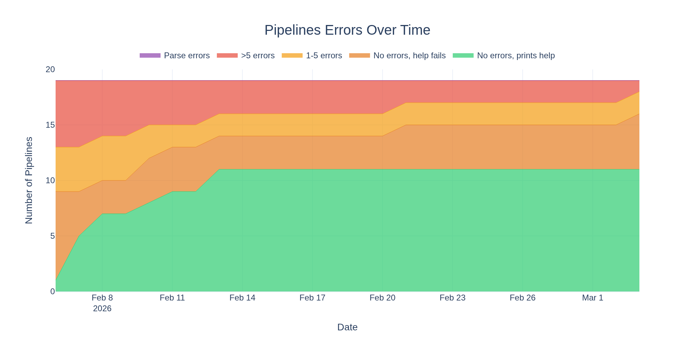
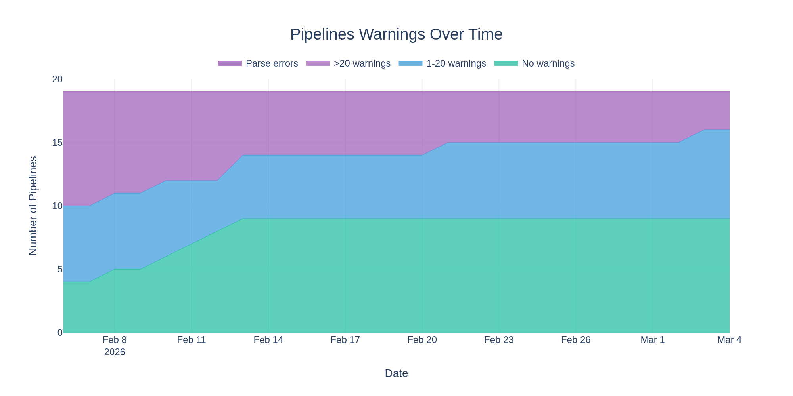
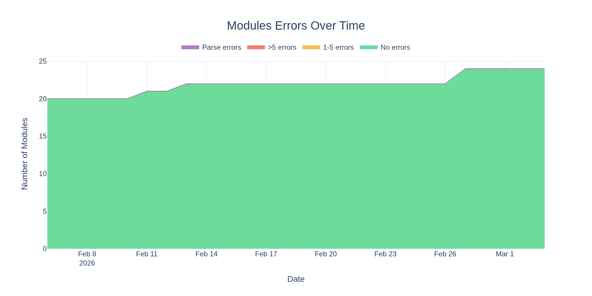
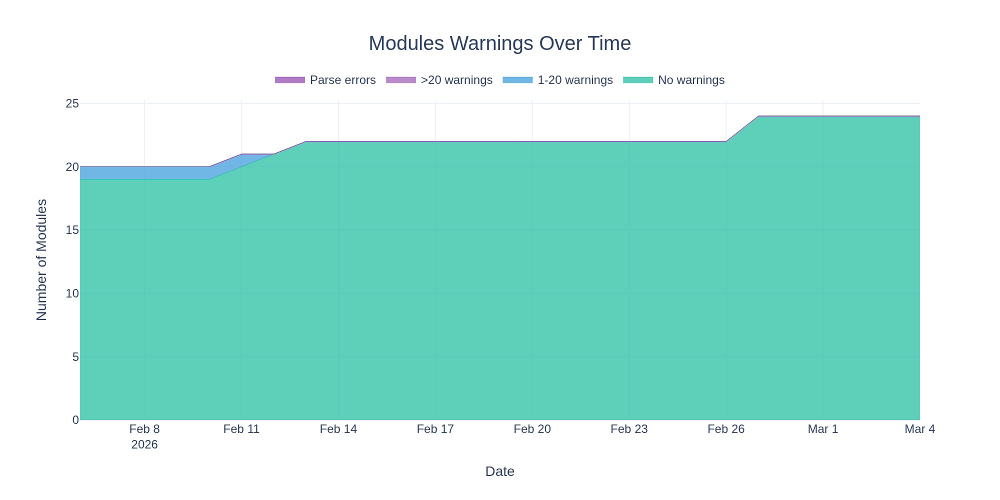
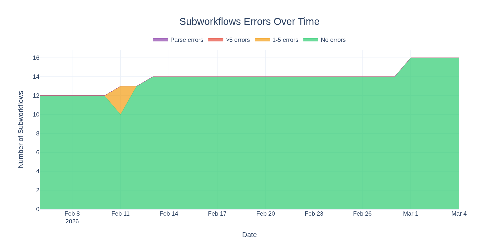
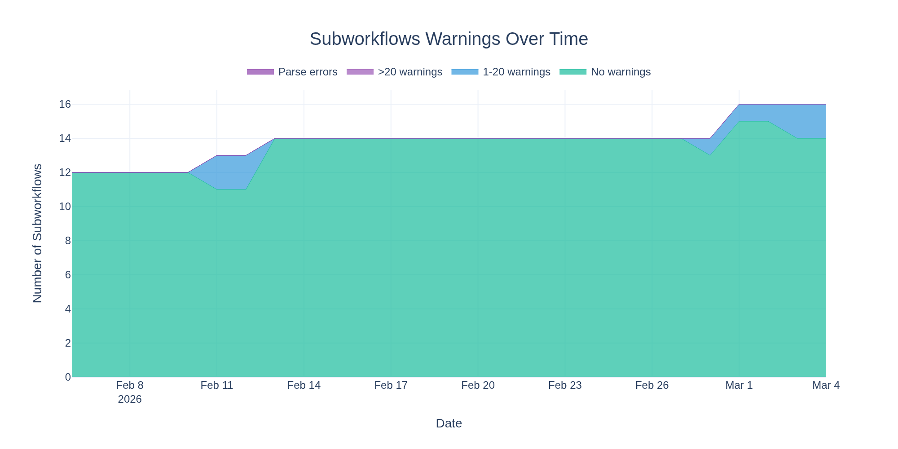

# nf-core Strict Syntax Health Report

This repository tracks the health of nf-core pipelines, modules, and subworkflows with respect to Nextflow's _strict syntax_ linting.

The [Nextflow docs](https://www.nextflow.io/docs/latest/strict-syntax.html) describes the differences from standard Nextflow syntax and includes many examples to help with migration and fixing errors.
Strict syntax is backwards compatible with existing Nextflow code, but enforces stricter rules to catch common errors and improve code quality.

The goal is for all nf-core pipelines to run without errors using strict syntax.

> [!IMPORTANT]
> See the [nf-core blog post](https://nf-co.re/blog/2025/nextflow_syntax_nf-core_roadmap) for details on the migration timeline.
> **Fixing all errors from `nextflow lint` will be a requirement by early spring 2026.**

- **Last updated:** 2026-01-16 02:17:30 UTC
- **Nextflow version:** 25.12.0-edge

## Pipelines

- **Total:** 0 parse errors, 3645 errors, 10331 warnings across 129 pipelines
- **Zero errors:** 16 pipelines (12.4%)

|                    Errors                    |                     Warnings                     |
| :------------------------------------------: | :----------------------------------------------: |
|  |  |

<details>
<summary>Pipeline Results (129 pipelines)</summary>

| Pipeline                                                                              | Parse Error | Errors | Warnings |                               Lint Output                               |
| ------------------------------------------------------------------------------------- | :---------: | -----: | -------: | :---------------------------------------------------------------------: |
| :x: [oncoanalyser](https://github.com/nf-core/oncoanalyser)                           |     No      |    305 |      102 |       [View](lint_results/pipeline-results/oncoanalyser_lint.md)        |
| :x: [sarek](https://github.com/nf-core/sarek)                                         |     No      |    152 |      608 |           [View](lint_results/pipeline-results/sarek_lint.md)           |
| :x: [airrflow](https://github.com/nf-core/airrflow)                                   |     No      |    151 |      141 |         [View](lint_results/pipeline-results/airrflow_lint.md)          |
| :x: [eager](https://github.com/nf-core/eager)                                         |     No      |    121 |      380 |           [View](lint_results/pipeline-results/eager_lint.md)           |
| :x: [deepmutscan](https://github.com/nf-core/deepmutscan)                             |     No      |    121 |      118 |        [View](lint_results/pipeline-results/deepmutscan_lint.md)        |
| :x: [rnaseq](https://github.com/nf-core/rnaseq)                                       |     No      |     89 |      284 |          [View](lint_results/pipeline-results/rnaseq_lint.md)           |
| :x: [hicar](https://github.com/nf-core/hicar)                                         |     No      |     89 |      122 |           [View](lint_results/pipeline-results/hicar_lint.md)           |
| :x: [genomeannotator](https://github.com/nf-core/genomeannotator)                     |     No      |     85 |      148 |      [View](lint_results/pipeline-results/genomeannotator_lint.md)      |
| :x: [evexplorer](https://github.com/nf-core/evexplorer)                               |     No      |     75 |       53 |        [View](lint_results/pipeline-results/evexplorer_lint.md)         |
| :x: [scnanoseq](https://github.com/nf-core/scnanoseq)                                 |     No      |     74 |      140 |         [View](lint_results/pipeline-results/scnanoseq_lint.md)         |
| :x: [diseasemodulediscovery](https://github.com/nf-core/diseasemodulediscovery)       |     No      |     69 |       80 |  [View](lint_results/pipeline-results/diseasemodulediscovery_lint.md)   |
| :x: [viralintegration](https://github.com/nf-core/viralintegration)                   |     No      |     66 |       13 |     [View](lint_results/pipeline-results/viralintegration_lint.md)      |
| :x: [metatdenovo](https://github.com/nf-core/metatdenovo)                             |     No      |     64 |      157 |        [View](lint_results/pipeline-results/metatdenovo_lint.md)        |
| :x: [cageseq](https://github.com/nf-core/cageseq)                                     |     No      |     62 |       69 |          [View](lint_results/pipeline-results/cageseq_lint.md)          |
| :x: [phageannotator](https://github.com/nf-core/phageannotator)                       |     No      |     59 |       98 |      [View](lint_results/pipeline-results/phageannotator_lint.md)       |
| :x: [atacseq](https://github.com/nf-core/atacseq)                                     |     No      |     56 |      205 |          [View](lint_results/pipeline-results/atacseq_lint.md)          |
| :x: [variantcatalogue](https://github.com/nf-core/variantcatalogue)                   |     No      |     55 |       48 |     [View](lint_results/pipeline-results/variantcatalogue_lint.md)      |
| :x: [demultiplex](https://github.com/nf-core/demultiplex)                             |     No      |     54 |       67 |        [View](lint_results/pipeline-results/demultiplex_lint.md)        |
| :x: [readsimulator](https://github.com/nf-core/readsimulator)                         |     No      |     53 |       49 |       [View](lint_results/pipeline-results/readsimulator_lint.md)       |
| :x: [metaboigniter](https://github.com/nf-core/metaboigniter)                         |     No      |     52 |      123 |       [View](lint_results/pipeline-results/metaboigniter_lint.md)       |
| :x: [imcyto](https://github.com/nf-core/imcyto)                                       |     No      |     52 |       14 |          [View](lint_results/pipeline-results/imcyto_lint.md)           |
| :x: [spinningjenny](https://github.com/nf-core/spinningjenny)                         |     No      |     50 |        9 |       [View](lint_results/pipeline-results/spinningjenny_lint.md)       |
| :x: [rnasplice](https://github.com/nf-core/rnasplice)                                 |     No      |     49 |      190 |         [View](lint_results/pipeline-results/rnasplice_lint.md)         |
| :x: [chipseq](https://github.com/nf-core/chipseq)                                     |     No      |     47 |      181 |          [View](lint_results/pipeline-results/chipseq_lint.md)          |
| :x: [radseq](https://github.com/nf-core/radseq)                                       |     No      |     45 |       42 |          [View](lint_results/pipeline-results/radseq_lint.md)           |
| :x: [meerpipe](https://github.com/nf-core/meerpipe)                                   |     No      |     44 |       84 |         [View](lint_results/pipeline-results/meerpipe_lint.md)          |
| :x: [omicsgenetraitassociation](https://github.com/nf-core/omicsgenetraitassociation) |     No      |     44 |       30 | [View](lint_results/pipeline-results/omicsgenetraitassociation_lint.md) |
| :x: [viralrecon](https://github.com/nf-core/viralrecon)                               |     No      |     43 |       98 |        [View](lint_results/pipeline-results/viralrecon_lint.md)         |
| :x: [riboseq](https://github.com/nf-core/riboseq)                                     |     No      |     42 |      195 |          [View](lint_results/pipeline-results/riboseq_lint.md)          |
| :x: [callingcards](https://github.com/nf-core/callingcards)                           |     No      |     41 |      168 |       [View](lint_results/pipeline-results/callingcards_lint.md)        |
| :x: [pathogensurveillance](https://github.com/nf-core/pathogensurveillance)           |     No      |     40 |      486 |   [View](lint_results/pipeline-results/pathogensurveillance_lint.md)    |
| :x: [lncpipe](https://github.com/nf-core/lncpipe)                                     |     No      |     40 |      176 |          [View](lint_results/pipeline-results/lncpipe_lint.md)          |
| :x: [genomeskim](https://github.com/nf-core/genomeskim)                               |     No      |     40 |       13 |        [View](lint_results/pipeline-results/genomeskim_lint.md)         |
| :x: [coproid](https://github.com/nf-core/coproid)                                     |     No      |     38 |       58 |          [View](lint_results/pipeline-results/coproid_lint.md)          |
| :x: [circdna](https://github.com/nf-core/circdna)                                     |     No      |     38 |       30 |          [View](lint_results/pipeline-results/circdna_lint.md)          |
| :x: [marsseq](https://github.com/nf-core/marsseq)                                     |     No      |     37 |       64 |          [View](lint_results/pipeline-results/marsseq_lint.md)          |
| :x: [nanoseq](https://github.com/nf-core/nanoseq)                                     |     No      |     36 |       43 |          [View](lint_results/pipeline-results/nanoseq_lint.md)          |
| :x: [proteomicslfq](https://github.com/nf-core/proteomicslfq)                         |     No      |     36 |        0 |       [View](lint_results/pipeline-results/proteomicslfq_lint.md)       |
| :x: [nascent](https://github.com/nf-core/nascent)                                     |     No      |     34 |      162 |          [View](lint_results/pipeline-results/nascent_lint.md)          |
| :x: [genomeqc](https://github.com/nf-core/genomeqc)                                   |     No      |     34 |      114 |         [View](lint_results/pipeline-results/genomeqc_lint.md)          |
| :x: [rarevariantburden](https://github.com/nf-core/rarevariantburden)                 |     No      |     33 |       22 |     [View](lint_results/pipeline-results/rarevariantburden_lint.md)     |
| :x: [rnadnavar](https://github.com/nf-core/rnadnavar)                                 |     No      |     31 |      371 |         [View](lint_results/pipeline-results/rnadnavar_lint.md)         |
| :x: [multiplesequencealign](https://github.com/nf-core/multiplesequencealign)         |     No      |     31 |      158 |   [View](lint_results/pipeline-results/multiplesequencealign_lint.md)   |
| :x: [denovotranscript](https://github.com/nf-core/denovotranscript)                   |     No      |     31 |       51 |     [View](lint_results/pipeline-results/denovotranscript_lint.md)      |
| :x: [raredisease](https://github.com/nf-core/raredisease)                             |     No      |     30 |       55 |        [View](lint_results/pipeline-results/raredisease_lint.md)        |
| :x: [stableexpression](https://github.com/nf-core/stableexpression)                   |     No      |     28 |       36 |     [View](lint_results/pipeline-results/stableexpression_lint.md)      |
| :x: [bacass](https://github.com/nf-core/bacass)                                       |     No      |     27 |      131 |          [View](lint_results/pipeline-results/bacass_lint.md)           |
| :x: [hic](https://github.com/nf-core/hic)                                             |     No      |     27 |       73 |            [View](lint_results/pipeline-results/hic_lint.md)            |
| :x: [bactmap](https://github.com/nf-core/bactmap)                                     |     No      |     27 |       64 |          [View](lint_results/pipeline-results/bactmap_lint.md)          |
| :x: [magmap](https://github.com/nf-core/magmap)                                       |     No      |     26 |       70 |          [View](lint_results/pipeline-results/magmap_lint.md)           |
| :x: [abotyper](https://github.com/nf-core/abotyper)                                   |     No      |     26 |       64 |         [View](lint_results/pipeline-results/abotyper_lint.md)          |
| :x: [scrnaseq](https://github.com/nf-core/scrnaseq)                                   |     No      |     22 |      111 |         [View](lint_results/pipeline-results/scrnaseq_lint.md)          |
| :x: [sammyseq](https://github.com/nf-core/sammyseq)                                   |     No      |     21 |      148 |         [View](lint_results/pipeline-results/sammyseq_lint.md)          |
| :x: [mcmicro](https://github.com/nf-core/mcmicro)                                     |     No      |     21 |       48 |          [View](lint_results/pipeline-results/mcmicro_lint.md)          |
| :x: [rangeland](https://github.com/nf-core/rangeland)                                 |     No      |     21 |       43 |         [View](lint_results/pipeline-results/rangeland_lint.md)         |
| :x: [epitopeprediction](https://github.com/nf-core/epitopeprediction)                 |     No      |     20 |       22 |     [View](lint_results/pipeline-results/epitopeprediction_lint.md)     |
| :x: [datasync](https://github.com/nf-core/datasync)                                   |     No      |     19 |       20 |         [View](lint_results/pipeline-results/datasync_lint.md)          |
| :x: [viralmetagenome](https://github.com/nf-core/viralmetagenome)                     |     No      |     18 |      207 |      [View](lint_results/pipeline-results/viralmetagenome_lint.md)      |
| :x: [cutandrun](https://github.com/nf-core/cutandrun)                                 |     No      |     17 |      152 |         [View](lint_results/pipeline-results/cutandrun_lint.md)         |
| :x: [phyloplace](https://github.com/nf-core/phyloplace)                               |     No      |     17 |      106 |        [View](lint_results/pipeline-results/phyloplace_lint.md)         |
| :x: [hlatyping](https://github.com/nf-core/hlatyping)                                 |     No      |     17 |       16 |         [View](lint_results/pipeline-results/hlatyping_lint.md)         |
| :x: [slamseq](https://github.com/nf-core/slamseq)                                     |     No      |     17 |        0 |          [View](lint_results/pipeline-results/slamseq_lint.md)          |
| :x: [genomeassembler](https://github.com/nf-core/genomeassembler)                     |     No      |     16 |       92 |      [View](lint_results/pipeline-results/genomeassembler_lint.md)      |
| :x: [diaproteomics](https://github.com/nf-core/diaproteomics)                         |     No      |     16 |        0 |       [View](lint_results/pipeline-results/diaproteomics_lint.md)       |
| :x: [clipseq](https://github.com/nf-core/clipseq)                                     |     No      |     15 |        0 |          [View](lint_results/pipeline-results/clipseq_lint.md)          |
| :x: [mnaseseq](https://github.com/nf-core/mnaseseq)                                   |     No      |     15 |        0 |         [View](lint_results/pipeline-results/mnaseseq_lint.md)          |
| :x: [proteogenomicsdb](https://github.com/nf-core/proteogenomicsdb)                   |     No      |     15 |        0 |     [View](lint_results/pipeline-results/proteogenomicsdb_lint.md)      |
| :x: [circrna](https://github.com/nf-core/circrna)                                     |     No      |     14 |      157 |          [View](lint_results/pipeline-results/circrna_lint.md)          |
| :x: [pangenome](https://github.com/nf-core/pangenome)                                 |     No      |     14 |       63 |         [View](lint_results/pipeline-results/pangenome_lint.md)         |
| :x: [differentialabundance](https://github.com/nf-core/differentialabundance)         |     No      |     14 |       50 |   [View](lint_results/pipeline-results/differentialabundance_lint.md)   |
| :x: [tbanalyzer](https://github.com/nf-core/tbanalyzer)                               |     No      |     14 |       47 |        [View](lint_results/pipeline-results/tbanalyzer_lint.md)         |
| :x: [spatialvi](https://github.com/nf-core/spatialvi)                                 |     No      |     14 |       20 |         [View](lint_results/pipeline-results/spatialvi_lint.md)         |
| :x: [rnafusion](https://github.com/nf-core/rnafusion)                                 |     No      |     13 |      116 |         [View](lint_results/pipeline-results/rnafusion_lint.md)         |
| :x: [detaxizer](https://github.com/nf-core/detaxizer)                                 |     No      |     13 |       61 |         [View](lint_results/pipeline-results/detaxizer_lint.md)         |
| :x: [crisprseq](https://github.com/nf-core/crisprseq)                                 |     No      |     13 |       45 |         [View](lint_results/pipeline-results/crisprseq_lint.md)         |
| :x: [sopa](https://github.com/nf-core/sopa)                                           |     No      |     13 |       17 |           [View](lint_results/pipeline-results/sopa_lint.md)            |
| :x: [variantbenchmarking](https://github.com/nf-core/variantbenchmarking)             |     No      |     12 |      144 |    [View](lint_results/pipeline-results/variantbenchmarking_lint.md)    |
| :x: [drop](https://github.com/nf-core/drop)                                           |     No      |     12 |       77 |           [View](lint_results/pipeline-results/drop_lint.md)            |
| :x: [pacvar](https://github.com/nf-core/pacvar)                                       |     No      |     12 |       54 |          [View](lint_results/pipeline-results/pacvar_lint.md)           |
| :x: [smrnaseq](https://github.com/nf-core/smrnaseq)                                   |     No      |     11 |       74 |         [View](lint_results/pipeline-results/smrnaseq_lint.md)          |
| :x: [metapep](https://github.com/nf-core/metapep)                                     |     No      |     11 |       34 |          [View](lint_results/pipeline-results/metapep_lint.md)          |
| :x: [hgtseq](https://github.com/nf-core/hgtseq)                                       |     No      |     10 |       69 |          [View](lint_results/pipeline-results/hgtseq_lint.md)           |
| :x: [pixelator](https://github.com/nf-core/pixelator)                                 |     No      |     10 |       65 |         [View](lint_results/pipeline-results/pixelator_lint.md)         |
| :x: [deepmodeloptim](https://github.com/nf-core/deepmodeloptim)                       |     No      |     10 |       49 |      [View](lint_results/pipeline-results/deepmodeloptim_lint.md)       |
| :x: [proteinfamilies](https://github.com/nf-core/proteinfamilies)                     |     No      |     10 |       19 |      [View](lint_results/pipeline-results/proteinfamilies_lint.md)      |
| :x: [mhcquant](https://github.com/nf-core/mhcquant)                                   |     No      |      9 |       60 |         [View](lint_results/pipeline-results/mhcquant_lint.md)          |
| :x: [tumourevo](https://github.com/nf-core/tumourevo)                                 |     No      |      9 |       56 |         [View](lint_results/pipeline-results/tumourevo_lint.md)         |
| :x: [fastqrepair](https://github.com/nf-core/fastqrepair)                             |     No      |      9 |       32 |        [View](lint_results/pipeline-results/fastqrepair_lint.md)        |
| :x: [drugresponseeval](https://github.com/nf-core/drugresponseeval)                   |     No      |      7 |       29 |     [View](lint_results/pipeline-results/drugresponseeval_lint.md)      |
| :x: [longraredisease](https://github.com/nf-core/longraredisease)                     |     No      |      6 |      121 |      [View](lint_results/pipeline-results/longraredisease_lint.md)      |
| :x: [funcscan](https://github.com/nf-core/funcscan)                                   |     No      |      6 |      115 |         [View](lint_results/pipeline-results/funcscan_lint.md)          |
| :x: [tfactivity](https://github.com/nf-core/tfactivity)                               |     No      |      6 |       57 |        [View](lint_results/pipeline-results/tfactivity_lint.md)         |
| :x: [lsmquant](https://github.com/nf-core/lsmquant)                                   |     No      |      6 |       54 |         [View](lint_results/pipeline-results/lsmquant_lint.md)          |
| :x: [cellpainting](https://github.com/nf-core/cellpainting)                           |     No      |      6 |       35 |       [View](lint_results/pipeline-results/cellpainting_lint.md)        |
| :x: [fastquorum](https://github.com/nf-core/fastquorum)                               |     No      |      6 |       28 |        [View](lint_results/pipeline-results/fastquorum_lint.md)         |
| :x: [fetchngs](https://github.com/nf-core/fetchngs)                                   |     No      |      6 |       25 |         [View](lint_results/pipeline-results/fetchngs_lint.md)          |
| :x: [demo](https://github.com/nf-core/demo)                                           |     No      |      6 |       17 |           [View](lint_results/pipeline-results/demo_lint.md)            |
| :x: [gwas](https://github.com/nf-core/gwas)                                           |     No      |      6 |       16 |           [View](lint_results/pipeline-results/gwas_lint.md)            |
| :x: [kmermaid](https://github.com/nf-core/kmermaid)                                   |     No      |      6 |       16 |         [View](lint_results/pipeline-results/kmermaid_lint.md)          |
| :x: [mitodetect](https://github.com/nf-core/mitodetect)                               |     No      |      6 |       16 |        [View](lint_results/pipeline-results/mitodetect_lint.md)         |
| :x: [panoramaseq](https://github.com/nf-core/panoramaseq)                             |     No      |      6 |       16 |        [View](lint_results/pipeline-results/panoramaseq_lint.md)        |
| :x: [troughgraph](https://github.com/nf-core/troughgraph)                             |     No      |      6 |       16 |        [View](lint_results/pipeline-results/troughgraph_lint.md)        |
| :x: [variantprioritization](https://github.com/nf-core/variantprioritization)         |     No      |      6 |       14 |   [View](lint_results/pipeline-results/variantprioritization_lint.md)   |
| :x: [ampliseq](https://github.com/nf-core/ampliseq)                                   |     No      |      4 |      148 |         [View](lint_results/pipeline-results/ampliseq_lint.md)          |
| :x: [methylseq](https://github.com/nf-core/methylseq)                                 |     No      |      3 |       65 |         [View](lint_results/pipeline-results/methylseq_lint.md)         |
| :x: [methylarray](https://github.com/nf-core/methylarray)                             |     No      |      3 |       19 |        [View](lint_results/pipeline-results/methylarray_lint.md)        |
| :x: [reportho](https://github.com/nf-core/reportho)                                   |     No      |      2 |       90 |         [View](lint_results/pipeline-results/reportho_lint.md)          |
| :x: [dualrnaseq](https://github.com/nf-core/dualrnaseq)                               |     No      |      2 |       48 |        [View](lint_results/pipeline-results/dualrnaseq_lint.md)         |
| :x: [pairgenomealign](https://github.com/nf-core/pairgenomealign)                     |     No      |      2 |       36 |      [View](lint_results/pipeline-results/pairgenomealign_lint.md)      |
| :x: [scdownstream](https://github.com/nf-core/scdownstream)                           |     No      |      2 |       30 |       [View](lint_results/pipeline-results/scdownstream_lint.md)        |
| :x: [phaseimpute](https://github.com/nf-core/phaseimpute)                             |     No      |      1 |      128 |        [View](lint_results/pipeline-results/phaseimpute_lint.md)        |
| :x: [seqsubmit](https://github.com/nf-core/seqsubmit)                                 |     No      |      1 |       32 |         [View](lint_results/pipeline-results/seqsubmit_lint.md)         |
| :x: [seqinspector](https://github.com/nf-core/seqinspector)                           |     No      |      1 |       14 |       [View](lint_results/pipeline-results/seqinspector_lint.md)        |
| :white_check_mark: [taxprofiler](https://github.com/nf-core/taxprofiler)              |     No      |      0 |      113 |        [View](lint_results/pipeline-results/taxprofiler_lint.md)        |
| :white_check_mark: [spatialxe](https://github.com/nf-core/spatialxe)                  |     No      |      0 |       98 |         [View](lint_results/pipeline-results/spatialxe_lint.md)         |
| :white_check_mark: [methylong](https://github.com/nf-core/methylong)                  |     No      |      0 |       81 |         [View](lint_results/pipeline-results/methylong_lint.md)         |
| :white_check_mark: [molkart](https://github.com/nf-core/molkart)                      |     No      |      0 |       63 |          [View](lint_results/pipeline-results/molkart_lint.md)          |
| :white_check_mark: [mag](https://github.com/nf-core/mag)                              |     No      |      0 |       35 |            [View](lint_results/pipeline-results/mag_lint.md)            |
| :white_check_mark: [createtaxdb](https://github.com/nf-core/createtaxdb)              |     No      |      0 |       33 |        [View](lint_results/pipeline-results/createtaxdb_lint.md)        |
| :white_check_mark: [isoseq](https://github.com/nf-core/isoseq)                        |     No      |      0 |       31 |          [View](lint_results/pipeline-results/isoseq_lint.md)           |
| :white_check_mark: [references](https://github.com/nf-core/references)                |     No      |      0 |       31 |        [View](lint_results/pipeline-results/references_lint.md)         |
| :white_check_mark: [ribomsqc](https://github.com/nf-core/ribomsqc)                    |     No      |      0 |       27 |         [View](lint_results/pipeline-results/ribomsqc_lint.md)          |
| :white_check_mark: [proteinfold](https://github.com/nf-core/proteinfold)              |     No      |      0 |       25 |        [View](lint_results/pipeline-results/proteinfold_lint.md)        |
| :white_check_mark: [bamtofastq](https://github.com/nf-core/bamtofastq)                |     No      |      0 |       21 |        [View](lint_results/pipeline-results/bamtofastq_lint.md)         |
| :white_check_mark: [alleleexpression](https://github.com/nf-core/alleleexpression)    |     No      |      0 |       20 |     [View](lint_results/pipeline-results/alleleexpression_lint.md)      |
| :white_check_mark: [createpanelrefs](https://github.com/nf-core/createpanelrefs)      |     No      |      0 |       15 |      [View](lint_results/pipeline-results/createpanelrefs_lint.md)      |
| :white_check_mark: [rnavar](https://github.com/nf-core/rnavar)                        |     No      |      0 |       14 |          [View](lint_results/pipeline-results/rnavar_lint.md)           |
| :white_check_mark: [proteinannotator](https://github.com/nf-core/proteinannotator)    |     No      |      0 |        8 |     [View](lint_results/pipeline-results/proteinannotator_lint.md)      |
| :white_check_mark: [nanostring](https://github.com/nf-core/nanostring)                |     No      |      0 |        0 |        [View](lint_results/pipeline-results/nanostring_lint.md)         |

</details>

## Modules

- **Total:** 0 parse errors, 147 errors, 688 warnings across 1358 modules
- **Zero errors:** 1288 modules (94.8%)

|                   Errors                   |                    Warnings                    |
| :----------------------------------------: | :--------------------------------------------: |
|  |  |

<details>
<summary>Module Results (1358 modules)</summary>

| Module                                                                                                                                                                                           | Parse Error | Errors | Warnings |                                            Lint Output                                            |
| ------------------------------------------------------------------------------------------------------------------------------------------------------------------------------------------------ | :---------: | -----: | -------: | :-----------------------------------------------------------------------------------------------: |
| :x: [mafft_align](https://github.com/nf-core/modules/tree/master/modules/nf-core/mafft/align)                                                                                                    |     No      |     10 |        6 |                      [View](lint_results/module-results/mafft_align_lint.md)                      |
| :x: [spaceranger_count](https://github.com/nf-core/modules/tree/master/modules/nf-core/spaceranger/count)                                                                                        |     No      |      7 |        0 |                   [View](lint_results/module-results/spaceranger_count_lint.md)                   |
| :x: [sentieon_staralign](https://github.com/nf-core/modules/tree/master/modules/nf-core/sentieon/staralign)                                                                                      |     No      |      6 |        2 |                  [View](lint_results/module-results/sentieon_staralign_lint.md)                   |
| :x: [sentieon_coveragemetrics](https://github.com/nf-core/modules/tree/master/modules/nf-core/sentieon/coveragemetrics)                                                                          |     No      |      6 |        1 |               [View](lint_results/module-results/sentieon_coveragemetrics_lint.md)                |
| :x: [cellranger_multi](https://github.com/nf-core/modules/tree/master/modules/nf-core/cellranger/multi)                                                                                          |     No      |      4 |       39 |                   [View](lint_results/module-results/cellranger_multi_lint.md)                    |
| :x: [sentieon_readwriter](https://github.com/nf-core/modules/tree/master/modules/nf-core/sentieon/readwriter)                                                                                    |     No      |      4 |        2 |                  [View](lint_results/module-results/sentieon_readwriter_lint.md)                  |
| :x: [sentieon_dedup](https://github.com/nf-core/modules/tree/master/modules/nf-core/sentieon/dedup)                                                                                              |     No      |      4 |        1 |                    [View](lint_results/module-results/sentieon_dedup_lint.md)                     |
| :x: [sentieon_bwamem](https://github.com/nf-core/modules/tree/master/modules/nf-core/sentieon/bwamem)                                                                                            |     No      |      4 |        0 |                    [View](lint_results/module-results/sentieon_bwamem_lint.md)                    |
| :x: [samtools_getrg](https://github.com/nf-core/modules/tree/master/modules/nf-core/samtools/getrg)                                                                                              |     No      |      3 |        3 |                    [View](lint_results/module-results/samtools_getrg_lint.md)                     |
| :x: [custom_getchromsizes](https://github.com/nf-core/modules/tree/master/modules/nf-core/custom/getchromsizes)                                                                                  |     No      |      3 |        2 |                 [View](lint_results/module-results/custom_getchromsizes_lint.md)                  |
| :x: [fcs_fcsgx](https://github.com/nf-core/modules/tree/master/modules/nf-core/fcs/fcsgx)                                                                                                        |     No      |      3 |        2 |                       [View](lint_results/module-results/fcs_fcsgx_lint.md)                       |
| :x: [kat_hist](https://github.com/nf-core/modules/tree/master/modules/nf-core/kat/hist)                                                                                                          |     No      |      3 |        2 |                       [View](lint_results/module-results/kat_hist_lint.md)                        |
| :x: [pbbam_pbmerge](https://github.com/nf-core/modules/tree/master/modules/nf-core/pbbam/pbmerge)                                                                                                |     No      |      3 |        2 |                     [View](lint_results/module-results/pbbam_pbmerge_lint.md)                     |
| :x: [krakentools_extractkrakenreads](https://github.com/nf-core/modules/tree/master/modules/nf-core/krakentools/extractkrakenreads)                                                              |     No      |      2 |        5 |            [View](lint_results/module-results/krakentools_extractkrakenreads_lint.md)             |
| :x: [plink_epistasis](https://github.com/nf-core/modules/tree/master/modules/nf-core/plink/epistasis)                                                                                            |     No      |      2 |        3 |                    [View](lint_results/module-results/plink_epistasis_lint.md)                    |
| :x: [plink_fastepistasis](https://github.com/nf-core/modules/tree/master/modules/nf-core/plink/fastepistasis)                                                                                    |     No      |      2 |        3 |                  [View](lint_results/module-results/plink_fastepistasis_lint.md)                  |
| :x: [chewbbaca_createschema](https://github.com/nf-core/modules/tree/master/modules/nf-core/chewbbaca/createschema)                                                                              |     No      |      2 |        2 |                [View](lint_results/module-results/chewbbaca_createschema_lint.md)                 |
| :x: [custom_dumpsoftwareversions](https://github.com/nf-core/modules/tree/master/modules/nf-core/custom/dumpsoftwareversions)                                                                    |     No      |      2 |        2 |              [View](lint_results/module-results/custom_dumpsoftwareversions_lint.md)              |
| :x: [sentieon_qualcal](https://github.com/nf-core/modules/tree/master/modules/nf-core/sentieon/qualcal)                                                                                          |     No      |      2 |        2 |                   [View](lint_results/module-results/sentieon_qualcal_lint.md)                    |
| :x: [sentieon_tnfilter](https://github.com/nf-core/modules/tree/master/modules/nf-core/sentieon/tnfilter)                                                                                        |     No      |      2 |        2 |                   [View](lint_results/module-results/sentieon_tnfilter_lint.md)                   |
| :x: [bam2fastx_bam2fastq](https://github.com/nf-core/modules/tree/master/modules/nf-core/bam2fastx/bam2fastq)                                                                                    |     No      |      2 |        1 |                  [View](lint_results/module-results/bam2fastx_bam2fastq_lint.md)                  |
| :x: [bbmap_bbsplit](https://github.com/nf-core/modules/tree/master/modules/nf-core/bbmap/bbsplit)                                                                                                |     No      |      2 |        1 |                     [View](lint_results/module-results/bbmap_bbsplit_lint.md)                     |
| :x: [sentieon_datametrics](https://github.com/nf-core/modules/tree/master/modules/nf-core/sentieon/datametrics)                                                                                  |     No      |      2 |        1 |                 [View](lint_results/module-results/sentieon_datametrics_lint.md)                  |
| :x: [sentieon_haplotyper](https://github.com/nf-core/modules/tree/master/modules/nf-core/sentieon/haplotyper)                                                                                    |     No      |      2 |        1 |                  [View](lint_results/module-results/sentieon_haplotyper_lint.md)                  |
| :x: [sentieon_rsemcalculateexpression](https://github.com/nf-core/modules/tree/master/modules/nf-core/sentieon/rsemcalculateexpression)                                                          |     No      |      2 |        1 |           [View](lint_results/module-results/sentieon_rsemcalculateexpression_lint.md)            |
| :x: [sentieon_rsempreparereference](https://github.com/nf-core/modules/tree/master/modules/nf-core/sentieon/rsempreparereference)                                                                |     No      |      2 |        1 |             [View](lint_results/module-results/sentieon_rsempreparereference_lint.md)             |
| :x: [sentieon_tnhaplotyper2](https://github.com/nf-core/modules/tree/master/modules/nf-core/sentieon/tnhaplotyper2)                                                                              |     No      |      2 |        1 |                [View](lint_results/module-results/sentieon_tnhaplotyper2_lint.md)                 |
| :x: [sentieon_tnscope](https://github.com/nf-core/modules/tree/master/modules/nf-core/sentieon/tnscope)                                                                                          |     No      |      2 |        1 |                   [View](lint_results/module-results/sentieon_tnscope_lint.md)                    |
| :x: [sentieon_wgsmetrics](https://github.com/nf-core/modules/tree/master/modules/nf-core/sentieon/wgsmetrics)                                                                                    |     No      |      2 |        1 |                  [View](lint_results/module-results/sentieon_wgsmetrics_lint.md)                  |
| :x: [svtyper_svtyper](https://github.com/nf-core/modules/tree/master/modules/nf-core/svtyper/svtyper)                                                                                            |     No      |      2 |        1 |                    [View](lint_results/module-results/svtyper_svtyper_lint.md)                    |
| :x: [svtyper_svtypersso](https://github.com/nf-core/modules/tree/master/modules/nf-core/svtyper/svtypersso)                                                                                      |     No      |      2 |        1 |                  [View](lint_results/module-results/svtyper_svtypersso_lint.md)                   |
| :x: [biobambam_bamsormadup](https://github.com/nf-core/modules/tree/master/modules/nf-core/biobambam/bamsormadup)                                                                                |     No      |      2 |        0 |                 [View](lint_results/module-results/biobambam_bamsormadup_lint.md)                 |
| :x: [blobtk_plot](https://github.com/nf-core/modules/tree/master/modules/nf-core/blobtk/plot)                                                                                                    |     No      |      2 |        0 |                      [View](lint_results/module-results/blobtk_plot_lint.md)                      |
| :x: [cellrangerarc_count](https://github.com/nf-core/modules/tree/master/modules/nf-core/cellrangerarc/count)                                                                                    |     No      |      2 |        0 |                  [View](lint_results/module-results/cellrangerarc_count_lint.md)                  |
| :x: [rastair_mbiasparser](https://github.com/nf-core/modules/tree/master/modules/nf-core/rastair/mbiasparser)                                                                                    |     No      |      2 |        0 |                  [View](lint_results/module-results/rastair_mbiasparser_lint.md)                  |
| :x: [sentieon_applyvarcal](https://github.com/nf-core/modules/tree/master/modules/nf-core/sentieon/applyvarcal)                                                                                  |     No      |      2 |        0 |                 [View](lint_results/module-results/sentieon_applyvarcal_lint.md)                  |
| :x: [sentieon_bwaindex](https://github.com/nf-core/modules/tree/master/modules/nf-core/sentieon/bwaindex)                                                                                        |     No      |      2 |        0 |                   [View](lint_results/module-results/sentieon_bwaindex_lint.md)                   |
| :x: [sentieon_collectvcmetrics](https://github.com/nf-core/modules/tree/master/modules/nf-core/sentieon/collectvcmetrics)                                                                        |     No      |      2 |        0 |               [View](lint_results/module-results/sentieon_collectvcmetrics_lint.md)               |
| :x: [sentieon_dnamodelapply](https://github.com/nf-core/modules/tree/master/modules/nf-core/sentieon/dnamodelapply)                                                                              |     No      |      2 |        0 |                [View](lint_results/module-results/sentieon_dnamodelapply_lint.md)                 |
| :x: [sentieon_dnascope](https://github.com/nf-core/modules/tree/master/modules/nf-core/sentieon/dnascope)                                                                                        |     No      |      2 |        0 |                   [View](lint_results/module-results/sentieon_dnascope_lint.md)                   |
| :x: [sentieon_gvcftyper](https://github.com/nf-core/modules/tree/master/modules/nf-core/sentieon/gvcftyper)                                                                                      |     No      |      2 |        0 |                  [View](lint_results/module-results/sentieon_gvcftyper_lint.md)                   |
| :x: [sentieon_hsmetrics](https://github.com/nf-core/modules/tree/master/modules/nf-core/sentieon/hsmetrics)                                                                                      |     No      |      2 |        0 |                  [View](lint_results/module-results/sentieon_hsmetrics_lint.md)                   |
| :x: [sentieon_varcal](https://github.com/nf-core/modules/tree/master/modules/nf-core/sentieon/varcal)                                                                                            |     No      |      2 |        0 |                    [View](lint_results/module-results/sentieon_varcal_lint.md)                    |
| :x: [cellranger_count](https://github.com/nf-core/modules/tree/master/modules/nf-core/cellranger/count)                                                                                          |     No      |      1 |        2 |                   [View](lint_results/module-results/cellranger_count_lint.md)                    |
| :x: [cellrangerarc_mkgtf](https://github.com/nf-core/modules/tree/master/modules/nf-core/cellrangerarc/mkgtf)                                                                                    |     No      |      1 |        1 |                  [View](lint_results/module-results/cellrangerarc_mkgtf_lint.md)                  |
| :x: [cellrangerarc_mkref](https://github.com/nf-core/modules/tree/master/modules/nf-core/cellrangerarc/mkref)                                                                                    |     No      |      1 |        1 |                  [View](lint_results/module-results/cellrangerarc_mkref_lint.md)                  |
| :x: [hmmer_hmmfetch](https://github.com/nf-core/modules/tree/master/modules/nf-core/hmmer/hmmfetch)                                                                                              |     No      |      1 |        1 |                    [View](lint_results/module-results/hmmer_hmmfetch_lint.md)                     |
| :x: [kraken2_buildstandard](https://github.com/nf-core/modules/tree/master/modules/nf-core/kraken2/buildstandard)                                                                                |     No      |      1 |        1 |                 [View](lint_results/module-results/kraken2_buildstandard_lint.md)                 |
| :x: [ribotish_predict](https://github.com/nf-core/modules/tree/master/modules/nf-core/ribotish/predict)                                                                                          |     No      |      1 |        1 |                   [View](lint_results/module-results/ribotish_predict_lint.md)                    |
| :x: [sam2lca_analyze](https://github.com/nf-core/modules/tree/master/modules/nf-core/sam2lca/analyze)                                                                                            |     No      |      1 |        1 |                    [View](lint_results/module-results/sam2lca_analyze_lint.md)                    |
| :x: [shinyngs_app](https://github.com/nf-core/modules/tree/master/modules/nf-core/shinyngs/app)                                                                                                  |     No      |      1 |        1 |                     [View](lint_results/module-results/shinyngs_app_lint.md)                      |
| :x: [svanalyzer_svbenchmark](https://github.com/nf-core/modules/tree/master/modules/nf-core/svanalyzer/svbenchmark)                                                                              |     No      |      1 |        1 |                [View](lint_results/module-results/svanalyzer_svbenchmark_lint.md)                 |
| :x: [bedtools_groupby](https://github.com/nf-core/modules/tree/master/modules/nf-core/bedtools/groupby)                                                                                          |     No      |      1 |        0 |                   [View](lint_results/module-results/bedtools_groupby_lint.md)                    |
| :x: [cellrangeratac_mkfastq](https://github.com/nf-core/modules/tree/master/modules/nf-core/cellrangeratac/mkfastq)                                                                              |     No      |      1 |        0 |                [View](lint_results/module-results/cellrangeratac_mkfastq_lint.md)                 |
| :x: [cnvnator_cnvnator](https://github.com/nf-core/modules/tree/master/modules/nf-core/cnvnator/cnvnator)                                                                                        |     No      |      1 |        0 |                   [View](lint_results/module-results/cnvnator_cnvnator_lint.md)                   |
| :x: [dastool_scaffolds2bin](https://github.com/nf-core/modules/tree/master/modules/nf-core/dastool/scaffolds2bin)                                                                                |     No      |      1 |        0 |                 [View](lint_results/module-results/dastool_scaffolds2bin_lint.md)                 |
| :x: [dragen_germline](https://github.com/nf-core/modules/tree/master/modules/nf-core/dragen/germline)                                                                                            |     No      |      1 |        0 |                    [View](lint_results/module-results/dragen_germline_lint.md)                    |
| :x: [happy_sompy](https://github.com/nf-core/modules/tree/master/modules/nf-core/happy/sompy)                                                                                                    |     No      |      1 |        0 |                      [View](lint_results/module-results/happy_sompy_lint.md)                      |
| :x: [ichorcna_createpon](https://github.com/nf-core/modules/tree/master/modules/nf-core/ichorcna/createpon)                                                                                      |     No      |      1 |        0 |                  [View](lint_results/module-results/ichorcna_createpon_lint.md)                   |
| :x: [jvarkit_sam2tsv](https://github.com/nf-core/modules/tree/master/modules/nf-core/jvarkit/sam2tsv)                                                                                            |     No      |      1 |        0 |                    [View](lint_results/module-results/jvarkit_sam2tsv_lint.md)                    |
| :x: [jvarkit_vcf2table](https://github.com/nf-core/modules/tree/master/modules/nf-core/jvarkit/vcf2table)                                                                                        |     No      |      1 |        0 |                   [View](lint_results/module-results/jvarkit_vcf2table_lint.md)                   |
| :x: [kaiju_mergeoutputs](https://github.com/nf-core/modules/tree/master/modules/nf-core/kaiju/mergeoutputs)                                                                                      |     No      |      1 |        0 |                  [View](lint_results/module-results/kaiju_mergeoutputs_lint.md)                   |
| :x: [metaphlan_makedb](https://github.com/nf-core/modules/tree/master/modules/nf-core/metaphlan/makedb)                                                                                          |     No      |      1 |        0 |                   [View](lint_results/module-results/metaphlan_makedb_lint.md)                    |
| :x: [pharokka_installdatabases](https://github.com/nf-core/modules/tree/master/modules/nf-core/pharokka/installdatabases)                                                                        |     No      |      1 |        0 |               [View](lint_results/module-results/pharokka_installdatabases_lint.md)               |
| :x: [ribotricer_detectorfs](https://github.com/nf-core/modules/tree/master/modules/nf-core/ribotricer/detectorfs)                                                                                |     No      |      1 |        0 |                 [View](lint_results/module-results/ribotricer_detectorfs_lint.md)                 |
| :x: [segemehl_align](https://github.com/nf-core/modules/tree/master/modules/nf-core/segemehl/align)                                                                                              |     No      |      1 |        0 |                    [View](lint_results/module-results/segemehl_align_lint.md)                     |
| :x: [star_starsolo](https://github.com/nf-core/modules/tree/master/modules/nf-core/star/starsolo)                                                                                                |     No      |      1 |        0 |                     [View](lint_results/module-results/star_starsolo_lint.md)                     |
| :x: [vcfpgloader_load](https://github.com/nf-core/modules/tree/master/modules/nf-core/vcfpgloader/load)                                                                                          |     No      |      1 |        0 |                   [View](lint_results/module-results/vcfpgloader_load_lint.md)                    |
| :x: [vg_deconstruct](https://github.com/nf-core/modules/tree/master/modules/nf-core/vg/deconstruct)                                                                                              |     No      |      1 |        0 |                    [View](lint_results/module-results/vg_deconstruct_lint.md)                     |
| :x: [vsearch_sort](https://github.com/nf-core/modules/tree/master/modules/nf-core/vsearch/sort)                                                                                                  |     No      |      1 |        0 |                     [View](lint_results/module-results/vsearch_sort_lint.md)                      |
| :white_check_mark: [fastqscreen_buildfromindex](https://github.com/nf-core/modules/tree/master/modules/nf-core/fastqscreen/buildfromindex)                                                       |     No      |      0 |        7 |              [View](lint_results/module-results/fastqscreen_buildfromindex_lint.md)               |
| :white_check_mark: [epang_place](https://github.com/nf-core/modules/tree/master/modules/nf-core/epang/place)                                                                                     |     No      |      0 |        6 |                      [View](lint_results/module-results/epang_place_lint.md)                      |
| :white_check_mark: [merquryfk_hapmaker](https://github.com/nf-core/modules/tree/master/modules/nf-core/merquryfk/hapmaker)                                                                       |     No      |      0 |        6 |                  [View](lint_results/module-results/merquryfk_hapmaker_lint.md)                   |
| :white_check_mark: [hicexplorer_hicpca](https://github.com/nf-core/modules/tree/master/modules/nf-core/hicexplorer/hicpca)                                                                       |     No      |      0 |        5 |                  [View](lint_results/module-results/hicexplorer_hicpca_lint.md)                   |
| :white_check_mark: [metaspace_converter](https://github.com/nf-core/modules/tree/master/modules/nf-core/metaspace/converter)                                                                     |     No      |      0 |        5 |                  [View](lint_results/module-results/metaspace_converter_lint.md)                  |
| :white_check_mark: [svdb_merge](https://github.com/nf-core/modules/tree/master/modules/nf-core/svdb/merge)                                                                                       |     No      |      0 |        5 |                      [View](lint_results/module-results/svdb_merge_lint.md)                       |
| :white_check_mark: [ctatsplicing_prepgenomelib](https://github.com/nf-core/modules/tree/master/modules/nf-core/ctatsplicing/prepgenomelib)                                                       |     No      |      0 |        4 |              [View](lint_results/module-results/ctatsplicing_prepgenomelib_lint.md)               |
| :white_check_mark: [gt_ltrharvest](https://github.com/nf-core/modules/tree/master/modules/nf-core/gt/ltrharvest)                                                                                 |     No      |      0 |        4 |                     [View](lint_results/module-results/gt_ltrharvest_lint.md)                     |
| :white_check_mark: [happy_ftxpy](https://github.com/nf-core/modules/tree/master/modules/nf-core/happy/ftxpy)                                                                                     |     No      |      0 |        4 |                      [View](lint_results/module-results/happy_ftxpy_lint.md)                      |
| :white_check_mark: [kraken2_kraken2](https://github.com/nf-core/modules/tree/master/modules/nf-core/kraken2/kraken2)                                                                             |     No      |      0 |        4 |                    [View](lint_results/module-results/kraken2_kraken2_lint.md)                    |
| :white_check_mark: [narfmap_align](https://github.com/nf-core/modules/tree/master/modules/nf-core/narfmap/align)                                                                                 |     No      |      0 |        4 |                     [View](lint_results/module-results/narfmap_align_lint.md)                     |
| :white_check_mark: [plink_ld](https://github.com/nf-core/modules/tree/master/modules/nf-core/plink/ld)                                                                                           |     No      |      0 |        4 |                       [View](lint_results/module-results/plink_ld_lint.md)                        |
| :white_check_mark: [sageproteomics_sage](https://github.com/nf-core/modules/tree/master/modules/nf-core/sageproteomics/sage)                                                                     |     No      |      0 |        4 |                  [View](lint_results/module-results/sageproteomics_sage_lint.md)                  |
| :white_check_mark: [scimap_mcmicro](https://github.com/nf-core/modules/tree/master/modules/nf-core/scimap/mcmicro)                                                                               |     No      |      0 |        4 |                    [View](lint_results/module-results/scimap_mcmicro_lint.md)                     |
| :white_check_mark: [bwameme_mem](https://github.com/nf-core/modules/tree/master/modules/nf-core/bwameme/mem)                                                                                     |     No      |      0 |        3 |                      [View](lint_results/module-results/bwameme_mem_lint.md)                      |
| :white_check_mark: [checkv_updatedatabase](https://github.com/nf-core/modules/tree/master/modules/nf-core/checkv/updatedatabase)                                                                 |     No      |      0 |        3 |                 [View](lint_results/module-results/checkv_updatedatabase_lint.md)                 |
| :white_check_mark: [ganon_buildcustom](https://github.com/nf-core/modules/tree/master/modules/nf-core/ganon/buildcustom)                                                                         |     No      |      0 |        3 |                   [View](lint_results/module-results/ganon_buildcustom_lint.md)                   |
| :white_check_mark: [gatk4_filtermutectcalls](https://github.com/nf-core/modules/tree/master/modules/nf-core/gatk4/filtermutectcalls)                                                             |     No      |      0 |        3 |                [View](lint_results/module-results/gatk4_filtermutectcalls_lint.md)                |
| :white_check_mark: [glimpse2_phase](https://github.com/nf-core/modules/tree/master/modules/nf-core/glimpse2/phase)                                                                               |     No      |      0 |        3 |                    [View](lint_results/module-results/glimpse2_phase_lint.md)                     |
| :white_check_mark: [goleft_indexcov](https://github.com/nf-core/modules/tree/master/modules/nf-core/goleft/indexcov)                                                                             |     No      |      0 |        3 |                    [View](lint_results/module-results/goleft_indexcov_lint.md)                    |
| :white_check_mark: [instrain_compare](https://github.com/nf-core/modules/tree/master/modules/nf-core/instrain/compare)                                                                           |     No      |      0 |        3 |                   [View](lint_results/module-results/instrain_compare_lint.md)                    |
| :white_check_mark: [instrain_profile](https://github.com/nf-core/modules/tree/master/modules/nf-core/instrain/profile)                                                                           |     No      |      0 |        3 |                   [View](lint_results/module-results/instrain_profile_lint.md)                    |
| :white_check_mark: [mageck_count](https://github.com/nf-core/modules/tree/master/modules/nf-core/mageck/count)                                                                                   |     No      |      0 |        3 |                     [View](lint_results/module-results/mageck_count_lint.md)                      |
| :white_check_mark: [merquryfk_merquryfk](https://github.com/nf-core/modules/tree/master/modules/nf-core/merquryfk/merquryfk)                                                                     |     No      |      0 |        3 |                  [View](lint_results/module-results/merquryfk_merquryfk_lint.md)                  |
| :white_check_mark: [metabat2_metabat2](https://github.com/nf-core/modules/tree/master/modules/nf-core/metabat2/metabat2)                                                                         |     No      |      0 |        3 |                   [View](lint_results/module-results/metabat2_metabat2_lint.md)                   |
| :white_check_mark: [metaphlan_metaphlan](https://github.com/nf-core/modules/tree/master/modules/nf-core/metaphlan/metaphlan)                                                                     |     No      |      0 |        3 |                  [View](lint_results/module-results/metaphlan_metaphlan_lint.md)                  |
| :white_check_mark: [mirtop_counts](https://github.com/nf-core/modules/tree/master/modules/nf-core/mirtop/counts)                                                                                 |     No      |      0 |        3 |                     [View](lint_results/module-results/mirtop_counts_lint.md)                     |
| :white_check_mark: [mirtrace_qc](https://github.com/nf-core/modules/tree/master/modules/nf-core/mirtrace/qc)                                                                                     |     No      |      0 |        3 |                      [View](lint_results/module-results/mirtrace_qc_lint.md)                      |
| :white_check_mark: [motus_merge](https://github.com/nf-core/modules/tree/master/modules/nf-core/motus/merge)                                                                                     |     No      |      0 |        3 |                      [View](lint_results/module-results/motus_merge_lint.md)                      |
| :white_check_mark: [motus_profile](https://github.com/nf-core/modules/tree/master/modules/nf-core/motus/profile)                                                                                 |     No      |      0 |        3 |                     [View](lint_results/module-results/motus_profile_lint.md)                     |
| :white_check_mark: [plink_gwas](https://github.com/nf-core/modules/tree/master/modules/nf-core/plink/gwas)                                                                                       |     No      |      0 |        3 |                      [View](lint_results/module-results/plink_gwas_lint.md)                       |
| :white_check_mark: [plink_hwe](https://github.com/nf-core/modules/tree/master/modules/nf-core/plink/hwe)                                                                                         |     No      |      0 |        3 |                       [View](lint_results/module-results/plink_hwe_lint.md)                       |
| :white_check_mark: [presto_filterseq](https://github.com/nf-core/modules/tree/master/modules/nf-core/presto/filterseq)                                                                           |     No      |      0 |        3 |                   [View](lint_results/module-results/presto_filterseq_lint.md)                    |
| :white_check_mark: [seqfu_derep](https://github.com/nf-core/modules/tree/master/modules/nf-core/seqfu/derep)                                                                                     |     No      |      0 |        3 |                      [View](lint_results/module-results/seqfu_derep_lint.md)                      |
| :white_check_mark: [slamdunk_all](https://github.com/nf-core/modules/tree/master/modules/nf-core/slamdunk/all)                                                                                   |     No      |      0 |        3 |                     [View](lint_results/module-results/slamdunk_all_lint.md)                      |
| :white_check_mark: [taxpasta_merge](https://github.com/nf-core/modules/tree/master/modules/nf-core/taxpasta/merge)                                                                               |     No      |      0 |        3 |                    [View](lint_results/module-results/taxpasta_merge_lint.md)                     |
| :white_check_mark: [wipertools_fastqgather](https://github.com/nf-core/modules/tree/master/modules/nf-core/wipertools/fastqgather)                                                               |     No      |      0 |        3 |                [View](lint_results/module-results/wipertools_fastqgather_lint.md)                 |
| :white_check_mark: [bcftools_consensus](https://github.com/nf-core/modules/tree/master/modules/nf-core/bcftools/consensus)                                                                       |     No      |      0 |        2 |                  [View](lint_results/module-results/bcftools_consensus_lint.md)                   |
| :white_check_mark: [bcftools_norm](https://github.com/nf-core/modules/tree/master/modules/nf-core/bcftools/norm)                                                                                 |     No      |      0 |        2 |                     [View](lint_results/module-results/bcftools_norm_lint.md)                     |
| :white_check_mark: [bedtools_unionbedg](https://github.com/nf-core/modules/tree/master/modules/nf-core/bedtools/unionbedg)                                                                       |     No      |      0 |        2 |                  [View](lint_results/module-results/bedtools_unionbedg_lint.md)                   |
| :white_check_mark: [biscuit_align](https://github.com/nf-core/modules/tree/master/modules/nf-core/biscuit/align)                                                                                 |     No      |      0 |        2 |                     [View](lint_results/module-results/biscuit_align_lint.md)                     |
| :white_check_mark: [bismark_align](https://github.com/nf-core/modules/tree/master/modules/nf-core/bismark/align)                                                                                 |     No      |      0 |        2 |                     [View](lint_results/module-results/bismark_align_lint.md)                     |
| :white_check_mark: [bismark_deduplicate](https://github.com/nf-core/modules/tree/master/modules/nf-core/bismark/deduplicate)                                                                     |     No      |      0 |        2 |                  [View](lint_results/module-results/bismark_deduplicate_lint.md)                  |
| :white_check_mark: [bismark_summary](https://github.com/nf-core/modules/tree/master/modules/nf-core/bismark/summary)                                                                             |     No      |      0 |        2 |                    [View](lint_results/module-results/bismark_summary_lint.md)                    |
| :white_check_mark: [busco_download](https://github.com/nf-core/modules/tree/master/modules/nf-core/busco/download)                                                                               |     No      |      0 |        2 |                    [View](lint_results/module-results/busco_download_lint.md)                     |
| :white_check_mark: [bwameth_index](https://github.com/nf-core/modules/tree/master/modules/nf-core/bwameth/index)                                                                                 |     No      |      0 |        2 |                     [View](lint_results/module-results/bwameth_index_lint.md)                     |
| :white_check_mark: [cat_cat](https://github.com/nf-core/modules/tree/master/modules/nf-core/cat/cat)                                                                                             |     No      |      0 |        2 |                        [View](lint_results/module-results/cat_cat_lint.md)                        |
| :white_check_mark: [cat_fastq](https://github.com/nf-core/modules/tree/master/modules/nf-core/cat/fastq)                                                                                         |     No      |      0 |        2 |                       [View](lint_results/module-results/cat_fastq_lint.md)                       |
| :white_check_mark: [cdhit_cdhitest](https://github.com/nf-core/modules/tree/master/modules/nf-core/cdhit/cdhitest)                                                                               |     No      |      0 |        2 |                    [View](lint_results/module-results/cdhit_cdhitest_lint.md)                     |
| :white_check_mark: [concoct_cutupfasta](https://github.com/nf-core/modules/tree/master/modules/nf-core/concoct/cutupfasta)                                                                       |     No      |      0 |        2 |                  [View](lint_results/module-results/concoct_cutupfasta_lint.md)                   |
| :white_check_mark: [coptr_estimate](https://github.com/nf-core/modules/tree/master/modules/nf-core/coptr/estimate)                                                                               |     No      |      0 |        2 |                    [View](lint_results/module-results/coptr_estimate_lint.md)                     |
| :white_check_mark: [crisprcleanr_normalize](https://github.com/nf-core/modules/tree/master/modules/nf-core/crisprcleanr/normalize)                                                               |     No      |      0 |        2 |                [View](lint_results/module-results/crisprcleanr_normalize_lint.md)                 |
| :white_check_mark: [custom_addmostsevereconsequence](https://github.com/nf-core/modules/tree/master/modules/nf-core/custom/addmostsevereconsequence)                                             |     No      |      0 |        2 |            [View](lint_results/module-results/custom_addmostsevereconsequence_lint.md)            |
| :white_check_mark: [custom_addmostseverepli](https://github.com/nf-core/modules/tree/master/modules/nf-core/custom/addmostseverepli)                                                             |     No      |      0 |        2 |                [View](lint_results/module-results/custom_addmostseverepli_lint.md)                |
| :white_check_mark: [custom_sratoolsncbisettings](https://github.com/nf-core/modules/tree/master/modules/nf-core/custom/sratoolsncbisettings)                                                     |     No      |      0 |        2 |              [View](lint_results/module-results/custom_sratoolsncbisettings_lint.md)              |
| :white_check_mark: [evigene_tr2aacds](https://github.com/nf-core/modules/tree/master/modules/nf-core/evigene/tr2aacds)                                                                           |     No      |      0 |        2 |                   [View](lint_results/module-results/evigene_tr2aacds_lint.md)                    |
| :white_check_mark: [fastqscreen_fastqscreen](https://github.com/nf-core/modules/tree/master/modules/nf-core/fastqscreen/fastqscreen)                                                             |     No      |      0 |        2 |                [View](lint_results/module-results/fastqscreen_fastqscreen_lint.md)                |
| :white_check_mark: [foldcomp_decompress](https://github.com/nf-core/modules/tree/master/modules/nf-core/foldcomp/decompress)                                                                     |     No      |      0 |        2 |                  [View](lint_results/module-results/foldcomp_decompress_lint.md)                  |
| :white_check_mark: [force_tileextent](https://github.com/nf-core/modules/tree/master/modules/nf-core/force/tileextent)                                                                           |     No      |      0 |        2 |                   [View](lint_results/module-results/force_tileextent_lint.md)                    |
| :white_check_mark: [ganon_classify](https://github.com/nf-core/modules/tree/master/modules/nf-core/ganon/classify)                                                                               |     No      |      0 |        2 |                    [View](lint_results/module-results/ganon_classify_lint.md)                     |
| :white_check_mark: [gatk4_determinegermlinecontigploidy](https://github.com/nf-core/modules/tree/master/modules/nf-core/gatk4/determinegermlinecontigploidy)                                     |     No      |      0 |        2 |          [View](lint_results/module-results/gatk4_determinegermlinecontigploidy_lint.md)          |
| :white_check_mark: [gatk4_postprocessgermlinecnvcalls](https://github.com/nf-core/modules/tree/master/modules/nf-core/gatk4/postprocessgermlinecnvcalls)                                         |     No      |      0 |        2 |           [View](lint_results/module-results/gatk4_postprocessgermlinecnvcalls_lint.md)           |
| :white_check_mark: [grabix_check](https://github.com/nf-core/modules/tree/master/modules/nf-core/grabix/check)                                                                                   |     No      |      0 |        2 |                     [View](lint_results/module-results/grabix_check_lint.md)                      |
| :white_check_mark: [happy_prepy](https://github.com/nf-core/modules/tree/master/modules/nf-core/happy/prepy)                                                                                     |     No      |      0 |        2 |                      [View](lint_results/module-results/happy_prepy_lint.md)                      |
| :white_check_mark: [hmmer_hmmrank](https://github.com/nf-core/modules/tree/master/modules/nf-core/hmmer/hmmrank)                                                                                 |     No      |      0 |        2 |                     [View](lint_results/module-results/hmmer_hmmrank_lint.md)                     |
| :white_check_mark: [hostile_clean](https://github.com/nf-core/modules/tree/master/modules/nf-core/hostile/clean)                                                                                 |     No      |      0 |        2 |                     [View](lint_results/module-results/hostile_clean_lint.md)                     |
| :white_check_mark: [iphop_predict](https://github.com/nf-core/modules/tree/master/modules/nf-core/iphop/predict)                                                                                 |     No      |      0 |        2 |                     [View](lint_results/module-results/iphop_predict_lint.md)                     |
| :white_check_mark: [isoseq_cluster](https://github.com/nf-core/modules/tree/master/modules/nf-core/isoseq/cluster)                                                                               |     No      |      0 |        2 |                    [View](lint_results/module-results/isoseq_cluster_lint.md)                     |
| :white_check_mark: [isoseq_refine](https://github.com/nf-core/modules/tree/master/modules/nf-core/isoseq/refine)                                                                                 |     No      |      0 |        2 |                     [View](lint_results/module-results/isoseq_refine_lint.md)                     |
| :white_check_mark: [kaiju_kaiju](https://github.com/nf-core/modules/tree/master/modules/nf-core/kaiju/kaiju)                                                                                     |     No      |      0 |        2 |                      [View](lint_results/module-results/kaiju_kaiju_lint.md)                      |
| :white_check_mark: [kmcp_search](https://github.com/nf-core/modules/tree/master/modules/nf-core/kmcp/search)                                                                                     |     No      |      0 |        2 |                      [View](lint_results/module-results/kmcp_search_lint.md)                      |
| :white_check_mark: [last_lastal](https://github.com/nf-core/modules/tree/master/modules/nf-core/last/lastal)                                                                                     |     No      |      0 |        2 |                      [View](lint_results/module-results/last_lastal_lint.md)                      |
| :white_check_mark: [leviosam2_index](https://github.com/nf-core/modules/tree/master/modules/nf-core/leviosam2/index)                                                                             |     No      |      0 |        2 |                    [View](lint_results/module-results/leviosam2_index_lint.md)                    |
| :white_check_mark: [ltrretriever_lai](https://github.com/nf-core/modules/tree/master/modules/nf-core/ltrretriever/lai)                                                                           |     No      |      0 |        2 |                   [View](lint_results/module-results/ltrretriever_lai_lint.md)                    |
| :white_check_mark: [macs2_callpeak](https://github.com/nf-core/modules/tree/master/modules/nf-core/macs2/callpeak)                                                                               |     No      |      0 |        2 |                    [View](lint_results/module-results/macs2_callpeak_lint.md)                     |
| :white_check_mark: [macs3_callpeak](https://github.com/nf-core/modules/tree/master/modules/nf-core/macs3/callpeak)                                                                               |     No      |      0 |        2 |                    [View](lint_results/module-results/macs3_callpeak_lint.md)                     |
| :white_check_mark: [megan_rma2info](https://github.com/nf-core/modules/tree/master/modules/nf-core/megan/rma2info)                                                                               |     No      |      0 |        2 |                    [View](lint_results/module-results/megan_rma2info_lint.md)                     |
| :white_check_mark: [merquryfk_katcomp](https://github.com/nf-core/modules/tree/master/modules/nf-core/merquryfk/katcomp)                                                                         |     No      |      0 |        2 |                   [View](lint_results/module-results/merquryfk_katcomp_lint.md)                   |
| :white_check_mark: [metacache_query](https://github.com/nf-core/modules/tree/master/modules/nf-core/metacache/query)                                                                             |     No      |      0 |        2 |                    [View](lint_results/module-results/metacache_query_lint.md)                    |
| :white_check_mark: [metamaps_classify](https://github.com/nf-core/modules/tree/master/modules/nf-core/metamaps/classify)                                                                         |     No      |      0 |        2 |                   [View](lint_results/module-results/metamaps_classify_lint.md)                   |
| :white_check_mark: [mirtop_export](https://github.com/nf-core/modules/tree/master/modules/nf-core/mirtop/export)                                                                                 |     No      |      0 |        2 |                     [View](lint_results/module-results/mirtop_export_lint.md)                     |
| :white_check_mark: [mirtop_gff](https://github.com/nf-core/modules/tree/master/modules/nf-core/mirtop/gff)                                                                                       |     No      |      0 |        2 |                      [View](lint_results/module-results/mirtop_gff_lint.md)                       |
| :white_check_mark: [mirtop_stats](https://github.com/nf-core/modules/tree/master/modules/nf-core/mirtop/stats)                                                                                   |     No      |      0 |        2 |                     [View](lint_results/module-results/mirtop_stats_lint.md)                      |
| :white_check_mark: [mudskipper_index](https://github.com/nf-core/modules/tree/master/modules/nf-core/mudskipper/index)                                                                           |     No      |      0 |        2 |                   [View](lint_results/module-results/mudskipper_index_lint.md)                    |
| :white_check_mark: [openms_idfilter](https://github.com/nf-core/modules/tree/master/modules/nf-core/openms/idfilter)                                                                             |     No      |      0 |        2 |                    [View](lint_results/module-results/openms_idfilter_lint.md)                    |
| :white_check_mark: [openms_idripper](https://github.com/nf-core/modules/tree/master/modules/nf-core/openms/idripper)                                                                             |     No      |      0 |        2 |                    [View](lint_results/module-results/openms_idripper_lint.md)                    |
| :white_check_mark: [parabricks_fq2bam](https://github.com/nf-core/modules/tree/master/modules/nf-core/parabricks/fq2bam)                                                                         |     No      |      0 |        2 |                   [View](lint_results/module-results/parabricks_fq2bam_lint.md)                   |
| :white_check_mark: [parabricks_minimap2](https://github.com/nf-core/modules/tree/master/modules/nf-core/parabricks/minimap2)                                                                     |     No      |      0 |        2 |                  [View](lint_results/module-results/parabricks_minimap2_lint.md)                  |
| :white_check_mark: [popscle_demuxlet](https://github.com/nf-core/modules/tree/master/modules/nf-core/popscle/demuxlet)                                                                           |     No      |      0 |        2 |                   [View](lint_results/module-results/popscle_demuxlet_lint.md)                    |
| :white_check_mark: [porechop_abi](https://github.com/nf-core/modules/tree/master/modules/nf-core/porechop/abi)                                                                                   |     No      |      0 |        2 |                     [View](lint_results/module-results/porechop_abi_lint.md)                      |
| :white_check_mark: [rbt_vcfsplit](https://github.com/nf-core/modules/tree/master/modules/nf-core/rbt/vcfsplit)                                                                                   |     No      |      0 |        2 |                     [View](lint_results/module-results/rbt_vcfsplit_lint.md)                      |
| :white_check_mark: [rseqc_tin](https://github.com/nf-core/modules/tree/master/modules/nf-core/rseqc/tin)                                                                                         |     No      |      0 |        2 |                       [View](lint_results/module-results/rseqc_tin_lint.md)                       |
| :white_check_mark: [rtn_tni](https://github.com/nf-core/modules/tree/master/modules/nf-core/rtn/tni)                                                                                             |     No      |      0 |        2 |                        [View](lint_results/module-results/rtn_tni_lint.md)                        |
| :white_check_mark: [rundbcan_database](https://github.com/nf-core/modules/tree/master/modules/nf-core/rundbcan/database)                                                                         |     No      |      0 |        2 |                   [View](lint_results/module-results/rundbcan_database_lint.md)                   |
| :white_check_mark: [sratools_prefetch](https://github.com/nf-core/modules/tree/master/modules/nf-core/sratools/prefetch)                                                                         |     No      |      0 |        2 |                   [View](lint_results/module-results/sratools_prefetch_lint.md)                   |
| :white_check_mark: [survivor_filter](https://github.com/nf-core/modules/tree/master/modules/nf-core/survivor/filter)                                                                             |     No      |      0 |        2 |                    [View](lint_results/module-results/survivor_filter_lint.md)                    |
| :white_check_mark: [survivor_merge](https://github.com/nf-core/modules/tree/master/modules/nf-core/survivor/merge)                                                                               |     No      |      0 |        2 |                    [View](lint_results/module-results/survivor_merge_lint.md)                     |
| :white_check_mark: [sylph_profile](https://github.com/nf-core/modules/tree/master/modules/nf-core/sylph/profile)                                                                                 |     No      |      0 |        2 |                     [View](lint_results/module-results/sylph_profile_lint.md)                     |
| :white_check_mark: [taxpasta_standardise](https://github.com/nf-core/modules/tree/master/modules/nf-core/taxpasta/standardise)                                                                   |     No      |      0 |        2 |                 [View](lint_results/module-results/taxpasta_standardise_lint.md)                  |
| :white_check_mark: [tcoffee_tcs](https://github.com/nf-core/modules/tree/master/modules/nf-core/tcoffee/tcs)                                                                                     |     No      |      0 |        2 |                      [View](lint_results/module-results/tcoffee_tcs_lint.md)                      |
| :white_check_mark: [varlociraptor_callvariants](https://github.com/nf-core/modules/tree/master/modules/nf-core/varlociraptor/callvariants)                                                       |     No      |      0 |        2 |              [View](lint_results/module-results/varlociraptor_callvariants_lint.md)               |
| :white_check_mark: [viennarna_rnacofold](https://github.com/nf-core/modules/tree/master/modules/nf-core/viennarna/rnacofold)                                                                     |     No      |      0 |        2 |                  [View](lint_results/module-results/viennarna_rnacofold_lint.md)                  |
| :white_check_mark: [viennarna_rnafold](https://github.com/nf-core/modules/tree/master/modules/nf-core/viennarna/rnafold)                                                                         |     No      |      0 |        2 |                   [View](lint_results/module-results/viennarna_rnafold_lint.md)                   |
| :white_check_mark: [wipertools_reportgather](https://github.com/nf-core/modules/tree/master/modules/nf-core/wipertools/reportgather)                                                             |     No      |      0 |        2 |                [View](lint_results/module-results/wipertools_reportgather_lint.md)                |
| :white_check_mark: [yara_index](https://github.com/nf-core/modules/tree/master/modules/nf-core/yara/index)                                                                                       |     No      |      0 |        2 |                      [View](lint_results/module-results/yara_index_lint.md)                       |
| :white_check_mark: [yara_mapper](https://github.com/nf-core/modules/tree/master/modules/nf-core/yara/mapper)                                                                                     |     No      |      0 |        2 |                      [View](lint_results/module-results/yara_mapper_lint.md)                      |
| :white_check_mark: [agat_convertgff2bed](https://github.com/nf-core/modules/tree/master/modules/nf-core/agat/convertgff2bed)                                                                     |     No      |      0 |        1 |                  [View](lint_results/module-results/agat_convertgff2bed_lint.md)                  |
| :white_check_mark: [agat_spmergeannotations](https://github.com/nf-core/modules/tree/master/modules/nf-core/agat/spmergeannotations)                                                             |     No      |      0 |        1 |                [View](lint_results/module-results/agat_spmergeannotations_lint.md)                |
| :white_check_mark: [ampcombi2_complete](https://github.com/nf-core/modules/tree/master/modules/nf-core/ampcombi2/complete)                                                                       |     No      |      0 |        1 |                  [View](lint_results/module-results/ampcombi2_complete_lint.md)                   |
| :white_check_mark: [ampcombi2_parsetables](https://github.com/nf-core/modules/tree/master/modules/nf-core/ampcombi2/parsetables)                                                                 |     No      |      0 |        1 |                 [View](lint_results/module-results/ampcombi2_parsetables_lint.md)                 |
| :white_check_mark: [autocycler_cluster](https://github.com/nf-core/modules/tree/master/modules/nf-core/autocycler/cluster)                                                                       |     No      |      0 |        1 |                  [View](lint_results/module-results/autocycler_cluster_lint.md)                   |
| :white_check_mark: [autocycler_combine](https://github.com/nf-core/modules/tree/master/modules/nf-core/autocycler/combine)                                                                       |     No      |      0 |        1 |                  [View](lint_results/module-results/autocycler_combine_lint.md)                   |
| :white_check_mark: [autocycler_compress](https://github.com/nf-core/modules/tree/master/modules/nf-core/autocycler/compress)                                                                     |     No      |      0 |        1 |                  [View](lint_results/module-results/autocycler_compress_lint.md)                  |
| :white_check_mark: [autocycler_resolve](https://github.com/nf-core/modules/tree/master/modules/nf-core/autocycler/resolve)                                                                       |     No      |      0 |        1 |                  [View](lint_results/module-results/autocycler_resolve_lint.md)                   |
| :white_check_mark: [autocycler_subsample](https://github.com/nf-core/modules/tree/master/modules/nf-core/autocycler/subsample)                                                                   |     No      |      0 |        1 |                 [View](lint_results/module-results/autocycler_subsample_lint.md)                  |
| :white_check_mark: [autocycler_trim](https://github.com/nf-core/modules/tree/master/modules/nf-core/autocycler/trim)                                                                             |     No      |      0 |        1 |                    [View](lint_results/module-results/autocycler_trim_lint.md)                    |
| :white_check_mark: [bamstats_generalstats](https://github.com/nf-core/modules/tree/master/modules/nf-core/bamstats/generalstats)                                                                 |     No      |      0 |        1 |                 [View](lint_results/module-results/bamstats_generalstats_lint.md)                 |
| :white_check_mark: [bamtools_split](https://github.com/nf-core/modules/tree/master/modules/nf-core/bamtools/split)                                                                               |     No      |      0 |        1 |                    [View](lint_results/module-results/bamtools_split_lint.md)                     |
| :white_check_mark: [bamutil_clipoverlap](https://github.com/nf-core/modules/tree/master/modules/nf-core/bamutil/clipoverlap)                                                                     |     No      |      0 |        1 |                  [View](lint_results/module-results/bamutil_clipoverlap_lint.md)                  |
| :white_check_mark: [bbmap_bbduk](https://github.com/nf-core/modules/tree/master/modules/nf-core/bbmap/bbduk)                                                                                     |     No      |      0 |        1 |                      [View](lint_results/module-results/bbmap_bbduk_lint.md)                      |
| :white_check_mark: [bbmap_bbmerge](https://github.com/nf-core/modules/tree/master/modules/nf-core/bbmap/bbmerge)                                                                                 |     No      |      0 |        1 |                     [View](lint_results/module-results/bbmap_bbmerge_lint.md)                     |
| :white_check_mark: [bcftools_concat](https://github.com/nf-core/modules/tree/master/modules/nf-core/bcftools/concat)                                                                             |     No      |      0 |        1 |                    [View](lint_results/module-results/bcftools_concat_lint.md)                    |
| :white_check_mark: [bcftools_convert](https://github.com/nf-core/modules/tree/master/modules/nf-core/bcftools/convert)                                                                           |     No      |      0 |        1 |                   [View](lint_results/module-results/bcftools_convert_lint.md)                    |
| :white_check_mark: [bcftools_isec](https://github.com/nf-core/modules/tree/master/modules/nf-core/bcftools/isec)                                                                                 |     No      |      0 |        1 |                     [View](lint_results/module-results/bcftools_isec_lint.md)                     |
| :white_check_mark: [bcftools_merge](https://github.com/nf-core/modules/tree/master/modules/nf-core/bcftools/merge)                                                                               |     No      |      0 |        1 |                    [View](lint_results/module-results/bcftools_merge_lint.md)                     |
| :white_check_mark: [bcftools_pluginfilltags](https://github.com/nf-core/modules/tree/master/modules/nf-core/bcftools/pluginfilltags)                                                             |     No      |      0 |        1 |                [View](lint_results/module-results/bcftools_pluginfilltags_lint.md)                |
| :white_check_mark: [bcftools_split](https://github.com/nf-core/modules/tree/master/modules/nf-core/bcftools/split)                                                                               |     No      |      0 |        1 |                    [View](lint_results/module-results/bcftools_split_lint.md)                     |
| :white_check_mark: [bedops_convert2bed](https://github.com/nf-core/modules/tree/master/modules/nf-core/bedops/convert2bed)                                                                       |     No      |      0 |        1 |                  [View](lint_results/module-results/bedops_convert2bed_lint.md)                   |
| :white_check_mark: [bftools_showinf](https://github.com/nf-core/modules/tree/master/modules/nf-core/bftools/showinf)                                                                             |     No      |      0 |        1 |                    [View](lint_results/module-results/bftools_showinf_lint.md)                    |
| :white_check_mark: [biomformat_convert](https://github.com/nf-core/modules/tree/master/modules/nf-core/biomformat/convert)                                                                       |     No      |      0 |        1 |                  [View](lint_results/module-results/biomformat_convert_lint.md)                   |
| :white_check_mark: [biscuit_bsconv](https://github.com/nf-core/modules/tree/master/modules/nf-core/biscuit/bsconv)                                                                               |     No      |      0 |        1 |                    [View](lint_results/module-results/biscuit_bsconv_lint.md)                     |
| :white_check_mark: [biscuit_index](https://github.com/nf-core/modules/tree/master/modules/nf-core/biscuit/index)                                                                                 |     No      |      0 |        1 |                     [View](lint_results/module-results/biscuit_index_lint.md)                     |
| :white_check_mark: [biscuit_qc](https://github.com/nf-core/modules/tree/master/modules/nf-core/biscuit/qc)                                                                                       |     No      |      0 |        1 |                      [View](lint_results/module-results/biscuit_qc_lint.md)                       |
| :white_check_mark: [bismark_coverage2cytosine](https://github.com/nf-core/modules/tree/master/modules/nf-core/bismark/coverage2cytosine)                                                         |     No      |      0 |        1 |               [View](lint_results/module-results/bismark_coverage2cytosine_lint.md)               |
| :white_check_mark: [bismark_genomepreparation](https://github.com/nf-core/modules/tree/master/modules/nf-core/bismark/genomepreparation)                                                         |     No      |      0 |        1 |               [View](lint_results/module-results/bismark_genomepreparation_lint.md)               |
| :white_check_mark: [bismark_methylationextractor](https://github.com/nf-core/modules/tree/master/modules/nf-core/bismark/methylationextractor)                                                   |     No      |      0 |        1 |             [View](lint_results/module-results/bismark_methylationextractor_lint.md)              |
| :white_check_mark: [bismark_report](https://github.com/nf-core/modules/tree/master/modules/nf-core/bismark/report)                                                                               |     No      |      0 |        1 |                    [View](lint_results/module-results/bismark_report_lint.md)                     |
| :white_check_mark: [blast_blastn](https://github.com/nf-core/modules/tree/master/modules/nf-core/blast/blastn)                                                                                   |     No      |      0 |        1 |                     [View](lint_results/module-results/blast_blastn_lint.md)                      |
| :white_check_mark: [blast_blastp](https://github.com/nf-core/modules/tree/master/modules/nf-core/blast/blastp)                                                                                   |     No      |      0 |        1 |                     [View](lint_results/module-results/blast_blastp_lint.md)                      |
| :white_check_mark: [blast_makeblastdb](https://github.com/nf-core/modules/tree/master/modules/nf-core/blast/makeblastdb)                                                                         |     No      |      0 |        1 |                   [View](lint_results/module-results/blast_makeblastdb_lint.md)                   |
| :white_check_mark: [blast_tblastn](https://github.com/nf-core/modules/tree/master/modules/nf-core/blast/tblastn)                                                                                 |     No      |      0 |        1 |                     [View](lint_results/module-results/blast_tblastn_lint.md)                     |
| :white_check_mark: [blast_updateblastdb](https://github.com/nf-core/modules/tree/master/modules/nf-core/blast/updateblastdb)                                                                     |     No      |      0 |        1 |                  [View](lint_results/module-results/blast_updateblastdb_lint.md)                  |
| :white_check_mark: [bracken_bracken](https://github.com/nf-core/modules/tree/master/modules/nf-core/bracken/bracken)                                                                             |     No      |      0 |        1 |                    [View](lint_results/module-results/bracken_bracken_lint.md)                    |
| :white_check_mark: [bracken_combinebrackenoutputs](https://github.com/nf-core/modules/tree/master/modules/nf-core/bracken/combinebrackenoutputs)                                                 |     No      |      0 |        1 |             [View](lint_results/module-results/bracken_combinebrackenoutputs_lint.md)             |
| :white_check_mark: [busco_phylogenomics](https://github.com/nf-core/modules/tree/master/modules/nf-core/busco/phylogenomics)                                                                     |     No      |      0 |        1 |                  [View](lint_results/module-results/busco_phylogenomics_lint.md)                  |
| :white_check_mark: [cellbender_merge](https://github.com/nf-core/modules/tree/master/modules/nf-core/cellbender/merge)                                                                           |     No      |      0 |        1 |                   [View](lint_results/module-results/cellbender_merge_lint.md)                    |
| :white_check_mark: [cellranger_mkgtf](https://github.com/nf-core/modules/tree/master/modules/nf-core/cellranger/mkgtf)                                                                           |     No      |      0 |        1 |                   [View](lint_results/module-results/cellranger_mkgtf_lint.md)                    |
| :white_check_mark: [cellranger_mkref](https://github.com/nf-core/modules/tree/master/modules/nf-core/cellranger/mkref)                                                                           |     No      |      0 |        1 |                   [View](lint_results/module-results/cellranger_mkref_lint.md)                    |
| :white_check_mark: [cellranger_vdj](https://github.com/nf-core/modules/tree/master/modules/nf-core/cellranger/vdj)                                                                               |     No      |      0 |        1 |                    [View](lint_results/module-results/cellranger_vdj_lint.md)                     |
| :white_check_mark: [cellrangeratac_mkref](https://github.com/nf-core/modules/tree/master/modules/nf-core/cellrangeratac/mkref)                                                                   |     No      |      0 |        1 |                 [View](lint_results/module-results/cellrangeratac_mkref_lint.md)                  |
| :white_check_mark: [checkv_downloaddatabase](https://github.com/nf-core/modules/tree/master/modules/nf-core/checkv/downloaddatabase)                                                             |     No      |      0 |        1 |                [View](lint_results/module-results/checkv_downloaddatabase_lint.md)                |
| :white_check_mark: [checkv_endtoend](https://github.com/nf-core/modules/tree/master/modules/nf-core/checkv/endtoend)                                                                             |     No      |      0 |        1 |                    [View](lint_results/module-results/checkv_endtoend_lint.md)                    |
| :white_check_mark: [chewbbaca_allelecall](https://github.com/nf-core/modules/tree/master/modules/nf-core/chewbbaca/allelecall)                                                                   |     No      |      0 |        1 |                 [View](lint_results/module-results/chewbbaca_allelecall_lint.md)                  |
| :white_check_mark: [circularmapper_circulargenerator](https://github.com/nf-core/modules/tree/master/modules/nf-core/circularmapper/circulargenerator)                                           |     No      |      0 |        1 |           [View](lint_results/module-results/circularmapper_circulargenerator_lint.md)            |
| :white_check_mark: [circularmapper_realignsamfile](https://github.com/nf-core/modules/tree/master/modules/nf-core/circularmapper/realignsamfile)                                                 |     No      |      0 |        1 |             [View](lint_results/module-results/circularmapper_realignsamfile_lint.md)             |
| :white_check_mark: [clustalo_align](https://github.com/nf-core/modules/tree/master/modules/nf-core/clustalo/align)                                                                               |     No      |      0 |        1 |                    [View](lint_results/module-results/clustalo_align_lint.md)                     |
| :white_check_mark: [clustalo_guidetree](https://github.com/nf-core/modules/tree/master/modules/nf-core/clustalo/guidetree)                                                                       |     No      |      0 |        1 |                  [View](lint_results/module-results/clustalo_guidetree_lint.md)                   |
| :white_check_mark: [cnvkit_access](https://github.com/nf-core/modules/tree/master/modules/nf-core/cnvkit/access)                                                                                 |     No      |      0 |        1 |                     [View](lint_results/module-results/cnvkit_access_lint.md)                     |
| :white_check_mark: [cnvpytor_callcnvs](https://github.com/nf-core/modules/tree/master/modules/nf-core/cnvpytor/callcnvs)                                                                         |     No      |      0 |        1 |                   [View](lint_results/module-results/cnvpytor_callcnvs_lint.md)                   |
| :white_check_mark: [comebin_runcomebin](https://github.com/nf-core/modules/tree/master/modules/nf-core/comebin/runcomebin)                                                                       |     No      |      0 |        1 |                  [View](lint_results/module-results/comebin_runcomebin_lint.md)                   |
| :white_check_mark: [concoct_concoct](https://github.com/nf-core/modules/tree/master/modules/nf-core/concoct/concoct)                                                                             |     No      |      0 |        1 |                    [View](lint_results/module-results/concoct_concoct_lint.md)                    |
| :white_check_mark: [concoct_concoctcoveragetable](https://github.com/nf-core/modules/tree/master/modules/nf-core/concoct/concoctcoveragetable)                                                   |     No      |      0 |        1 |             [View](lint_results/module-results/concoct_concoctcoveragetable_lint.md)              |
| :white_check_mark: [concoct_extractfastabins](https://github.com/nf-core/modules/tree/master/modules/nf-core/concoct/extractfastabins)                                                           |     No      |      0 |        1 |               [View](lint_results/module-results/concoct_extractfastabins_lint.md)                |
| :white_check_mark: [concoct_mergecutupclustering](https://github.com/nf-core/modules/tree/master/modules/nf-core/concoct/mergecutupclustering)                                                   |     No      |      0 |        1 |             [View](lint_results/module-results/concoct_mergecutupclustering_lint.md)              |
| :white_check_mark: [cooltools_eigscis](https://github.com/nf-core/modules/tree/master/modules/nf-core/cooltools/eigscis)                                                                         |     No      |      0 |        1 |                   [View](lint_results/module-results/cooltools_eigscis_lint.md)                   |
| :white_check_mark: [cooltools_insulation](https://github.com/nf-core/modules/tree/master/modules/nf-core/cooltools/insulation)                                                                   |     No      |      0 |        1 |                 [View](lint_results/module-results/cooltools_insulation_lint.md)                  |
| :white_check_mark: [coptr_extract](https://github.com/nf-core/modules/tree/master/modules/nf-core/coptr/extract)                                                                                 |     No      |      0 |        1 |                     [View](lint_results/module-results/coptr_extract_lint.md)                     |
| :white_check_mark: [coptr_index](https://github.com/nf-core/modules/tree/master/modules/nf-core/coptr/index)                                                                                     |     No      |      0 |        1 |                      [View](lint_results/module-results/coptr_index_lint.md)                      |
| :white_check_mark: [coptr_map](https://github.com/nf-core/modules/tree/master/modules/nf-core/coptr/map)                                                                                         |     No      |      0 |        1 |                       [View](lint_results/module-results/coptr_map_lint.md)                       |
| :white_check_mark: [coptr_merge](https://github.com/nf-core/modules/tree/master/modules/nf-core/coptr/merge)                                                                                     |     No      |      0 |        1 |                      [View](lint_results/module-results/coptr_merge_lint.md)                      |
| :white_check_mark: [crabz_compress](https://github.com/nf-core/modules/tree/master/modules/nf-core/crabz/compress)                                                                               |     No      |      0 |        1 |                    [View](lint_results/module-results/crabz_compress_lint.md)                     |
| :white_check_mark: [crabz_decompress](https://github.com/nf-core/modules/tree/master/modules/nf-core/crabz/decompress)                                                                           |     No      |      0 |        1 |                   [View](lint_results/module-results/crabz_decompress_lint.md)                    |
| :white_check_mark: [csvtk_split](https://github.com/nf-core/modules/tree/master/modules/nf-core/csvtk/split)                                                                                     |     No      |      0 |        1 |                      [View](lint_results/module-results/csvtk_split_lint.md)                      |
| :white_check_mark: [custom_catadditionalfasta](https://github.com/nf-core/modules/tree/master/modules/nf-core/custom/catadditionalfasta)                                                         |     No      |      0 |        1 |               [View](lint_results/module-results/custom_catadditionalfasta_lint.md)               |
| :white_check_mark: [custom_filterdifferentialtable](https://github.com/nf-core/modules/tree/master/modules/nf-core/custom/filterdifferentialtable)                                               |     No      |      0 |        1 |            [View](lint_results/module-results/custom_filterdifferentialtable_lint.md)             |
| :white_check_mark: [deeparg_predict](https://github.com/nf-core/modules/tree/master/modules/nf-core/deeparg/predict)                                                                             |     No      |      0 |        1 |                    [View](lint_results/module-results/deeparg_predict_lint.md)                    |
| :white_check_mark: [deepbgc_download](https://github.com/nf-core/modules/tree/master/modules/nf-core/deepbgc/download)                                                                           |     No      |      0 |        1 |                   [View](lint_results/module-results/deepbgc_download_lint.md)                    |
| :white_check_mark: [deepvariant_vcfstatsreport](https://github.com/nf-core/modules/tree/master/modules/nf-core/deepvariant/vcfstatsreport)                                                       |     No      |      0 |        1 |              [View](lint_results/module-results/deepvariant_vcfstatsreport_lint.md)               |
| :white_check_mark: [diann_insilicolibrarygeneration](https://github.com/nf-core/modules/tree/master/modules/nf-core/diann/insilicolibrarygeneration)                                             |     No      |      0 |        1 |            [View](lint_results/module-results/diann_insilicolibrarygeneration_lint.md)            |
| :white_check_mark: [drep_dereplicate](https://github.com/nf-core/modules/tree/master/modules/nf-core/drep/dereplicate)                                                                           |     No      |      0 |        1 |                   [View](lint_results/module-results/drep_dereplicate_lint.md)                    |
| :white_check_mark: [dshbio_filterbed](https://github.com/nf-core/modules/tree/master/modules/nf-core/dshbio/filterbed)                                                                           |     No      |      0 |        1 |                   [View](lint_results/module-results/dshbio_filterbed_lint.md)                    |
| :white_check_mark: [dshbio_splitgff3](https://github.com/nf-core/modules/tree/master/modules/nf-core/dshbio/splitgff3)                                                                           |     No      |      0 |        1 |                   [View](lint_results/module-results/dshbio_splitgff3_lint.md)                    |
| :white_check_mark: [dssp_mkdssp](https://github.com/nf-core/modules/tree/master/modules/nf-core/dssp/mkdssp)                                                                                     |     No      |      0 |        1 |                      [View](lint_results/module-results/dssp_mkdssp_lint.md)                      |
| :white_check_mark: [eido_convert](https://github.com/nf-core/modules/tree/master/modules/nf-core/eido/convert)                                                                                   |     No      |      0 |        1 |                     [View](lint_results/module-results/eido_convert_lint.md)                      |
| :white_check_mark: [emboss_revseq](https://github.com/nf-core/modules/tree/master/modules/nf-core/emboss/revseq)                                                                                 |     No      |      0 |        1 |                     [View](lint_results/module-results/emboss_revseq_lint.md)                     |
| :white_check_mark: [entrezdirect_esummary](https://github.com/nf-core/modules/tree/master/modules/nf-core/entrezdirect/esummary)                                                                 |     No      |      0 |        1 |                 [View](lint_results/module-results/entrezdirect_esummary_lint.md)                 |
| :white_check_mark: [famsa_guidetree](https://github.com/nf-core/modules/tree/master/modules/nf-core/famsa/guidetree)                                                                             |     No      |      0 |        1 |                    [View](lint_results/module-results/famsa_guidetree_lint.md)                    |
| :white_check_mark: [fastqutils_info](https://github.com/nf-core/modules/tree/master/modules/nf-core/fastqutils/info)                                                                             |     No      |      0 |        1 |                    [View](lint_results/module-results/fastqutils_info_lint.md)                    |
| :white_check_mark: [fastx_collapser](https://github.com/nf-core/modules/tree/master/modules/nf-core/fastx/collapser)                                                                             |     No      |      0 |        1 |                    [View](lint_results/module-results/fastx_collapser_lint.md)                    |
| :white_check_mark: [fgbio_zipperbams](https://github.com/nf-core/modules/tree/master/modules/nf-core/fgbio/zipperbams)                                                                           |     No      |      0 |        1 |                   [View](lint_results/module-results/fgbio_zipperbams_lint.md)                    |
| :white_check_mark: [foldcomp_compress](https://github.com/nf-core/modules/tree/master/modules/nf-core/foldcomp/compress)                                                                         |     No      |      0 |        1 |                   [View](lint_results/module-results/foldcomp_compress_lint.md)                   |
| :white_check_mark: [foldmason_createdb](https://github.com/nf-core/modules/tree/master/modules/nf-core/foldmason/createdb)                                                                       |     No      |      0 |        1 |                  [View](lint_results/module-results/foldmason_createdb_lint.md)                   |
| :white_check_mark: [foldmason_easymsa](https://github.com/nf-core/modules/tree/master/modules/nf-core/foldmason/easymsa)                                                                         |     No      |      0 |        1 |                   [View](lint_results/module-results/foldmason_easymsa_lint.md)                   |
| :white_check_mark: [foldmason_msa2lddtreport](https://github.com/nf-core/modules/tree/master/modules/nf-core/foldmason/msa2lddtreport)                                                           |     No      |      0 |        1 |               [View](lint_results/module-results/foldmason_msa2lddtreport_lint.md)                |
| :white_check_mark: [foldseek_createdb](https://github.com/nf-core/modules/tree/master/modules/nf-core/foldseek/createdb)                                                                         |     No      |      0 |        1 |                   [View](lint_results/module-results/foldseek_createdb_lint.md)                   |
| :white_check_mark: [foldseek_easysearch](https://github.com/nf-core/modules/tree/master/modules/nf-core/foldseek/easysearch)                                                                     |     No      |      0 |        1 |                  [View](lint_results/module-results/foldseek_easysearch_lint.md)                  |
| :white_check_mark: [freyja_update](https://github.com/nf-core/modules/tree/master/modules/nf-core/freyja/update)                                                                                 |     No      |      0 |        1 |                     [View](lint_results/module-results/freyja_update_lint.md)                     |
| :white_check_mark: [ganon_report](https://github.com/nf-core/modules/tree/master/modules/nf-core/ganon/report)                                                                                   |     No      |      0 |        1 |                     [View](lint_results/module-results/ganon_report_lint.md)                      |
| :white_check_mark: [ganon_table](https://github.com/nf-core/modules/tree/master/modules/nf-core/ganon/table)                                                                                     |     No      |      0 |        1 |                      [View](lint_results/module-results/ganon_table_lint.md)                      |
| :white_check_mark: [gappa_examineassign](https://github.com/nf-core/modules/tree/master/modules/nf-core/gappa/examineassign)                                                                     |     No      |      0 |        1 |                  [View](lint_results/module-results/gappa_examineassign_lint.md)                  |
| :white_check_mark: [gappa_examineheattree](https://github.com/nf-core/modules/tree/master/modules/nf-core/gappa/examineheattree)                                                                 |     No      |      0 |        1 |                 [View](lint_results/module-results/gappa_examineheattree_lint.md)                 |
| :white_check_mark: [gatk4_annotateintervals](https://github.com/nf-core/modules/tree/master/modules/nf-core/gatk4/annotateintervals)                                                             |     No      |      0 |        1 |                [View](lint_results/module-results/gatk4_annotateintervals_lint.md)                |
| :white_check_mark: [gatk4_baserecalibrator](https://github.com/nf-core/modules/tree/master/modules/nf-core/gatk4/baserecalibrator)                                                               |     No      |      0 |        1 |                [View](lint_results/module-results/gatk4_baserecalibrator_lint.md)                 |
| :white_check_mark: [gatk4_combinegvcfs](https://github.com/nf-core/modules/tree/master/modules/nf-core/gatk4/combinegvcfs)                                                                       |     No      |      0 |        1 |                  [View](lint_results/module-results/gatk4_combinegvcfs_lint.md)                   |
| :white_check_mark: [gatk4_createreadcountpanelofnormals](https://github.com/nf-core/modules/tree/master/modules/nf-core/gatk4/createreadcountpanelofnormals)                                     |     No      |      0 |        1 |          [View](lint_results/module-results/gatk4_createreadcountpanelofnormals_lint.md)          |
| :white_check_mark: [gatk4_estimatelibrarycomplexity](https://github.com/nf-core/modules/tree/master/modules/nf-core/gatk4/estimatelibrarycomplexity)                                             |     No      |      0 |        1 |            [View](lint_results/module-results/gatk4_estimatelibrarycomplexity_lint.md)            |
| :white_check_mark: [gatk4_filterintervals](https://github.com/nf-core/modules/tree/master/modules/nf-core/gatk4/filterintervals)                                                                 |     No      |      0 |        1 |                 [View](lint_results/module-results/gatk4_filterintervals_lint.md)                 |
| :white_check_mark: [gatk4_filtervarianttranches](https://github.com/nf-core/modules/tree/master/modules/nf-core/gatk4/filtervarianttranches)                                                     |     No      |      0 |        1 |              [View](lint_results/module-results/gatk4_filtervarianttranches_lint.md)              |
| :white_check_mark: [gatk4_gatherbqsrreports](https://github.com/nf-core/modules/tree/master/modules/nf-core/gatk4/gatherbqsrreports)                                                             |     No      |      0 |        1 |                [View](lint_results/module-results/gatk4_gatherbqsrreports_lint.md)                |
| :white_check_mark: [gatk4_gatherpileupsummaries](https://github.com/nf-core/modules/tree/master/modules/nf-core/gatk4/gatherpileupsummaries)                                                     |     No      |      0 |        1 |              [View](lint_results/module-results/gatk4_gatherpileupsummaries_lint.md)              |
| :white_check_mark: [gatk4_germlinecnvcaller](https://github.com/nf-core/modules/tree/master/modules/nf-core/gatk4/germlinecnvcaller)                                                             |     No      |      0 |        1 |                [View](lint_results/module-results/gatk4_germlinecnvcaller_lint.md)                |
| :white_check_mark: [gatk4_learnreadorientationmodel](https://github.com/nf-core/modules/tree/master/modules/nf-core/gatk4/learnreadorientationmodel)                                             |     No      |      0 |        1 |            [View](lint_results/module-results/gatk4_learnreadorientationmodel_lint.md)            |
| :white_check_mark: [gatk4_markduplicates](https://github.com/nf-core/modules/tree/master/modules/nf-core/gatk4/markduplicates)                                                                   |     No      |      0 |        1 |                 [View](lint_results/module-results/gatk4_markduplicates_lint.md)                  |
| :white_check_mark: [gatk4_mergemutectstats](https://github.com/nf-core/modules/tree/master/modules/nf-core/gatk4/mergemutectstats)                                                               |     No      |      0 |        1 |                [View](lint_results/module-results/gatk4_mergemutectstats_lint.md)                 |
| :white_check_mark: [gatk4_mergevcfs](https://github.com/nf-core/modules/tree/master/modules/nf-core/gatk4/mergevcfs)                                                                             |     No      |      0 |        1 |                    [View](lint_results/module-results/gatk4_mergevcfs_lint.md)                    |
| :white_check_mark: [gatk4_printsvevidence](https://github.com/nf-core/modules/tree/master/modules/nf-core/gatk4/printsvevidence)                                                                 |     No      |      0 |        1 |                 [View](lint_results/module-results/gatk4_printsvevidence_lint.md)                 |
| :white_check_mark: [gatk4_sitedepthtobaf](https://github.com/nf-core/modules/tree/master/modules/nf-core/gatk4/sitedepthtobaf)                                                                   |     No      |      0 |        1 |                 [View](lint_results/module-results/gatk4_sitedepthtobaf_lint.md)                  |
| :white_check_mark: [gatk4_svcluster](https://github.com/nf-core/modules/tree/master/modules/nf-core/gatk4/svcluster)                                                                             |     No      |      0 |        1 |                    [View](lint_results/module-results/gatk4_svcluster_lint.md)                    |
| :white_check_mark: [gatk4_unmarkduplicates](https://github.com/nf-core/modules/tree/master/modules/nf-core/gatk4/unmarkduplicates)                                                               |     No      |      0 |        1 |                [View](lint_results/module-results/gatk4_unmarkduplicates_lint.md)                 |
| :white_check_mark: [gatk4spark_baserecalibrator](https://github.com/nf-core/modules/tree/master/modules/nf-core/gatk4spark/baserecalibrator)                                                     |     No      |      0 |        1 |              [View](lint_results/module-results/gatk4spark_baserecalibrator_lint.md)              |
| :white_check_mark: [gatk4spark_markduplicates](https://github.com/nf-core/modules/tree/master/modules/nf-core/gatk4spark/markduplicates)                                                         |     No      |      0 |        1 |               [View](lint_results/module-results/gatk4spark_markduplicates_lint.md)               |
| :white_check_mark: [gem2_gemindexer](https://github.com/nf-core/modules/tree/master/modules/nf-core/gem2/gemindexer)                                                                             |     No      |      0 |        1 |                    [View](lint_results/module-results/gem2_gemindexer_lint.md)                    |
| :white_check_mark: [gem3_gem3indexer](https://github.com/nf-core/modules/tree/master/modules/nf-core/gem3/gem3indexer)                                                                           |     No      |      0 |        1 |                   [View](lint_results/module-results/gem3_gem3indexer_lint.md)                    |
| :white_check_mark: [genotyphi_parse](https://github.com/nf-core/modules/tree/master/modules/nf-core/genotyphi/parse)                                                                             |     No      |      0 |        1 |                    [View](lint_results/module-results/genotyphi_parse_lint.md)                    |
| :white_check_mark: [getorganelle_config](https://github.com/nf-core/modules/tree/master/modules/nf-core/getorganelle/config)                                                                     |     No      |      0 |        1 |                  [View](lint_results/module-results/getorganelle_config_lint.md)                  |
| :white_check_mark: [gfatools_gfa2fa](https://github.com/nf-core/modules/tree/master/modules/nf-core/gfatools/gfa2fa)                                                                             |     No      |      0 |        1 |                    [View](lint_results/module-results/gfatools_gfa2fa_lint.md)                    |
| :white_check_mark: [gfatools_stat](https://github.com/nf-core/modules/tree/master/modules/nf-core/gfatools/stat)                                                                                 |     No      |      0 |        1 |                     [View](lint_results/module-results/gfatools_stat_lint.md)                     |
| :white_check_mark: [gnu_split](https://github.com/nf-core/modules/tree/master/modules/nf-core/gnu/split)                                                                                         |     No      |      0 |        1 |                       [View](lint_results/module-results/gnu_split_lint.md)                       |
| :white_check_mark: [goat_taxonsearch](https://github.com/nf-core/modules/tree/master/modules/nf-core/goat/taxonsearch)                                                                           |     No      |      0 |        1 |                   [View](lint_results/module-results/goat_taxonsearch_lint.md)                    |
| :white_check_mark: [graphmap2_index](https://github.com/nf-core/modules/tree/master/modules/nf-core/graphmap2/index)                                                                             |     No      |      0 |        1 |                    [View](lint_results/module-results/graphmap2_index_lint.md)                    |
| :white_check_mark: [graphtyper_vcfconcatenate](https://github.com/nf-core/modules/tree/master/modules/nf-core/graphtyper/vcfconcatenate)                                                         |     No      |      0 |        1 |               [View](lint_results/module-results/graphtyper_vcfconcatenate_lint.md)               |
| :white_check_mark: [gt_suffixerator](https://github.com/nf-core/modules/tree/master/modules/nf-core/gt/suffixerator)                                                                             |     No      |      0 |        1 |                    [View](lint_results/module-results/gt_suffixerator_lint.md)                    |
| :white_check_mark: [gunc_downloaddb](https://github.com/nf-core/modules/tree/master/modules/nf-core/gunc/downloaddb)                                                                             |     No      |      0 |        1 |                    [View](lint_results/module-results/gunc_downloaddb_lint.md)                    |
| :white_check_mark: [gunc_mergecheckm](https://github.com/nf-core/modules/tree/master/modules/nf-core/gunc/mergecheckm)                                                                           |     No      |      0 |        1 |                   [View](lint_results/module-results/gunc_mergecheckm_lint.md)                    |
| :white_check_mark: [gunc_run](https://github.com/nf-core/modules/tree/master/modules/nf-core/gunc/run)                                                                                           |     No      |      0 |        1 |                       [View](lint_results/module-results/gunc_run_lint.md)                        |
| :white_check_mark: [happy_happy](https://github.com/nf-core/modules/tree/master/modules/nf-core/happy/happy)                                                                                     |     No      |      0 |        1 |                      [View](lint_results/module-results/happy_happy_lint.md)                      |
| :white_check_mark: [helitronscanner_draw](https://github.com/nf-core/modules/tree/master/modules/nf-core/helitronscanner/draw)                                                                   |     No      |      0 |        1 |                 [View](lint_results/module-results/helitronscanner_draw_lint.md)                  |
| :white_check_mark: [hhsuite_reformat](https://github.com/nf-core/modules/tree/master/modules/nf-core/hhsuite/reformat)                                                                           |     No      |      0 |        1 |                   [View](lint_results/module-results/hhsuite_reformat_lint.md)                    |
| :white_check_mark: [hifitrimmer_processblast](https://github.com/nf-core/modules/tree/master/modules/nf-core/hifitrimmer/processblast)                                                           |     No      |      0 |        1 |               [View](lint_results/module-results/hifitrimmer_processblast_lint.md)                |
| :white_check_mark: [hisat2_extractsplicesites](https://github.com/nf-core/modules/tree/master/modules/nf-core/hisat2/extractsplicesites)                                                         |     No      |      0 |        1 |               [View](lint_results/module-results/hisat2_extractsplicesites_lint.md)               |
| :white_check_mark: [hlala_preparegraph](https://github.com/nf-core/modules/tree/master/modules/nf-core/hlala/preparegraph)                                                                       |     No      |      0 |        1 |                  [View](lint_results/module-results/hlala_preparegraph_lint.md)                   |
| :white_check_mark: [homer_pos2bed](https://github.com/nf-core/modules/tree/master/modules/nf-core/homer/pos2bed)                                                                                 |     No      |      0 |        1 |                     [View](lint_results/module-results/homer_pos2bed_lint.md)                     |
| :white_check_mark: [htsnimtools_vcfcheck](https://github.com/nf-core/modules/tree/master/modules/nf-core/htsnimtools/vcfcheck)                                                                   |     No      |      0 |        1 |                 [View](lint_results/module-results/htsnimtools_vcfcheck_lint.md)                  |
| :white_check_mark: [ichorcna_run](https://github.com/nf-core/modules/tree/master/modules/nf-core/ichorcna/run)                                                                                   |     No      |      0 |        1 |                     [View](lint_results/module-results/ichorcna_run_lint.md)                      |
| :white_check_mark: [icountmini_segment](https://github.com/nf-core/modules/tree/master/modules/nf-core/icountmini/segment)                                                                       |     No      |      0 |        1 |                  [View](lint_results/module-results/icountmini_segment_lint.md)                   |
| :white_check_mark: [ivar_trim](https://github.com/nf-core/modules/tree/master/modules/nf-core/ivar/trim)                                                                                         |     No      |      0 |        1 |                       [View](lint_results/module-results/ivar_trim_lint.md)                       |
| :white_check_mark: [jellyfish_count](https://github.com/nf-core/modules/tree/master/modules/nf-core/jellyfish/count)                                                                             |     No      |      0 |        1 |                    [View](lint_results/module-results/jellyfish_count_lint.md)                    |
| :white_check_mark: [kaiju_kaiju2krona](https://github.com/nf-core/modules/tree/master/modules/nf-core/kaiju/kaiju2krona)                                                                         |     No      |      0 |        1 |                   [View](lint_results/module-results/kaiju_kaiju2krona_lint.md)                   |
| :white_check_mark: [kaiju_kaiju2table](https://github.com/nf-core/modules/tree/master/modules/nf-core/kaiju/kaiju2table)                                                                         |     No      |      0 |        1 |                   [View](lint_results/module-results/kaiju_kaiju2table_lint.md)                   |
| :white_check_mark: [kaiju_mkfmi](https://github.com/nf-core/modules/tree/master/modules/nf-core/kaiju/mkfmi)                                                                                     |     No      |      0 |        1 |                      [View](lint_results/module-results/kaiju_mkfmi_lint.md)                      |
| :white_check_mark: [kalign_align](https://github.com/nf-core/modules/tree/master/modules/nf-core/kalign/align)                                                                                   |     No      |      0 |        1 |                     [View](lint_results/module-results/kalign_align_lint.md)                      |
| :white_check_mark: [kallistobustools_ref](https://github.com/nf-core/modules/tree/master/modules/nf-core/kallistobustools/ref)                                                                   |     No      |      0 |        1 |                 [View](lint_results/module-results/kallistobustools_ref_lint.md)                  |
| :white_check_mark: [kmcp_compute](https://github.com/nf-core/modules/tree/master/modules/nf-core/kmcp/compute)                                                                                   |     No      |      0 |        1 |                     [View](lint_results/module-results/kmcp_compute_lint.md)                      |
| :white_check_mark: [kmcp_index](https://github.com/nf-core/modules/tree/master/modules/nf-core/kmcp/index)                                                                                       |     No      |      0 |        1 |                      [View](lint_results/module-results/kmcp_index_lint.md)                       |
| :white_check_mark: [kmcp_profile](https://github.com/nf-core/modules/tree/master/modules/nf-core/kmcp/profile)                                                                                   |     No      |      0 |        1 |                     [View](lint_results/module-results/kmcp_profile_lint.md)                      |
| :white_check_mark: [krakentools_combinekreports](https://github.com/nf-core/modules/tree/master/modules/nf-core/krakentools/combinekreports)                                                     |     No      |      0 |        1 |              [View](lint_results/module-results/krakentools_combinekreports_lint.md)              |
| :white_check_mark: [krakentools_kreport2krona](https://github.com/nf-core/modules/tree/master/modules/nf-core/krakentools/kreport2krona)                                                         |     No      |      0 |        1 |               [View](lint_results/module-results/krakentools_kreport2krona_lint.md)               |
| :white_check_mark: [krakenuniq_download](https://github.com/nf-core/modules/tree/master/modules/nf-core/krakenuniq/download)                                                                     |     No      |      0 |        1 |                  [View](lint_results/module-results/krakenuniq_download_lint.md)                  |
| :white_check_mark: [krona_ktimportkrona](https://github.com/nf-core/modules/tree/master/modules/nf-core/krona/ktimportkrona)                                                                     |     No      |      0 |        1 |                  [View](lint_results/module-results/krona_ktimportkrona_lint.md)                  |
| :white_check_mark: [last_dotplot](https://github.com/nf-core/modules/tree/master/modules/nf-core/last/dotplot)                                                                                   |     No      |      0 |        1 |                     [View](lint_results/module-results/last_dotplot_lint.md)                      |
| :white_check_mark: [last_lastdb](https://github.com/nf-core/modules/tree/master/modules/nf-core/last/lastdb)                                                                                     |     No      |      0 |        1 |                      [View](lint_results/module-results/last_lastdb_lint.md)                      |
| :white_check_mark: [last_mafconvert](https://github.com/nf-core/modules/tree/master/modules/nf-core/last/mafconvert)                                                                             |     No      |      0 |        1 |                    [View](lint_results/module-results/last_mafconvert_lint.md)                    |
| :white_check_mark: [last_mafswap](https://github.com/nf-core/modules/tree/master/modules/nf-core/last/mafswap)                                                                                   |     No      |      0 |        1 |                     [View](lint_results/module-results/last_mafswap_lint.md)                      |
| :white_check_mark: [last_postmask](https://github.com/nf-core/modules/tree/master/modules/nf-core/last/postmask)                                                                                 |     No      |      0 |        1 |                     [View](lint_results/module-results/last_postmask_lint.md)                     |
| :white_check_mark: [last_split](https://github.com/nf-core/modules/tree/master/modules/nf-core/last/split)                                                                                       |     No      |      0 |        1 |                      [View](lint_results/module-results/last_split_lint.md)                       |
| :white_check_mark: [last_train](https://github.com/nf-core/modules/tree/master/modules/nf-core/last/train)                                                                                       |     No      |      0 |        1 |                      [View](lint_results/module-results/last_train_lint.md)                       |
| :white_check_mark: [learnmsa_align](https://github.com/nf-core/modules/tree/master/modules/nf-core/learnmsa/align)                                                                               |     No      |      0 |        1 |                    [View](lint_results/module-results/learnmsa_align_lint.md)                     |
| :white_check_mark: [leviosam2_lift](https://github.com/nf-core/modules/tree/master/modules/nf-core/leviosam2/lift)                                                                               |     No      |      0 |        1 |                    [View](lint_results/module-results/leviosam2_lift_lint.md)                     |
| :white_check_mark: [lofreq_alnqual](https://github.com/nf-core/modules/tree/master/modules/nf-core/lofreq/alnqual)                                                                               |     No      |      0 |        1 |                    [View](lint_results/module-results/lofreq_alnqual_lint.md)                     |
| :white_check_mark: [lofreq_indelqual](https://github.com/nf-core/modules/tree/master/modules/nf-core/lofreq/indelqual)                                                                           |     No      |      0 |        1 |                   [View](lint_results/module-results/lofreq_indelqual_lint.md)                    |
| :white_check_mark: [lofreq_viterbi](https://github.com/nf-core/modules/tree/master/modules/nf-core/lofreq/viterbi)                                                                               |     No      |      0 |        1 |                    [View](lint_results/module-results/lofreq_viterbi_lint.md)                     |
| :white_check_mark: [mafft_guidetree](https://github.com/nf-core/modules/tree/master/modules/nf-core/mafft/guidetree)                                                                             |     No      |      0 |        1 |                    [View](lint_results/module-results/mafft_guidetree_lint.md)                    |
| :white_check_mark: [mageck_test](https://github.com/nf-core/modules/tree/master/modules/nf-core/mageck/test)                                                                                     |     No      |      0 |        1 |                      [View](lint_results/module-results/mageck_test_lint.md)                      |
| :white_check_mark: [magus_align](https://github.com/nf-core/modules/tree/master/modules/nf-core/magus/align)                                                                                     |     No      |      0 |        1 |                      [View](lint_results/module-results/magus_align_lint.md)                      |
| :white_check_mark: [magus_guidetree](https://github.com/nf-core/modules/tree/master/modules/nf-core/magus/guidetree)                                                                             |     No      |      0 |        1 |                    [View](lint_results/module-results/magus_guidetree_lint.md)                    |
| :white_check_mark: [malt_build](https://github.com/nf-core/modules/tree/master/modules/nf-core/malt/build)                                                                                       |     No      |      0 |        1 |                      [View](lint_results/module-results/malt_build_lint.md)                       |
| :white_check_mark: [malt_run](https://github.com/nf-core/modules/tree/master/modules/nf-core/malt/run)                                                                                           |     No      |      0 |        1 |                       [View](lint_results/module-results/malt_run_lint.md)                        |
| :white_check_mark: [mapad_index](https://github.com/nf-core/modules/tree/master/modules/nf-core/mapad/index)                                                                                     |     No      |      0 |        1 |                      [View](lint_results/module-results/mapad_index_lint.md)                      |
| :white_check_mark: [mash_screen](https://github.com/nf-core/modules/tree/master/modules/nf-core/mash/screen)                                                                                     |     No      |      0 |        1 |                      [View](lint_results/module-results/mash_screen_lint.md)                      |
| :white_check_mark: [mash_sketch](https://github.com/nf-core/modules/tree/master/modules/nf-core/mash/sketch)                                                                                     |     No      |      0 |        1 |                      [View](lint_results/module-results/mash_sketch_lint.md)                      |
| :white_check_mark: [merquryfk_katgc](https://github.com/nf-core/modules/tree/master/modules/nf-core/merquryfk/katgc)                                                                             |     No      |      0 |        1 |                    [View](lint_results/module-results/merquryfk_katgc_lint.md)                    |
| :white_check_mark: [merquryfk_ploidyplot](https://github.com/nf-core/modules/tree/master/modules/nf-core/merquryfk/ploidyplot)                                                                   |     No      |      0 |        1 |                 [View](lint_results/module-results/merquryfk_ploidyplot_lint.md)                  |
| :white_check_mark: [meryl_histogram](https://github.com/nf-core/modules/tree/master/modules/nf-core/meryl/histogram)                                                                             |     No      |      0 |        1 |                    [View](lint_results/module-results/meryl_histogram_lint.md)                    |
| :white_check_mark: [meryl_unionsum](https://github.com/nf-core/modules/tree/master/modules/nf-core/meryl/unionsum)                                                                               |     No      |      0 |        1 |                    [View](lint_results/module-results/meryl_unionsum_lint.md)                     |
| :white_check_mark: [metamaps_mapdirectly](https://github.com/nf-core/modules/tree/master/modules/nf-core/metamaps/mapdirectly)                                                                   |     No      |      0 |        1 |                 [View](lint_results/module-results/metamaps_mapdirectly_lint.md)                  |
| :white_check_mark: [metamdbg_asm](https://github.com/nf-core/modules/tree/master/modules/nf-core/metamdbg/asm)                                                                                   |     No      |      0 |        1 |                     [View](lint_results/module-results/metamdbg_asm_lint.md)                      |
| :white_check_mark: [metaphlan_mergemetaphlantables](https://github.com/nf-core/modules/tree/master/modules/nf-core/metaphlan/mergemetaphlantables)                                               |     No      |      0 |        1 |            [View](lint_results/module-results/metaphlan_mergemetaphlantables_lint.md)             |
| :white_check_mark: [metaphlan3_mergemetaphlantables](https://github.com/nf-core/modules/tree/master/modules/nf-core/metaphlan3/mergemetaphlantables)                                             |     No      |      0 |        1 |            [View](lint_results/module-results/metaphlan3_mergemetaphlantables_lint.md)            |
| :white_check_mark: [minimap2_align](https://github.com/nf-core/modules/tree/master/modules/nf-core/minimap2/align)                                                                               |     No      |      0 |        1 |                    [View](lint_results/module-results/minimap2_align_lint.md)                     |
| :white_check_mark: [mirdeep2_mapper](https://github.com/nf-core/modules/tree/master/modules/nf-core/mirdeep2/mapper)                                                                             |     No      |      0 |        1 |                    [View](lint_results/module-results/mirdeep2_mapper_lint.md)                    |
| :white_check_mark: [mirdeep2_mirdeep2](https://github.com/nf-core/modules/tree/master/modules/nf-core/mirdeep2/mirdeep2)                                                                         |     No      |      0 |        1 |                   [View](lint_results/module-results/mirdeep2_mirdeep2_lint.md)                   |
| :white_check_mark: [molkartgarage_clahe](https://github.com/nf-core/modules/tree/master/modules/nf-core/molkartgarage/clahe)                                                                     |     No      |      0 |        1 |                  [View](lint_results/module-results/molkartgarage_clahe_lint.md)                  |
| :white_check_mark: [motus_preplong](https://github.com/nf-core/modules/tree/master/modules/nf-core/motus/preplong)                                                                               |     No      |      0 |        1 |                    [View](lint_results/module-results/motus_preplong_lint.md)                     |
| :white_check_mark: [mtmalign_align](https://github.com/nf-core/modules/tree/master/modules/nf-core/mtmalign/align)                                                                               |     No      |      0 |        1 |                    [View](lint_results/module-results/mtmalign_align_lint.md)                     |
| :white_check_mark: [mudskipper_bulk](https://github.com/nf-core/modules/tree/master/modules/nf-core/mudskipper/bulk)                                                                             |     No      |      0 |        1 |                    [View](lint_results/module-results/mudskipper_bulk_lint.md)                    |
| :white_check_mark: [muscle5_super5](https://github.com/nf-core/modules/tree/master/modules/nf-core/muscle5/super5)                                                                               |     No      |      0 |        1 |                    [View](lint_results/module-results/muscle5_super5_lint.md)                     |
| :white_check_mark: [mykrobe_predict](https://github.com/nf-core/modules/tree/master/modules/nf-core/mykrobe/predict)                                                                             |     No      |      0 |        1 |                    [View](lint_results/module-results/mykrobe_predict_lint.md)                    |
| :white_check_mark: [nail_search](https://github.com/nf-core/modules/tree/master/modules/nf-core/nail/search)                                                                                     |     No      |      0 |        1 |                      [View](lint_results/module-results/nail_search_lint.md)                      |
| :white_check_mark: [nonpareil_curve](https://github.com/nf-core/modules/tree/master/modules/nf-core/nonpareil/curve)                                                                             |     No      |      0 |        1 |                    [View](lint_results/module-results/nonpareil_curve_lint.md)                    |
| :white_check_mark: [nonpareil_nonpareil](https://github.com/nf-core/modules/tree/master/modules/nf-core/nonpareil/nonpareil)                                                                     |     No      |      0 |        1 |                  [View](lint_results/module-results/nonpareil_nonpareil_lint.md)                  |
| :white_check_mark: [nonpareil_nonpareilcurvesr](https://github.com/nf-core/modules/tree/master/modules/nf-core/nonpareil/nonpareilcurvesr)                                                       |     No      |      0 |        1 |              [View](lint_results/module-results/nonpareil_nonpareilcurvesr_lint.md)               |
| :white_check_mark: [nonpareil_set](https://github.com/nf-core/modules/tree/master/modules/nf-core/nonpareil/set)                                                                                 |     No      |      0 |        1 |                     [View](lint_results/module-results/nonpareil_set_lint.md)                     |
| :white_check_mark: [openms_decoydatabase](https://github.com/nf-core/modules/tree/master/modules/nf-core/openms/decoydatabase)                                                                   |     No      |      0 |        1 |                 [View](lint_results/module-results/openms_decoydatabase_lint.md)                  |
| :white_check_mark: [openms_filefilter](https://github.com/nf-core/modules/tree/master/modules/nf-core/openms/filefilter)                                                                         |     No      |      0 |        1 |                   [View](lint_results/module-results/openms_filefilter_lint.md)                   |
| :white_check_mark: [openms_idmassaccuracy](https://github.com/nf-core/modules/tree/master/modules/nf-core/openms/idmassaccuracy)                                                                 |     No      |      0 |        1 |                 [View](lint_results/module-results/openms_idmassaccuracy_lint.md)                 |
| :white_check_mark: [openms_idmerger](https://github.com/nf-core/modules/tree/master/modules/nf-core/openms/idmerger)                                                                             |     No      |      0 |        1 |                    [View](lint_results/module-results/openms_idmerger_lint.md)                    |
| :white_check_mark: [openms_idscoreswitcher](https://github.com/nf-core/modules/tree/master/modules/nf-core/openms/idscoreswitcher)                                                               |     No      |      0 |        1 |                [View](lint_results/module-results/openms_idscoreswitcher_lint.md)                 |
| :white_check_mark: [openms_peakpickerhires](https://github.com/nf-core/modules/tree/master/modules/nf-core/openms/peakpickerhires)                                                               |     No      |      0 |        1 |                [View](lint_results/module-results/openms_peakpickerhires_lint.md)                 |
| :white_check_mark: [openms_peptideindexer](https://github.com/nf-core/modules/tree/master/modules/nf-core/openms/peptideindexer)                                                                 |     No      |      0 |        1 |                 [View](lint_results/module-results/openms_peptideindexer_lint.md)                 |
| :white_check_mark: [openmsthirdparty_cometadapter](https://github.com/nf-core/modules/tree/master/modules/nf-core/openmsthirdparty/cometadapter)                                                 |     No      |      0 |        1 |             [View](lint_results/module-results/openmsthirdparty_cometadapter_lint.md)             |
| :white_check_mark: [opt_flip](https://github.com/nf-core/modules/tree/master/modules/nf-core/opt/flip)                                                                                           |     No      |      0 |        1 |                       [View](lint_results/module-results/opt_flip_lint.md)                        |
| :white_check_mark: [opt_stat](https://github.com/nf-core/modules/tree/master/modules/nf-core/opt/stat)                                                                                           |     No      |      0 |        1 |                       [View](lint_results/module-results/opt_stat_lint.md)                        |
| :white_check_mark: [opt_track](https://github.com/nf-core/modules/tree/master/modules/nf-core/opt/track)                                                                                         |     No      |      0 |        1 |                       [View](lint_results/module-results/opt_track_lint.md)                       |
| :white_check_mark: [osfclient_fetch](https://github.com/nf-core/modules/tree/master/modules/nf-core/osfclient/fetch)                                                                             |     No      |      0 |        1 |                    [View](lint_results/module-results/osfclient_fetch_lint.md)                    |
| :white_check_mark: [paftools_sam2paf](https://github.com/nf-core/modules/tree/master/modules/nf-core/paftools/sam2paf)                                                                           |     No      |      0 |        1 |                   [View](lint_results/module-results/paftools_sam2paf_lint.md)                    |
| :white_check_mark: [panaroo_run](https://github.com/nf-core/modules/tree/master/modules/nf-core/panaroo/run)                                                                                     |     No      |      0 |        1 |                      [View](lint_results/module-results/panaroo_run_lint.md)                      |
| :white_check_mark: [parabricks_applybqsr](https://github.com/nf-core/modules/tree/master/modules/nf-core/parabricks/applybqsr)                                                                   |     No      |      0 |        1 |                 [View](lint_results/module-results/parabricks_applybqsr_lint.md)                  |
| :white_check_mark: [parabricks_deepvariant](https://github.com/nf-core/modules/tree/master/modules/nf-core/parabricks/deepvariant)                                                               |     No      |      0 |        1 |                [View](lint_results/module-results/parabricks_deepvariant_lint.md)                 |
| :white_check_mark: [parabricks_fq2bammeth](https://github.com/nf-core/modules/tree/master/modules/nf-core/parabricks/fq2bammeth)                                                                 |     No      |      0 |        1 |                 [View](lint_results/module-results/parabricks_fq2bammeth_lint.md)                 |
| :white_check_mark: [parabricks_genotypegvcf](https://github.com/nf-core/modules/tree/master/modules/nf-core/parabricks/genotypegvcf)                                                             |     No      |      0 |        1 |                [View](lint_results/module-results/parabricks_genotypegvcf_lint.md)                |
| :white_check_mark: [parabricks_haplotypecaller](https://github.com/nf-core/modules/tree/master/modules/nf-core/parabricks/haplotypecaller)                                                       |     No      |      0 |        1 |              [View](lint_results/module-results/parabricks_haplotypecaller_lint.md)               |
| :white_check_mark: [parabricks_indexgvcf](https://github.com/nf-core/modules/tree/master/modules/nf-core/parabricks/indexgvcf)                                                                   |     No      |      0 |        1 |                 [View](lint_results/module-results/parabricks_indexgvcf_lint.md)                  |
| :white_check_mark: [parabricks_mutectcaller](https://github.com/nf-core/modules/tree/master/modules/nf-core/parabricks/mutectcaller)                                                             |     No      |      0 |        1 |                [View](lint_results/module-results/parabricks_mutectcaller_lint.md)                |
| :white_check_mark: [paragraph_idxdepth](https://github.com/nf-core/modules/tree/master/modules/nf-core/paragraph/idxdepth)                                                                       |     No      |      0 |        1 |                  [View](lint_results/module-results/paragraph_idxdepth_lint.md)                   |
| :white_check_mark: [pbmm2_align](https://github.com/nf-core/modules/tree/master/modules/nf-core/pbmm2/align)                                                                                     |     No      |      0 |        1 |                      [View](lint_results/module-results/pbmm2_align_lint.md)                      |
| :white_check_mark: [pbsv_call](https://github.com/nf-core/modules/tree/master/modules/nf-core/pbsv/call)                                                                                         |     No      |      0 |        1 |                       [View](lint_results/module-results/pbsv_call_lint.md)                       |
| :white_check_mark: [pbsv_discover](https://github.com/nf-core/modules/tree/master/modules/nf-core/pbsv/discover)                                                                                 |     No      |      0 |        1 |                     [View](lint_results/module-results/pbsv_discover_lint.md)                     |
| :white_check_mark: [pbtk_pbmerge](https://github.com/nf-core/modules/tree/master/modules/nf-core/pbtk/pbmerge)                                                                                   |     No      |      0 |        1 |                     [View](lint_results/module-results/pbtk_pbmerge_lint.md)                      |
| :white_check_mark: [pharokka_pharokka](https://github.com/nf-core/modules/tree/master/modules/nf-core/pharokka/pharokka)                                                                         |     No      |      0 |        1 |                   [View](lint_results/module-results/pharokka_pharokka_lint.md)                   |
| :white_check_mark: [pigz_compress](https://github.com/nf-core/modules/tree/master/modules/nf-core/pigz/compress)                                                                                 |     No      |      0 |        1 |                     [View](lint_results/module-results/pigz_compress_lint.md)                     |
| :white_check_mark: [pigz_uncompress](https://github.com/nf-core/modules/tree/master/modules/nf-core/pigz/uncompress)                                                                             |     No      |      0 |        1 |                    [View](lint_results/module-results/pigz_uncompress_lint.md)                    |
| :white_check_mark: [plink_vcf](https://github.com/nf-core/modules/tree/master/modules/nf-core/plink/vcf)                                                                                         |     No      |      0 |        1 |                       [View](lint_results/module-results/plink_vcf_lint.md)                       |
| :white_check_mark: [plink2_filter](https://github.com/nf-core/modules/tree/master/modules/nf-core/plink2/filter)                                                                                 |     No      |      0 |        1 |                     [View](lint_results/module-results/plink2_filter_lint.md)                     |
| :white_check_mark: [plink2_het](https://github.com/nf-core/modules/tree/master/modules/nf-core/plink2/het)                                                                                       |     No      |      0 |        1 |                      [View](lint_results/module-results/plink2_het_lint.md)                       |
| :white_check_mark: [plink2_indeppairwise](https://github.com/nf-core/modules/tree/master/modules/nf-core/plink2/indeppairwise)                                                                   |     No      |      0 |        1 |                 [View](lint_results/module-results/plink2_indeppairwise_lint.md)                  |
| :white_check_mark: [plink2_pca](https://github.com/nf-core/modules/tree/master/modules/nf-core/plink2/pca)                                                                                       |     No      |      0 |        1 |                      [View](lint_results/module-results/plink2_pca_lint.md)                       |
| :white_check_mark: [plink2_remove](https://github.com/nf-core/modules/tree/master/modules/nf-core/plink2/remove)                                                                                 |     No      |      0 |        1 |                     [View](lint_results/module-results/plink2_remove_lint.md)                     |
| :white_check_mark: [plink2_vcf2bgen](https://github.com/nf-core/modules/tree/master/modules/nf-core/plink2/vcf2bgen)                                                                             |     No      |      0 |        1 |                    [View](lint_results/module-results/plink2_vcf2bgen_lint.md)                    |
| :white_check_mark: [polypolish_polish](https://github.com/nf-core/modules/tree/master/modules/nf-core/polypolish/polish)                                                                         |     No      |      0 |        1 |                   [View](lint_results/module-results/polypolish_polish_lint.md)                   |
| :white_check_mark: [popscle_dscpileup](https://github.com/nf-core/modules/tree/master/modules/nf-core/popscle/dscpileup)                                                                         |     No      |      0 |        1 |                   [View](lint_results/module-results/popscle_dscpileup_lint.md)                   |
| :white_check_mark: [portcullis_full](https://github.com/nf-core/modules/tree/master/modules/nf-core/portcullis/full)                                                                             |     No      |      0 |        1 |                    [View](lint_results/module-results/portcullis_full_lint.md)                    |
| :white_check_mark: [preseq_ccurve](https://github.com/nf-core/modules/tree/master/modules/nf-core/preseq/ccurve)                                                                                 |     No      |      0 |        1 |                     [View](lint_results/module-results/preseq_ccurve_lint.md)                     |
| :white_check_mark: [proovframe_fix](https://github.com/nf-core/modules/tree/master/modules/nf-core/proovframe/fix)                                                                               |     No      |      0 |        1 |                    [View](lint_results/module-results/proovframe_fix_lint.md)                     |
| :white_check_mark: [proovframe_map](https://github.com/nf-core/modules/tree/master/modules/nf-core/proovframe/map)                                                                               |     No      |      0 |        1 |                    [View](lint_results/module-results/proovframe_map_lint.md)                     |
| :white_check_mark: [purecn_normaldb](https://github.com/nf-core/modules/tree/master/modules/nf-core/purecn/normaldb)                                                                             |     No      |      0 |        1 |                    [View](lint_results/module-results/purecn_normaldb_lint.md)                    |
| :white_check_mark: [pypgx_computecontrolstatistics](https://github.com/nf-core/modules/tree/master/modules/nf-core/pypgx/computecontrolstatistics)                                               |     No      |      0 |        1 |            [View](lint_results/module-results/pypgx_computecontrolstatistics_lint.md)             |
| :white_check_mark: [pypgx_createinputvcf](https://github.com/nf-core/modules/tree/master/modules/nf-core/pypgx/createinputvcf)                                                                   |     No      |      0 |        1 |                 [View](lint_results/module-results/pypgx_createinputvcf_lint.md)                  |
| :white_check_mark: [pypgx_preparedepthofcoverage](https://github.com/nf-core/modules/tree/master/modules/nf-core/pypgx/preparedepthofcoverage)                                                   |     No      |      0 |        1 |             [View](lint_results/module-results/pypgx_preparedepthofcoverage_lint.md)              |
| :white_check_mark: [pypgx_runngspipeline](https://github.com/nf-core/modules/tree/master/modules/nf-core/pypgx/runngspipeline)                                                                   |     No      |      0 |        1 |                 [View](lint_results/module-results/pypgx_runngspipeline_lint.md)                  |
| :white_check_mark: [quantmsutils_diann2mztab](https://github.com/nf-core/modules/tree/master/modules/nf-core/quantmsutils/diann2mztab)                                                           |     No      |      0 |        1 |               [View](lint_results/module-results/quantmsutils_diann2mztab_lint.md)                |
| :white_check_mark: [quantmsutils_dianncfg](https://github.com/nf-core/modules/tree/master/modules/nf-core/quantmsutils/dianncfg)                                                                 |     No      |      0 |        1 |                 [View](lint_results/module-results/quantmsutils_dianncfg_lint.md)                 |
| :white_check_mark: [quantmsutils_mzmlstatistics](https://github.com/nf-core/modules/tree/master/modules/nf-core/quantmsutils/mzmlstatistics)                                                     |     No      |      0 |        1 |              [View](lint_results/module-results/quantmsutils_mzmlstatistics_lint.md)              |
| :white_check_mark: [rastair_call](https://github.com/nf-core/modules/tree/master/modules/nf-core/rastair/call)                                                                                   |     No      |      0 |        1 |                     [View](lint_results/module-results/rastair_call_lint.md)                      |
| :white_check_mark: [rastair_mbias](https://github.com/nf-core/modules/tree/master/modules/nf-core/rastair/mbias)                                                                                 |     No      |      0 |        1 |                     [View](lint_results/module-results/rastair_mbias_lint.md)                     |
| :white_check_mark: [resfinder_run](https://github.com/nf-core/modules/tree/master/modules/nf-core/resfinder/run)                                                                                 |     No      |      0 |        1 |                     [View](lint_results/module-results/resfinder_run_lint.md)                     |
| :white_check_mark: [ribocode_gtfupdate](https://github.com/nf-core/modules/tree/master/modules/nf-core/ribocode/gtfupdate)                                                                       |     No      |      0 |        1 |                  [View](lint_results/module-results/ribocode_gtfupdate_lint.md)                   |
| :white_check_mark: [ribocode_metaplots](https://github.com/nf-core/modules/tree/master/modules/nf-core/ribocode/metaplots)                                                                       |     No      |      0 |        1 |                  [View](lint_results/module-results/ribocode_metaplots_lint.md)                   |
| :white_check_mark: [ribocode_prepare](https://github.com/nf-core/modules/tree/master/modules/nf-core/ribocode/prepare)                                                                           |     No      |      0 |        1 |                   [View](lint_results/module-results/ribocode_prepare_lint.md)                    |
| :white_check_mark: [ribocode_ribocode](https://github.com/nf-core/modules/tree/master/modules/nf-core/ribocode/ribocode)                                                                         |     No      |      0 |        1 |                   [View](lint_results/module-results/ribocode_ribocode_lint.md)                   |
| :white_check_mark: [ribotish_quality](https://github.com/nf-core/modules/tree/master/modules/nf-core/ribotish/quality)                                                                           |     No      |      0 |        1 |                   [View](lint_results/module-results/ribotish_quality_lint.md)                    |
| :white_check_mark: [ribotricer_prepareorfs](https://github.com/nf-core/modules/tree/master/modules/nf-core/ribotricer/prepareorfs)                                                               |     No      |      0 |        1 |                [View](lint_results/module-results/ribotricer_prepareorfs_lint.md)                 |
| :white_check_mark: [rsem_preparereference](https://github.com/nf-core/modules/tree/master/modules/nf-core/rsem/preparereference)                                                                 |     No      |      0 |        1 |                 [View](lint_results/module-results/rsem_preparereference_lint.md)                 |
| :white_check_mark: [rseqc_readdistribution](https://github.com/nf-core/modules/tree/master/modules/nf-core/rseqc/readdistribution)                                                               |     No      |      0 |        1 |                [View](lint_results/module-results/rseqc_readdistribution_lint.md)                 |
| :white_check_mark: [rundbcan_cazymeannotation](https://github.com/nf-core/modules/tree/master/modules/nf-core/rundbcan/cazymeannotation)                                                         |     No      |      0 |        1 |               [View](lint_results/module-results/rundbcan_cazymeannotation_lint.md)               |
| :white_check_mark: [rundbcan_easycgc](https://github.com/nf-core/modules/tree/master/modules/nf-core/rundbcan/easycgc)                                                                           |     No      |      0 |        1 |                   [View](lint_results/module-results/rundbcan_easycgc_lint.md)                    |
| :white_check_mark: [rundbcan_easysubstrate](https://github.com/nf-core/modules/tree/master/modules/nf-core/rundbcan/easysubstrate)                                                               |     No      |      0 |        1 |                [View](lint_results/module-results/rundbcan_easysubstrate_lint.md)                 |
| :white_check_mark: [salmon_quant](https://github.com/nf-core/modules/tree/master/modules/nf-core/salmon/quant)                                                                                   |     No      |      0 |        1 |                     [View](lint_results/module-results/salmon_quant_lint.md)                      |
| :white_check_mark: [sambamba_flagstat](https://github.com/nf-core/modules/tree/master/modules/nf-core/sambamba/flagstat)                                                                         |     No      |      0 |        1 |                   [View](lint_results/module-results/sambamba_flagstat_lint.md)                   |
| :white_check_mark: [samtools_samples](https://github.com/nf-core/modules/tree/master/modules/nf-core/samtools/samples)                                                                           |     No      |      0 |        1 |                   [View](lint_results/module-results/samtools_samples_lint.md)                    |
| :white_check_mark: [seqcluster_collapse](https://github.com/nf-core/modules/tree/master/modules/nf-core/seqcluster/collapse)                                                                     |     No      |      0 |        1 |                  [View](lint_results/module-results/seqcluster_collapse_lint.md)                  |
| :white_check_mark: [seqfu_check](https://github.com/nf-core/modules/tree/master/modules/nf-core/seqfu/check)                                                                                     |     No      |      0 |        1 |                      [View](lint_results/module-results/seqfu_check_lint.md)                      |
| :white_check_mark: [seqkit_grep](https://github.com/nf-core/modules/tree/master/modules/nf-core/seqkit/grep)                                                                                     |     No      |      0 |        1 |                      [View](lint_results/module-results/seqkit_grep_lint.md)                      |
| :white_check_mark: [seqkit_pair](https://github.com/nf-core/modules/tree/master/modules/nf-core/seqkit/pair)                                                                                     |     No      |      0 |        1 |                      [View](lint_results/module-results/seqkit_pair_lint.md)                      |
| :white_check_mark: [seqtk_comp](https://github.com/nf-core/modules/tree/master/modules/nf-core/seqtk/comp)                                                                                       |     No      |      0 |        1 |                      [View](lint_results/module-results/seqtk_comp_lint.md)                       |
| :white_check_mark: [sequenzautils_bam2seqz](https://github.com/nf-core/modules/tree/master/modules/nf-core/sequenzautils/bam2seqz)                                                               |     No      |      0 |        1 |                [View](lint_results/module-results/sequenzautils_bam2seqz_lint.md)                 |
| :white_check_mark: [sequenzautils_gcwiggle](https://github.com/nf-core/modules/tree/master/modules/nf-core/sequenzautils/gcwiggle)                                                               |     No      |      0 |        1 |                [View](lint_results/module-results/sequenzautils_gcwiggle_lint.md)                 |
| :white_check_mark: [shinyngs_staticexploratory](https://github.com/nf-core/modules/tree/master/modules/nf-core/shinyngs/staticexploratory)                                                       |     No      |      0 |        1 |              [View](lint_results/module-results/shinyngs_staticexploratory_lint.md)               |
| :white_check_mark: [ska_distance](https://github.com/nf-core/modules/tree/master/modules/nf-core/ska/distance)                                                                                   |     No      |      0 |        1 |                     [View](lint_results/module-results/ska_distance_lint.md)                      |
| :white_check_mark: [ska_fasta](https://github.com/nf-core/modules/tree/master/modules/nf-core/ska/fasta)                                                                                         |     No      |      0 |        1 |                       [View](lint_results/module-results/ska_fasta_lint.md)                       |
| :white_check_mark: [slamdunk_map](https://github.com/nf-core/modules/tree/master/modules/nf-core/slamdunk/map)                                                                                   |     No      |      0 |        1 |                     [View](lint_results/module-results/slamdunk_map_lint.md)                      |
| :white_check_mark: [sourmash_compare](https://github.com/nf-core/modules/tree/master/modules/nf-core/sourmash/compare)                                                                           |     No      |      0 |        1 |                   [View](lint_results/module-results/sourmash_compare_lint.md)                    |
| :white_check_mark: [stadeniolib_scramble](https://github.com/nf-core/modules/tree/master/modules/nf-core/stadeniolib/scramble)                                                                   |     No      |      0 |        1 |                 [View](lint_results/module-results/stadeniolib_scramble_lint.md)                  |
| :white_check_mark: [staramr_search](https://github.com/nf-core/modules/tree/master/modules/nf-core/staramr/search)                                                                               |     No      |      0 |        1 |                    [View](lint_results/module-results/staramr_search_lint.md)                     |
| :white_check_mark: [survivor_stats](https://github.com/nf-core/modules/tree/master/modules/nf-core/survivor/stats)                                                                               |     No      |      0 |        1 |                    [View](lint_results/module-results/survivor_stats_lint.md)                     |
| :white_check_mark: [svdb_build](https://github.com/nf-core/modules/tree/master/modules/nf-core/svdb/build)                                                                                       |     No      |      0 |        1 |                      [View](lint_results/module-results/svdb_build_lint.md)                       |
| :white_check_mark: [sylphtax_merge](https://github.com/nf-core/modules/tree/master/modules/nf-core/sylphtax/merge)                                                                               |     No      |      0 |        1 |                    [View](lint_results/module-results/sylphtax_merge_lint.md)                     |
| :white_check_mark: [taxonkit_lineage](https://github.com/nf-core/modules/tree/master/modules/nf-core/taxonkit/lineage)                                                                           |     No      |      0 |        1 |                   [View](lint_results/module-results/taxonkit_lineage_lint.md)                    |
| :white_check_mark: [taxonkit_list](https://github.com/nf-core/modules/tree/master/modules/nf-core/taxonkit/list)                                                                                 |     No      |      0 |        1 |                     [View](lint_results/module-results/taxonkit_list_lint.md)                     |
| :white_check_mark: [taxonkit_name2taxid](https://github.com/nf-core/modules/tree/master/modules/nf-core/taxonkit/name2taxid)                                                                     |     No      |      0 |        1 |                  [View](lint_results/module-results/taxonkit_name2taxid_lint.md)                  |
| :white_check_mark: [tcoffee_alncompare](https://github.com/nf-core/modules/tree/master/modules/nf-core/tcoffee/alncompare)                                                                       |     No      |      0 |        1 |                  [View](lint_results/module-results/tcoffee_alncompare_lint.md)                   |
| :white_check_mark: [tcoffee_extractfrompdb](https://github.com/nf-core/modules/tree/master/modules/nf-core/tcoffee/extractfrompdb)                                                               |     No      |      0 |        1 |                [View](lint_results/module-results/tcoffee_extractfrompdb_lint.md)                 |
| :white_check_mark: [tcoffee_irmsd](https://github.com/nf-core/modules/tree/master/modules/nf-core/tcoffee/irmsd)                                                                                 |     No      |      0 |        1 |                     [View](lint_results/module-results/tcoffee_irmsd_lint.md)                     |
| :white_check_mark: [tcoffee_seqreformat](https://github.com/nf-core/modules/tree/master/modules/nf-core/tcoffee/seqreformat)                                                                     |     No      |      0 |        1 |                  [View](lint_results/module-results/tcoffee_seqreformat_lint.md)                  |
| :white_check_mark: [tidk_explore](https://github.com/nf-core/modules/tree/master/modules/nf-core/tidk/explore)                                                                                   |     No      |      0 |        1 |                     [View](lint_results/module-results/tidk_explore_lint.md)                      |
| :white_check_mark: [tidk_plot](https://github.com/nf-core/modules/tree/master/modules/nf-core/tidk/plot)                                                                                         |     No      |      0 |        1 |                       [View](lint_results/module-results/tidk_plot_lint.md)                       |
| :white_check_mark: [trgt_genotype](https://github.com/nf-core/modules/tree/master/modules/nf-core/trgt/genotype)                                                                                 |     No      |      0 |        1 |                     [View](lint_results/module-results/trgt_genotype_lint.md)                     |
| :white_check_mark: [trgt_plot](https://github.com/nf-core/modules/tree/master/modules/nf-core/trgt/plot)                                                                                         |     No      |      0 |        1 |                       [View](lint_results/module-results/trgt_plot_lint.md)                       |
| :white_check_mark: [truvari_segment](https://github.com/nf-core/modules/tree/master/modules/nf-core/truvari/segment)                                                                             |     No      |      0 |        1 |                    [View](lint_results/module-results/truvari_segment_lint.md)                    |
| :white_check_mark: [trycycler_cluster](https://github.com/nf-core/modules/tree/master/modules/nf-core/trycycler/cluster)                                                                         |     No      |      0 |        1 |                   [View](lint_results/module-results/trycycler_cluster_lint.md)                   |
| :white_check_mark: [ucsc_bedclip](https://github.com/nf-core/modules/tree/master/modules/nf-core/ucsc/bedclip)                                                                                   |     No      |      0 |        1 |                     [View](lint_results/module-results/ucsc_bedclip_lint.md)                      |
| :white_check_mark: [ucsc_bedgraphtobigwig](https://github.com/nf-core/modules/tree/master/modules/nf-core/ucsc/bedgraphtobigwig)                                                                 |     No      |      0 |        1 |                 [View](lint_results/module-results/ucsc_bedgraphtobigwig_lint.md)                 |
| :white_check_mark: [upp_align](https://github.com/nf-core/modules/tree/master/modules/nf-core/upp/align)                                                                                         |     No      |      0 |        1 |                       [View](lint_results/module-results/upp_align_lint.md)                       |
| :white_check_mark: [vamb_bin](https://github.com/nf-core/modules/tree/master/modules/nf-core/vamb/bin)                                                                                           |     No      |      0 |        1 |                       [View](lint_results/module-results/vamb_bin_lint.md)                        |
| :white_check_mark: [varscan_processsomatic](https://github.com/nf-core/modules/tree/master/modules/nf-core/varscan/processsomatic)                                                               |     No      |      0 |        1 |                [View](lint_results/module-results/varscan_processsomatic_lint.md)                 |
| :white_check_mark: [vclust_align](https://github.com/nf-core/modules/tree/master/modules/nf-core/vclust/align)                                                                                   |     No      |      0 |        1 |                     [View](lint_results/module-results/vclust_align_lint.md)                      |
| :white_check_mark: [vclust_cluster](https://github.com/nf-core/modules/tree/master/modules/nf-core/vclust/cluster)                                                                               |     No      |      0 |        1 |                    [View](lint_results/module-results/vclust_cluster_lint.md)                     |
| :white_check_mark: [vclust_prefilter](https://github.com/nf-core/modules/tree/master/modules/nf-core/vclust/prefilter)                                                                           |     No      |      0 |        1 |                   [View](lint_results/module-results/vclust_prefilter_lint.md)                    |
| :white_check_mark: [vg_construct](https://github.com/nf-core/modules/tree/master/modules/nf-core/vg/construct)                                                                                   |     No      |      0 |        1 |                     [View](lint_results/module-results/vg_construct_lint.md)                      |
| :white_check_mark: [vg_index](https://github.com/nf-core/modules/tree/master/modules/nf-core/vg/index)                                                                                           |     No      |      0 |        1 |                       [View](lint_results/module-results/vg_index_lint.md)                        |
| :white_check_mark: [viennarna_rnalfold](https://github.com/nf-core/modules/tree/master/modules/nf-core/viennarna/rnalfold)                                                                       |     No      |      0 |        1 |                  [View](lint_results/module-results/viennarna_rnalfold_lint.md)                   |
| :white_check_mark: [vizgenpostprocessing_runsegmentationontile](https://github.com/nf-core/modules/tree/master/modules/nf-core/vizgenpostprocessing/runsegmentationontile)                       |     No      |      0 |        1 |      [View](lint_results/module-results/vizgenpostprocessing_runsegmentationontile_lint.md)       |
| :white_check_mark: [vrhyme_linkbins](https://github.com/nf-core/modules/tree/master/modules/nf-core/vrhyme/linkbins)                                                                             |     No      |      0 |        1 |                    [View](lint_results/module-results/vrhyme_linkbins_lint.md)                    |
| :white_check_mark: [vsearch_cluster](https://github.com/nf-core/modules/tree/master/modules/nf-core/vsearch/cluster)                                                                             |     No      |      0 |        1 |                    [View](lint_results/module-results/vsearch_cluster_lint.md)                    |
| :white_check_mark: [vsearch_dereplicate](https://github.com/nf-core/modules/tree/master/modules/nf-core/vsearch/dereplicate)                                                                     |     No      |      0 |        1 |                  [View](lint_results/module-results/vsearch_dereplicate_lint.md)                  |
| :white_check_mark: [vsearch_fastqfilter](https://github.com/nf-core/modules/tree/master/modules/nf-core/vsearch/fastqfilter)                                                                     |     No      |      0 |        1 |                  [View](lint_results/module-results/vsearch_fastqfilter_lint.md)                  |
| :white_check_mark: [vt_decomposeblocksub](https://github.com/nf-core/modules/tree/master/modules/nf-core/vt/decomposeblocksub)                                                                   |     No      |      0 |        1 |                 [View](lint_results/module-results/vt_decomposeblocksub_lint.md)                  |
| :white_check_mark: [vt_normalize](https://github.com/nf-core/modules/tree/master/modules/nf-core/vt/normalize)                                                                                   |     No      |      0 |        1 |                     [View](lint_results/module-results/vt_normalize_lint.md)                      |
| :white_check_mark: [xengsort_index](https://github.com/nf-core/modules/tree/master/modules/nf-core/xengsort/index)                                                                               |     No      |      0 |        1 |                    [View](lint_results/module-results/xengsort_index_lint.md)                     |
| :white_check_mark: [yak_count](https://github.com/nf-core/modules/tree/master/modules/nf-core/yak/count)                                                                                         |     No      |      0 |        1 |                       [View](lint_results/module-results/yak_count_lint.md)                       |
| :white_check_mark: [abricate_run](https://github.com/nf-core/modules/tree/master/modules/nf-core/abricate/run)                                                                                   |     No      |      0 |        0 |                     [View](lint_results/module-results/abricate_run_lint.md)                      |
| :white_check_mark: [abricate_summary](https://github.com/nf-core/modules/tree/master/modules/nf-core/abricate/summary)                                                                           |     No      |      0 |        0 |                   [View](lint_results/module-results/abricate_summary_lint.md)                    |
| :white_check_mark: [abritamr_run](https://github.com/nf-core/modules/tree/master/modules/nf-core/abritamr/run)                                                                                   |     No      |      0 |        0 |                     [View](lint_results/module-results/abritamr_run_lint.md)                      |
| :white_check_mark: [affy_justrma](https://github.com/nf-core/modules/tree/master/modules/nf-core/affy/justrma)                                                                                   |     No      |      0 |        0 |                     [View](lint_results/module-results/affy_justrma_lint.md)                      |
| :white_check_mark: [agat_convertbed2gff](https://github.com/nf-core/modules/tree/master/modules/nf-core/agat/convertbed2gff)                                                                     |     No      |      0 |        0 |                  [View](lint_results/module-results/agat_convertbed2gff_lint.md)                  |
| :white_check_mark: [agat_convertspgff2gtf](https://github.com/nf-core/modules/tree/master/modules/nf-core/agat/convertspgff2gtf)                                                                 |     No      |      0 |        0 |                 [View](lint_results/module-results/agat_convertspgff2gtf_lint.md)                 |
| :white_check_mark: [agat_convertspgff2tsv](https://github.com/nf-core/modules/tree/master/modules/nf-core/agat/convertspgff2tsv)                                                                 |     No      |      0 |        0 |                 [View](lint_results/module-results/agat_convertspgff2tsv_lint.md)                 |
| :white_check_mark: [agat_convertspgxf2gxf](https://github.com/nf-core/modules/tree/master/modules/nf-core/agat/convertspgxf2gxf)                                                                 |     No      |      0 |        0 |                 [View](lint_results/module-results/agat_convertspgxf2gxf_lint.md)                 |
| :white_check_mark: [agat_spaddintrons](https://github.com/nf-core/modules/tree/master/modules/nf-core/agat/spaddintrons)                                                                         |     No      |      0 |        0 |                   [View](lint_results/module-results/agat_spaddintrons_lint.md)                   |
| :white_check_mark: [agat_spextractsequences](https://github.com/nf-core/modules/tree/master/modules/nf-core/agat/spextractsequences)                                                             |     No      |      0 |        0 |                [View](lint_results/module-results/agat_spextractsequences_lint.md)                |
| :white_check_mark: [agat_spfilterbyorfsize](https://github.com/nf-core/modules/tree/master/modules/nf-core/agat/spfilterbyorfsize)                                                               |     No      |      0 |        0 |                [View](lint_results/module-results/agat_spfilterbyorfsize_lint.md)                 |
| :white_check_mark: [agat_spfilterfeaturefromkilllist](https://github.com/nf-core/modules/tree/master/modules/nf-core/agat/spfilterfeaturefromkilllist)                                           |     No      |      0 |        0 |           [View](lint_results/module-results/agat_spfilterfeaturefromkilllist_lint.md)            |
| :white_check_mark: [agat_spflagshortintrons](https://github.com/nf-core/modules/tree/master/modules/nf-core/agat/spflagshortintrons)                                                             |     No      |      0 |        0 |                [View](lint_results/module-results/agat_spflagshortintrons_lint.md)                |
| :white_check_mark: [agat_spkeeplongestisoform](https://github.com/nf-core/modules/tree/master/modules/nf-core/agat/spkeeplongestisoform)                                                         |     No      |      0 |        0 |               [View](lint_results/module-results/agat_spkeeplongestisoform_lint.md)               |
| :white_check_mark: [agat_spstatistics](https://github.com/nf-core/modules/tree/master/modules/nf-core/agat/spstatistics)                                                                         |     No      |      0 |        0 |                   [View](lint_results/module-results/agat_spstatistics_lint.md)                   |
| :white_check_mark: [agat_sqstatbasic](https://github.com/nf-core/modules/tree/master/modules/nf-core/agat/sqstatbasic)                                                                           |     No      |      0 |        0 |                   [View](lint_results/module-results/agat_sqstatbasic_lint.md)                    |
| :white_check_mark: [ampcombi2_cluster](https://github.com/nf-core/modules/tree/master/modules/nf-core/ampcombi2/cluster)                                                                         |     No      |      0 |        0 |                   [View](lint_results/module-results/ampcombi2_cluster_lint.md)                   |
| :white_check_mark: [amplify_predict](https://github.com/nf-core/modules/tree/master/modules/nf-core/amplify/predict)                                                                             |     No      |      0 |        0 |                    [View](lint_results/module-results/amplify_predict_lint.md)                    |
| :white_check_mark: [amrfinderplus_run](https://github.com/nf-core/modules/tree/master/modules/nf-core/amrfinderplus/run)                                                                         |     No      |      0 |        0 |                   [View](lint_results/module-results/amrfinderplus_run_lint.md)                   |
| :white_check_mark: [amrfinderplus_update](https://github.com/nf-core/modules/tree/master/modules/nf-core/amrfinderplus/update)                                                                   |     No      |      0 |        0 |                 [View](lint_results/module-results/amrfinderplus_update_lint.md)                  |
| :white_check_mark: [amulety_antiberta2](https://github.com/nf-core/modules/tree/master/modules/nf-core/amulety/antiberta2)                                                                       |     No      |      0 |        0 |                  [View](lint_results/module-results/amulety_antiberta2_lint.md)                   |
| :white_check_mark: [amulety_antiberty](https://github.com/nf-core/modules/tree/master/modules/nf-core/amulety/antiberty)                                                                         |     No      |      0 |        0 |                   [View](lint_results/module-results/amulety_antiberty_lint.md)                   |
| :white_check_mark: [amulety_balmpaired](https://github.com/nf-core/modules/tree/master/modules/nf-core/amulety/balmpaired)                                                                       |     No      |      0 |        0 |                  [View](lint_results/module-results/amulety_balmpaired_lint.md)                   |
| :white_check_mark: [amulety_esm2](https://github.com/nf-core/modules/tree/master/modules/nf-core/amulety/esm2)                                                                                   |     No      |      0 |        0 |                     [View](lint_results/module-results/amulety_esm2_lint.md)                      |
| :white_check_mark: [amulety_translate](https://github.com/nf-core/modules/tree/master/modules/nf-core/amulety/translate)                                                                         |     No      |      0 |        0 |                   [View](lint_results/module-results/amulety_translate_lint.md)                   |
| :white_check_mark: [angsd_contamination](https://github.com/nf-core/modules/tree/master/modules/nf-core/angsd/contamination)                                                                     |     No      |      0 |        0 |                  [View](lint_results/module-results/angsd_contamination_lint.md)                  |
| :white_check_mark: [angsd_docounts](https://github.com/nf-core/modules/tree/master/modules/nf-core/angsd/docounts)                                                                               |     No      |      0 |        0 |                    [View](lint_results/module-results/angsd_docounts_lint.md)                     |
| :white_check_mark: [angsd_gl](https://github.com/nf-core/modules/tree/master/modules/nf-core/angsd/gl)                                                                                           |     No      |      0 |        0 |                       [View](lint_results/module-results/angsd_gl_lint.md)                        |
| :white_check_mark: [anndata_barcodes](https://github.com/nf-core/modules/tree/master/modules/nf-core/anndata/barcodes)                                                                           |     No      |      0 |        0 |                   [View](lint_results/module-results/anndata_barcodes_lint.md)                    |
| :white_check_mark: [anndata_getsize](https://github.com/nf-core/modules/tree/master/modules/nf-core/anndata/getsize)                                                                             |     No      |      0 |        0 |                    [View](lint_results/module-results/anndata_getsize_lint.md)                    |
| :white_check_mark: [annotsv_annotsv](https://github.com/nf-core/modules/tree/master/modules/nf-core/annotsv/annotsv)                                                                             |     No      |      0 |        0 |                    [View](lint_results/module-results/annotsv_annotsv_lint.md)                    |
| :white_check_mark: [annotsv_installannotations](https://github.com/nf-core/modules/tree/master/modules/nf-core/annotsv/installannotations)                                                       |     No      |      0 |        0 |              [View](lint_results/module-results/annotsv_installannotations_lint.md)               |
| :white_check_mark: [anota2seq_anota2seqrun](https://github.com/nf-core/modules/tree/master/modules/nf-core/anota2seq/anota2seqrun)                                                               |     No      |      0 |        0 |                [View](lint_results/module-results/anota2seq_anota2seqrun_lint.md)                 |
| :white_check_mark: [antismash_antismash](https://github.com/nf-core/modules/tree/master/modules/nf-core/antismash/antismash)                                                                     |     No      |      0 |        0 |                  [View](lint_results/module-results/antismash_antismash_lint.md)                  |
| :white_check_mark: [antismash_antismashdownloaddatabases](https://github.com/nf-core/modules/tree/master/modules/nf-core/antismash/antismashdownloaddatabases)                                   |     No      |      0 |        0 |         [View](lint_results/module-results/antismash_antismashdownloaddatabases_lint.md)          |
| :white_check_mark: [antismash_antismashlite](https://github.com/nf-core/modules/tree/master/modules/nf-core/antismash/antismashlite)                                                             |     No      |      0 |        0 |                [View](lint_results/module-results/antismash_antismashlite_lint.md)                |
| :white_check_mark: [antismash_antismashlitedownloaddatabases](https://github.com/nf-core/modules/tree/master/modules/nf-core/antismash/antismashlitedownloaddatabases)                           |     No      |      0 |        0 |       [View](lint_results/module-results/antismash_antismashlitedownloaddatabases_lint.md)        |
| :white_check_mark: [arcashla_extract](https://github.com/nf-core/modules/tree/master/modules/nf-core/arcashla/extract)                                                                           |     No      |      0 |        0 |                   [View](lint_results/module-results/arcashla_extract_lint.md)                    |
| :white_check_mark: [ariba_getref](https://github.com/nf-core/modules/tree/master/modules/nf-core/ariba/getref)                                                                                   |     No      |      0 |        0 |                     [View](lint_results/module-results/ariba_getref_lint.md)                      |
| :white_check_mark: [ariba_run](https://github.com/nf-core/modules/tree/master/modules/nf-core/ariba/run)                                                                                         |     No      |      0 |        0 |                       [View](lint_results/module-results/ariba_run_lint.md)                       |
| :white_check_mark: [arriba_arriba](https://github.com/nf-core/modules/tree/master/modules/nf-core/arriba/arriba)                                                                                 |     No      |      0 |        0 |                     [View](lint_results/module-results/arriba_arriba_lint.md)                     |
| :white_check_mark: [arriba_download](https://github.com/nf-core/modules/tree/master/modules/nf-core/arriba/download)                                                                             |     No      |      0 |        0 |                    [View](lint_results/module-results/arriba_download_lint.md)                    |
| :white_check_mark: [arriba_visualisation](https://github.com/nf-core/modules/tree/master/modules/nf-core/arriba/visualisation)                                                                   |     No      |      0 |        0 |                 [View](lint_results/module-results/arriba_visualisation_lint.md)                  |
| :white_check_mark: [art_illumina](https://github.com/nf-core/modules/tree/master/modules/nf-core/art/illumina)                                                                                   |     No      |      0 |        0 |                     [View](lint_results/module-results/art_illumina_lint.md)                      |
| :white_check_mark: [artic_aligntrim](https://github.com/nf-core/modules/tree/master/modules/nf-core/artic/aligntrim)                                                                             |     No      |      0 |        0 |                    [View](lint_results/module-results/artic_aligntrim_lint.md)                    |
| :white_check_mark: [artic_guppyplex](https://github.com/nf-core/modules/tree/master/modules/nf-core/artic/guppyplex)                                                                             |     No      |      0 |        0 |                    [View](lint_results/module-results/artic_guppyplex_lint.md)                    |
| :white_check_mark: [artic_minion](https://github.com/nf-core/modules/tree/master/modules/nf-core/artic/minion)                                                                                   |     No      |      0 |        0 |                     [View](lint_results/module-results/artic_minion_lint.md)                      |
| :white_check_mark: [ataqv_ataqv](https://github.com/nf-core/modules/tree/master/modules/nf-core/ataqv/ataqv)                                                                                     |     No      |      0 |        0 |                      [View](lint_results/module-results/ataqv_ataqv_lint.md)                      |
| :white_check_mark: [ataqv_mkarv](https://github.com/nf-core/modules/tree/master/modules/nf-core/ataqv/mkarv)                                                                                     |     No      |      0 |        0 |                      [View](lint_results/module-results/ataqv_mkarv_lint.md)                      |
| :white_check_mark: [atlas_call](https://github.com/nf-core/modules/tree/master/modules/nf-core/atlas/call)                                                                                       |     No      |      0 |        0 |                      [View](lint_results/module-results/atlas_call_lint.md)                       |
| :white_check_mark: [atlas_pmd](https://github.com/nf-core/modules/tree/master/modules/nf-core/atlas/pmd)                                                                                         |     No      |      0 |        0 |                       [View](lint_results/module-results/atlas_pmd_lint.md)                       |
| :white_check_mark: [atlas_recal](https://github.com/nf-core/modules/tree/master/modules/nf-core/atlas/recal)                                                                                     |     No      |      0 |        0 |                      [View](lint_results/module-results/atlas_recal_lint.md)                      |
| :white_check_mark: [atlas_splitmerge](https://github.com/nf-core/modules/tree/master/modules/nf-core/atlas/splitmerge)                                                                           |     No      |      0 |        0 |                   [View](lint_results/module-results/atlas_splitmerge_lint.md)                    |
| :white_check_mark: [atlasgeneannotationmanipulation_gtf2featureannotation](https://github.com/nf-core/modules/tree/master/modules/nf-core/atlasgeneannotationmanipulation/gtf2featureannotation) |     No      |      0 |        0 | [View](lint_results/module-results/atlasgeneannotationmanipulation_gtf2featureannotation_lint.md) |
| :white_check_mark: [authentict_deam2cont](https://github.com/nf-core/modules/tree/master/modules/nf-core/authentict/deam2cont)                                                                   |     No      |      0 |        0 |                 [View](lint_results/module-results/authentict_deam2cont_lint.md)                  |
| :white_check_mark: [bakta_bakta](https://github.com/nf-core/modules/tree/master/modules/nf-core/bakta/bakta)                                                                                     |     No      |      0 |        0 |                      [View](lint_results/module-results/bakta_bakta_lint.md)                      |
| :white_check_mark: [bakta_baktadbdownload](https://github.com/nf-core/modules/tree/master/modules/nf-core/bakta/baktadbdownload)                                                                 |     No      |      0 |        0 |                 [View](lint_results/module-results/bakta_baktadbdownload_lint.md)                 |
| :white_check_mark: [bamtools_convert](https://github.com/nf-core/modules/tree/master/modules/nf-core/bamtools/convert)                                                                           |     No      |      0 |        0 |                   [View](lint_results/module-results/bamtools_convert_lint.md)                    |
| :white_check_mark: [bamtools_stats](https://github.com/nf-core/modules/tree/master/modules/nf-core/bamtools/stats)                                                                               |     No      |      0 |        0 |                    [View](lint_results/module-results/bamtools_stats_lint.md)                     |
| :white_check_mark: [bamutil_trimbam](https://github.com/nf-core/modules/tree/master/modules/nf-core/bamutil/trimbam)                                                                             |     No      |      0 |        0 |                    [View](lint_results/module-results/bamutil_trimbam_lint.md)                    |
| :white_check_mark: [bandage_image](https://github.com/nf-core/modules/tree/master/modules/nf-core/bandage/image)                                                                                 |     No      |      0 |        0 |                     [View](lint_results/module-results/bandage_image_lint.md)                     |
| :white_check_mark: [bbmap_align](https://github.com/nf-core/modules/tree/master/modules/nf-core/bbmap/align)                                                                                     |     No      |      0 |        0 |                      [View](lint_results/module-results/bbmap_align_lint.md)                      |
| :white_check_mark: [bbmap_bbnorm](https://github.com/nf-core/modules/tree/master/modules/nf-core/bbmap/bbnorm)                                                                                   |     No      |      0 |        0 |                     [View](lint_results/module-results/bbmap_bbnorm_lint.md)                      |
| :white_check_mark: [bbmap_clumpify](https://github.com/nf-core/modules/tree/master/modules/nf-core/bbmap/clumpify)                                                                               |     No      |      0 |        0 |                    [View](lint_results/module-results/bbmap_clumpify_lint.md)                     |
| :white_check_mark: [bbmap_filterbyname](https://github.com/nf-core/modules/tree/master/modules/nf-core/bbmap/filterbyname)                                                                       |     No      |      0 |        0 |                  [View](lint_results/module-results/bbmap_filterbyname_lint.md)                   |
| :white_check_mark: [bbmap_index](https://github.com/nf-core/modules/tree/master/modules/nf-core/bbmap/index)                                                                                     |     No      |      0 |        0 |                      [View](lint_results/module-results/bbmap_index_lint.md)                      |
| :white_check_mark: [bbmap_pileup](https://github.com/nf-core/modules/tree/master/modules/nf-core/bbmap/pileup)                                                                                   |     No      |      0 |        0 |                     [View](lint_results/module-results/bbmap_pileup_lint.md)                      |
| :white_check_mark: [bbmap_repair](https://github.com/nf-core/modules/tree/master/modules/nf-core/bbmap/repair)                                                                                   |     No      |      0 |        0 |                     [View](lint_results/module-results/bbmap_repair_lint.md)                      |
| :white_check_mark: [bbmap_sendsketch](https://github.com/nf-core/modules/tree/master/modules/nf-core/bbmap/sendsketch)                                                                           |     No      |      0 |        0 |                   [View](lint_results/module-results/bbmap_sendsketch_lint.md)                    |
| :white_check_mark: [bcftools_annotate](https://github.com/nf-core/modules/tree/master/modules/nf-core/bcftools/annotate)                                                                         |     No      |      0 |        0 |                   [View](lint_results/module-results/bcftools_annotate_lint.md)                   |
| :white_check_mark: [bcftools_call](https://github.com/nf-core/modules/tree/master/modules/nf-core/bcftools/call)                                                                                 |     No      |      0 |        0 |                     [View](lint_results/module-results/bcftools_call_lint.md)                     |
| :white_check_mark: [bcftools_csq](https://github.com/nf-core/modules/tree/master/modules/nf-core/bcftools/csq)                                                                                   |     No      |      0 |        0 |                     [View](lint_results/module-results/bcftools_csq_lint.md)                      |
| :white_check_mark: [bcftools_filter](https://github.com/nf-core/modules/tree/master/modules/nf-core/bcftools/filter)                                                                             |     No      |      0 |        0 |                    [View](lint_results/module-results/bcftools_filter_lint.md)                    |
| :white_check_mark: [bcftools_index](https://github.com/nf-core/modules/tree/master/modules/nf-core/bcftools/index)                                                                               |     No      |      0 |        0 |                    [View](lint_results/module-results/bcftools_index_lint.md)                     |
| :white_check_mark: [bcftools_mpileup](https://github.com/nf-core/modules/tree/master/modules/nf-core/bcftools/mpileup)                                                                           |     No      |      0 |        0 |                   [View](lint_results/module-results/bcftools_mpileup_lint.md)                    |
| :white_check_mark: [bcftools_pluginimputeinfo](https://github.com/nf-core/modules/tree/master/modules/nf-core/bcftools/pluginimputeinfo)                                                         |     No      |      0 |        0 |               [View](lint_results/module-results/bcftools_pluginimputeinfo_lint.md)               |
| :white_check_mark: [bcftools_pluginscatter](https://github.com/nf-core/modules/tree/master/modules/nf-core/bcftools/pluginscatter)                                                               |     No      |      0 |        0 |                [View](lint_results/module-results/bcftools_pluginscatter_lint.md)                 |
| :white_check_mark: [bcftools_pluginsetgt](https://github.com/nf-core/modules/tree/master/modules/nf-core/bcftools/pluginsetgt)                                                                   |     No      |      0 |        0 |                 [View](lint_results/module-results/bcftools_pluginsetgt_lint.md)                  |
| :white_check_mark: [bcftools_pluginsplit](https://github.com/nf-core/modules/tree/master/modules/nf-core/bcftools/pluginsplit)                                                                   |     No      |      0 |        0 |                 [View](lint_results/module-results/bcftools_pluginsplit_lint.md)                  |
| :white_check_mark: [bcftools_plugintag2tag](https://github.com/nf-core/modules/tree/master/modules/nf-core/bcftools/plugintag2tag)                                                               |     No      |      0 |        0 |                [View](lint_results/module-results/bcftools_plugintag2tag_lint.md)                 |
| :white_check_mark: [bcftools_query](https://github.com/nf-core/modules/tree/master/modules/nf-core/bcftools/query)                                                                               |     No      |      0 |        0 |                    [View](lint_results/module-results/bcftools_query_lint.md)                     |
| :white_check_mark: [bcftools_reheader](https://github.com/nf-core/modules/tree/master/modules/nf-core/bcftools/reheader)                                                                         |     No      |      0 |        0 |                   [View](lint_results/module-results/bcftools_reheader_lint.md)                   |
| :white_check_mark: [bcftools_roh](https://github.com/nf-core/modules/tree/master/modules/nf-core/bcftools/roh)                                                                                   |     No      |      0 |        0 |                     [View](lint_results/module-results/bcftools_roh_lint.md)                      |
| :white_check_mark: [bcftools_sort](https://github.com/nf-core/modules/tree/master/modules/nf-core/bcftools/sort)                                                                                 |     No      |      0 |        0 |                     [View](lint_results/module-results/bcftools_sort_lint.md)                     |
| :white_check_mark: [bcftools_stats](https://github.com/nf-core/modules/tree/master/modules/nf-core/bcftools/stats)                                                                               |     No      |      0 |        0 |                    [View](lint_results/module-results/bcftools_stats_lint.md)                     |
| :white_check_mark: [bcftools_view](https://github.com/nf-core/modules/tree/master/modules/nf-core/bcftools/view)                                                                                 |     No      |      0 |        0 |                     [View](lint_results/module-results/bcftools_view_lint.md)                     |
| :white_check_mark: [beagle5_beagle](https://github.com/nf-core/modules/tree/master/modules/nf-core/beagle5/beagle)                                                                               |     No      |      0 |        0 |                    [View](lint_results/module-results/beagle5_beagle_lint.md)                     |
| :white_check_mark: [bedops_gtf2bed](https://github.com/nf-core/modules/tree/master/modules/nf-core/bedops/gtf2bed)                                                                               |     No      |      0 |        0 |                    [View](lint_results/module-results/bedops_gtf2bed_lint.md)                     |
| :white_check_mark: [bedtools_bamtobed](https://github.com/nf-core/modules/tree/master/modules/nf-core/bedtools/bamtobed)                                                                         |     No      |      0 |        0 |                   [View](lint_results/module-results/bedtools_bamtobed_lint.md)                   |
| :white_check_mark: [bedtools_closest](https://github.com/nf-core/modules/tree/master/modules/nf-core/bedtools/closest)                                                                           |     No      |      0 |        0 |                   [View](lint_results/module-results/bedtools_closest_lint.md)                    |
| :white_check_mark: [bedtools_complement](https://github.com/nf-core/modules/tree/master/modules/nf-core/bedtools/complement)                                                                     |     No      |      0 |        0 |                  [View](lint_results/module-results/bedtools_complement_lint.md)                  |
| :white_check_mark: [bedtools_coverage](https://github.com/nf-core/modules/tree/master/modules/nf-core/bedtools/coverage)                                                                         |     No      |      0 |        0 |                   [View](lint_results/module-results/bedtools_coverage_lint.md)                   |
| :white_check_mark: [bedtools_genomecov](https://github.com/nf-core/modules/tree/master/modules/nf-core/bedtools/genomecov)                                                                       |     No      |      0 |        0 |                  [View](lint_results/module-results/bedtools_genomecov_lint.md)                   |
| :white_check_mark: [bedtools_getfasta](https://github.com/nf-core/modules/tree/master/modules/nf-core/bedtools/getfasta)                                                                         |     No      |      0 |        0 |                   [View](lint_results/module-results/bedtools_getfasta_lint.md)                   |
| :white_check_mark: [bedtools_intersect](https://github.com/nf-core/modules/tree/master/modules/nf-core/bedtools/intersect)                                                                       |     No      |      0 |        0 |                  [View](lint_results/module-results/bedtools_intersect_lint.md)                   |
| :white_check_mark: [bedtools_jaccard](https://github.com/nf-core/modules/tree/master/modules/nf-core/bedtools/jaccard)                                                                           |     No      |      0 |        0 |                   [View](lint_results/module-results/bedtools_jaccard_lint.md)                    |
| :white_check_mark: [bedtools_makewindows](https://github.com/nf-core/modules/tree/master/modules/nf-core/bedtools/makewindows)                                                                   |     No      |      0 |        0 |                 [View](lint_results/module-results/bedtools_makewindows_lint.md)                  |
| :white_check_mark: [bedtools_map](https://github.com/nf-core/modules/tree/master/modules/nf-core/bedtools/map)                                                                                   |     No      |      0 |        0 |                     [View](lint_results/module-results/bedtools_map_lint.md)                      |
| :white_check_mark: [bedtools_maskfasta](https://github.com/nf-core/modules/tree/master/modules/nf-core/bedtools/maskfasta)                                                                       |     No      |      0 |        0 |                  [View](lint_results/module-results/bedtools_maskfasta_lint.md)                   |
| :white_check_mark: [bedtools_merge](https://github.com/nf-core/modules/tree/master/modules/nf-core/bedtools/merge)                                                                               |     No      |      0 |        0 |                    [View](lint_results/module-results/bedtools_merge_lint.md)                     |
| :white_check_mark: [bedtools_multiinter](https://github.com/nf-core/modules/tree/master/modules/nf-core/bedtools/multiinter)                                                                     |     No      |      0 |        0 |                  [View](lint_results/module-results/bedtools_multiinter_lint.md)                  |
| :white_check_mark: [bedtools_nuc](https://github.com/nf-core/modules/tree/master/modules/nf-core/bedtools/nuc)                                                                                   |     No      |      0 |        0 |                     [View](lint_results/module-results/bedtools_nuc_lint.md)                      |
| :white_check_mark: [bedtools_shift](https://github.com/nf-core/modules/tree/master/modules/nf-core/bedtools/shift)                                                                               |     No      |      0 |        0 |                    [View](lint_results/module-results/bedtools_shift_lint.md)                     |
| :white_check_mark: [bedtools_shuffle](https://github.com/nf-core/modules/tree/master/modules/nf-core/bedtools/shuffle)                                                                           |     No      |      0 |        0 |                   [View](lint_results/module-results/bedtools_shuffle_lint.md)                    |
| :white_check_mark: [bedtools_slop](https://github.com/nf-core/modules/tree/master/modules/nf-core/bedtools/slop)                                                                                 |     No      |      0 |        0 |                     [View](lint_results/module-results/bedtools_slop_lint.md)                     |
| :white_check_mark: [bedtools_sort](https://github.com/nf-core/modules/tree/master/modules/nf-core/bedtools/sort)                                                                                 |     No      |      0 |        0 |                     [View](lint_results/module-results/bedtools_sort_lint.md)                     |
| :white_check_mark: [bedtools_split](https://github.com/nf-core/modules/tree/master/modules/nf-core/bedtools/split)                                                                               |     No      |      0 |        0 |                    [View](lint_results/module-results/bedtools_split_lint.md)                     |
| :white_check_mark: [bedtools_subtract](https://github.com/nf-core/modules/tree/master/modules/nf-core/bedtools/subtract)                                                                         |     No      |      0 |        0 |                   [View](lint_results/module-results/bedtools_subtract_lint.md)                   |
| :white_check_mark: [biobambam_bammarkduplicates2](https://github.com/nf-core/modules/tree/master/modules/nf-core/biobambam/bammarkduplicates2)                                                   |     No      |      0 |        0 |             [View](lint_results/module-results/biobambam_bammarkduplicates2_lint.md)              |
| :white_check_mark: [biobambam_bammerge](https://github.com/nf-core/modules/tree/master/modules/nf-core/biobambam/bammerge)                                                                       |     No      |      0 |        0 |                  [View](lint_results/module-results/biobambam_bammerge_lint.md)                   |
| :white_check_mark: [biscuit_biscuitblaster](https://github.com/nf-core/modules/tree/master/modules/nf-core/biscuit/biscuitblaster)                                                               |     No      |      0 |        0 |                [View](lint_results/module-results/biscuit_biscuitblaster_lint.md)                 |
| :white_check_mark: [biscuit_epiread](https://github.com/nf-core/modules/tree/master/modules/nf-core/biscuit/epiread)                                                                             |     No      |      0 |        0 |                    [View](lint_results/module-results/biscuit_epiread_lint.md)                    |
| :white_check_mark: [biscuit_mergecg](https://github.com/nf-core/modules/tree/master/modules/nf-core/biscuit/mergecg)                                                                             |     No      |      0 |        0 |                    [View](lint_results/module-results/biscuit_mergecg_lint.md)                    |
| :white_check_mark: [biscuit_pileup](https://github.com/nf-core/modules/tree/master/modules/nf-core/biscuit/pileup)                                                                               |     No      |      0 |        0 |                    [View](lint_results/module-results/biscuit_pileup_lint.md)                     |
| :white_check_mark: [biscuit_vcf2bed](https://github.com/nf-core/modules/tree/master/modules/nf-core/biscuit/vcf2bed)                                                                             |     No      |      0 |        0 |                    [View](lint_results/module-results/biscuit_vcf2bed_lint.md)                    |
| :white_check_mark: [blast_blastdbcmd](https://github.com/nf-core/modules/tree/master/modules/nf-core/blast/blastdbcmd)                                                                           |     No      |      0 |        0 |                   [View](lint_results/module-results/blast_blastdbcmd_lint.md)                    |
| :white_check_mark: [blobtk_depth](https://github.com/nf-core/modules/tree/master/modules/nf-core/blobtk/depth)                                                                                   |     No      |      0 |        0 |                     [View](lint_results/module-results/blobtk_depth_lint.md)                      |
| :white_check_mark: [bowtie_align](https://github.com/nf-core/modules/tree/master/modules/nf-core/bowtie/align)                                                                                   |     No      |      0 |        0 |                     [View](lint_results/module-results/bowtie_align_lint.md)                      |
| :white_check_mark: [bowtie_build](https://github.com/nf-core/modules/tree/master/modules/nf-core/bowtie/build)                                                                                   |     No      |      0 |        0 |                     [View](lint_results/module-results/bowtie_build_lint.md)                      |
| :white_check_mark: [bowtie2_align](https://github.com/nf-core/modules/tree/master/modules/nf-core/bowtie2/align)                                                                                 |     No      |      0 |        0 |                     [View](lint_results/module-results/bowtie2_align_lint.md)                     |
| :white_check_mark: [bowtie2_build](https://github.com/nf-core/modules/tree/master/modules/nf-core/bowtie2/build)                                                                                 |     No      |      0 |        0 |                     [View](lint_results/module-results/bowtie2_build_lint.md)                     |
| :white_check_mark: [bracken_build](https://github.com/nf-core/modules/tree/master/modules/nf-core/bracken/build)                                                                                 |     No      |      0 |        0 |                     [View](lint_results/module-results/bracken_build_lint.md)                     |
| :white_check_mark: [busco_busco](https://github.com/nf-core/modules/tree/master/modules/nf-core/busco/busco)                                                                                     |     No      |      0 |        0 |                      [View](lint_results/module-results/busco_busco_lint.md)                      |
| :white_check_mark: [busco_generateplot](https://github.com/nf-core/modules/tree/master/modules/nf-core/busco/generateplot)                                                                       |     No      |      0 |        0 |                  [View](lint_results/module-results/busco_generateplot_lint.md)                   |
| :white_check_mark: [bwa_aln](https://github.com/nf-core/modules/tree/master/modules/nf-core/bwa/aln)                                                                                             |     No      |      0 |        0 |                        [View](lint_results/module-results/bwa_aln_lint.md)                        |
| :white_check_mark: [bwa_index](https://github.com/nf-core/modules/tree/master/modules/nf-core/bwa/index)                                                                                         |     No      |      0 |        0 |                       [View](lint_results/module-results/bwa_index_lint.md)                       |
| :white_check_mark: [bwa_mem](https://github.com/nf-core/modules/tree/master/modules/nf-core/bwa/mem)                                                                                             |     No      |      0 |        0 |                        [View](lint_results/module-results/bwa_mem_lint.md)                        |
| :white_check_mark: [bwa_sampe](https://github.com/nf-core/modules/tree/master/modules/nf-core/bwa/sampe)                                                                                         |     No      |      0 |        0 |                       [View](lint_results/module-results/bwa_sampe_lint.md)                       |
| :white_check_mark: [bwa_samse](https://github.com/nf-core/modules/tree/master/modules/nf-core/bwa/samse)                                                                                         |     No      |      0 |        0 |                       [View](lint_results/module-results/bwa_samse_lint.md)                       |
| :white_check_mark: [bwamem2_index](https://github.com/nf-core/modules/tree/master/modules/nf-core/bwamem2/index)                                                                                 |     No      |      0 |        0 |                     [View](lint_results/module-results/bwamem2_index_lint.md)                     |
| :white_check_mark: [bwamem2_mem](https://github.com/nf-core/modules/tree/master/modules/nf-core/bwamem2/mem)                                                                                     |     No      |      0 |        0 |                      [View](lint_results/module-results/bwamem2_mem_lint.md)                      |
| :white_check_mark: [bwameme_index](https://github.com/nf-core/modules/tree/master/modules/nf-core/bwameme/index)                                                                                 |     No      |      0 |        0 |                     [View](lint_results/module-results/bwameme_index_lint.md)                     |
| :white_check_mark: [bwameth_align](https://github.com/nf-core/modules/tree/master/modules/nf-core/bwameth/align)                                                                                 |     No      |      0 |        0 |                     [View](lint_results/module-results/bwameth_align_lint.md)                     |
| :white_check_mark: [catpack_addnames](https://github.com/nf-core/modules/tree/master/modules/nf-core/catpack/addnames)                                                                           |     No      |      0 |        0 |                   [View](lint_results/module-results/catpack_addnames_lint.md)                    |
| :white_check_mark: [catpack_bins](https://github.com/nf-core/modules/tree/master/modules/nf-core/catpack/bins)                                                                                   |     No      |      0 |        0 |                     [View](lint_results/module-results/catpack_bins_lint.md)                      |
| :white_check_mark: [catpack_contigs](https://github.com/nf-core/modules/tree/master/modules/nf-core/catpack/contigs)                                                                             |     No      |      0 |        0 |                    [View](lint_results/module-results/catpack_contigs_lint.md)                    |
| :white_check_mark: [catpack_download](https://github.com/nf-core/modules/tree/master/modules/nf-core/catpack/download)                                                                           |     No      |      0 |        0 |                   [View](lint_results/module-results/catpack_download_lint.md)                    |
| :white_check_mark: [catpack_prepare](https://github.com/nf-core/modules/tree/master/modules/nf-core/catpack/prepare)                                                                             |     No      |      0 |        0 |                    [View](lint_results/module-results/catpack_prepare_lint.md)                    |
| :white_check_mark: [catpack_reads](https://github.com/nf-core/modules/tree/master/modules/nf-core/catpack/reads)                                                                                 |     No      |      0 |        0 |                     [View](lint_results/module-results/catpack_reads_lint.md)                     |
| :white_check_mark: [catpack_summarise](https://github.com/nf-core/modules/tree/master/modules/nf-core/catpack/summarise)                                                                         |     No      |      0 |        0 |                   [View](lint_results/module-results/catpack_summarise_lint.md)                   |
| :white_check_mark: [cdhit_cdhit](https://github.com/nf-core/modules/tree/master/modules/nf-core/cdhit/cdhit)                                                                                     |     No      |      0 |        0 |                      [View](lint_results/module-results/cdhit_cdhit_lint.md)                      |
| :white_check_mark: [cellbender_removebackground](https://github.com/nf-core/modules/tree/master/modules/nf-core/cellbender/removebackground)                                                     |     No      |      0 |        0 |              [View](lint_results/module-results/cellbender_removebackground_lint.md)              |
| :white_check_mark: [cellranger_mkfastq](https://github.com/nf-core/modules/tree/master/modules/nf-core/cellranger/mkfastq)                                                                       |     No      |      0 |        0 |                  [View](lint_results/module-results/cellranger_mkfastq_lint.md)                   |
| :white_check_mark: [cellranger_mkvdjref](https://github.com/nf-core/modules/tree/master/modules/nf-core/cellranger/mkvdjref)                                                                     |     No      |      0 |        0 |                  [View](lint_results/module-results/cellranger_mkvdjref_lint.md)                  |
| :white_check_mark: [cellrangerarc_mkfastq](https://github.com/nf-core/modules/tree/master/modules/nf-core/cellrangerarc/mkfastq)                                                                 |     No      |      0 |        0 |                 [View](lint_results/module-results/cellrangerarc_mkfastq_lint.md)                 |
| :white_check_mark: [cellrangeratac_count](https://github.com/nf-core/modules/tree/master/modules/nf-core/cellrangeratac/count)                                                                   |     No      |      0 |        0 |                 [View](lint_results/module-results/cellrangeratac_count_lint.md)                  |
| :white_check_mark: [cellsnp_modea](https://github.com/nf-core/modules/tree/master/modules/nf-core/cellsnp/modea)                                                                                 |     No      |      0 |        0 |                     [View](lint_results/module-results/cellsnp_modea_lint.md)                     |
| :white_check_mark: [centrifuge_build](https://github.com/nf-core/modules/tree/master/modules/nf-core/centrifuge/build)                                                                           |     No      |      0 |        0 |                   [View](lint_results/module-results/centrifuge_build_lint.md)                    |
| :white_check_mark: [centrifuge_centrifuge](https://github.com/nf-core/modules/tree/master/modules/nf-core/centrifuge/centrifuge)                                                                 |     No      |      0 |        0 |                 [View](lint_results/module-results/centrifuge_centrifuge_lint.md)                 |
| :white_check_mark: [centrifuge_kreport](https://github.com/nf-core/modules/tree/master/modules/nf-core/centrifuge/kreport)                                                                       |     No      |      0 |        0 |                  [View](lint_results/module-results/centrifuge_kreport_lint.md)                   |
| :white_check_mark: [checkm_lineagewf](https://github.com/nf-core/modules/tree/master/modules/nf-core/checkm/lineagewf)                                                                           |     No      |      0 |        0 |                   [View](lint_results/module-results/checkm_lineagewf_lint.md)                    |
| :white_check_mark: [checkm_qa](https://github.com/nf-core/modules/tree/master/modules/nf-core/checkm/qa)                                                                                         |     No      |      0 |        0 |                       [View](lint_results/module-results/checkm_qa_lint.md)                       |
| :white_check_mark: [checkm2_databasedownload](https://github.com/nf-core/modules/tree/master/modules/nf-core/checkm2/databasedownload)                                                           |     No      |      0 |        0 |               [View](lint_results/module-results/checkm2_databasedownload_lint.md)                |
| :white_check_mark: [checkm2_predict](https://github.com/nf-core/modules/tree/master/modules/nf-core/checkm2/predict)                                                                             |     No      |      0 |        0 |                    [View](lint_results/module-results/checkm2_predict_lint.md)                    |
| :white_check_mark: [chromap_chromap](https://github.com/nf-core/modules/tree/master/modules/nf-core/chromap/chromap)                                                                             |     No      |      0 |        0 |                    [View](lint_results/module-results/chromap_chromap_lint.md)                    |
| :white_check_mark: [chromap_index](https://github.com/nf-core/modules/tree/master/modules/nf-core/chromap/index)                                                                                 |     No      |      0 |        0 |                     [View](lint_results/module-results/chromap_index_lint.md)                     |
| :white_check_mark: [circexplorer2_annotate](https://github.com/nf-core/modules/tree/master/modules/nf-core/circexplorer2/annotate)                                                               |     No      |      0 |        0 |                [View](lint_results/module-results/circexplorer2_annotate_lint.md)                 |
| :white_check_mark: [circexplorer2_parse](https://github.com/nf-core/modules/tree/master/modules/nf-core/circexplorer2/parse)                                                                     |     No      |      0 |        0 |                  [View](lint_results/module-results/circexplorer2_parse_lint.md)                  |
| :white_check_mark: [cmseq_polymut](https://github.com/nf-core/modules/tree/master/modules/nf-core/cmseq/polymut)                                                                                 |     No      |      0 |        0 |                     [View](lint_results/module-results/cmseq_polymut_lint.md)                     |
| :white_check_mark: [cnvkit_antitarget](https://github.com/nf-core/modules/tree/master/modules/nf-core/cnvkit/antitarget)                                                                         |     No      |      0 |        0 |                   [View](lint_results/module-results/cnvkit_antitarget_lint.md)                   |
| :white_check_mark: [cnvkit_batch](https://github.com/nf-core/modules/tree/master/modules/nf-core/cnvkit/batch)                                                                                   |     No      |      0 |        0 |                     [View](lint_results/module-results/cnvkit_batch_lint.md)                      |
| :white_check_mark: [cnvkit_call](https://github.com/nf-core/modules/tree/master/modules/nf-core/cnvkit/call)                                                                                     |     No      |      0 |        0 |                      [View](lint_results/module-results/cnvkit_call_lint.md)                      |
| :white_check_mark: [cnvkit_export](https://github.com/nf-core/modules/tree/master/modules/nf-core/cnvkit/export)                                                                                 |     No      |      0 |        0 |                     [View](lint_results/module-results/cnvkit_export_lint.md)                     |
| :white_check_mark: [cnvkit_genemetrics](https://github.com/nf-core/modules/tree/master/modules/nf-core/cnvkit/genemetrics)                                                                       |     No      |      0 |        0 |                  [View](lint_results/module-results/cnvkit_genemetrics_lint.md)                   |
| :white_check_mark: [cnvkit_reference](https://github.com/nf-core/modules/tree/master/modules/nf-core/cnvkit/reference)                                                                           |     No      |      0 |        0 |                   [View](lint_results/module-results/cnvkit_reference_lint.md)                    |
| :white_check_mark: [cnvkit_target](https://github.com/nf-core/modules/tree/master/modules/nf-core/cnvkit/target)                                                                                 |     No      |      0 |        0 |                     [View](lint_results/module-results/cnvkit_target_lint.md)                     |
| :white_check_mark: [cnvnator_convert2vcf](https://github.com/nf-core/modules/tree/master/modules/nf-core/cnvnator/convert2vcf)                                                                   |     No      |      0 |        0 |                 [View](lint_results/module-results/cnvnator_convert2vcf_lint.md)                  |
| :white_check_mark: [cnvpytor_histogram](https://github.com/nf-core/modules/tree/master/modules/nf-core/cnvpytor/histogram)                                                                       |     No      |      0 |        0 |                  [View](lint_results/module-results/cnvpytor_histogram_lint.md)                   |
| :white_check_mark: [cnvpytor_importreaddepth](https://github.com/nf-core/modules/tree/master/modules/nf-core/cnvpytor/importreaddepth)                                                           |     No      |      0 |        0 |               [View](lint_results/module-results/cnvpytor_importreaddepth_lint.md)                |
| :white_check_mark: [cnvpytor_partition](https://github.com/nf-core/modules/tree/master/modules/nf-core/cnvpytor/partition)                                                                       |     No      |      0 |        0 |                  [View](lint_results/module-results/cnvpytor_partition_lint.md)                   |
| :white_check_mark: [cnvpytor_view](https://github.com/nf-core/modules/tree/master/modules/nf-core/cnvpytor/view)                                                                                 |     No      |      0 |        0 |                     [View](lint_results/module-results/cnvpytor_view_lint.md)                     |
| :white_check_mark: [cobs_classicconstruct](https://github.com/nf-core/modules/tree/master/modules/nf-core/cobs/classicconstruct)                                                                 |     No      |      0 |        0 |                 [View](lint_results/module-results/cobs_classicconstruct_lint.md)                 |
| :white_check_mark: [cobs_compactconstruct](https://github.com/nf-core/modules/tree/master/modules/nf-core/cobs/compactconstruct)                                                                 |     No      |      0 |        0 |                 [View](lint_results/module-results/cobs_compactconstruct_lint.md)                 |
| :white_check_mark: [controlfreec_assesssignificance](https://github.com/nf-core/modules/tree/master/modules/nf-core/controlfreec/assesssignificance)                                             |     No      |      0 |        0 |            [View](lint_results/module-results/controlfreec_assesssignificance_lint.md)            |
| :white_check_mark: [controlfreec_freec](https://github.com/nf-core/modules/tree/master/modules/nf-core/controlfreec/freec)                                                                       |     No      |      0 |        0 |                  [View](lint_results/module-results/controlfreec_freec_lint.md)                   |
| :white_check_mark: [controlfreec_freec2bed](https://github.com/nf-core/modules/tree/master/modules/nf-core/controlfreec/freec2bed)                                                               |     No      |      0 |        0 |                [View](lint_results/module-results/controlfreec_freec2bed_lint.md)                 |
| :white_check_mark: [controlfreec_freec2circos](https://github.com/nf-core/modules/tree/master/modules/nf-core/controlfreec/freec2circos)                                                         |     No      |      0 |        0 |               [View](lint_results/module-results/controlfreec_freec2circos_lint.md)               |
| :white_check_mark: [controlfreec_makegraph](https://github.com/nf-core/modules/tree/master/modules/nf-core/controlfreec/makegraph)                                                               |     No      |      0 |        0 |                [View](lint_results/module-results/controlfreec_makegraph_lint.md)                 |
| :white_check_mark: [controlfreec_makegraph2](https://github.com/nf-core/modules/tree/master/modules/nf-core/controlfreec/makegraph2)                                                             |     No      |      0 |        0 |                [View](lint_results/module-results/controlfreec_makegraph2_lint.md)                |
| :white_check_mark: [cooler_balance](https://github.com/nf-core/modules/tree/master/modules/nf-core/cooler/balance)                                                                               |     No      |      0 |        0 |                    [View](lint_results/module-results/cooler_balance_lint.md)                     |
| :white_check_mark: [cooler_cload](https://github.com/nf-core/modules/tree/master/modules/nf-core/cooler/cload)                                                                                   |     No      |      0 |        0 |                     [View](lint_results/module-results/cooler_cload_lint.md)                      |
| :white_check_mark: [cooler_digest](https://github.com/nf-core/modules/tree/master/modules/nf-core/cooler/digest)                                                                                 |     No      |      0 |        0 |                     [View](lint_results/module-results/cooler_digest_lint.md)                     |
| :white_check_mark: [cooler_dump](https://github.com/nf-core/modules/tree/master/modules/nf-core/cooler/dump)                                                                                     |     No      |      0 |        0 |                      [View](lint_results/module-results/cooler_dump_lint.md)                      |
| :white_check_mark: [cooler_makebins](https://github.com/nf-core/modules/tree/master/modules/nf-core/cooler/makebins)                                                                             |     No      |      0 |        0 |                    [View](lint_results/module-results/cooler_makebins_lint.md)                    |
| :white_check_mark: [cooler_merge](https://github.com/nf-core/modules/tree/master/modules/nf-core/cooler/merge)                                                                                   |     No      |      0 |        0 |                     [View](lint_results/module-results/cooler_merge_lint.md)                      |
| :white_check_mark: [cooler_zoomify](https://github.com/nf-core/modules/tree/master/modules/nf-core/cooler/zoomify)                                                                               |     No      |      0 |        0 |                    [View](lint_results/module-results/cooler_zoomify_lint.md)                     |
| :white_check_mark: [coverm_contig](https://github.com/nf-core/modules/tree/master/modules/nf-core/coverm/contig)                                                                                 |     No      |      0 |        0 |                     [View](lint_results/module-results/coverm_contig_lint.md)                     |
| :white_check_mark: [coverm_genome](https://github.com/nf-core/modules/tree/master/modules/nf-core/coverm/genome)                                                                                 |     No      |      0 |        0 |                     [View](lint_results/module-results/coverm_genome_lint.md)                     |
| :white_check_mark: [crabs_import](https://github.com/nf-core/modules/tree/master/modules/nf-core/crabs/import)                                                                                   |     No      |      0 |        0 |                     [View](lint_results/module-results/crabs_import_lint.md)                      |
| :white_check_mark: [crabs_insilicopcr](https://github.com/nf-core/modules/tree/master/modules/nf-core/crabs/insilicopcr)                                                                         |     No      |      0 |        0 |                   [View](lint_results/module-results/crabs_insilicopcr_lint.md)                   |
| :white_check_mark: [csvtk_concat](https://github.com/nf-core/modules/tree/master/modules/nf-core/csvtk/concat)                                                                                   |     No      |      0 |        0 |                     [View](lint_results/module-results/csvtk_concat_lint.md)                      |
| :white_check_mark: [csvtk_join](https://github.com/nf-core/modules/tree/master/modules/nf-core/csvtk/join)                                                                                       |     No      |      0 |        0 |                      [View](lint_results/module-results/csvtk_join_lint.md)                       |
| :white_check_mark: [csvtk_sort](https://github.com/nf-core/modules/tree/master/modules/nf-core/csvtk/sort)                                                                                       |     No      |      0 |        0 |                      [View](lint_results/module-results/csvtk_sort_lint.md)                       |
| :white_check_mark: [ctatsplicing_startocancerintrons](https://github.com/nf-core/modules/tree/master/modules/nf-core/ctatsplicing/startocancerintrons)                                           |     No      |      0 |        0 |           [View](lint_results/module-results/ctatsplicing_startocancerintrons_lint.md)            |
| :white_check_mark: [custom_gtffilter](https://github.com/nf-core/modules/tree/master/modules/nf-core/custom/gtffilter)                                                                           |     No      |      0 |        0 |                   [View](lint_results/module-results/custom_gtffilter_lint.md)                    |
| :white_check_mark: [custom_matrixfilter](https://github.com/nf-core/modules/tree/master/modules/nf-core/custom/matrixfilter)                                                                     |     No      |      0 |        0 |                  [View](lint_results/module-results/custom_matrixfilter_lint.md)                  |
| :white_check_mark: [custom_tabulartogseachip](https://github.com/nf-core/modules/tree/master/modules/nf-core/custom/tabulartogseachip)                                                           |     No      |      0 |        0 |               [View](lint_results/module-results/custom_tabulartogseachip_lint.md)                |
| :white_check_mark: [custom_tabulartogseacls](https://github.com/nf-core/modules/tree/master/modules/nf-core/custom/tabulartogseacls)                                                             |     No      |      0 |        0 |                [View](lint_results/module-results/custom_tabulartogseacls_lint.md)                |
| :white_check_mark: [custom_tabulartogseagct](https://github.com/nf-core/modules/tree/master/modules/nf-core/custom/tabulartogseagct)                                                             |     No      |      0 |        0 |                [View](lint_results/module-results/custom_tabulartogseagct_lint.md)                |
| :white_check_mark: [custom_tx2gene](https://github.com/nf-core/modules/tree/master/modules/nf-core/custom/tx2gene)                                                                               |     No      |      0 |        0 |                    [View](lint_results/module-results/custom_tx2gene_lint.md)                     |
| :white_check_mark: [dastool_dastool](https://github.com/nf-core/modules/tree/master/modules/nf-core/dastool/dastool)                                                                             |     No      |      0 |        0 |                    [View](lint_results/module-results/dastool_dastool_lint.md)                    |
| :white_check_mark: [dastool_fastatocontig2bin](https://github.com/nf-core/modules/tree/master/modules/nf-core/dastool/fastatocontig2bin)                                                         |     No      |      0 |        0 |               [View](lint_results/module-results/dastool_fastatocontig2bin_lint.md)               |
| :white_check_mark: [deacon_filter](https://github.com/nf-core/modules/tree/master/modules/nf-core/deacon/filter)                                                                                 |     No      |      0 |        0 |                     [View](lint_results/module-results/deacon_filter_lint.md)                     |
| :white_check_mark: [deacon_index](https://github.com/nf-core/modules/tree/master/modules/nf-core/deacon/index)                                                                                   |     No      |      0 |        0 |                     [View](lint_results/module-results/deacon_index_lint.md)                      |
| :white_check_mark: [decoupler_decoupler](https://github.com/nf-core/modules/tree/master/modules/nf-core/decoupler/decoupler)                                                                     |     No      |      0 |        0 |                  [View](lint_results/module-results/decoupler_decoupler_lint.md)                  |
| :white_check_mark: [deeparg_downloaddata](https://github.com/nf-core/modules/tree/master/modules/nf-core/deeparg/downloaddata)                                                                   |     No      |      0 |        0 |                 [View](lint_results/module-results/deeparg_downloaddata_lint.md)                  |
| :white_check_mark: [deepbgc_pipeline](https://github.com/nf-core/modules/tree/master/modules/nf-core/deepbgc/pipeline)                                                                           |     No      |      0 |        0 |                   [View](lint_results/module-results/deepbgc_pipeline_lint.md)                    |
| :white_check_mark: [deepcell_mesmer](https://github.com/nf-core/modules/tree/master/modules/nf-core/deepcell/mesmer)                                                                             |     No      |      0 |        0 |                    [View](lint_results/module-results/deepcell_mesmer_lint.md)                    |
| :white_check_mark: [deeptools_alignmentsieve](https://github.com/nf-core/modules/tree/master/modules/nf-core/deeptools/alignmentsieve)                                                           |     No      |      0 |        0 |               [View](lint_results/module-results/deeptools_alignmentsieve_lint.md)                |
| :white_check_mark: [deeptools_bamcoverage](https://github.com/nf-core/modules/tree/master/modules/nf-core/deeptools/bamcoverage)                                                                 |     No      |      0 |        0 |                 [View](lint_results/module-results/deeptools_bamcoverage_lint.md)                 |
| :white_check_mark: [deeptools_bigwigcompare](https://github.com/nf-core/modules/tree/master/modules/nf-core/deeptools/bigwigcompare)                                                             |     No      |      0 |        0 |                [View](lint_results/module-results/deeptools_bigwigcompare_lint.md)                |
| :white_check_mark: [deeptools_computematrix](https://github.com/nf-core/modules/tree/master/modules/nf-core/deeptools/computematrix)                                                             |     No      |      0 |        0 |                [View](lint_results/module-results/deeptools_computematrix_lint.md)                |
| :white_check_mark: [deeptools_multibamsummary](https://github.com/nf-core/modules/tree/master/modules/nf-core/deeptools/multibamsummary)                                                         |     No      |      0 |        0 |               [View](lint_results/module-results/deeptools_multibamsummary_lint.md)               |
| :white_check_mark: [deeptools_multibigwigsummary](https://github.com/nf-core/modules/tree/master/modules/nf-core/deeptools/multibigwigsummary)                                                   |     No      |      0 |        0 |             [View](lint_results/module-results/deeptools_multibigwigsummary_lint.md)              |
| :white_check_mark: [deeptools_plotcorrelation](https://github.com/nf-core/modules/tree/master/modules/nf-core/deeptools/plotcorrelation)                                                         |     No      |      0 |        0 |               [View](lint_results/module-results/deeptools_plotcorrelation_lint.md)               |
| :white_check_mark: [deeptools_plotfingerprint](https://github.com/nf-core/modules/tree/master/modules/nf-core/deeptools/plotfingerprint)                                                         |     No      |      0 |        0 |               [View](lint_results/module-results/deeptools_plotfingerprint_lint.md)               |
| :white_check_mark: [deeptools_plotheatmap](https://github.com/nf-core/modules/tree/master/modules/nf-core/deeptools/plotheatmap)                                                                 |     No      |      0 |        0 |                 [View](lint_results/module-results/deeptools_plotheatmap_lint.md)                 |
| :white_check_mark: [deeptools_plotpca](https://github.com/nf-core/modules/tree/master/modules/nf-core/deeptools/plotpca)                                                                         |     No      |      0 |        0 |                   [View](lint_results/module-results/deeptools_plotpca_lint.md)                   |
| :white_check_mark: [deeptools_plotprofile](https://github.com/nf-core/modules/tree/master/modules/nf-core/deeptools/plotprofile)                                                                 |     No      |      0 |        0 |                 [View](lint_results/module-results/deeptools_plotprofile_lint.md)                 |
| :white_check_mark: [deepvariant_callvariants](https://github.com/nf-core/modules/tree/master/modules/nf-core/deepvariant/callvariants)                                                           |     No      |      0 |        0 |               [View](lint_results/module-results/deepvariant_callvariants_lint.md)                |
| :white_check_mark: [deepvariant_makeexamples](https://github.com/nf-core/modules/tree/master/modules/nf-core/deepvariant/makeexamples)                                                           |     No      |      0 |        0 |               [View](lint_results/module-results/deepvariant_makeexamples_lint.md)                |
| :white_check_mark: [deepvariant_postprocessvariants](https://github.com/nf-core/modules/tree/master/modules/nf-core/deepvariant/postprocessvariants)                                             |     No      |      0 |        0 |            [View](lint_results/module-results/deepvariant_postprocessvariants_lint.md)            |
| :white_check_mark: [deepvariant_rundeepvariant](https://github.com/nf-core/modules/tree/master/modules/nf-core/deepvariant/rundeepvariant)                                                       |     No      |      0 |        0 |              [View](lint_results/module-results/deepvariant_rundeepvariant_lint.md)               |
| :white_check_mark: [delly_call](https://github.com/nf-core/modules/tree/master/modules/nf-core/delly/call)                                                                                       |     No      |      0 |        0 |                      [View](lint_results/module-results/delly_call_lint.md)                       |
| :white_check_mark: [deseq2_differential](https://github.com/nf-core/modules/tree/master/modules/nf-core/deseq2/differential)                                                                     |     No      |      0 |        0 |                  [View](lint_results/module-results/deseq2_differential_lint.md)                  |
| :white_check_mark: [diamond_blastp](https://github.com/nf-core/modules/tree/master/modules/nf-core/diamond/blastp)                                                                               |     No      |      0 |        0 |                    [View](lint_results/module-results/diamond_blastp_lint.md)                     |
| :white_check_mark: [diamond_blastx](https://github.com/nf-core/modules/tree/master/modules/nf-core/diamond/blastx)                                                                               |     No      |      0 |        0 |                    [View](lint_results/module-results/diamond_blastx_lint.md)                     |
| :white_check_mark: [diamond_cluster](https://github.com/nf-core/modules/tree/master/modules/nf-core/diamond/cluster)                                                                             |     No      |      0 |        0 |                    [View](lint_results/module-results/diamond_cluster_lint.md)                    |
| :white_check_mark: [diamond_makedb](https://github.com/nf-core/modules/tree/master/modules/nf-core/diamond/makedb)                                                                               |     No      |      0 |        0 |                    [View](lint_results/module-results/diamond_makedb_lint.md)                     |
| :white_check_mark: [dragmap_align](https://github.com/nf-core/modules/tree/master/modules/nf-core/dragmap/align)                                                                                 |     No      |      0 |        0 |                     [View](lint_results/module-results/dragmap_align_lint.md)                     |
| :white_check_mark: [dragmap_hashtable](https://github.com/nf-core/modules/tree/master/modules/nf-core/dragmap/hashtable)                                                                         |     No      |      0 |        0 |                   [View](lint_results/module-results/dragmap_hashtable_lint.md)                   |
| :white_check_mark: [drep_compare](https://github.com/nf-core/modules/tree/master/modules/nf-core/drep/compare)                                                                                   |     No      |      0 |        0 |                     [View](lint_results/module-results/drep_compare_lint.md)                      |
| :white_check_mark: [dshbio_exportsegments](https://github.com/nf-core/modules/tree/master/modules/nf-core/dshbio/exportsegments)                                                                 |     No      |      0 |        0 |                 [View](lint_results/module-results/dshbio_exportsegments_lint.md)                 |
| :white_check_mark: [dshbio_filtergff3](https://github.com/nf-core/modules/tree/master/modules/nf-core/dshbio/filtergff3)                                                                         |     No      |      0 |        0 |                   [View](lint_results/module-results/dshbio_filtergff3_lint.md)                   |
| :white_check_mark: [dshbio_splitbed](https://github.com/nf-core/modules/tree/master/modules/nf-core/dshbio/splitbed)                                                                             |     No      |      0 |        0 |                    [View](lint_results/module-results/dshbio_splitbed_lint.md)                    |
| :white_check_mark: [dysgu_run](https://github.com/nf-core/modules/tree/master/modules/nf-core/dysgu/run)                                                                                         |     No      |      0 |        0 |                       [View](lint_results/module-results/dysgu_run_lint.md)                       |
| :white_check_mark: [eido_validate](https://github.com/nf-core/modules/tree/master/modules/nf-core/eido/validate)                                                                                 |     No      |      0 |        0 |                     [View](lint_results/module-results/eido_validate_lint.md)                     |
| :white_check_mark: [eigenstratdatabasetools_eigenstratsnpcoverage](https://github.com/nf-core/modules/tree/master/modules/nf-core/eigenstratdatabasetools/eigenstratsnpcoverage)                 |     No      |      0 |        0 |     [View](lint_results/module-results/eigenstratdatabasetools_eigenstratsnpcoverage_lint.md)     |
| :white_check_mark: [elprep_fastatoelfasta](https://github.com/nf-core/modules/tree/master/modules/nf-core/elprep/fastatoelfasta)                                                                 |     No      |      0 |        0 |                 [View](lint_results/module-results/elprep_fastatoelfasta_lint.md)                 |
| :white_check_mark: [elprep_filter](https://github.com/nf-core/modules/tree/master/modules/nf-core/elprep/filter)                                                                                 |     No      |      0 |        0 |                     [View](lint_results/module-results/elprep_filter_lint.md)                     |
| :white_check_mark: [elprep_merge](https://github.com/nf-core/modules/tree/master/modules/nf-core/elprep/merge)                                                                                   |     No      |      0 |        0 |                     [View](lint_results/module-results/elprep_merge_lint.md)                      |
| :white_check_mark: [elprep_split](https://github.com/nf-core/modules/tree/master/modules/nf-core/elprep/split)                                                                                   |     No      |      0 |        0 |                     [View](lint_results/module-results/elprep_split_lint.md)                      |
| :white_check_mark: [emboss_cons](https://github.com/nf-core/modules/tree/master/modules/nf-core/emboss/cons)                                                                                     |     No      |      0 |        0 |                      [View](lint_results/module-results/emboss_cons_lint.md)                      |
| :white_check_mark: [emboss_seqret](https://github.com/nf-core/modules/tree/master/modules/nf-core/emboss/seqret)                                                                                 |     No      |      0 |        0 |                     [View](lint_results/module-results/emboss_seqret_lint.md)                     |
| :white_check_mark: [emu_abundance](https://github.com/nf-core/modules/tree/master/modules/nf-core/emu/abundance)                                                                                 |     No      |      0 |        0 |                     [View](lint_results/module-results/emu_abundance_lint.md)                     |
| :white_check_mark: [ensemblvep_download](https://github.com/nf-core/modules/tree/master/modules/nf-core/ensemblvep/download)                                                                     |     No      |      0 |        0 |                  [View](lint_results/module-results/ensemblvep_download_lint.md)                  |
| :white_check_mark: [ensemblvep_filtervep](https://github.com/nf-core/modules/tree/master/modules/nf-core/ensemblvep/filtervep)                                                                   |     No      |      0 |        0 |                 [View](lint_results/module-results/ensemblvep_filtervep_lint.md)                  |
| :white_check_mark: [ensemblvep_vep](https://github.com/nf-core/modules/tree/master/modules/nf-core/ensemblvep/vep)                                                                               |     No      |      0 |        0 |                    [View](lint_results/module-results/ensemblvep_vep_lint.md)                     |
| :white_check_mark: [entrezdirect_esearch](https://github.com/nf-core/modules/tree/master/modules/nf-core/entrezdirect/esearch)                                                                   |     No      |      0 |        0 |                 [View](lint_results/module-results/entrezdirect_esearch_lint.md)                  |
| :white_check_mark: [entrezdirect_xtract](https://github.com/nf-core/modules/tree/master/modules/nf-core/entrezdirect/xtract)                                                                     |     No      |      0 |        0 |                  [View](lint_results/module-results/entrezdirect_xtract_lint.md)                  |
| :white_check_mark: [epang_split](https://github.com/nf-core/modules/tree/master/modules/nf-core/epang/split)                                                                                     |     No      |      0 |        0 |                      [View](lint_results/module-results/epang_split_lint.md)                      |
| :white_check_mark: [expansionhunterdenovo_merge](https://github.com/nf-core/modules/tree/master/modules/nf-core/expansionhunterdenovo/merge)                                                     |     No      |      0 |        0 |              [View](lint_results/module-results/expansionhunterdenovo_merge_lint.md)              |
| :white_check_mark: [expansionhunterdenovo_profile](https://github.com/nf-core/modules/tree/master/modules/nf-core/expansionhunterdenovo/profile)                                                 |     No      |      0 |        0 |             [View](lint_results/module-results/expansionhunterdenovo_profile_lint.md)             |
| :white_check_mark: [famsa_align](https://github.com/nf-core/modules/tree/master/modules/nf-core/famsa/align)                                                                                     |     No      |      0 |        0 |                      [View](lint_results/module-results/famsa_align_lint.md)                      |
| :white_check_mark: [fastk_fastk](https://github.com/nf-core/modules/tree/master/modules/nf-core/fastk/fastk)                                                                                     |     No      |      0 |        0 |                      [View](lint_results/module-results/fastk_fastk_lint.md)                      |
| :white_check_mark: [fastk_histex](https://github.com/nf-core/modules/tree/master/modules/nf-core/fastk/histex)                                                                                   |     No      |      0 |        0 |                     [View](lint_results/module-results/fastk_histex_lint.md)                      |
| :white_check_mark: [fastk_merge](https://github.com/nf-core/modules/tree/master/modules/nf-core/fastk/merge)                                                                                     |     No      |      0 |        0 |                      [View](lint_results/module-results/fastk_merge_lint.md)                      |
| :white_check_mark: [fcs_fcsadaptor](https://github.com/nf-core/modules/tree/master/modules/nf-core/fcs/fcsadaptor)                                                                               |     No      |      0 |        0 |                    [View](lint_results/module-results/fcs_fcsadaptor_lint.md)                     |
| :white_check_mark: [fcsgx_cleangenome](https://github.com/nf-core/modules/tree/master/modules/nf-core/fcsgx/cleangenome)                                                                         |     No      |      0 |        0 |                   [View](lint_results/module-results/fcsgx_cleangenome_lint.md)                   |
| :white_check_mark: [fcsgx_fetchdb](https://github.com/nf-core/modules/tree/master/modules/nf-core/fcsgx/fetchdb)                                                                                 |     No      |      0 |        0 |                     [View](lint_results/module-results/fcsgx_fetchdb_lint.md)                     |
| :white_check_mark: [fcsgx_rungx](https://github.com/nf-core/modules/tree/master/modules/nf-core/fcsgx/rungx)                                                                                     |     No      |      0 |        0 |                      [View](lint_results/module-results/fcsgx_rungx_lint.md)                      |
| :white_check_mark: [fgbio_callduplexconsensusreads](https://github.com/nf-core/modules/tree/master/modules/nf-core/fgbio/callduplexconsensusreads)                                               |     No      |      0 |        0 |            [View](lint_results/module-results/fgbio_callduplexconsensusreads_lint.md)             |
| :white_check_mark: [fgbio_callmolecularconsensusreads](https://github.com/nf-core/modules/tree/master/modules/nf-core/fgbio/callmolecularconsensusreads)                                         |     No      |      0 |        0 |           [View](lint_results/module-results/fgbio_callmolecularconsensusreads_lint.md)           |
| :white_check_mark: [fgbio_collectduplexseqmetrics](https://github.com/nf-core/modules/tree/master/modules/nf-core/fgbio/collectduplexseqmetrics)                                                 |     No      |      0 |        0 |             [View](lint_results/module-results/fgbio_collectduplexseqmetrics_lint.md)             |
| :white_check_mark: [fgbio_copyumifromreadname](https://github.com/nf-core/modules/tree/master/modules/nf-core/fgbio/copyumifromreadname)                                                         |     No      |      0 |        0 |               [View](lint_results/module-results/fgbio_copyumifromreadname_lint.md)               |
| :white_check_mark: [fgbio_fastqtobam](https://github.com/nf-core/modules/tree/master/modules/nf-core/fgbio/fastqtobam)                                                                           |     No      |      0 |        0 |                   [View](lint_results/module-results/fgbio_fastqtobam_lint.md)                    |
| :white_check_mark: [fgbio_filterconsensusreads](https://github.com/nf-core/modules/tree/master/modules/nf-core/fgbio/filterconsensusreads)                                                       |     No      |      0 |        0 |              [View](lint_results/module-results/fgbio_filterconsensusreads_lint.md)               |
| :white_check_mark: [fgbio_groupreadsbyumi](https://github.com/nf-core/modules/tree/master/modules/nf-core/fgbio/groupreadsbyumi)                                                                 |     No      |      0 |        0 |                 [View](lint_results/module-results/fgbio_groupreadsbyumi_lint.md)                 |
| :white_check_mark: [fgbio_sortbam](https://github.com/nf-core/modules/tree/master/modules/nf-core/fgbio/sortbam)                                                                                 |     No      |      0 |        0 |                     [View](lint_results/module-results/fgbio_sortbam_lint.md)                     |
| :white_check_mark: [fibertoolsrs_addnucleosomes](https://github.com/nf-core/modules/tree/master/modules/nf-core/fibertoolsrs/addnucleosomes)                                                     |     No      |      0 |        0 |              [View](lint_results/module-results/fibertoolsrs_addnucleosomes_lint.md)              |
| :white_check_mark: [fibertoolsrs_extract](https://github.com/nf-core/modules/tree/master/modules/nf-core/fibertoolsrs/extract)                                                                   |     No      |      0 |        0 |                 [View](lint_results/module-results/fibertoolsrs_extract_lint.md)                  |
| :white_check_mark: [fibertoolsrs_predictm6a](https://github.com/nf-core/modules/tree/master/modules/nf-core/fibertoolsrs/predictm6a)                                                             |     No      |      0 |        0 |                [View](lint_results/module-results/fibertoolsrs_predictm6a_lint.md)                |
| :white_check_mark: [find_concatenate](https://github.com/nf-core/modules/tree/master/modules/nf-core/find/concatenate)                                                                           |     No      |      0 |        0 |                   [View](lint_results/module-results/find_concatenate_lint.md)                    |
| :white_check_mark: [find_unpigz](https://github.com/nf-core/modules/tree/master/modules/nf-core/find/unpigz)                                                                                     |     No      |      0 |        0 |                      [View](lint_results/module-results/find_unpigz_lint.md)                      |
| :white_check_mark: [force_cube](https://github.com/nf-core/modules/tree/master/modules/nf-core/force/cube)                                                                                       |     No      |      0 |        0 |                      [View](lint_results/module-results/force_cube_lint.md)                       |
| :white_check_mark: [fq_generate](https://github.com/nf-core/modules/tree/master/modules/nf-core/fq/generate)                                                                                     |     No      |      0 |        0 |                      [View](lint_results/module-results/fq_generate_lint.md)                      |
| :white_check_mark: [fq_lint](https://github.com/nf-core/modules/tree/master/modules/nf-core/fq/lint)                                                                                             |     No      |      0 |        0 |                        [View](lint_results/module-results/fq_lint_lint.md)                        |
| :white_check_mark: [fq_subsample](https://github.com/nf-core/modules/tree/master/modules/nf-core/fq/subsample)                                                                                   |     No      |      0 |        0 |                     [View](lint_results/module-results/fq_subsample_lint.md)                      |
| :white_check_mark: [freyja_boot](https://github.com/nf-core/modules/tree/master/modules/nf-core/freyja/boot)                                                                                     |     No      |      0 |        0 |                      [View](lint_results/module-results/freyja_boot_lint.md)                      |
| :white_check_mark: [freyja_demix](https://github.com/nf-core/modules/tree/master/modules/nf-core/freyja/demix)                                                                                   |     No      |      0 |        0 |                     [View](lint_results/module-results/freyja_demix_lint.md)                      |
| :white_check_mark: [freyja_variants](https://github.com/nf-core/modules/tree/master/modules/nf-core/freyja/variants)                                                                             |     No      |      0 |        0 |                    [View](lint_results/module-results/freyja_variants_lint.md)                    |
| :white_check_mark: [fusioncatcher_build](https://github.com/nf-core/modules/tree/master/modules/nf-core/fusioncatcher/build)                                                                     |     No      |      0 |        0 |                  [View](lint_results/module-results/fusioncatcher_build_lint.md)                  |
| :white_check_mark: [fusioncatcher_fusioncatcher](https://github.com/nf-core/modules/tree/master/modules/nf-core/fusioncatcher/fusioncatcher)                                                     |     No      |      0 |        0 |              [View](lint_results/module-results/fusioncatcher_fusioncatcher_lint.md)              |
| :white_check_mark: [fusionreport_detect](https://github.com/nf-core/modules/tree/master/modules/nf-core/fusionreport/detect)                                                                     |     No      |      0 |        0 |                  [View](lint_results/module-results/fusionreport_detect_lint.md)                  |
| :white_check_mark: [fusionreport_download](https://github.com/nf-core/modules/tree/master/modules/nf-core/fusionreport/download)                                                                 |     No      |      0 |        0 |                 [View](lint_results/module-results/fusionreport_download_lint.md)                 |
| :white_check_mark: [gamma_gamma](https://github.com/nf-core/modules/tree/master/modules/nf-core/gamma/gamma)                                                                                     |     No      |      0 |        0 |                      [View](lint_results/module-results/gamma_gamma_lint.md)                      |
| :white_check_mark: [gappa_examinegraft](https://github.com/nf-core/modules/tree/master/modules/nf-core/gappa/examinegraft)                                                                       |     No      |      0 |        0 |                  [View](lint_results/module-results/gappa_examinegraft_lint.md)                   |
| :white_check_mark: [gatk_indelrealigner](https://github.com/nf-core/modules/tree/master/modules/nf-core/gatk/indelrealigner)                                                                     |     No      |      0 |        0 |                  [View](lint_results/module-results/gatk_indelrealigner_lint.md)                  |
| :white_check_mark: [gatk_realignertargetcreator](https://github.com/nf-core/modules/tree/master/modules/nf-core/gatk/realignertargetcreator)                                                     |     No      |      0 |        0 |              [View](lint_results/module-results/gatk_realignertargetcreator_lint.md)              |
| :white_check_mark: [gatk_unifiedgenotyper](https://github.com/nf-core/modules/tree/master/modules/nf-core/gatk/unifiedgenotyper)                                                                 |     No      |      0 |        0 |                 [View](lint_results/module-results/gatk_unifiedgenotyper_lint.md)                 |
| :white_check_mark: [gatk4_addorreplacereadgroups](https://github.com/nf-core/modules/tree/master/modules/nf-core/gatk4/addorreplacereadgroups)                                                   |     No      |      0 |        0 |             [View](lint_results/module-results/gatk4_addorreplacereadgroups_lint.md)              |
| :white_check_mark: [gatk4_applybqsr](https://github.com/nf-core/modules/tree/master/modules/nf-core/gatk4/applybqsr)                                                                             |     No      |      0 |        0 |                    [View](lint_results/module-results/gatk4_applybqsr_lint.md)                    |
| :white_check_mark: [gatk4_applyvqsr](https://github.com/nf-core/modules/tree/master/modules/nf-core/gatk4/applyvqsr)                                                                             |     No      |      0 |        0 |                    [View](lint_results/module-results/gatk4_applyvqsr_lint.md)                    |
| :white_check_mark: [gatk4_asereadcounter](https://github.com/nf-core/modules/tree/master/modules/nf-core/gatk4/asereadcounter)                                                                   |     No      |      0 |        0 |                 [View](lint_results/module-results/gatk4_asereadcounter_lint.md)                  |
| :white_check_mark: [gatk4_bedtointervallist](https://github.com/nf-core/modules/tree/master/modules/nf-core/gatk4/bedtointervallist)                                                             |     No      |      0 |        0 |                [View](lint_results/module-results/gatk4_bedtointervallist_lint.md)                |
| :white_check_mark: [gatk4_calculatecontamination](https://github.com/nf-core/modules/tree/master/modules/nf-core/gatk4/calculatecontamination)                                                   |     No      |      0 |        0 |             [View](lint_results/module-results/gatk4_calculatecontamination_lint.md)              |
| :white_check_mark: [gatk4_calibratedragstrmodel](https://github.com/nf-core/modules/tree/master/modules/nf-core/gatk4/calibratedragstrmodel)                                                     |     No      |      0 |        0 |              [View](lint_results/module-results/gatk4_calibratedragstrmodel_lint.md)              |
| :white_check_mark: [gatk4_cnnscorevariants](https://github.com/nf-core/modules/tree/master/modules/nf-core/gatk4/cnnscorevariants)                                                               |     No      |      0 |        0 |                [View](lint_results/module-results/gatk4_cnnscorevariants_lint.md)                 |
| :white_check_mark: [gatk4_collectreadcounts](https://github.com/nf-core/modules/tree/master/modules/nf-core/gatk4/collectreadcounts)                                                             |     No      |      0 |        0 |                [View](lint_results/module-results/gatk4_collectreadcounts_lint.md)                |
| :white_check_mark: [gatk4_collectsvevidence](https://github.com/nf-core/modules/tree/master/modules/nf-core/gatk4/collectsvevidence)                                                             |     No      |      0 |        0 |                [View](lint_results/module-results/gatk4_collectsvevidence_lint.md)                |
| :white_check_mark: [gatk4_composestrtablefile](https://github.com/nf-core/modules/tree/master/modules/nf-core/gatk4/composestrtablefile)                                                         |     No      |      0 |        0 |               [View](lint_results/module-results/gatk4_composestrtablefile_lint.md)               |
| :white_check_mark: [gatk4_concordance](https://github.com/nf-core/modules/tree/master/modules/nf-core/gatk4/concordance)                                                                         |     No      |      0 |        0 |                   [View](lint_results/module-results/gatk4_concordance_lint.md)                   |
| :white_check_mark: [gatk4_condensedepthevidence](https://github.com/nf-core/modules/tree/master/modules/nf-core/gatk4/condensedepthevidence)                                                     |     No      |      0 |        0 |              [View](lint_results/module-results/gatk4_condensedepthevidence_lint.md)              |
| :white_check_mark: [gatk4_createsequencedictionary](https://github.com/nf-core/modules/tree/master/modules/nf-core/gatk4/createsequencedictionary)                                               |     No      |      0 |        0 |            [View](lint_results/module-results/gatk4_createsequencedictionary_lint.md)             |
| :white_check_mark: [gatk4_createsomaticpanelofnormals](https://github.com/nf-core/modules/tree/master/modules/nf-core/gatk4/createsomaticpanelofnormals)                                         |     No      |      0 |        0 |           [View](lint_results/module-results/gatk4_createsomaticpanelofnormals_lint.md)           |
| :white_check_mark: [gatk4_denoisereadcounts](https://github.com/nf-core/modules/tree/master/modules/nf-core/gatk4/denoisereadcounts)                                                             |     No      |      0 |        0 |                [View](lint_results/module-results/gatk4_denoisereadcounts_lint.md)                |
| :white_check_mark: [gatk4_fastqtosam](https://github.com/nf-core/modules/tree/master/modules/nf-core/gatk4/fastqtosam)                                                                           |     No      |      0 |        0 |                   [View](lint_results/module-results/gatk4_fastqtosam_lint.md)                    |
| :white_check_mark: [gatk4_genomicsdbimport](https://github.com/nf-core/modules/tree/master/modules/nf-core/gatk4/genomicsdbimport)                                                               |     No      |      0 |        0 |                [View](lint_results/module-results/gatk4_genomicsdbimport_lint.md)                 |
| :white_check_mark: [gatk4_genotypegvcfs](https://github.com/nf-core/modules/tree/master/modules/nf-core/gatk4/genotypegvcfs)                                                                     |     No      |      0 |        0 |                  [View](lint_results/module-results/gatk4_genotypegvcfs_lint.md)                  |
| :white_check_mark: [gatk4_getpileupsummaries](https://github.com/nf-core/modules/tree/master/modules/nf-core/gatk4/getpileupsummaries)                                                           |     No      |      0 |        0 |               [View](lint_results/module-results/gatk4_getpileupsummaries_lint.md)                |
| :white_check_mark: [gatk4_haplotypecaller](https://github.com/nf-core/modules/tree/master/modules/nf-core/gatk4/haplotypecaller)                                                                 |     No      |      0 |        0 |                 [View](lint_results/module-results/gatk4_haplotypecaller_lint.md)                 |
| :white_check_mark: [gatk4_indexfeaturefile](https://github.com/nf-core/modules/tree/master/modules/nf-core/gatk4/indexfeaturefile)                                                               |     No      |      0 |        0 |                [View](lint_results/module-results/gatk4_indexfeaturefile_lint.md)                 |
| :white_check_mark: [gatk4_intervallisttobed](https://github.com/nf-core/modules/tree/master/modules/nf-core/gatk4/intervallisttobed)                                                             |     No      |      0 |        0 |                [View](lint_results/module-results/gatk4_intervallisttobed_lint.md)                |
| :white_check_mark: [gatk4_intervallisttools](https://github.com/nf-core/modules/tree/master/modules/nf-core/gatk4/intervallisttools)                                                             |     No      |      0 |        0 |                [View](lint_results/module-results/gatk4_intervallisttools_lint.md)                |
| :white_check_mark: [gatk4_leftalignandtrimvariants](https://github.com/nf-core/modules/tree/master/modules/nf-core/gatk4/leftalignandtrimvariants)                                               |     No      |      0 |        0 |            [View](lint_results/module-results/gatk4_leftalignandtrimvariants_lint.md)             |
| :white_check_mark: [gatk4_mergebamalignment](https://github.com/nf-core/modules/tree/master/modules/nf-core/gatk4/mergebamalignment)                                                             |     No      |      0 |        0 |                [View](lint_results/module-results/gatk4_mergebamalignment_lint.md)                |
| :white_check_mark: [gatk4_modelsegments](https://github.com/nf-core/modules/tree/master/modules/nf-core/gatk4/modelsegments)                                                                     |     No      |      0 |        0 |                  [View](lint_results/module-results/gatk4_modelsegments_lint.md)                  |
| :white_check_mark: [gatk4_mutect2](https://github.com/nf-core/modules/tree/master/modules/nf-core/gatk4/mutect2)                                                                                 |     No      |      0 |        0 |                     [View](lint_results/module-results/gatk4_mutect2_lint.md)                     |
| :white_check_mark: [gatk4_preprocessintervals](https://github.com/nf-core/modules/tree/master/modules/nf-core/gatk4/preprocessintervals)                                                         |     No      |      0 |        0 |               [View](lint_results/module-results/gatk4_preprocessintervals_lint.md)               |
| :white_check_mark: [gatk4_printreads](https://github.com/nf-core/modules/tree/master/modules/nf-core/gatk4/printreads)                                                                           |     No      |      0 |        0 |                   [View](lint_results/module-results/gatk4_printreads_lint.md)                    |
| :white_check_mark: [gatk4_reblockgvcf](https://github.com/nf-core/modules/tree/master/modules/nf-core/gatk4/reblockgvcf)                                                                         |     No      |      0 |        0 |                   [View](lint_results/module-results/gatk4_reblockgvcf_lint.md)                   |
| :white_check_mark: [gatk4_revertsam](https://github.com/nf-core/modules/tree/master/modules/nf-core/gatk4/revertsam)                                                                             |     No      |      0 |        0 |                    [View](lint_results/module-results/gatk4_revertsam_lint.md)                    |
| :white_check_mark: [gatk4_samtofastq](https://github.com/nf-core/modules/tree/master/modules/nf-core/gatk4/samtofastq)                                                                           |     No      |      0 |        0 |                   [View](lint_results/module-results/gatk4_samtofastq_lint.md)                    |
| :white_check_mark: [gatk4_selectvariants](https://github.com/nf-core/modules/tree/master/modules/nf-core/gatk4/selectvariants)                                                                   |     No      |      0 |        0 |                 [View](lint_results/module-results/gatk4_selectvariants_lint.md)                  |
| :white_check_mark: [gatk4_shiftfasta](https://github.com/nf-core/modules/tree/master/modules/nf-core/gatk4/shiftfasta)                                                                           |     No      |      0 |        0 |                   [View](lint_results/module-results/gatk4_shiftfasta_lint.md)                    |
| :white_check_mark: [gatk4_splitcram](https://github.com/nf-core/modules/tree/master/modules/nf-core/gatk4/splitcram)                                                                             |     No      |      0 |        0 |                    [View](lint_results/module-results/gatk4_splitcram_lint.md)                    |
| :white_check_mark: [gatk4_splitintervals](https://github.com/nf-core/modules/tree/master/modules/nf-core/gatk4/splitintervals)                                                                   |     No      |      0 |        0 |                 [View](lint_results/module-results/gatk4_splitintervals_lint.md)                  |
| :white_check_mark: [gatk4_splitncigarreads](https://github.com/nf-core/modules/tree/master/modules/nf-core/gatk4/splitncigarreads)                                                               |     No      |      0 |        0 |                [View](lint_results/module-results/gatk4_splitncigarreads_lint.md)                 |
| :white_check_mark: [gatk4_svannotate](https://github.com/nf-core/modules/tree/master/modules/nf-core/gatk4/svannotate)                                                                           |     No      |      0 |        0 |                   [View](lint_results/module-results/gatk4_svannotate_lint.md)                    |
| :white_check_mark: [gatk4_variantfiltration](https://github.com/nf-core/modules/tree/master/modules/nf-core/gatk4/variantfiltration)                                                             |     No      |      0 |        0 |                [View](lint_results/module-results/gatk4_variantfiltration_lint.md)                |
| :white_check_mark: [gatk4_variantrecalibrator](https://github.com/nf-core/modules/tree/master/modules/nf-core/gatk4/variantrecalibrator)                                                         |     No      |      0 |        0 |               [View](lint_results/module-results/gatk4_variantrecalibrator_lint.md)               |
| :white_check_mark: [gatk4_variantstotable](https://github.com/nf-core/modules/tree/master/modules/nf-core/gatk4/variantstotable)                                                                 |     No      |      0 |        0 |                 [View](lint_results/module-results/gatk4_variantstotable_lint.md)                 |
| :white_check_mark: [gatk4spark_applybqsr](https://github.com/nf-core/modules/tree/master/modules/nf-core/gatk4spark/applybqsr)                                                                   |     No      |      0 |        0 |                 [View](lint_results/module-results/gatk4spark_applybqsr_lint.md)                  |
| :white_check_mark: [gecco_convert](https://github.com/nf-core/modules/tree/master/modules/nf-core/gecco/convert)                                                                                 |     No      |      0 |        0 |                     [View](lint_results/module-results/gecco_convert_lint.md)                     |
| :white_check_mark: [gecco_run](https://github.com/nf-core/modules/tree/master/modules/nf-core/gecco/run)                                                                                         |     No      |      0 |        0 |                       [View](lint_results/module-results/gecco_run_lint.md)                       |
| :white_check_mark: [gem2_gem2bedmappability](https://github.com/nf-core/modules/tree/master/modules/nf-core/gem2/gem2bedmappability)                                                             |     No      |      0 |        0 |                [View](lint_results/module-results/gem2_gem2bedmappability_lint.md)                |
| :white_check_mark: [gem2_gemmappability](https://github.com/nf-core/modules/tree/master/modules/nf-core/gem2/gemmappability)                                                                     |     No      |      0 |        0 |                  [View](lint_results/module-results/gem2_gemmappability_lint.md)                  |
| :white_check_mark: [gem3_gem3mapper](https://github.com/nf-core/modules/tree/master/modules/nf-core/gem3/gem3mapper)                                                                             |     No      |      0 |        0 |                    [View](lint_results/module-results/gem3_gem3mapper_lint.md)                    |
| :white_check_mark: [genmap_index](https://github.com/nf-core/modules/tree/master/modules/nf-core/genmap/index)                                                                                   |     No      |      0 |        0 |                     [View](lint_results/module-results/genmap_index_lint.md)                      |
| :white_check_mark: [genmap_map](https://github.com/nf-core/modules/tree/master/modules/nf-core/genmap/map)                                                                                       |     No      |      0 |        0 |                      [View](lint_results/module-results/genmap_map_lint.md)                       |
| :white_check_mark: [genmod_annotate](https://github.com/nf-core/modules/tree/master/modules/nf-core/genmod/annotate)                                                                             |     No      |      0 |        0 |                    [View](lint_results/module-results/genmod_annotate_lint.md)                    |
| :white_check_mark: [genmod_compound](https://github.com/nf-core/modules/tree/master/modules/nf-core/genmod/compound)                                                                             |     No      |      0 |        0 |                    [View](lint_results/module-results/genmod_compound_lint.md)                    |
| :white_check_mark: [genmod_models](https://github.com/nf-core/modules/tree/master/modules/nf-core/genmod/models)                                                                                 |     No      |      0 |        0 |                     [View](lint_results/module-results/genmod_models_lint.md)                     |
| :white_check_mark: [genmod_score](https://github.com/nf-core/modules/tree/master/modules/nf-core/genmod/score)                                                                                   |     No      |      0 |        0 |                     [View](lint_results/module-results/genmod_score_lint.md)                      |
| :white_check_mark: [genomad_download](https://github.com/nf-core/modules/tree/master/modules/nf-core/genomad/download)                                                                           |     No      |      0 |        0 |                   [View](lint_results/module-results/genomad_download_lint.md)                    |
| :white_check_mark: [genomad_endtoend](https://github.com/nf-core/modules/tree/master/modules/nf-core/genomad/endtoend)                                                                           |     No      |      0 |        0 |                   [View](lint_results/module-results/genomad_endtoend_lint.md)                    |
| :white_check_mark: [geoquery_getgeo](https://github.com/nf-core/modules/tree/master/modules/nf-core/geoquery/getgeo)                                                                             |     No      |      0 |        0 |                    [View](lint_results/module-results/geoquery_getgeo_lint.md)                    |
| :white_check_mark: [getorganelle_fromreads](https://github.com/nf-core/modules/tree/master/modules/nf-core/getorganelle/fromreads)                                                               |     No      |      0 |        0 |                [View](lint_results/module-results/getorganelle_fromreads_lint.md)                 |
| :white_check_mark: [gget_gget](https://github.com/nf-core/modules/tree/master/modules/nf-core/gget/gget)                                                                                         |     No      |      0 |        0 |                       [View](lint_results/module-results/gget_gget_lint.md)                       |
| :white_check_mark: [glimpse_chunk](https://github.com/nf-core/modules/tree/master/modules/nf-core/glimpse/chunk)                                                                                 |     No      |      0 |        0 |                     [View](lint_results/module-results/glimpse_chunk_lint.md)                     |
| :white_check_mark: [glimpse_concordance](https://github.com/nf-core/modules/tree/master/modules/nf-core/glimpse/concordance)                                                                     |     No      |      0 |        0 |                  [View](lint_results/module-results/glimpse_concordance_lint.md)                  |
| :white_check_mark: [glimpse_ligate](https://github.com/nf-core/modules/tree/master/modules/nf-core/glimpse/ligate)                                                                               |     No      |      0 |        0 |                    [View](lint_results/module-results/glimpse_ligate_lint.md)                     |
| :white_check_mark: [glimpse_phase](https://github.com/nf-core/modules/tree/master/modules/nf-core/glimpse/phase)                                                                                 |     No      |      0 |        0 |                     [View](lint_results/module-results/glimpse_phase_lint.md)                     |
| :white_check_mark: [glimpse_sample](https://github.com/nf-core/modules/tree/master/modules/nf-core/glimpse/sample)                                                                               |     No      |      0 |        0 |                    [View](lint_results/module-results/glimpse_sample_lint.md)                     |
| :white_check_mark: [glimpse2_chunk](https://github.com/nf-core/modules/tree/master/modules/nf-core/glimpse2/chunk)                                                                               |     No      |      0 |        0 |                    [View](lint_results/module-results/glimpse2_chunk_lint.md)                     |
| :white_check_mark: [glimpse2_concordance](https://github.com/nf-core/modules/tree/master/modules/nf-core/glimpse2/concordance)                                                                   |     No      |      0 |        0 |                 [View](lint_results/module-results/glimpse2_concordance_lint.md)                  |
| :white_check_mark: [glimpse2_ligate](https://github.com/nf-core/modules/tree/master/modules/nf-core/glimpse2/ligate)                                                                             |     No      |      0 |        0 |                    [View](lint_results/module-results/glimpse2_ligate_lint.md)                    |
| :white_check_mark: [glimpse2_splitreference](https://github.com/nf-core/modules/tree/master/modules/nf-core/glimpse2/splitreference)                                                             |     No      |      0 |        0 |                [View](lint_results/module-results/glimpse2_splitreference_lint.md)                |
| :white_check_mark: [gnu_sort](https://github.com/nf-core/modules/tree/master/modules/nf-core/gnu/sort)                                                                                           |     No      |      0 |        0 |                       [View](lint_results/module-results/gnu_sort_lint.md)                        |
| :white_check_mark: [goleft_indexsplit](https://github.com/nf-core/modules/tree/master/modules/nf-core/goleft/indexsplit)                                                                         |     No      |      0 |        0 |                   [View](lint_results/module-results/goleft_indexsplit_lint.md)                   |
| :white_check_mark: [gprofiler2_gost](https://github.com/nf-core/modules/tree/master/modules/nf-core/gprofiler2/gost)                                                                             |     No      |      0 |        0 |                    [View](lint_results/module-results/gprofiler2_gost_lint.md)                    |
| :white_check_mark: [graphmap2_align](https://github.com/nf-core/modules/tree/master/modules/nf-core/graphmap2/align)                                                                             |     No      |      0 |        0 |                    [View](lint_results/module-results/graphmap2_align_lint.md)                    |
| :white_check_mark: [graphtyper_genotype](https://github.com/nf-core/modules/tree/master/modules/nf-core/graphtyper/genotype)                                                                     |     No      |      0 |        0 |                  [View](lint_results/module-results/graphtyper_genotype_lint.md)                  |
| :white_check_mark: [gridss_generateponbedpe](https://github.com/nf-core/modules/tree/master/modules/nf-core/gridss/generateponbedpe)                                                             |     No      |      0 |        0 |                [View](lint_results/module-results/gridss_generateponbedpe_lint.md)                |
| :white_check_mark: [gridss_gridss](https://github.com/nf-core/modules/tree/master/modules/nf-core/gridss/gridss)                                                                                 |     No      |      0 |        0 |                     [View](lint_results/module-results/gridss_gridss_lint.md)                     |
| :white_check_mark: [gridss_somaticfilter](https://github.com/nf-core/modules/tree/master/modules/nf-core/gridss/somaticfilter)                                                                   |     No      |      0 |        0 |                 [View](lint_results/module-results/gridss_somaticfilter_lint.md)                  |
| :white_check_mark: [gsea_gsea](https://github.com/nf-core/modules/tree/master/modules/nf-core/gsea/gsea)                                                                                         |     No      |      0 |        0 |                       [View](lint_results/module-results/gsea_gsea_lint.md)                       |
| :white_check_mark: [gstama_collapse](https://github.com/nf-core/modules/tree/master/modules/nf-core/gstama/collapse)                                                                             |     No      |      0 |        0 |                    [View](lint_results/module-results/gstama_collapse_lint.md)                    |
| :white_check_mark: [gstama_merge](https://github.com/nf-core/modules/tree/master/modules/nf-core/gstama/merge)                                                                                   |     No      |      0 |        0 |                     [View](lint_results/module-results/gstama_merge_lint.md)                      |
| :white_check_mark: [gstama_polyacleanup](https://github.com/nf-core/modules/tree/master/modules/nf-core/gstama/polyacleanup)                                                                     |     No      |      0 |        0 |                  [View](lint_results/module-results/gstama_polyacleanup_lint.md)                  |
| :white_check_mark: [gt_gff3](https://github.com/nf-core/modules/tree/master/modules/nf-core/gt/gff3)                                                                                             |     No      |      0 |        0 |                        [View](lint_results/module-results/gt_gff3_lint.md)                        |
| :white_check_mark: [gt_gff3validator](https://github.com/nf-core/modules/tree/master/modules/nf-core/gt/gff3validator)                                                                           |     No      |      0 |        0 |                   [View](lint_results/module-results/gt_gff3validator_lint.md)                    |
| :white_check_mark: [gt_stat](https://github.com/nf-core/modules/tree/master/modules/nf-core/gt/stat)                                                                                             |     No      |      0 |        0 |                        [View](lint_results/module-results/gt_stat_lint.md)                        |
| :white_check_mark: [gtdbtk_classifywf](https://github.com/nf-core/modules/tree/master/modules/nf-core/gtdbtk/classifywf)                                                                         |     No      |      0 |        0 |                   [View](lint_results/module-results/gtdbtk_classifywf_lint.md)                   |
| :white_check_mark: [gtdbtk_gtdbtoncbimajorityvote](https://github.com/nf-core/modules/tree/master/modules/nf-core/gtdbtk/gtdbtoncbimajorityvote)                                                 |     No      |      0 |        0 |             [View](lint_results/module-results/gtdbtk_gtdbtoncbimajorityvote_lint.md)             |
| :white_check_mark: [gvcftools_extractvariants](https://github.com/nf-core/modules/tree/master/modules/nf-core/gvcftools/extractvariants)                                                         |     No      |      0 |        0 |               [View](lint_results/module-results/gvcftools_extractvariants_lint.md)               |
| :white_check_mark: [hamronization_abricate](https://github.com/nf-core/modules/tree/master/modules/nf-core/hamronization/abricate)                                                               |     No      |      0 |        0 |                [View](lint_results/module-results/hamronization_abricate_lint.md)                 |
| :white_check_mark: [hamronization_amrfinderplus](https://github.com/nf-core/modules/tree/master/modules/nf-core/hamronization/amrfinderplus)                                                     |     No      |      0 |        0 |              [View](lint_results/module-results/hamronization_amrfinderplus_lint.md)              |
| :white_check_mark: [hamronization_deeparg](https://github.com/nf-core/modules/tree/master/modules/nf-core/hamronization/deeparg)                                                                 |     No      |      0 |        0 |                 [View](lint_results/module-results/hamronization_deeparg_lint.md)                 |
| :white_check_mark: [hamronization_fargene](https://github.com/nf-core/modules/tree/master/modules/nf-core/hamronization/fargene)                                                                 |     No      |      0 |        0 |                 [View](lint_results/module-results/hamronization_fargene_lint.md)                 |
| :white_check_mark: [hamronization_rgi](https://github.com/nf-core/modules/tree/master/modules/nf-core/hamronization/rgi)                                                                         |     No      |      0 |        0 |                   [View](lint_results/module-results/hamronization_rgi_lint.md)                   |
| :white_check_mark: [hamronization_summarize](https://github.com/nf-core/modules/tree/master/modules/nf-core/hamronization/summarize)                                                             |     No      |      0 |        0 |                [View](lint_results/module-results/hamronization_summarize_lint.md)                |
| :white_check_mark: [haplogrep2_classify](https://github.com/nf-core/modules/tree/master/modules/nf-core/haplogrep2/classify)                                                                     |     No      |      0 |        0 |                  [View](lint_results/module-results/haplogrep2_classify_lint.md)                  |
| :white_check_mark: [haplogrep3_classify](https://github.com/nf-core/modules/tree/master/modules/nf-core/haplogrep3/classify)                                                                     |     No      |      0 |        0 |                  [View](lint_results/module-results/haplogrep3_classify_lint.md)                  |
| :white_check_mark: [helitronscanner_scan](https://github.com/nf-core/modules/tree/master/modules/nf-core/helitronscanner/scan)                                                                   |     No      |      0 |        0 |                 [View](lint_results/module-results/helitronscanner_scan_lint.md)                  |
| :white_check_mark: [hhsuite_hhblits](https://github.com/nf-core/modules/tree/master/modules/nf-core/hhsuite/hhblits)                                                                             |     No      |      0 |        0 |                    [View](lint_results/module-results/hhsuite_hhblits_lint.md)                    |
| :white_check_mark: [hhsuite_hhsearch](https://github.com/nf-core/modules/tree/master/modules/nf-core/hhsuite/hhsearch)                                                                           |     No      |      0 |        0 |                   [View](lint_results/module-results/hhsuite_hhsearch_lint.md)                    |
| :white_check_mark: [hifitrimmer_filterbam](https://github.com/nf-core/modules/tree/master/modules/nf-core/hifitrimmer/filterbam)                                                                 |     No      |      0 |        0 |                 [View](lint_results/module-results/hifitrimmer_filterbam_lint.md)                 |
| :white_check_mark: [hisat2_align](https://github.com/nf-core/modules/tree/master/modules/nf-core/hisat2/align)                                                                                   |     No      |      0 |        0 |                     [View](lint_results/module-results/hisat2_align_lint.md)                      |
| :white_check_mark: [hisat2_build](https://github.com/nf-core/modules/tree/master/modules/nf-core/hisat2/build)                                                                                   |     No      |      0 |        0 |                     [View](lint_results/module-results/hisat2_build_lint.md)                      |
| :white_check_mark: [hlala_typing](https://github.com/nf-core/modules/tree/master/modules/nf-core/hlala/typing)                                                                                   |     No      |      0 |        0 |                     [View](lint_results/module-results/hlala_typing_lint.md)                      |
| :white_check_mark: [hmmcopy_gccounter](https://github.com/nf-core/modules/tree/master/modules/nf-core/hmmcopy/gccounter)                                                                         |     No      |      0 |        0 |                   [View](lint_results/module-results/hmmcopy_gccounter_lint.md)                   |
| :white_check_mark: [hmmcopy_generatemap](https://github.com/nf-core/modules/tree/master/modules/nf-core/hmmcopy/generatemap)                                                                     |     No      |      0 |        0 |                  [View](lint_results/module-results/hmmcopy_generatemap_lint.md)                  |
| :white_check_mark: [hmmcopy_mapcounter](https://github.com/nf-core/modules/tree/master/modules/nf-core/hmmcopy/mapcounter)                                                                       |     No      |      0 |        0 |                  [View](lint_results/module-results/hmmcopy_mapcounter_lint.md)                   |
| :white_check_mark: [hmmcopy_readcounter](https://github.com/nf-core/modules/tree/master/modules/nf-core/hmmcopy/readcounter)                                                                     |     No      |      0 |        0 |                  [View](lint_results/module-results/hmmcopy_readcounter_lint.md)                  |
| :white_check_mark: [hmmer_eslalimask](https://github.com/nf-core/modules/tree/master/modules/nf-core/hmmer/eslalimask)                                                                           |     No      |      0 |        0 |                   [View](lint_results/module-results/hmmer_eslalimask_lint.md)                    |
| :white_check_mark: [hmmer_eslreformat](https://github.com/nf-core/modules/tree/master/modules/nf-core/hmmer/eslreformat)                                                                         |     No      |      0 |        0 |                   [View](lint_results/module-results/hmmer_eslreformat_lint.md)                   |
| :white_check_mark: [hmmer_hmmalign](https://github.com/nf-core/modules/tree/master/modules/nf-core/hmmer/hmmalign)                                                                               |     No      |      0 |        0 |                    [View](lint_results/module-results/hmmer_hmmalign_lint.md)                     |
| :white_check_mark: [hmmer_hmmbuild](https://github.com/nf-core/modules/tree/master/modules/nf-core/hmmer/hmmbuild)                                                                               |     No      |      0 |        0 |                    [View](lint_results/module-results/hmmer_hmmbuild_lint.md)                     |
| :white_check_mark: [hmmer_hmmpress](https://github.com/nf-core/modules/tree/master/modules/nf-core/hmmer/hmmpress)                                                                               |     No      |      0 |        0 |                    [View](lint_results/module-results/hmmer_hmmpress_lint.md)                     |
| :white_check_mark: [hmmer_hmmsearch](https://github.com/nf-core/modules/tree/master/modules/nf-core/hmmer/hmmsearch)                                                                             |     No      |      0 |        0 |                    [View](lint_results/module-results/hmmer_hmmsearch_lint.md)                    |
| :white_check_mark: [hmmer_jackhmmer](https://github.com/nf-core/modules/tree/master/modules/nf-core/hmmer/jackhmmer)                                                                             |     No      |      0 |        0 |                    [View](lint_results/module-results/hmmer_jackhmmer_lint.md)                    |
| :white_check_mark: [hmtnote_annotate](https://github.com/nf-core/modules/tree/master/modules/nf-core/hmtnote/annotate)                                                                           |     No      |      0 |        0 |                   [View](lint_results/module-results/hmtnote_annotate_lint.md)                    |
| :white_check_mark: [homer_annotatepeaks](https://github.com/nf-core/modules/tree/master/modules/nf-core/homer/annotatepeaks)                                                                     |     No      |      0 |        0 |                  [View](lint_results/module-results/homer_annotatepeaks_lint.md)                  |
| :white_check_mark: [homer_findpeaks](https://github.com/nf-core/modules/tree/master/modules/nf-core/homer/findpeaks)                                                                             |     No      |      0 |        0 |                    [View](lint_results/module-results/homer_findpeaks_lint.md)                    |
| :white_check_mark: [homer_maketagdirectory](https://github.com/nf-core/modules/tree/master/modules/nf-core/homer/maketagdirectory)                                                               |     No      |      0 |        0 |                [View](lint_results/module-results/homer_maketagdirectory_lint.md)                 |
| :white_check_mark: [homer_makeucscfile](https://github.com/nf-core/modules/tree/master/modules/nf-core/homer/makeucscfile)                                                                       |     No      |      0 |        0 |                  [View](lint_results/module-results/homer_makeucscfile_lint.md)                   |
| :white_check_mark: [hostile_fetch](https://github.com/nf-core/modules/tree/master/modules/nf-core/hostile/fetch)                                                                                 |     No      |      0 |        0 |                     [View](lint_results/module-results/hostile_fetch_lint.md)                     |
| :white_check_mark: [htseq_count](https://github.com/nf-core/modules/tree/master/modules/nf-core/htseq/count)                                                                                     |     No      |      0 |        0 |                      [View](lint_results/module-results/htseq_count_lint.md)                      |
| :white_check_mark: [icountmini_metagene](https://github.com/nf-core/modules/tree/master/modules/nf-core/icountmini/metagene)                                                                     |     No      |      0 |        0 |                  [View](lint_results/module-results/icountmini_metagene_lint.md)                  |
| :white_check_mark: [icountmini_peaks](https://github.com/nf-core/modules/tree/master/modules/nf-core/icountmini/peaks)                                                                           |     No      |      0 |        0 |                   [View](lint_results/module-results/icountmini_peaks_lint.md)                    |
| :white_check_mark: [icountmini_sigxls](https://github.com/nf-core/modules/tree/master/modules/nf-core/icountmini/sigxls)                                                                         |     No      |      0 |        0 |                   [View](lint_results/module-results/icountmini_sigxls_lint.md)                   |
| :white_check_mark: [icountmini_summary](https://github.com/nf-core/modules/tree/master/modules/nf-core/icountmini/summary)                                                                       |     No      |      0 |        0 |                  [View](lint_results/module-results/icountmini_summary_lint.md)                   |
| :white_check_mark: [igv_js](https://github.com/nf-core/modules/tree/master/modules/nf-core/igv/js)                                                                                               |     No      |      0 |        0 |                        [View](lint_results/module-results/igv_js_lint.md)                         |
| :white_check_mark: [ilastik_multicut](https://github.com/nf-core/modules/tree/master/modules/nf-core/ilastik/multicut)                                                                           |     No      |      0 |        0 |                   [View](lint_results/module-results/ilastik_multicut_lint.md)                    |
| :white_check_mark: [ilastik_pixelclassification](https://github.com/nf-core/modules/tree/master/modules/nf-core/ilastik/pixelclassification)                                                     |     No      |      0 |        0 |              [View](lint_results/module-results/ilastik_pixelclassification_lint.md)              |
| :white_check_mark: [infernal_cmsearch](https://github.com/nf-core/modules/tree/master/modules/nf-core/infernal/cmsearch)                                                                         |     No      |      0 |        0 |                   [View](lint_results/module-results/infernal_cmsearch_lint.md)                   |
| :white_check_mark: [iphop_download](https://github.com/nf-core/modules/tree/master/modules/nf-core/iphop/download)                                                                               |     No      |      0 |        0 |                    [View](lint_results/module-results/iphop_download_lint.md)                     |
| :white_check_mark: [isoseq3_tag](https://github.com/nf-core/modules/tree/master/modules/nf-core/isoseq3/tag)                                                                                     |     No      |      0 |        0 |                      [View](lint_results/module-results/isoseq3_tag_lint.md)                      |
| :white_check_mark: [ivar_consensus](https://github.com/nf-core/modules/tree/master/modules/nf-core/ivar/consensus)                                                                               |     No      |      0 |        0 |                    [View](lint_results/module-results/ivar_consensus_lint.md)                     |
| :white_check_mark: [ivar_variants](https://github.com/nf-core/modules/tree/master/modules/nf-core/ivar/variants)                                                                                 |     No      |      0 |        0 |                     [View](lint_results/module-results/ivar_variants_lint.md)                     |
| :white_check_mark: [jellyfish_dump](https://github.com/nf-core/modules/tree/master/modules/nf-core/jellyfish/dump)                                                                               |     No      |      0 |        0 |                    [View](lint_results/module-results/jellyfish_dump_lint.md)                     |
| :white_check_mark: [juicertools_pre](https://github.com/nf-core/modules/tree/master/modules/nf-core/juicertools/pre)                                                                             |     No      |      0 |        0 |                    [View](lint_results/module-results/juicertools_pre_lint.md)                    |
| :white_check_mark: [jvarkit_dict2bed](https://github.com/nf-core/modules/tree/master/modules/nf-core/jvarkit/dict2bed)                                                                           |     No      |      0 |        0 |                   [View](lint_results/module-results/jvarkit_dict2bed_lint.md)                    |
| :white_check_mark: [jvarkit_vcffilterjdk](https://github.com/nf-core/modules/tree/master/modules/nf-core/jvarkit/vcffilterjdk)                                                                   |     No      |      0 |        0 |                 [View](lint_results/module-results/jvarkit_vcffilterjdk_lint.md)                  |
| :white_check_mark: [jvarkit_vcfpolyx](https://github.com/nf-core/modules/tree/master/modules/nf-core/jvarkit/vcfpolyx)                                                                           |     No      |      0 |        0 |                   [View](lint_results/module-results/jvarkit_vcfpolyx_lint.md)                    |
| :white_check_mark: [jvarkit_wgscoverageplotter](https://github.com/nf-core/modules/tree/master/modules/nf-core/jvarkit/wgscoverageplotter)                                                       |     No      |      0 |        0 |              [View](lint_results/module-results/jvarkit_wgscoverageplotter_lint.md)               |
| :white_check_mark: [kallisto_index](https://github.com/nf-core/modules/tree/master/modules/nf-core/kallisto/index)                                                                               |     No      |      0 |        0 |                    [View](lint_results/module-results/kallisto_index_lint.md)                     |
| :white_check_mark: [kallisto_quant](https://github.com/nf-core/modules/tree/master/modules/nf-core/kallisto/quant)                                                                               |     No      |      0 |        0 |                    [View](lint_results/module-results/kallisto_quant_lint.md)                     |
| :white_check_mark: [kallistobustools_count](https://github.com/nf-core/modules/tree/master/modules/nf-core/kallistobustools/count)                                                               |     No      |      0 |        0 |                [View](lint_results/module-results/kallistobustools_count_lint.md)                 |
| :white_check_mark: [khmer_normalizebymedian](https://github.com/nf-core/modules/tree/master/modules/nf-core/khmer/normalizebymedian)                                                             |     No      |      0 |        0 |                [View](lint_results/module-results/khmer_normalizebymedian_lint.md)                |
| :white_check_mark: [khmer_trimlowabund](https://github.com/nf-core/modules/tree/master/modules/nf-core/khmer/trimlowabund)                                                                       |     No      |      0 |        0 |                  [View](lint_results/module-results/khmer_trimlowabund_lint.md)                   |
| :white_check_mark: [khmer_uniquekmers](https://github.com/nf-core/modules/tree/master/modules/nf-core/khmer/uniquekmers)                                                                         |     No      |      0 |        0 |                   [View](lint_results/module-results/khmer_uniquekmers_lint.md)                   |
| :white_check_mark: [kma_index](https://github.com/nf-core/modules/tree/master/modules/nf-core/kma/index)                                                                                         |     No      |      0 |        0 |                       [View](lint_results/module-results/kma_index_lint.md)                       |
| :white_check_mark: [kma_kma](https://github.com/nf-core/modules/tree/master/modules/nf-core/kma/kma)                                                                                             |     No      |      0 |        0 |                        [View](lint_results/module-results/kma_kma_lint.md)                        |
| :white_check_mark: [kmcp_merge](https://github.com/nf-core/modules/tree/master/modules/nf-core/kmcp/merge)                                                                                       |     No      |      0 |        0 |                      [View](lint_results/module-results/kmcp_merge_lint.md)                       |
| :white_check_mark: [kraken2_add](https://github.com/nf-core/modules/tree/master/modules/nf-core/kraken2/add)                                                                                     |     No      |      0 |        0 |                      [View](lint_results/module-results/kraken2_add_lint.md)                      |
| :white_check_mark: [kraken2_build](https://github.com/nf-core/modules/tree/master/modules/nf-core/kraken2/build)                                                                                 |     No      |      0 |        0 |                     [View](lint_results/module-results/kraken2_build_lint.md)                     |
| :white_check_mark: [krakenuniq_build](https://github.com/nf-core/modules/tree/master/modules/nf-core/krakenuniq/build)                                                                           |     No      |      0 |        0 |                   [View](lint_results/module-results/krakenuniq_build_lint.md)                    |
| :white_check_mark: [krakenuniq_preloadedkrakenuniq](https://github.com/nf-core/modules/tree/master/modules/nf-core/krakenuniq/preloadedkrakenuniq)                                               |     No      |      0 |        0 |            [View](lint_results/module-results/krakenuniq_preloadedkrakenuniq_lint.md)             |
| :white_check_mark: [krona_kronadb](https://github.com/nf-core/modules/tree/master/modules/nf-core/krona/kronadb)                                                                                 |     No      |      0 |        0 |                     [View](lint_results/module-results/krona_kronadb_lint.md)                     |
| :white_check_mark: [krona_ktimporttaxonomy](https://github.com/nf-core/modules/tree/master/modules/nf-core/krona/ktimporttaxonomy)                                                               |     No      |      0 |        0 |                [View](lint_results/module-results/krona_ktimporttaxonomy_lint.md)                 |
| :white_check_mark: [krona_ktimporttext](https://github.com/nf-core/modules/tree/master/modules/nf-core/krona/ktimporttext)                                                                       |     No      |      0 |        0 |                  [View](lint_results/module-results/krona_ktimporttext_lint.md)                   |
| :white_check_mark: [krona_ktupdatetaxonomy](https://github.com/nf-core/modules/tree/master/modules/nf-core/krona/ktupdatetaxonomy)                                                               |     No      |      0 |        0 |                [View](lint_results/module-results/krona_ktupdatetaxonomy_lint.md)                 |
| :white_check_mark: [limma_differential](https://github.com/nf-core/modules/tree/master/modules/nf-core/limma/differential)                                                                       |     No      |      0 |        0 |                  [View](lint_results/module-results/limma_differential_lint.md)                   |
| :white_check_mark: [localcdsearch_annotate](https://github.com/nf-core/modules/tree/master/modules/nf-core/localcdsearch/annotate)                                                               |     No      |      0 |        0 |                [View](lint_results/module-results/localcdsearch_annotate_lint.md)                 |
| :white_check_mark: [localcdsearch_download](https://github.com/nf-core/modules/tree/master/modules/nf-core/localcdsearch/download)                                                               |     No      |      0 |        0 |                [View](lint_results/module-results/localcdsearch_download_lint.md)                 |
| :white_check_mark: [lofreq_call](https://github.com/nf-core/modules/tree/master/modules/nf-core/lofreq/call)                                                                                     |     No      |      0 |        0 |                      [View](lint_results/module-results/lofreq_call_lint.md)                      |
| :white_check_mark: [lofreq_callparallel](https://github.com/nf-core/modules/tree/master/modules/nf-core/lofreq/callparallel)                                                                     |     No      |      0 |        0 |                  [View](lint_results/module-results/lofreq_callparallel_lint.md)                  |
| :white_check_mark: [lofreq_filter](https://github.com/nf-core/modules/tree/master/modules/nf-core/lofreq/filter)                                                                                 |     No      |      0 |        0 |                     [View](lint_results/module-results/lofreq_filter_lint.md)                     |
| :white_check_mark: [lofreq_somatic](https://github.com/nf-core/modules/tree/master/modules/nf-core/lofreq/somatic)                                                                               |     No      |      0 |        0 |                    [View](lint_results/module-results/lofreq_somatic_lint.md)                     |
| :white_check_mark: [longphase_haplotag](https://github.com/nf-core/modules/tree/master/modules/nf-core/longphase/haplotag)                                                                       |     No      |      0 |        0 |                  [View](lint_results/module-results/longphase_haplotag_lint.md)                   |
| :white_check_mark: [longphase_phase](https://github.com/nf-core/modules/tree/master/modules/nf-core/longphase/phase)                                                                             |     No      |      0 |        0 |                    [View](lint_results/module-results/longphase_phase_lint.md)                    |
| :white_check_mark: [ltrretriever_ltrretriever](https://github.com/nf-core/modules/tree/master/modules/nf-core/ltrretriever/ltrretriever)                                                         |     No      |      0 |        0 |               [View](lint_results/module-results/ltrretriever_ltrretriever_lint.md)               |
| :white_check_mark: [macrel_contigs](https://github.com/nf-core/modules/tree/master/modules/nf-core/macrel/contigs)                                                                               |     No      |      0 |        0 |                    [View](lint_results/module-results/macrel_contigs_lint.md)                     |
| :white_check_mark: [mageck_mle](https://github.com/nf-core/modules/tree/master/modules/nf-core/mageck/mle)                                                                                       |     No      |      0 |        0 |                      [View](lint_results/module-results/mageck_mle_lint.md)                       |
| :white_check_mark: [manta_convertinversion](https://github.com/nf-core/modules/tree/master/modules/nf-core/manta/convertinversion)                                                               |     No      |      0 |        0 |                [View](lint_results/module-results/manta_convertinversion_lint.md)                 |
| :white_check_mark: [manta_germline](https://github.com/nf-core/modules/tree/master/modules/nf-core/manta/germline)                                                                               |     No      |      0 |        0 |                    [View](lint_results/module-results/manta_germline_lint.md)                     |
| :white_check_mark: [manta_somatic](https://github.com/nf-core/modules/tree/master/modules/nf-core/manta/somatic)                                                                                 |     No      |      0 |        0 |                     [View](lint_results/module-results/manta_somatic_lint.md)                     |
| :white_check_mark: [manta_tumoronly](https://github.com/nf-core/modules/tree/master/modules/nf-core/manta/tumoronly)                                                                             |     No      |      0 |        0 |                    [View](lint_results/module-results/manta_tumoronly_lint.md)                    |
| :white_check_mark: [mapad_map](https://github.com/nf-core/modules/tree/master/modules/nf-core/mapad/map)                                                                                         |     No      |      0 |        0 |                       [View](lint_results/module-results/mapad_map_lint.md)                       |
| :white_check_mark: [mash_dist](https://github.com/nf-core/modules/tree/master/modules/nf-core/mash/dist)                                                                                         |     No      |      0 |        0 |                       [View](lint_results/module-results/mash_dist_lint.md)                       |
| :white_check_mark: [maxquant_lfq](https://github.com/nf-core/modules/tree/master/modules/nf-core/maxquant/lfq)                                                                                   |     No      |      0 |        0 |                     [View](lint_results/module-results/maxquant_lfq_lint.md)                      |
| :white_check_mark: [mcstaging_imc2mc](https://github.com/nf-core/modules/tree/master/modules/nf-core/mcstaging/imc2mc)                                                                           |     No      |      0 |        0 |                   [View](lint_results/module-results/mcstaging_imc2mc_lint.md)                    |
| :white_check_mark: [mcstaging_phenoimager2mc](https://github.com/nf-core/modules/tree/master/modules/nf-core/mcstaging/phenoimager2mc)                                                           |     No      |      0 |        0 |               [View](lint_results/module-results/mcstaging_phenoimager2mc_lint.md)                |
| :white_check_mark: [megan_daa2info](https://github.com/nf-core/modules/tree/master/modules/nf-core/megan/daa2info)                                                                               |     No      |      0 |        0 |                    [View](lint_results/module-results/megan_daa2info_lint.md)                     |
| :white_check_mark: [merfin_hist](https://github.com/nf-core/modules/tree/master/modules/nf-core/merfin/hist)                                                                                     |     No      |      0 |        0 |                      [View](lint_results/module-results/merfin_hist_lint.md)                      |
| :white_check_mark: [merqury_hapmers](https://github.com/nf-core/modules/tree/master/modules/nf-core/merqury/hapmers)                                                                             |     No      |      0 |        0 |                    [View](lint_results/module-results/merqury_hapmers_lint.md)                    |
| :white_check_mark: [merqury_merqury](https://github.com/nf-core/modules/tree/master/modules/nf-core/merqury/merqury)                                                                             |     No      |      0 |        0 |                    [View](lint_results/module-results/merqury_merqury_lint.md)                    |
| :white_check_mark: [meryl_count](https://github.com/nf-core/modules/tree/master/modules/nf-core/meryl/count)                                                                                     |     No      |      0 |        0 |                      [View](lint_results/module-results/meryl_count_lint.md)                      |
| :white_check_mark: [metabat2_jgisummarizebamcontigdepths](https://github.com/nf-core/modules/tree/master/modules/nf-core/metabat2/jgisummarizebamcontigdepths)                                   |     No      |      0 |        0 |         [View](lint_results/module-results/metabat2_jgisummarizebamcontigdepths_lint.md)          |
| :white_check_mark: [metacache_build](https://github.com/nf-core/modules/tree/master/modules/nf-core/metacache/build)                                                                             |     No      |      0 |        0 |                    [View](lint_results/module-results/metacache_build_lint.md)                    |
| :white_check_mark: [metaeuk_easypredict](https://github.com/nf-core/modules/tree/master/modules/nf-core/metaeuk/easypredict)                                                                     |     No      |      0 |        0 |                  [View](lint_results/module-results/metaeuk_easypredict_lint.md)                  |
| :white_check_mark: [metaphlan3_metaphlan3](https://github.com/nf-core/modules/tree/master/modules/nf-core/metaphlan3/metaphlan3)                                                                 |     No      |      0 |        0 |                 [View](lint_results/module-results/metaphlan3_metaphlan3_lint.md)                 |
| :white_check_mark: [metaspace_download](https://github.com/nf-core/modules/tree/master/modules/nf-core/metaspace/download)                                                                       |     No      |      0 |        0 |                  [View](lint_results/module-results/metaspace_download_lint.md)                   |
| :white_check_mark: [methbat_profile](https://github.com/nf-core/modules/tree/master/modules/nf-core/methbat/profile)                                                                             |     No      |      0 |        0 |                    [View](lint_results/module-results/methbat_profile_lint.md)                    |
| :white_check_mark: [methyldackel_extract](https://github.com/nf-core/modules/tree/master/modules/nf-core/methyldackel/extract)                                                                   |     No      |      0 |        0 |                 [View](lint_results/module-results/methyldackel_extract_lint.md)                  |
| :white_check_mark: [methyldackel_mbias](https://github.com/nf-core/modules/tree/master/modules/nf-core/methyldackel/mbias)                                                                       |     No      |      0 |        0 |                  [View](lint_results/module-results/methyldackel_mbias_lint.md)                   |
| :white_check_mark: [mgikit_demultiplex](https://github.com/nf-core/modules/tree/master/modules/nf-core/mgikit/demultiplex)                                                                       |     No      |      0 |        0 |                  [View](lint_results/module-results/mgikit_demultiplex_lint.md)                   |
| :white_check_mark: [midas_run](https://github.com/nf-core/modules/tree/master/modules/nf-core/midas/run)                                                                                         |     No      |      0 |        0 |                       [View](lint_results/module-results/midas_run_lint.md)                       |
| :white_check_mark: [mindagap_duplicatefinder](https://github.com/nf-core/modules/tree/master/modules/nf-core/mindagap/duplicatefinder)                                                           |     No      |      0 |        0 |               [View](lint_results/module-results/mindagap_duplicatefinder_lint.md)                |
| :white_check_mark: [mindagap_mindagap](https://github.com/nf-core/modules/tree/master/modules/nf-core/mindagap/mindagap)                                                                         |     No      |      0 |        0 |                   [View](lint_results/module-results/mindagap_mindagap_lint.md)                   |
| :white_check_mark: [minimac4_compressref](https://github.com/nf-core/modules/tree/master/modules/nf-core/minimac4/compressref)                                                                   |     No      |      0 |        0 |                 [View](lint_results/module-results/minimac4_compressref_lint.md)                  |
| :white_check_mark: [minimac4_impute](https://github.com/nf-core/modules/tree/master/modules/nf-core/minimac4/impute)                                                                             |     No      |      0 |        0 |                    [View](lint_results/module-results/minimac4_impute_lint.md)                    |
| :white_check_mark: [minimap2_index](https://github.com/nf-core/modules/tree/master/modules/nf-core/minimap2/index)                                                                               |     No      |      0 |        0 |                    [View](lint_results/module-results/minimap2_index_lint.md)                     |
| :white_check_mark: [miniprot_align](https://github.com/nf-core/modules/tree/master/modules/nf-core/miniprot/align)                                                                               |     No      |      0 |        0 |                    [View](lint_results/module-results/miniprot_align_lint.md)                     |
| :white_check_mark: [miniprot_index](https://github.com/nf-core/modules/tree/master/modules/nf-core/miniprot/index)                                                                               |     No      |      0 |        0 |                    [View](lint_results/module-results/miniprot_index_lint.md)                     |
| :white_check_mark: [mitohifi_findmitoreference](https://github.com/nf-core/modules/tree/master/modules/nf-core/mitohifi/findmitoreference)                                                       |     No      |      0 |        0 |              [View](lint_results/module-results/mitohifi_findmitoreference_lint.md)               |
| :white_check_mark: [mitohifi_mitohifi](https://github.com/nf-core/modules/tree/master/modules/nf-core/mitohifi/mitohifi)                                                                         |     No      |      0 |        0 |                   [View](lint_results/module-results/mitohifi_mitohifi_lint.md)                   |
| :white_check_mark: [mmseqs_cluster](https://github.com/nf-core/modules/tree/master/modules/nf-core/mmseqs/cluster)                                                                               |     No      |      0 |        0 |                    [View](lint_results/module-results/mmseqs_cluster_lint.md)                     |
| :white_check_mark: [mmseqs_createdb](https://github.com/nf-core/modules/tree/master/modules/nf-core/mmseqs/createdb)                                                                             |     No      |      0 |        0 |                    [View](lint_results/module-results/mmseqs_createdb_lint.md)                    |
| :white_check_mark: [mmseqs_createindex](https://github.com/nf-core/modules/tree/master/modules/nf-core/mmseqs/createindex)                                                                       |     No      |      0 |        0 |                  [View](lint_results/module-results/mmseqs_createindex_lint.md)                   |
| :white_check_mark: [mmseqs_createtaxdb](https://github.com/nf-core/modules/tree/master/modules/nf-core/mmseqs/createtaxdb)                                                                       |     No      |      0 |        0 |                  [View](lint_results/module-results/mmseqs_createtaxdb_lint.md)                   |
| :white_check_mark: [mmseqs_createtsv](https://github.com/nf-core/modules/tree/master/modules/nf-core/mmseqs/createtsv)                                                                           |     No      |      0 |        0 |                   [View](lint_results/module-results/mmseqs_createtsv_lint.md)                    |
| :white_check_mark: [mmseqs_databases](https://github.com/nf-core/modules/tree/master/modules/nf-core/mmseqs/databases)                                                                           |     No      |      0 |        0 |                   [View](lint_results/module-results/mmseqs_databases_lint.md)                    |
| :white_check_mark: [mmseqs_easycluster](https://github.com/nf-core/modules/tree/master/modules/nf-core/mmseqs/easycluster)                                                                       |     No      |      0 |        0 |                  [View](lint_results/module-results/mmseqs_easycluster_lint.md)                   |
| :white_check_mark: [mmseqs_easysearch](https://github.com/nf-core/modules/tree/master/modules/nf-core/mmseqs/easysearch)                                                                         |     No      |      0 |        0 |                   [View](lint_results/module-results/mmseqs_easysearch_lint.md)                   |
| :white_check_mark: [mmseqs_linclust](https://github.com/nf-core/modules/tree/master/modules/nf-core/mmseqs/linclust)                                                                             |     No      |      0 |        0 |                    [View](lint_results/module-results/mmseqs_linclust_lint.md)                    |
| :white_check_mark: [mmseqs_search](https://github.com/nf-core/modules/tree/master/modules/nf-core/mmseqs/search)                                                                                 |     No      |      0 |        0 |                     [View](lint_results/module-results/mmseqs_search_lint.md)                     |
| :white_check_mark: [mmseqs_taxonomy](https://github.com/nf-core/modules/tree/master/modules/nf-core/mmseqs/taxonomy)                                                                             |     No      |      0 |        0 |                    [View](lint_results/module-results/mmseqs_taxonomy_lint.md)                    |
| :white_check_mark: [mmseqs_tsv2exprofiledb](https://github.com/nf-core/modules/tree/master/modules/nf-core/mmseqs/tsv2exprofiledb)                                                               |     No      |      0 |        0 |                [View](lint_results/module-results/mmseqs_tsv2exprofiledb_lint.md)                 |
| :white_check_mark: [mobsuite_recon](https://github.com/nf-core/modules/tree/master/modules/nf-core/mobsuite/recon)                                                                               |     No      |      0 |        0 |                    [View](lint_results/module-results/mobsuite_recon_lint.md)                     |
| :white_check_mark: [modkit_bedmethyltobigwig](https://github.com/nf-core/modules/tree/master/modules/nf-core/modkit/bedmethyltobigwig)                                                           |     No      |      0 |        0 |               [View](lint_results/module-results/modkit_bedmethyltobigwig_lint.md)                |
| :white_check_mark: [modkit_callmods](https://github.com/nf-core/modules/tree/master/modules/nf-core/modkit/callmods)                                                                             |     No      |      0 |        0 |                    [View](lint_results/module-results/modkit_callmods_lint.md)                    |
| :white_check_mark: [modkit_pileup](https://github.com/nf-core/modules/tree/master/modules/nf-core/modkit/pileup)                                                                                 |     No      |      0 |        0 |                     [View](lint_results/module-results/modkit_pileup_lint.md)                     |
| :white_check_mark: [modkit_repair](https://github.com/nf-core/modules/tree/master/modules/nf-core/modkit/repair)                                                                                 |     No      |      0 |        0 |                     [View](lint_results/module-results/modkit_repair_lint.md)                     |
| :white_check_mark: [motus_downloaddb](https://github.com/nf-core/modules/tree/master/modules/nf-core/motus/downloaddb)                                                                           |     No      |      0 |        0 |                   [View](lint_results/module-results/motus_downloaddb_lint.md)                    |
| :white_check_mark: [msisensor_msi](https://github.com/nf-core/modules/tree/master/modules/nf-core/msisensor/msi)                                                                                 |     No      |      0 |        0 |                     [View](lint_results/module-results/msisensor_msi_lint.md)                     |
| :white_check_mark: [msisensor_scan](https://github.com/nf-core/modules/tree/master/modules/nf-core/msisensor/scan)                                                                               |     No      |      0 |        0 |                    [View](lint_results/module-results/msisensor_scan_lint.md)                     |
| :white_check_mark: [msisensor2_msi](https://github.com/nf-core/modules/tree/master/modules/nf-core/msisensor2/msi)                                                                               |     No      |      0 |        0 |                    [View](lint_results/module-results/msisensor2_msi_lint.md)                     |
| :white_check_mark: [msisensorpro_msisomatic](https://github.com/nf-core/modules/tree/master/modules/nf-core/msisensorpro/msisomatic)                                                             |     No      |      0 |        0 |                [View](lint_results/module-results/msisensorpro_msisomatic_lint.md)                |
| :white_check_mark: [msisensorpro_pro](https://github.com/nf-core/modules/tree/master/modules/nf-core/msisensorpro/pro)                                                                           |     No      |      0 |        0 |                   [View](lint_results/module-results/msisensorpro_pro_lint.md)                    |
| :white_check_mark: [msisensorpro_scan](https://github.com/nf-core/modules/tree/master/modules/nf-core/msisensorpro/scan)                                                                         |     No      |      0 |        0 |                   [View](lint_results/module-results/msisensorpro_scan_lint.md)                   |
| :white_check_mark: [muse_call](https://github.com/nf-core/modules/tree/master/modules/nf-core/muse/call)                                                                                         |     No      |      0 |        0 |                       [View](lint_results/module-results/muse_call_lint.md)                       |
| :white_check_mark: [muse_sump](https://github.com/nf-core/modules/tree/master/modules/nf-core/muse/sump)                                                                                         |     No      |      0 |        0 |                       [View](lint_results/module-results/muse_sump_lint.md)                       |
| :white_check_mark: [nacho_normalize](https://github.com/nf-core/modules/tree/master/modules/nf-core/nacho/normalize)                                                                             |     No      |      0 |        0 |                    [View](lint_results/module-results/nacho_normalize_lint.md)                    |
| :white_check_mark: [nacho_qc](https://github.com/nf-core/modules/tree/master/modules/nf-core/nacho/qc)                                                                                           |     No      |      0 |        0 |                       [View](lint_results/module-results/nacho_qc_lint.md)                        |
| :white_check_mark: [nanomonsv_parse](https://github.com/nf-core/modules/tree/master/modules/nf-core/nanomonsv/parse)                                                                             |     No      |      0 |        0 |                    [View](lint_results/module-results/nanomonsv_parse_lint.md)                    |
| :white_check_mark: [narfmap_hashtable](https://github.com/nf-core/modules/tree/master/modules/nf-core/narfmap/hashtable)                                                                         |     No      |      0 |        0 |                   [View](lint_results/module-results/narfmap_hashtable_lint.md)                   |
| :white_check_mark: [ncbitools_vecscreen](https://github.com/nf-core/modules/tree/master/modules/nf-core/ncbitools/vecscreen)                                                                     |     No      |      0 |        0 |                  [View](lint_results/module-results/ncbitools_vecscreen_lint.md)                  |
| :white_check_mark: [nextclade_datasetget](https://github.com/nf-core/modules/tree/master/modules/nf-core/nextclade/datasetget)                                                                   |     No      |      0 |        0 |                 [View](lint_results/module-results/nextclade_datasetget_lint.md)                  |
| :white_check_mark: [nextclade_run](https://github.com/nf-core/modules/tree/master/modules/nf-core/nextclade/run)                                                                                 |     No      |      0 |        0 |                     [View](lint_results/module-results/nextclade_run_lint.md)                     |
| :white_check_mark: [ngsbits_bedannotategc](https://github.com/nf-core/modules/tree/master/modules/nf-core/ngsbits/bedannotategc)                                                                 |     No      |      0 |        0 |                 [View](lint_results/module-results/ngsbits_bedannotategc_lint.md)                 |
| :white_check_mark: [ngsbits_bedcoverage](https://github.com/nf-core/modules/tree/master/modules/nf-core/ngsbits/bedcoverage)                                                                     |     No      |      0 |        0 |                  [View](lint_results/module-results/ngsbits_bedcoverage_lint.md)                  |
| :white_check_mark: [ngsbits_samplegender](https://github.com/nf-core/modules/tree/master/modules/nf-core/ngsbits/samplegender)                                                                   |     No      |      0 |        0 |                 [View](lint_results/module-results/ngsbits_samplegender_lint.md)                  |
| :white_check_mark: [ngsbits_updhunter](https://github.com/nf-core/modules/tree/master/modules/nf-core/ngsbits/updhunter)                                                                         |     No      |      0 |        0 |                   [View](lint_results/module-results/ngsbits_updhunter_lint.md)                   |
| :white_check_mark: [ngscheckmate_fastq](https://github.com/nf-core/modules/tree/master/modules/nf-core/ngscheckmate/fastq)                                                                       |     No      |      0 |        0 |                  [View](lint_results/module-results/ngscheckmate_fastq_lint.md)                   |
| :white_check_mark: [ngscheckmate_ncm](https://github.com/nf-core/modules/tree/master/modules/nf-core/ngscheckmate/ncm)                                                                           |     No      |      0 |        0 |                   [View](lint_results/module-results/ngscheckmate_ncm_lint.md)                    |
| :white_check_mark: [ngscheckmate_patterngenerator](https://github.com/nf-core/modules/tree/master/modules/nf-core/ngscheckmate/patterngenerator)                                                 |     No      |      0 |        0 |             [View](lint_results/module-results/ngscheckmate_patterngenerator_lint.md)             |
| :white_check_mark: [ngscheckmate_vafncm](https://github.com/nf-core/modules/tree/master/modules/nf-core/ngscheckmate/vafncm)                                                                     |     No      |      0 |        0 |                  [View](lint_results/module-results/ngscheckmate_vafncm_lint.md)                  |
| :white_check_mark: [odgi_build](https://github.com/nf-core/modules/tree/master/modules/nf-core/odgi/build)                                                                                       |     No      |      0 |        0 |                      [View](lint_results/module-results/odgi_build_lint.md)                       |
| :white_check_mark: [odgi_draw](https://github.com/nf-core/modules/tree/master/modules/nf-core/odgi/draw)                                                                                         |     No      |      0 |        0 |                       [View](lint_results/module-results/odgi_draw_lint.md)                       |
| :white_check_mark: [odgi_layout](https://github.com/nf-core/modules/tree/master/modules/nf-core/odgi/layout)                                                                                     |     No      |      0 |        0 |                      [View](lint_results/module-results/odgi_layout_lint.md)                      |
| :white_check_mark: [odgi_sort](https://github.com/nf-core/modules/tree/master/modules/nf-core/odgi/sort)                                                                                         |     No      |      0 |        0 |                       [View](lint_results/module-results/odgi_sort_lint.md)                       |
| :white_check_mark: [odgi_squeeze](https://github.com/nf-core/modules/tree/master/modules/nf-core/odgi/squeeze)                                                                                   |     No      |      0 |        0 |                     [View](lint_results/module-results/odgi_squeeze_lint.md)                      |
| :white_check_mark: [odgi_stats](https://github.com/nf-core/modules/tree/master/modules/nf-core/odgi/stats)                                                                                       |     No      |      0 |        0 |                      [View](lint_results/module-results/odgi_stats_lint.md)                       |
| :white_check_mark: [odgi_unchop](https://github.com/nf-core/modules/tree/master/modules/nf-core/odgi/unchop)                                                                                     |     No      |      0 |        0 |                      [View](lint_results/module-results/odgi_unchop_lint.md)                      |
| :white_check_mark: [odgi_view](https://github.com/nf-core/modules/tree/master/modules/nf-core/odgi/view)                                                                                         |     No      |      0 |        0 |                       [View](lint_results/module-results/odgi_view_lint.md)                       |
| :white_check_mark: [odgi_viz](https://github.com/nf-core/modules/tree/master/modules/nf-core/odgi/viz)                                                                                           |     No      |      0 |        0 |                       [View](lint_results/module-results/odgi_viz_lint.md)                        |
| :white_check_mark: [pairtools_dedup](https://github.com/nf-core/modules/tree/master/modules/nf-core/pairtools/dedup)                                                                             |     No      |      0 |        0 |                    [View](lint_results/module-results/pairtools_dedup_lint.md)                    |
| :white_check_mark: [pairtools_flip](https://github.com/nf-core/modules/tree/master/modules/nf-core/pairtools/flip)                                                                               |     No      |      0 |        0 |                    [View](lint_results/module-results/pairtools_flip_lint.md)                     |
| :white_check_mark: [pairtools_merge](https://github.com/nf-core/modules/tree/master/modules/nf-core/pairtools/merge)                                                                             |     No      |      0 |        0 |                    [View](lint_results/module-results/pairtools_merge_lint.md)                    |
| :white_check_mark: [pairtools_parse](https://github.com/nf-core/modules/tree/master/modules/nf-core/pairtools/parse)                                                                             |     No      |      0 |        0 |                    [View](lint_results/module-results/pairtools_parse_lint.md)                    |
| :white_check_mark: [pairtools_restrict](https://github.com/nf-core/modules/tree/master/modules/nf-core/pairtools/restrict)                                                                       |     No      |      0 |        0 |                  [View](lint_results/module-results/pairtools_restrict_lint.md)                   |
| :white_check_mark: [pairtools_select](https://github.com/nf-core/modules/tree/master/modules/nf-core/pairtools/select)                                                                           |     No      |      0 |        0 |                   [View](lint_results/module-results/pairtools_select_lint.md)                    |
| :white_check_mark: [pairtools_sort](https://github.com/nf-core/modules/tree/master/modules/nf-core/pairtools/sort)                                                                               |     No      |      0 |        0 |                    [View](lint_results/module-results/pairtools_sort_lint.md)                     |
| :white_check_mark: [pairtools_split](https://github.com/nf-core/modules/tree/master/modules/nf-core/pairtools/split)                                                                             |     No      |      0 |        0 |                    [View](lint_results/module-results/pairtools_split_lint.md)                    |
| :white_check_mark: [pairtools_stats](https://github.com/nf-core/modules/tree/master/modules/nf-core/pairtools/stats)                                                                             |     No      |      0 |        0 |                    [View](lint_results/module-results/pairtools_stats_lint.md)                    |
| :white_check_mark: [panacus_histgrowth](https://github.com/nf-core/modules/tree/master/modules/nf-core/panacus/histgrowth)                                                                       |     No      |      0 |        0 |                  [View](lint_results/module-results/panacus_histgrowth_lint.md)                   |
| :white_check_mark: [panacus_visualize](https://github.com/nf-core/modules/tree/master/modules/nf-core/panacus/visualize)                                                                         |     No      |      0 |        0 |                   [View](lint_results/module-results/panacus_visualize_lint.md)                   |
| :white_check_mark: [pangolin_run](https://github.com/nf-core/modules/tree/master/modules/nf-core/pangolin/run)                                                                                   |     No      |      0 |        0 |                     [View](lint_results/module-results/pangolin_run_lint.md)                      |
| :white_check_mark: [pangolin_updatedata](https://github.com/nf-core/modules/tree/master/modules/nf-core/pangolin/updatedata)                                                                     |     No      |      0 |        0 |                  [View](lint_results/module-results/pangolin_updatedata_lint.md)                  |
| :white_check_mark: [parabricks_dbsnp](https://github.com/nf-core/modules/tree/master/modules/nf-core/parabricks/dbsnp)                                                                           |     No      |      0 |        0 |                   [View](lint_results/module-results/parabricks_dbsnp_lint.md)                    |
| :white_check_mark: [parabricks_rnafq2bam](https://github.com/nf-core/modules/tree/master/modules/nf-core/parabricks/rnafq2bam)                                                                   |     No      |      0 |        0 |                 [View](lint_results/module-results/parabricks_rnafq2bam_lint.md)                  |
| :white_check_mark: [parabricks_starfusion](https://github.com/nf-core/modules/tree/master/modules/nf-core/parabricks/starfusion)                                                                 |     No      |      0 |        0 |                 [View](lint_results/module-results/parabricks_starfusion_lint.md)                 |
| :white_check_mark: [parabricks_starfusion_build](https://github.com/nf-core/modules/tree/master/modules/nf-core/parabricks/starfusion_build)                                                     |     No      |      0 |        0 |              [View](lint_results/module-results/parabricks_starfusion_build_lint.md)              |
| :white_check_mark: [parabricks_stargenomegenerate](https://github.com/nf-core/modules/tree/master/modules/nf-core/parabricks/stargenomegenerate)                                                 |     No      |      0 |        0 |             [View](lint_results/module-results/parabricks_stargenomegenerate_lint.md)             |
| :white_check_mark: [paragraph_multigrmpy](https://github.com/nf-core/modules/tree/master/modules/nf-core/paragraph/multigrmpy)                                                                   |     No      |      0 |        0 |                 [View](lint_results/module-results/paragraph_multigrmpy_lint.md)                  |
| :white_check_mark: [paragraph_vcf2paragraph](https://github.com/nf-core/modules/tree/master/modules/nf-core/paragraph/vcf2paragraph)                                                             |     No      |      0 |        0 |                [View](lint_results/module-results/paragraph_vcf2paragraph_lint.md)                |
| :white_check_mark: [pbcpgtools_alignedbamtocpgscores](https://github.com/nf-core/modules/tree/master/modules/nf-core/pbcpgtools/alignedbamtocpgscores)                                           |     No      |      0 |        0 |           [View](lint_results/module-results/pbcpgtools_alignedbamtocpgscores_lint.md)            |
| :white_check_mark: [pbtk_bam2fastq](https://github.com/nf-core/modules/tree/master/modules/nf-core/pbtk/bam2fastq)                                                                               |     No      |      0 |        0 |                    [View](lint_results/module-results/pbtk_bam2fastq_lint.md)                     |
| :white_check_mark: [pbtk_pbindex](https://github.com/nf-core/modules/tree/master/modules/nf-core/pbtk/pbindex)                                                                                   |     No      |      0 |        0 |                     [View](lint_results/module-results/pbtk_pbindex_lint.md)                      |
| :white_check_mark: [pcgr_getref](https://github.com/nf-core/modules/tree/master/modules/nf-core/pcgr/getref)                                                                                     |     No      |      0 |        0 |                      [View](lint_results/module-results/pcgr_getref_lint.md)                      |
| :white_check_mark: [picard_addorreplacereadgroups](https://github.com/nf-core/modules/tree/master/modules/nf-core/picard/addorreplacereadgroups)                                                 |     No      |      0 |        0 |             [View](lint_results/module-results/picard_addorreplacereadgroups_lint.md)             |
| :white_check_mark: [picard_bedtointervallist](https://github.com/nf-core/modules/tree/master/modules/nf-core/picard/bedtointervallist)                                                           |     No      |      0 |        0 |               [View](lint_results/module-results/picard_bedtointervallist_lint.md)                |
| :white_check_mark: [picard_cleansam](https://github.com/nf-core/modules/tree/master/modules/nf-core/picard/cleansam)                                                                             |     No      |      0 |        0 |                    [View](lint_results/module-results/picard_cleansam_lint.md)                    |
| :white_check_mark: [picard_collectalignmentsummarymetrics](https://github.com/nf-core/modules/tree/master/modules/nf-core/picard/collectalignmentsummarymetrics)                                 |     No      |      0 |        0 |         [View](lint_results/module-results/picard_collectalignmentsummarymetrics_lint.md)         |
| :white_check_mark: [picard_collecthsmetrics](https://github.com/nf-core/modules/tree/master/modules/nf-core/picard/collecthsmetrics)                                                             |     No      |      0 |        0 |                [View](lint_results/module-results/picard_collecthsmetrics_lint.md)                |
| :white_check_mark: [picard_collectinsertsizemetrics](https://github.com/nf-core/modules/tree/master/modules/nf-core/picard/collectinsertsizemetrics)                                             |     No      |      0 |        0 |            [View](lint_results/module-results/picard_collectinsertsizemetrics_lint.md)            |
| :white_check_mark: [picard_collectmultiplemetrics](https://github.com/nf-core/modules/tree/master/modules/nf-core/picard/collectmultiplemetrics)                                                 |     No      |      0 |        0 |             [View](lint_results/module-results/picard_collectmultiplemetrics_lint.md)             |
| :white_check_mark: [picard_collectrnaseqmetrics](https://github.com/nf-core/modules/tree/master/modules/nf-core/picard/collectrnaseqmetrics)                                                     |     No      |      0 |        0 |              [View](lint_results/module-results/picard_collectrnaseqmetrics_lint.md)              |
| :white_check_mark: [picard_collectvariantcallingmetrics](https://github.com/nf-core/modules/tree/master/modules/nf-core/picard/collectvariantcallingmetrics)                                     |     No      |      0 |        0 |          [View](lint_results/module-results/picard_collectvariantcallingmetrics_lint.md)          |
| :white_check_mark: [picard_collectwgsmetrics](https://github.com/nf-core/modules/tree/master/modules/nf-core/picard/collectwgsmetrics)                                                           |     No      |      0 |        0 |               [View](lint_results/module-results/picard_collectwgsmetrics_lint.md)                |
| :white_check_mark: [picard_createsequencedictionary](https://github.com/nf-core/modules/tree/master/modules/nf-core/picard/createsequencedictionary)                                             |     No      |      0 |        0 |            [View](lint_results/module-results/picard_createsequencedictionary_lint.md)            |
| :white_check_mark: [picard_crosscheckfingerprints](https://github.com/nf-core/modules/tree/master/modules/nf-core/picard/crosscheckfingerprints)                                                 |     No      |      0 |        0 |             [View](lint_results/module-results/picard_crosscheckfingerprints_lint.md)             |
| :white_check_mark: [picard_extractfingerprint](https://github.com/nf-core/modules/tree/master/modules/nf-core/picard/extractfingerprint)                                                         |     No      |      0 |        0 |               [View](lint_results/module-results/picard_extractfingerprint_lint.md)               |
| :white_check_mark: [picard_fastqtosam](https://github.com/nf-core/modules/tree/master/modules/nf-core/picard/fastqtosam)                                                                         |     No      |      0 |        0 |                   [View](lint_results/module-results/picard_fastqtosam_lint.md)                   |
| :white_check_mark: [picard_filtersamreads](https://github.com/nf-core/modules/tree/master/modules/nf-core/picard/filtersamreads)                                                                 |     No      |      0 |        0 |                 [View](lint_results/module-results/picard_filtersamreads_lint.md)                 |
| :white_check_mark: [picard_fixmateinformation](https://github.com/nf-core/modules/tree/master/modules/nf-core/picard/fixmateinformation)                                                         |     No      |      0 |        0 |               [View](lint_results/module-results/picard_fixmateinformation_lint.md)               |
| :white_check_mark: [picard_liftovervcf](https://github.com/nf-core/modules/tree/master/modules/nf-core/picard/liftovervcf)                                                                       |     No      |      0 |        0 |                  [View](lint_results/module-results/picard_liftovervcf_lint.md)                   |
| :white_check_mark: [picard_markduplicates](https://github.com/nf-core/modules/tree/master/modules/nf-core/picard/markduplicates)                                                                 |     No      |      0 |        0 |                 [View](lint_results/module-results/picard_markduplicates_lint.md)                 |
| :white_check_mark: [picard_meanqualitybycycle](https://github.com/nf-core/modules/tree/master/modules/nf-core/picard/meanqualitybycycle)                                                         |     No      |      0 |        0 |               [View](lint_results/module-results/picard_meanqualitybycycle_lint.md)               |
| :white_check_mark: [picard_mergesamfiles](https://github.com/nf-core/modules/tree/master/modules/nf-core/picard/mergesamfiles)                                                                   |     No      |      0 |        0 |                 [View](lint_results/module-results/picard_mergesamfiles_lint.md)                  |
| :white_check_mark: [picard_positionbaseddownsamplesam](https://github.com/nf-core/modules/tree/master/modules/nf-core/picard/positionbaseddownsamplesam)                                         |     No      |      0 |        0 |           [View](lint_results/module-results/picard_positionbaseddownsamplesam_lint.md)           |
| :white_check_mark: [picard_renamesampleinvcf](https://github.com/nf-core/modules/tree/master/modules/nf-core/picard/renamesampleinvcf)                                                           |     No      |      0 |        0 |               [View](lint_results/module-results/picard_renamesampleinvcf_lint.md)                |
| :white_check_mark: [picard_scatterintervalsbyns](https://github.com/nf-core/modules/tree/master/modules/nf-core/picard/scatterintervalsbyns)                                                     |     No      |      0 |        0 |              [View](lint_results/module-results/picard_scatterintervalsbyns_lint.md)              |
| :white_check_mark: [picard_setnmmdanduqtags](https://github.com/nf-core/modules/tree/master/modules/nf-core/picard/setnmmdanduqtags)                                                             |     No      |      0 |        0 |                [View](lint_results/module-results/picard_setnmmdanduqtags_lint.md)                |
| :white_check_mark: [picard_sortsam](https://github.com/nf-core/modules/tree/master/modules/nf-core/picard/sortsam)                                                                               |     No      |      0 |        0 |                    [View](lint_results/module-results/picard_sortsam_lint.md)                     |
| :white_check_mark: [picard_sortvcf](https://github.com/nf-core/modules/tree/master/modules/nf-core/picard/sortvcf)                                                                               |     No      |      0 |        0 |                    [View](lint_results/module-results/picard_sortvcf_lint.md)                     |
| :white_check_mark: [picard_splitsambynumberofreads](https://github.com/nf-core/modules/tree/master/modules/nf-core/picard/splitsambynumberofreads)                                               |     No      |      0 |        0 |            [View](lint_results/module-results/picard_splitsambynumberofreads_lint.md)             |
| :white_check_mark: [picrust2_pipeline](https://github.com/nf-core/modules/tree/master/modules/nf-core/picrust2/pipeline)                                                                         |     No      |      0 |        0 |                   [View](lint_results/module-results/picrust2_pipeline_lint.md)                   |
| :white_check_mark: [pindel_pindel](https://github.com/nf-core/modules/tree/master/modules/nf-core/pindel/pindel)                                                                                 |     No      |      0 |        0 |                     [View](lint_results/module-results/pindel_pindel_lint.md)                     |
| :white_check_mark: [pints_caller](https://github.com/nf-core/modules/tree/master/modules/nf-core/pints/caller)                                                                                   |     No      |      0 |        0 |                     [View](lint_results/module-results/pints_caller_lint.md)                      |
| :white_check_mark: [plastid_make_wiggle](https://github.com/nf-core/modules/tree/master/modules/nf-core/plastid/make_wiggle)                                                                     |     No      |      0 |        0 |                  [View](lint_results/module-results/plastid_make_wiggle_lint.md)                  |
| :white_check_mark: [plastid_metagene_generate](https://github.com/nf-core/modules/tree/master/modules/nf-core/plastid/metagene_generate)                                                         |     No      |      0 |        0 |               [View](lint_results/module-results/plastid_metagene_generate_lint.md)               |
| :white_check_mark: [plastid_psite](https://github.com/nf-core/modules/tree/master/modules/nf-core/plastid/psite)                                                                                 |     No      |      0 |        0 |                     [View](lint_results/module-results/plastid_psite_lint.md)                     |
| :white_check_mark: [plink_bcf](https://github.com/nf-core/modules/tree/master/modules/nf-core/plink/bcf)                                                                                         |     No      |      0 |        0 |                       [View](lint_results/module-results/plink_bcf_lint.md)                       |
| :white_check_mark: [plink_exclude](https://github.com/nf-core/modules/tree/master/modules/nf-core/plink/exclude)                                                                                 |     No      |      0 |        0 |                     [View](lint_results/module-results/plink_exclude_lint.md)                     |
| :white_check_mark: [plink_extract](https://github.com/nf-core/modules/tree/master/modules/nf-core/plink/extract)                                                                                 |     No      |      0 |        0 |                     [View](lint_results/module-results/plink_extract_lint.md)                     |
| :white_check_mark: [plink_genome](https://github.com/nf-core/modules/tree/master/modules/nf-core/plink/genome)                                                                                   |     No      |      0 |        0 |                     [View](lint_results/module-results/plink_genome_lint.md)                      |
| :white_check_mark: [plink_indep](https://github.com/nf-core/modules/tree/master/modules/nf-core/plink/indep)                                                                                     |     No      |      0 |        0 |                      [View](lint_results/module-results/plink_indep_lint.md)                      |
| :white_check_mark: [plink_indeppairwise](https://github.com/nf-core/modules/tree/master/modules/nf-core/plink/indeppairwise)                                                                     |     No      |      0 |        0 |                  [View](lint_results/module-results/plink_indeppairwise_lint.md)                  |
| :white_check_mark: [plink_recode](https://github.com/nf-core/modules/tree/master/modules/nf-core/plink/recode)                                                                                   |     No      |      0 |        0 |                     [View](lint_results/module-results/plink_recode_lint.md)                      |
| :white_check_mark: [plink2_extract](https://github.com/nf-core/modules/tree/master/modules/nf-core/plink2/extract)                                                                               |     No      |      0 |        0 |                    [View](lint_results/module-results/plink2_extract_lint.md)                     |
| :white_check_mark: [plink2_score](https://github.com/nf-core/modules/tree/master/modules/nf-core/plink2/score)                                                                                   |     No      |      0 |        0 |                     [View](lint_results/module-results/plink2_score_lint.md)                      |
| :white_check_mark: [plink2_vcf](https://github.com/nf-core/modules/tree/master/modules/nf-core/plink2/vcf)                                                                                       |     No      |      0 |        0 |                      [View](lint_results/module-results/plink2_vcf_lint.md)                       |
| :white_check_mark: [pmdtools_filter](https://github.com/nf-core/modules/tree/master/modules/nf-core/pmdtools/filter)                                                                             |     No      |      0 |        0 |                    [View](lint_results/module-results/pmdtools_filter_lint.md)                    |
| :white_check_mark: [popscle_freemuxlet](https://github.com/nf-core/modules/tree/master/modules/nf-core/popscle/freemuxlet)                                                                       |     No      |      0 |        0 |                  [View](lint_results/module-results/popscle_freemuxlet_lint.md)                   |
| :white_check_mark: [porechop_porechop](https://github.com/nf-core/modules/tree/master/modules/nf-core/porechop/porechop)                                                                         |     No      |      0 |        0 |                   [View](lint_results/module-results/porechop_porechop_lint.md)                   |
| :white_check_mark: [preseq_lcextrap](https://github.com/nf-core/modules/tree/master/modules/nf-core/preseq/lcextrap)                                                                             |     No      |      0 |        0 |                    [View](lint_results/module-results/preseq_lcextrap_lint.md)                    |
| :white_check_mark: [propr_grea](https://github.com/nf-core/modules/tree/master/modules/nf-core/propr/grea)                                                                                       |     No      |      0 |        0 |                      [View](lint_results/module-results/propr_grea_lint.md)                       |
| :white_check_mark: [propr_logratio](https://github.com/nf-core/modules/tree/master/modules/nf-core/propr/logratio)                                                                               |     No      |      0 |        0 |                    [View](lint_results/module-results/propr_logratio_lint.md)                     |
| :white_check_mark: [propr_propd](https://github.com/nf-core/modules/tree/master/modules/nf-core/propr/propd)                                                                                     |     No      |      0 |        0 |                      [View](lint_results/module-results/propr_propd_lint.md)                      |
| :white_check_mark: [propr_propr](https://github.com/nf-core/modules/tree/master/modules/nf-core/propr/propr)                                                                                     |     No      |      0 |        0 |                      [View](lint_results/module-results/propr_propr_lint.md)                      |
| :white_check_mark: [proseg_proseg](https://github.com/nf-core/modules/tree/master/modules/nf-core/proseg/proseg)                                                                                 |     No      |      0 |        0 |                     [View](lint_results/module-results/proseg_proseg_lint.md)                     |
| :white_check_mark: [proseg_proseg_to_baysor](https://github.com/nf-core/modules/tree/master/modules/nf-core/proseg/proseg_to_baysor)                                                             |     No      |      0 |        0 |                [View](lint_results/module-results/proseg_proseg_to_baysor_lint.md)                |
| :white_check_mark: [proteus_readproteingroups](https://github.com/nf-core/modules/tree/master/modules/nf-core/proteus/readproteingroups)                                                         |     No      |      0 |        0 |               [View](lint_results/module-results/proteus_readproteingroups_lint.md)               |
| :white_check_mark: [purecn_coverage](https://github.com/nf-core/modules/tree/master/modules/nf-core/purecn/coverage)                                                                             |     No      |      0 |        0 |                    [View](lint_results/module-results/purecn_coverage_lint.md)                    |
| :white_check_mark: [purecn_intervalfile](https://github.com/nf-core/modules/tree/master/modules/nf-core/purecn/intervalfile)                                                                     |     No      |      0 |        0 |                  [View](lint_results/module-results/purecn_intervalfile_lint.md)                  |
| :white_check_mark: [purecn_run](https://github.com/nf-core/modules/tree/master/modules/nf-core/purecn/run)                                                                                       |     No      |      0 |        0 |                      [View](lint_results/module-results/purecn_run_lint.md)                       |
| :white_check_mark: [purgedups_calcuts](https://github.com/nf-core/modules/tree/master/modules/nf-core/purgedups/calcuts)                                                                         |     No      |      0 |        0 |                   [View](lint_results/module-results/purgedups_calcuts_lint.md)                   |
| :white_check_mark: [purgedups_getseqs](https://github.com/nf-core/modules/tree/master/modules/nf-core/purgedups/getseqs)                                                                         |     No      |      0 |        0 |                   [View](lint_results/module-results/purgedups_getseqs_lint.md)                   |
| :white_check_mark: [purgedups_histplot](https://github.com/nf-core/modules/tree/master/modules/nf-core/purgedups/histplot)                                                                       |     No      |      0 |        0 |                  [View](lint_results/module-results/purgedups_histplot_lint.md)                   |
| :white_check_mark: [purgedups_pbcstat](https://github.com/nf-core/modules/tree/master/modules/nf-core/purgedups/pbcstat)                                                                         |     No      |      0 |        0 |                   [View](lint_results/module-results/purgedups_pbcstat_lint.md)                   |
| :white_check_mark: [purgedups_purgedups](https://github.com/nf-core/modules/tree/master/modules/nf-core/purgedups/purgedups)                                                                     |     No      |      0 |        0 |                  [View](lint_results/module-results/purgedups_purgedups_lint.md)                  |
| :white_check_mark: [purgedups_splitfa](https://github.com/nf-core/modules/tree/master/modules/nf-core/purgedups/splitfa)                                                                         |     No      |      0 |        0 |                   [View](lint_results/module-results/purgedups_splitfa_lint.md)                   |
| :white_check_mark: [pydamage_analyze](https://github.com/nf-core/modules/tree/master/modules/nf-core/pydamage/analyze)                                                                           |     No      |      0 |        0 |                   [View](lint_results/module-results/pydamage_analyze_lint.md)                    |
| :white_check_mark: [pydamage_filter](https://github.com/nf-core/modules/tree/master/modules/nf-core/pydamage/filter)                                                                             |     No      |      0 |        0 |                    [View](lint_results/module-results/pydamage_filter_lint.md)                    |
| :white_check_mark: [pypolca_run](https://github.com/nf-core/modules/tree/master/modules/nf-core/pypolca/run)                                                                                     |     No      |      0 |        0 |                      [View](lint_results/module-results/pypolca_run_lint.md)                      |
| :white_check_mark: [qsv_cat](https://github.com/nf-core/modules/tree/master/modules/nf-core/qsv/cat)                                                                                             |     No      |      0 |        0 |                        [View](lint_results/module-results/qsv_cat_lint.md)                        |
| :white_check_mark: [qualimap_bamqc](https://github.com/nf-core/modules/tree/master/modules/nf-core/qualimap/bamqc)                                                                               |     No      |      0 |        0 |                    [View](lint_results/module-results/qualimap_bamqc_lint.md)                     |
| :white_check_mark: [qualimap_bamqccram](https://github.com/nf-core/modules/tree/master/modules/nf-core/qualimap/bamqccram)                                                                       |     No      |      0 |        0 |                  [View](lint_results/module-results/qualimap_bamqccram_lint.md)                   |
| :white_check_mark: [qualimap_rnaseq](https://github.com/nf-core/modules/tree/master/modules/nf-core/qualimap/rnaseq)                                                                             |     No      |      0 |        0 |                    [View](lint_results/module-results/qualimap_rnaseq_lint.md)                    |
| :white_check_mark: [quilt_quilt](https://github.com/nf-core/modules/tree/master/modules/nf-core/quilt/quilt)                                                                                     |     No      |      0 |        0 |                      [View](lint_results/module-results/quilt_quilt_lint.md)                      |
| :white_check_mark: [ragtag_patch](https://github.com/nf-core/modules/tree/master/modules/nf-core/ragtag/patch)                                                                                   |     No      |      0 |        0 |                     [View](lint_results/module-results/ragtag_patch_lint.md)                      |
| :white_check_mark: [ragtag_scaffold](https://github.com/nf-core/modules/tree/master/modules/nf-core/ragtag/scaffold)                                                                             |     No      |      0 |        0 |                    [View](lint_results/module-results/ragtag_scaffold_lint.md)                    |
| :white_check_mark: [rastair_methylkit](https://github.com/nf-core/modules/tree/master/modules/nf-core/rastair/methylkit)                                                                         |     No      |      0 |        0 |                   [View](lint_results/module-results/rastair_methylkit_lint.md)                   |
| :white_check_mark: [regtools_junctionsextract](https://github.com/nf-core/modules/tree/master/modules/nf-core/regtools/junctionsextract)                                                         |     No      |      0 |        0 |               [View](lint_results/module-results/regtools_junctionsextract_lint.md)               |
| :white_check_mark: [repeatmasker_repeatmasker](https://github.com/nf-core/modules/tree/master/modules/nf-core/repeatmasker/repeatmasker)                                                         |     No      |      0 |        0 |               [View](lint_results/module-results/repeatmasker_repeatmasker_lint.md)               |
| :white_check_mark: [repeatmasker_rmouttogff3](https://github.com/nf-core/modules/tree/master/modules/nf-core/repeatmasker/rmouttogff3)                                                           |     No      |      0 |        0 |               [View](lint_results/module-results/repeatmasker_rmouttogff3_lint.md)                |
| :white_check_mark: [repeatmodeler_builddatabase](https://github.com/nf-core/modules/tree/master/modules/nf-core/repeatmodeler/builddatabase)                                                     |     No      |      0 |        0 |              [View](lint_results/module-results/repeatmodeler_builddatabase_lint.md)              |
| :white_check_mark: [repeatmodeler_repeatmodeler](https://github.com/nf-core/modules/tree/master/modules/nf-core/repeatmodeler/repeatmodeler)                                                     |     No      |      0 |        0 |              [View](lint_results/module-results/repeatmodeler_repeatmodeler_lint.md)              |
| :white_check_mark: [rgi_cardannotation](https://github.com/nf-core/modules/tree/master/modules/nf-core/rgi/cardannotation)                                                                       |     No      |      0 |        0 |                  [View](lint_results/module-results/rgi_cardannotation_lint.md)                   |
| :white_check_mark: [rgi_main](https://github.com/nf-core/modules/tree/master/modules/nf-core/rgi/main)                                                                                           |     No      |      0 |        0 |                       [View](lint_results/module-results/rgi_main_lint.md)                        |
| :white_check_mark: [rhocall_annotate](https://github.com/nf-core/modules/tree/master/modules/nf-core/rhocall/annotate)                                                                           |     No      |      0 |        0 |                   [View](lint_results/module-results/rhocall_annotate_lint.md)                    |
| :white_check_mark: [rhocall_viz](https://github.com/nf-core/modules/tree/master/modules/nf-core/rhocall/viz)                                                                                     |     No      |      0 |        0 |                      [View](lint_results/module-results/rhocall_viz_lint.md)                      |
| :white_check_mark: [rsem_calculateexpression](https://github.com/nf-core/modules/tree/master/modules/nf-core/rsem/calculateexpression)                                                           |     No      |      0 |        0 |               [View](lint_results/module-results/rsem_calculateexpression_lint.md)                |
| :white_check_mark: [rseqc_bamstat](https://github.com/nf-core/modules/tree/master/modules/nf-core/rseqc/bamstat)                                                                                 |     No      |      0 |        0 |                     [View](lint_results/module-results/rseqc_bamstat_lint.md)                     |
| :white_check_mark: [rseqc_inferexperiment](https://github.com/nf-core/modules/tree/master/modules/nf-core/rseqc/inferexperiment)                                                                 |     No      |      0 |        0 |                 [View](lint_results/module-results/rseqc_inferexperiment_lint.md)                 |
| :white_check_mark: [rseqc_innerdistance](https://github.com/nf-core/modules/tree/master/modules/nf-core/rseqc/innerdistance)                                                                     |     No      |      0 |        0 |                  [View](lint_results/module-results/rseqc_innerdistance_lint.md)                  |
| :white_check_mark: [rseqc_junctionannotation](https://github.com/nf-core/modules/tree/master/modules/nf-core/rseqc/junctionannotation)                                                           |     No      |      0 |        0 |               [View](lint_results/module-results/rseqc_junctionannotation_lint.md)                |
| :white_check_mark: [rseqc_junctionsaturation](https://github.com/nf-core/modules/tree/master/modules/nf-core/rseqc/junctionsaturation)                                                           |     No      |      0 |        0 |               [View](lint_results/module-results/rseqc_junctionsaturation_lint.md)                |
| :white_check_mark: [rseqc_readduplication](https://github.com/nf-core/modules/tree/master/modules/nf-core/rseqc/readduplication)                                                                 |     No      |      0 |        0 |                 [View](lint_results/module-results/rseqc_readduplication_lint.md)                 |
| :white_check_mark: [rseqc_splitbam](https://github.com/nf-core/modules/tree/master/modules/nf-core/rseqc/splitbam)                                                                               |     No      |      0 |        0 |                    [View](lint_results/module-results/rseqc_splitbam_lint.md)                     |
| :white_check_mark: [rtgtools_bndeval](https://github.com/nf-core/modules/tree/master/modules/nf-core/rtgtools/bndeval)                                                                           |     No      |      0 |        0 |                   [View](lint_results/module-results/rtgtools_bndeval_lint.md)                    |
| :white_check_mark: [rtgtools_format](https://github.com/nf-core/modules/tree/master/modules/nf-core/rtgtools/format)                                                                             |     No      |      0 |        0 |                    [View](lint_results/module-results/rtgtools_format_lint.md)                    |
| :white_check_mark: [rtgtools_pedfilter](https://github.com/nf-core/modules/tree/master/modules/nf-core/rtgtools/pedfilter)                                                                       |     No      |      0 |        0 |                  [View](lint_results/module-results/rtgtools_pedfilter_lint.md)                   |
| :white_check_mark: [rtgtools_rocplot](https://github.com/nf-core/modules/tree/master/modules/nf-core/rtgtools/rocplot)                                                                           |     No      |      0 |        0 |                   [View](lint_results/module-results/rtgtools_rocplot_lint.md)                    |
| :white_check_mark: [rtgtools_svdecompose](https://github.com/nf-core/modules/tree/master/modules/nf-core/rtgtools/svdecompose)                                                                   |     No      |      0 |        0 |                 [View](lint_results/module-results/rtgtools_svdecompose_lint.md)                  |
| :white_check_mark: [rtgtools_vcfeval](https://github.com/nf-core/modules/tree/master/modules/nf-core/rtgtools/vcfeval)                                                                           |     No      |      0 |        0 |                   [View](lint_results/module-results/rtgtools_vcfeval_lint.md)                    |
| :white_check_mark: [s4pred_runmodel](https://github.com/nf-core/modules/tree/master/modules/nf-core/s4pred/runmodel)                                                                             |     No      |      0 |        0 |                    [View](lint_results/module-results/s4pred_runmodel_lint.md)                    |
| :white_check_mark: [salmon_index](https://github.com/nf-core/modules/tree/master/modules/nf-core/salmon/index)                                                                                   |     No      |      0 |        0 |                     [View](lint_results/module-results/salmon_index_lint.md)                      |
| :white_check_mark: [sambamba_depth](https://github.com/nf-core/modules/tree/master/modules/nf-core/sambamba/depth)                                                                               |     No      |      0 |        0 |                    [View](lint_results/module-results/sambamba_depth_lint.md)                     |
| :white_check_mark: [sambamba_markdup](https://github.com/nf-core/modules/tree/master/modules/nf-core/sambamba/markdup)                                                                           |     No      |      0 |        0 |                   [View](lint_results/module-results/sambamba_markdup_lint.md)                    |
| :white_check_mark: [samtools_ampliconclip](https://github.com/nf-core/modules/tree/master/modules/nf-core/samtools/ampliconclip)                                                                 |     No      |      0 |        0 |                 [View](lint_results/module-results/samtools_ampliconclip_lint.md)                 |
| :white_check_mark: [samtools_bam2fq](https://github.com/nf-core/modules/tree/master/modules/nf-core/samtools/bam2fq)                                                                             |     No      |      0 |        0 |                    [View](lint_results/module-results/samtools_bam2fq_lint.md)                    |
| :white_check_mark: [samtools_bedcov](https://github.com/nf-core/modules/tree/master/modules/nf-core/samtools/bedcov)                                                                             |     No      |      0 |        0 |                    [View](lint_results/module-results/samtools_bedcov_lint.md)                    |
| :white_check_mark: [samtools_bgzip](https://github.com/nf-core/modules/tree/master/modules/nf-core/samtools/bgzip)                                                                               |     No      |      0 |        0 |                    [View](lint_results/module-results/samtools_bgzip_lint.md)                     |
| :white_check_mark: [samtools_calmd](https://github.com/nf-core/modules/tree/master/modules/nf-core/samtools/calmd)                                                                               |     No      |      0 |        0 |                    [View](lint_results/module-results/samtools_calmd_lint.md)                     |
| :white_check_mark: [samtools_cat](https://github.com/nf-core/modules/tree/master/modules/nf-core/samtools/cat)                                                                                   |     No      |      0 |        0 |                     [View](lint_results/module-results/samtools_cat_lint.md)                      |
| :white_check_mark: [samtools_collate](https://github.com/nf-core/modules/tree/master/modules/nf-core/samtools/collate)                                                                           |     No      |      0 |        0 |                   [View](lint_results/module-results/samtools_collate_lint.md)                    |
| :white_check_mark: [samtools_collatefastq](https://github.com/nf-core/modules/tree/master/modules/nf-core/samtools/collatefastq)                                                                 |     No      |      0 |        0 |                 [View](lint_results/module-results/samtools_collatefastq_lint.md)                 |
| :white_check_mark: [samtools_consensus](https://github.com/nf-core/modules/tree/master/modules/nf-core/samtools/consensus)                                                                       |     No      |      0 |        0 |                  [View](lint_results/module-results/samtools_consensus_lint.md)                   |
| :white_check_mark: [samtools_convert](https://github.com/nf-core/modules/tree/master/modules/nf-core/samtools/convert)                                                                           |     No      |      0 |        0 |                   [View](lint_results/module-results/samtools_convert_lint.md)                    |
| :white_check_mark: [samtools_coverage](https://github.com/nf-core/modules/tree/master/modules/nf-core/samtools/coverage)                                                                         |     No      |      0 |        0 |                   [View](lint_results/module-results/samtools_coverage_lint.md)                   |
| :white_check_mark: [samtools_cramsize](https://github.com/nf-core/modules/tree/master/modules/nf-core/samtools/cramsize)                                                                         |     No      |      0 |        0 |                   [View](lint_results/module-results/samtools_cramsize_lint.md)                   |
| :white_check_mark: [samtools_depth](https://github.com/nf-core/modules/tree/master/modules/nf-core/samtools/depth)                                                                               |     No      |      0 |        0 |                    [View](lint_results/module-results/samtools_depth_lint.md)                     |
| :white_check_mark: [samtools_dict](https://github.com/nf-core/modules/tree/master/modules/nf-core/samtools/dict)                                                                                 |     No      |      0 |        0 |                     [View](lint_results/module-results/samtools_dict_lint.md)                     |
| :white_check_mark: [samtools_faidx](https://github.com/nf-core/modules/tree/master/modules/nf-core/samtools/faidx)                                                                               |     No      |      0 |        0 |                    [View](lint_results/module-results/samtools_faidx_lint.md)                     |
| :white_check_mark: [samtools_fasta](https://github.com/nf-core/modules/tree/master/modules/nf-core/samtools/fasta)                                                                               |     No      |      0 |        0 |                    [View](lint_results/module-results/samtools_fasta_lint.md)                     |
| :white_check_mark: [samtools_fastq](https://github.com/nf-core/modules/tree/master/modules/nf-core/samtools/fastq)                                                                               |     No      |      0 |        0 |                    [View](lint_results/module-results/samtools_fastq_lint.md)                     |
| :white_check_mark: [samtools_fixmate](https://github.com/nf-core/modules/tree/master/modules/nf-core/samtools/fixmate)                                                                           |     No      |      0 |        0 |                   [View](lint_results/module-results/samtools_fixmate_lint.md)                    |
| :white_check_mark: [samtools_flagstat](https://github.com/nf-core/modules/tree/master/modules/nf-core/samtools/flagstat)                                                                         |     No      |      0 |        0 |                   [View](lint_results/module-results/samtools_flagstat_lint.md)                   |
| :white_check_mark: [samtools_idxstats](https://github.com/nf-core/modules/tree/master/modules/nf-core/samtools/idxstats)                                                                         |     No      |      0 |        0 |                   [View](lint_results/module-results/samtools_idxstats_lint.md)                   |
| :white_check_mark: [samtools_import](https://github.com/nf-core/modules/tree/master/modules/nf-core/samtools/import)                                                                             |     No      |      0 |        0 |                    [View](lint_results/module-results/samtools_import_lint.md)                    |
| :white_check_mark: [samtools_index](https://github.com/nf-core/modules/tree/master/modules/nf-core/samtools/index)                                                                               |     No      |      0 |        0 |                    [View](lint_results/module-results/samtools_index_lint.md)                     |
| :white_check_mark: [samtools_markdup](https://github.com/nf-core/modules/tree/master/modules/nf-core/samtools/markdup)                                                                           |     No      |      0 |        0 |                   [View](lint_results/module-results/samtools_markdup_lint.md)                    |
| :white_check_mark: [samtools_merge](https://github.com/nf-core/modules/tree/master/modules/nf-core/samtools/merge)                                                                               |     No      |      0 |        0 |                    [View](lint_results/module-results/samtools_merge_lint.md)                     |
| :white_check_mark: [samtools_mpileup](https://github.com/nf-core/modules/tree/master/modules/nf-core/samtools/mpileup)                                                                           |     No      |      0 |        0 |                   [View](lint_results/module-results/samtools_mpileup_lint.md)                    |
| :white_check_mark: [samtools_reheader](https://github.com/nf-core/modules/tree/master/modules/nf-core/samtools/reheader)                                                                         |     No      |      0 |        0 |                   [View](lint_results/module-results/samtools_reheader_lint.md)                   |
| :white_check_mark: [samtools_sormadup](https://github.com/nf-core/modules/tree/master/modules/nf-core/samtools/sormadup)                                                                         |     No      |      0 |        0 |                   [View](lint_results/module-results/samtools_sormadup_lint.md)                   |
| :white_check_mark: [samtools_sort](https://github.com/nf-core/modules/tree/master/modules/nf-core/samtools/sort)                                                                                 |     No      |      0 |        0 |                     [View](lint_results/module-results/samtools_sort_lint.md)                     |
| :white_check_mark: [samtools_splitheader](https://github.com/nf-core/modules/tree/master/modules/nf-core/samtools/splitheader)                                                                   |     No      |      0 |        0 |                 [View](lint_results/module-results/samtools_splitheader_lint.md)                  |
| :white_check_mark: [samtools_stats](https://github.com/nf-core/modules/tree/master/modules/nf-core/samtools/stats)                                                                               |     No      |      0 |        0 |                    [View](lint_results/module-results/samtools_stats_lint.md)                     |
| :white_check_mark: [samtools_view](https://github.com/nf-core/modules/tree/master/modules/nf-core/samtools/view)                                                                                 |     No      |      0 |        0 |                     [View](lint_results/module-results/samtools_view_lint.md)                     |
| :white_check_mark: [sawfish_discover](https://github.com/nf-core/modules/tree/master/modules/nf-core/sawfish/discover)                                                                           |     No      |      0 |        0 |                   [View](lint_results/module-results/sawfish_discover_lint.md)                    |
| :white_check_mark: [sawfish_jointcall](https://github.com/nf-core/modules/tree/master/modules/nf-core/sawfish/jointcall)                                                                         |     No      |      0 |        0 |                   [View](lint_results/module-results/sawfish_jointcall_lint.md)                   |
| :white_check_mark: [scanpy_filter](https://github.com/nf-core/modules/tree/master/modules/nf-core/scanpy/filter)                                                                                 |     No      |      0 |        0 |                     [View](lint_results/module-results/scanpy_filter_lint.md)                     |
| :white_check_mark: [scanpy_hashsolo](https://github.com/nf-core/modules/tree/master/modules/nf-core/scanpy/hashsolo)                                                                             |     No      |      0 |        0 |                    [View](lint_results/module-results/scanpy_hashsolo_lint.md)                    |
| :white_check_mark: [scanpy_pca](https://github.com/nf-core/modules/tree/master/modules/nf-core/scanpy/pca)                                                                                       |     No      |      0 |        0 |                      [View](lint_results/module-results/scanpy_pca_lint.md)                       |
| :white_check_mark: [scanpy_scrublet](https://github.com/nf-core/modules/tree/master/modules/nf-core/scanpy/scrublet)                                                                             |     No      |      0 |        0 |                    [View](lint_results/module-results/scanpy_scrublet_lint.md)                    |
| :white_check_mark: [scimap_spatiallda](https://github.com/nf-core/modules/tree/master/modules/nf-core/scimap/spatiallda)                                                                         |     No      |      0 |        0 |                   [View](lint_results/module-results/scimap_spatiallda_lint.md)                   |
| :white_check_mark: [scramble_clusteranalysis](https://github.com/nf-core/modules/tree/master/modules/nf-core/scramble/clusteranalysis)                                                           |     No      |      0 |        0 |               [View](lint_results/module-results/scramble_clusteranalysis_lint.md)                |
| :white_check_mark: [scramble_clusteridentifier](https://github.com/nf-core/modules/tree/master/modules/nf-core/scramble/clusteridentifier)                                                       |     No      |      0 |        0 |              [View](lint_results/module-results/scramble_clusteridentifier_lint.md)               |
| :white_check_mark: [scvitools_scar](https://github.com/nf-core/modules/tree/master/modules/nf-core/scvitools/scar)                                                                               |     No      |      0 |        0 |                    [View](lint_results/module-results/scvitools_scar_lint.md)                     |
| :white_check_mark: [scvitools_solo](https://github.com/nf-core/modules/tree/master/modules/nf-core/scvitools/solo)                                                                               |     No      |      0 |        0 |                    [View](lint_results/module-results/scvitools_solo_lint.md)                     |
| :white_check_mark: [seacr_callpeak](https://github.com/nf-core/modules/tree/master/modules/nf-core/seacr/callpeak)                                                                               |     No      |      0 |        0 |                    [View](lint_results/module-results/seacr_callpeak_lint.md)                     |
| :white_check_mark: [segemehl_index](https://github.com/nf-core/modules/tree/master/modules/nf-core/segemehl/index)                                                                               |     No      |      0 |        0 |                    [View](lint_results/module-results/segemehl_index_lint.md)                     |
| :white_check_mark: [semibin_singleeasybin](https://github.com/nf-core/modules/tree/master/modules/nf-core/semibin/singleeasybin)                                                                 |     No      |      0 |        0 |                 [View](lint_results/module-results/semibin_singleeasybin_lint.md)                 |
| :white_check_mark: [seqfu_stats](https://github.com/nf-core/modules/tree/master/modules/nf-core/seqfu/stats)                                                                                     |     No      |      0 |        0 |                      [View](lint_results/module-results/seqfu_stats_lint.md)                      |
| :white_check_mark: [seqkit_concat](https://github.com/nf-core/modules/tree/master/modules/nf-core/seqkit/concat)                                                                                 |     No      |      0 |        0 |                     [View](lint_results/module-results/seqkit_concat_lint.md)                     |
| :white_check_mark: [seqkit_fq2fa](https://github.com/nf-core/modules/tree/master/modules/nf-core/seqkit/fq2fa)                                                                                   |     No      |      0 |        0 |                     [View](lint_results/module-results/seqkit_fq2fa_lint.md)                      |
| :white_check_mark: [seqkit_fx2tab](https://github.com/nf-core/modules/tree/master/modules/nf-core/seqkit/fx2tab)                                                                                 |     No      |      0 |        0 |                     [View](lint_results/module-results/seqkit_fx2tab_lint.md)                     |
| :white_check_mark: [seqkit_head](https://github.com/nf-core/modules/tree/master/modules/nf-core/seqkit/head)                                                                                     |     No      |      0 |        0 |                      [View](lint_results/module-results/seqkit_head_lint.md)                      |
| :white_check_mark: [seqkit_replace](https://github.com/nf-core/modules/tree/master/modules/nf-core/seqkit/replace)                                                                               |     No      |      0 |        0 |                    [View](lint_results/module-results/seqkit_replace_lint.md)                     |
| :white_check_mark: [seqkit_rmdup](https://github.com/nf-core/modules/tree/master/modules/nf-core/seqkit/rmdup)                                                                                   |     No      |      0 |        0 |                     [View](lint_results/module-results/seqkit_rmdup_lint.md)                      |
| :white_check_mark: [seqkit_sana](https://github.com/nf-core/modules/tree/master/modules/nf-core/seqkit/sana)                                                                                     |     No      |      0 |        0 |                      [View](lint_results/module-results/seqkit_sana_lint.md)                      |
| :white_check_mark: [seqkit_seq](https://github.com/nf-core/modules/tree/master/modules/nf-core/seqkit/seq)                                                                                       |     No      |      0 |        0 |                      [View](lint_results/module-results/seqkit_seq_lint.md)                       |
| :white_check_mark: [seqkit_sliding](https://github.com/nf-core/modules/tree/master/modules/nf-core/seqkit/sliding)                                                                               |     No      |      0 |        0 |                    [View](lint_results/module-results/seqkit_sliding_lint.md)                     |
| :white_check_mark: [seqkit_sort](https://github.com/nf-core/modules/tree/master/modules/nf-core/seqkit/sort)                                                                                     |     No      |      0 |        0 |                      [View](lint_results/module-results/seqkit_sort_lint.md)                      |
| :white_check_mark: [seqkit_split2](https://github.com/nf-core/modules/tree/master/modules/nf-core/seqkit/split2)                                                                                 |     No      |      0 |        0 |                     [View](lint_results/module-results/seqkit_split2_lint.md)                     |
| :white_check_mark: [seqkit_stats](https://github.com/nf-core/modules/tree/master/modules/nf-core/seqkit/stats)                                                                                   |     No      |      0 |        0 |                     [View](lint_results/module-results/seqkit_stats_lint.md)                      |
| :white_check_mark: [seqkit_tab2fx](https://github.com/nf-core/modules/tree/master/modules/nf-core/seqkit/tab2fx)                                                                                 |     No      |      0 |        0 |                     [View](lint_results/module-results/seqkit_tab2fx_lint.md)                     |
| :white_check_mark: [seqkit_translate](https://github.com/nf-core/modules/tree/master/modules/nf-core/seqkit/translate)                                                                           |     No      |      0 |        0 |                   [View](lint_results/module-results/seqkit_translate_lint.md)                    |
| :white_check_mark: [seqtk_cutn](https://github.com/nf-core/modules/tree/master/modules/nf-core/seqtk/cutn)                                                                                       |     No      |      0 |        0 |                      [View](lint_results/module-results/seqtk_cutn_lint.md)                       |
| :white_check_mark: [seqtk_mergepe](https://github.com/nf-core/modules/tree/master/modules/nf-core/seqtk/mergepe)                                                                                 |     No      |      0 |        0 |                     [View](lint_results/module-results/seqtk_mergepe_lint.md)                     |
| :white_check_mark: [seqtk_rename](https://github.com/nf-core/modules/tree/master/modules/nf-core/seqtk/rename)                                                                                   |     No      |      0 |        0 |                     [View](lint_results/module-results/seqtk_rename_lint.md)                      |
| :white_check_mark: [seqtk_sample](https://github.com/nf-core/modules/tree/master/modules/nf-core/seqtk/sample)                                                                                   |     No      |      0 |        0 |                     [View](lint_results/module-results/seqtk_sample_lint.md)                      |
| :white_check_mark: [seqtk_seq](https://github.com/nf-core/modules/tree/master/modules/nf-core/seqtk/seq)                                                                                         |     No      |      0 |        0 |                       [View](lint_results/module-results/seqtk_seq_lint.md)                       |
| :white_check_mark: [seqtk_subseq](https://github.com/nf-core/modules/tree/master/modules/nf-core/seqtk/subseq)                                                                                   |     No      |      0 |        0 |                     [View](lint_results/module-results/seqtk_subseq_lint.md)                      |
| :white_check_mark: [seqtk_trim](https://github.com/nf-core/modules/tree/master/modules/nf-core/seqtk/trim)                                                                                       |     No      |      0 |        0 |                      [View](lint_results/module-results/seqtk_trim_lint.md)                       |
| :white_check_mark: [sequencetools_pileupcaller](https://github.com/nf-core/modules/tree/master/modules/nf-core/sequencetools/pileupcaller)                                                       |     No      |      0 |        0 |              [View](lint_results/module-results/sequencetools_pileupcaller_lint.md)               |
| :white_check_mark: [seqwish_induce](https://github.com/nf-core/modules/tree/master/modules/nf-core/seqwish/induce)                                                                               |     No      |      0 |        0 |                    [View](lint_results/module-results/seqwish_induce_lint.md)                     |
| :white_check_mark: [seroba_run](https://github.com/nf-core/modules/tree/master/modules/nf-core/seroba/run)                                                                                       |     No      |      0 |        0 |                      [View](lint_results/module-results/seroba_run_lint.md)                       |
| :white_check_mark: [shapeit5_ligate](https://github.com/nf-core/modules/tree/master/modules/nf-core/shapeit5/ligate)                                                                             |     No      |      0 |        0 |                    [View](lint_results/module-results/shapeit5_ligate_lint.md)                    |
| :white_check_mark: [shapeit5_phasecommon](https://github.com/nf-core/modules/tree/master/modules/nf-core/shapeit5/phasecommon)                                                                   |     No      |      0 |        0 |                 [View](lint_results/module-results/shapeit5_phasecommon_lint.md)                  |
| :white_check_mark: [shapeit5_phaserare](https://github.com/nf-core/modules/tree/master/modules/nf-core/shapeit5/phaserare)                                                                       |     No      |      0 |        0 |                  [View](lint_results/module-results/shapeit5_phaserare_lint.md)                   |
| :white_check_mark: [shapeit5_switch](https://github.com/nf-core/modules/tree/master/modules/nf-core/shapeit5/switch)                                                                             |     No      |      0 |        0 |                    [View](lint_results/module-results/shapeit5_switch_lint.md)                    |
| :white_check_mark: [shinyngs_staticdifferential](https://github.com/nf-core/modules/tree/master/modules/nf-core/shinyngs/staticdifferential)                                                     |     No      |      0 |        0 |              [View](lint_results/module-results/shinyngs_staticdifferential_lint.md)              |
| :white_check_mark: [shinyngs_validatefomcomponents](https://github.com/nf-core/modules/tree/master/modules/nf-core/shinyngs/validatefomcomponents)                                               |     No      |      0 |        0 |            [View](lint_results/module-results/shinyngs_validatefomcomponents_lint.md)             |
| :white_check_mark: [simpleaf_index](https://github.com/nf-core/modules/tree/master/modules/nf-core/simpleaf/index)                                                                               |     No      |      0 |        0 |                    [View](lint_results/module-results/simpleaf_index_lint.md)                     |
| :white_check_mark: [simpleaf_quant](https://github.com/nf-core/modules/tree/master/modules/nf-core/simpleaf/quant)                                                                               |     No      |      0 |        0 |                    [View](lint_results/module-results/simpleaf_quant_lint.md)                     |
| :white_check_mark: [skani_dist](https://github.com/nf-core/modules/tree/master/modules/nf-core/skani/dist)                                                                                       |     No      |      0 |        0 |                      [View](lint_results/module-results/skani_dist_lint.md)                       |
| :white_check_mark: [skani_search](https://github.com/nf-core/modules/tree/master/modules/nf-core/skani/search)                                                                                   |     No      |      0 |        0 |                     [View](lint_results/module-results/skani_search_lint.md)                      |
| :white_check_mark: [skani_sketch](https://github.com/nf-core/modules/tree/master/modules/nf-core/skani/sketch)                                                                                   |     No      |      0 |        0 |                     [View](lint_results/module-results/skani_sketch_lint.md)                      |
| :white_check_mark: [skani_triangle](https://github.com/nf-core/modules/tree/master/modules/nf-core/skani/triangle)                                                                               |     No      |      0 |        0 |                    [View](lint_results/module-results/skani_triangle_lint.md)                     |
| :white_check_mark: [smoove_call](https://github.com/nf-core/modules/tree/master/modules/nf-core/smoove/call)                                                                                     |     No      |      0 |        0 |                      [View](lint_results/module-results/smoove_call_lint.md)                      |
| :white_check_mark: [snapaligner_align](https://github.com/nf-core/modules/tree/master/modules/nf-core/snapaligner/align)                                                                         |     No      |      0 |        0 |                   [View](lint_results/module-results/snapaligner_align_lint.md)                   |
| :white_check_mark: [snapaligner_index](https://github.com/nf-core/modules/tree/master/modules/nf-core/snapaligner/index)                                                                         |     No      |      0 |        0 |                   [View](lint_results/module-results/snapaligner_index_lint.md)                   |
| :white_check_mark: [snippy_core](https://github.com/nf-core/modules/tree/master/modules/nf-core/snippy/core)                                                                                     |     No      |      0 |        0 |                      [View](lint_results/module-results/snippy_core_lint.md)                      |
| :white_check_mark: [snippy_run](https://github.com/nf-core/modules/tree/master/modules/nf-core/snippy/run)                                                                                       |     No      |      0 |        0 |                      [View](lint_results/module-results/snippy_run_lint.md)                       |
| :white_check_mark: [snpeff_download](https://github.com/nf-core/modules/tree/master/modules/nf-core/snpeff/download)                                                                             |     No      |      0 |        0 |                    [View](lint_results/module-results/snpeff_download_lint.md)                    |
| :white_check_mark: [snpeff_snpeff](https://github.com/nf-core/modules/tree/master/modules/nf-core/snpeff/snpeff)                                                                                 |     No      |      0 |        0 |                     [View](lint_results/module-results/snpeff_snpeff_lint.md)                     |
| :white_check_mark: [snpsift_annotate](https://github.com/nf-core/modules/tree/master/modules/nf-core/snpsift/annotate)                                                                           |     No      |      0 |        0 |                   [View](lint_results/module-results/snpsift_annotate_lint.md)                    |
| :white_check_mark: [snpsift_dbnsfp](https://github.com/nf-core/modules/tree/master/modules/nf-core/snpsift/dbnsfp)                                                                               |     No      |      0 |        0 |                    [View](lint_results/module-results/snpsift_dbnsfp_lint.md)                     |
| :white_check_mark: [snpsift_split](https://github.com/nf-core/modules/tree/master/modules/nf-core/snpsift/split)                                                                                 |     No      |      0 |        0 |                     [View](lint_results/module-results/snpsift_split_lint.md)                     |
| :white_check_mark: [somalier_ancestry](https://github.com/nf-core/modules/tree/master/modules/nf-core/somalier/ancestry)                                                                         |     No      |      0 |        0 |                   [View](lint_results/module-results/somalier_ancestry_lint.md)                   |
| :white_check_mark: [somalier_extract](https://github.com/nf-core/modules/tree/master/modules/nf-core/somalier/extract)                                                                           |     No      |      0 |        0 |                   [View](lint_results/module-results/somalier_extract_lint.md)                    |
| :white_check_mark: [somalier_relate](https://github.com/nf-core/modules/tree/master/modules/nf-core/somalier/relate)                                                                             |     No      |      0 |        0 |                    [View](lint_results/module-results/somalier_relate_lint.md)                    |
| :white_check_mark: [sourmash_gather](https://github.com/nf-core/modules/tree/master/modules/nf-core/sourmash/gather)                                                                             |     No      |      0 |        0 |                    [View](lint_results/module-results/sourmash_gather_lint.md)                    |
| :white_check_mark: [sourmash_index](https://github.com/nf-core/modules/tree/master/modules/nf-core/sourmash/index)                                                                               |     No      |      0 |        0 |                    [View](lint_results/module-results/sourmash_index_lint.md)                     |
| :white_check_mark: [sourmash_sketch](https://github.com/nf-core/modules/tree/master/modules/nf-core/sourmash/sketch)                                                                             |     No      |      0 |        0 |                    [View](lint_results/module-results/sourmash_sketch_lint.md)                    |
| :white_check_mark: [sourmash_taxannotate](https://github.com/nf-core/modules/tree/master/modules/nf-core/sourmash/taxannotate)                                                                   |     No      |      0 |        0 |                 [View](lint_results/module-results/sourmash_taxannotate_lint.md)                  |
| :white_check_mark: [spaceranger_mkgtf](https://github.com/nf-core/modules/tree/master/modules/nf-core/spaceranger/mkgtf)                                                                         |     No      |      0 |        0 |                   [View](lint_results/module-results/spaceranger_mkgtf_lint.md)                   |
| :white_check_mark: [spaceranger_mkref](https://github.com/nf-core/modules/tree/master/modules/nf-core/spaceranger/mkref)                                                                         |     No      |      0 |        0 |                   [View](lint_results/module-results/spaceranger_mkref_lint.md)                   |
| :white_check_mark: [spring_compress](https://github.com/nf-core/modules/tree/master/modules/nf-core/spring/compress)                                                                             |     No      |      0 |        0 |                    [View](lint_results/module-results/spring_compress_lint.md)                    |
| :white_check_mark: [spring_decompress](https://github.com/nf-core/modules/tree/master/modules/nf-core/spring/decompress)                                                                         |     No      |      0 |        0 |                   [View](lint_results/module-results/spring_decompress_lint.md)                   |
| :white_check_mark: [sratools_fasterqdump](https://github.com/nf-core/modules/tree/master/modules/nf-core/sratools/fasterqdump)                                                                   |     No      |      0 |        0 |                 [View](lint_results/module-results/sratools_fasterqdump_lint.md)                  |
| :white_check_mark: [srst2_srst2](https://github.com/nf-core/modules/tree/master/modules/nf-core/srst2/srst2)                                                                                     |     No      |      0 |        0 |                      [View](lint_results/module-results/srst2_srst2_lint.md)                      |
| :white_check_mark: [star_align](https://github.com/nf-core/modules/tree/master/modules/nf-core/star/align)                                                                                       |     No      |      0 |        0 |                      [View](lint_results/module-results/star_align_lint.md)                       |
| :white_check_mark: [star_genomegenerate](https://github.com/nf-core/modules/tree/master/modules/nf-core/star/genomegenerate)                                                                     |     No      |      0 |        0 |                  [View](lint_results/module-results/star_genomegenerate_lint.md)                  |
| :white_check_mark: [star_indexversion](https://github.com/nf-core/modules/tree/master/modules/nf-core/star/indexversion)                                                                         |     No      |      0 |        0 |                   [View](lint_results/module-results/star_indexversion_lint.md)                   |
| :white_check_mark: [starfusion_build](https://github.com/nf-core/modules/tree/master/modules/nf-core/starfusion/build)                                                                           |     No      |      0 |        0 |                   [View](lint_results/module-results/starfusion_build_lint.md)                    |
| :white_check_mark: [starfusion_detect](https://github.com/nf-core/modules/tree/master/modules/nf-core/starfusion/detect)                                                                         |     No      |      0 |        0 |                   [View](lint_results/module-results/starfusion_detect_lint.md)                   |
| :white_check_mark: [strdrop_build](https://github.com/nf-core/modules/tree/master/modules/nf-core/strdrop/build)                                                                                 |     No      |      0 |        0 |                     [View](lint_results/module-results/strdrop_build_lint.md)                     |
| :white_check_mark: [strdrop_call](https://github.com/nf-core/modules/tree/master/modules/nf-core/strdrop/call)                                                                                   |     No      |      0 |        0 |                     [View](lint_results/module-results/strdrop_call_lint.md)                      |
| :white_check_mark: [strelka_germline](https://github.com/nf-core/modules/tree/master/modules/nf-core/strelka/germline)                                                                           |     No      |      0 |        0 |                   [View](lint_results/module-results/strelka_germline_lint.md)                    |
| :white_check_mark: [strelka_somatic](https://github.com/nf-core/modules/tree/master/modules/nf-core/strelka/somatic)                                                                             |     No      |      0 |        0 |                    [View](lint_results/module-results/strelka_somatic_lint.md)                    |
| :white_check_mark: [stringtie_merge](https://github.com/nf-core/modules/tree/master/modules/nf-core/stringtie/merge)                                                                             |     No      |      0 |        0 |                    [View](lint_results/module-results/stringtie_merge_lint.md)                    |
| :white_check_mark: [stringtie_stringtie](https://github.com/nf-core/modules/tree/master/modules/nf-core/stringtie/stringtie)                                                                     |     No      |      0 |        0 |                  [View](lint_results/module-results/stringtie_stringtie_lint.md)                  |
| :white_check_mark: [strvctvre_strvctvre](https://github.com/nf-core/modules/tree/master/modules/nf-core/strvctvre/strvctvre)                                                                     |     No      |      0 |        0 |                  [View](lint_results/module-results/strvctvre_strvctvre_lint.md)                  |
| :white_check_mark: [subread_featurecounts](https://github.com/nf-core/modules/tree/master/modules/nf-core/subread/featurecounts)                                                                 |     No      |      0 |        0 |                 [View](lint_results/module-results/subread_featurecounts_lint.md)                 |
| :white_check_mark: [summarizedexperiment_summarizedexperiment](https://github.com/nf-core/modules/tree/master/modules/nf-core/summarizedexperiment/summarizedexperiment)                         |     No      |      0 |        0 |       [View](lint_results/module-results/summarizedexperiment_summarizedexperiment_lint.md)       |
| :white_check_mark: [survivor_bedpetovcf](https://github.com/nf-core/modules/tree/master/modules/nf-core/survivor/bedpetovcf)                                                                     |     No      |      0 |        0 |                  [View](lint_results/module-results/survivor_bedpetovcf_lint.md)                  |
| :white_check_mark: [survivor_simsv](https://github.com/nf-core/modules/tree/master/modules/nf-core/survivor/simsv)                                                                               |     No      |      0 |        0 |                    [View](lint_results/module-results/survivor_simsv_lint.md)                     |
| :white_check_mark: [svdb_query](https://github.com/nf-core/modules/tree/master/modules/nf-core/svdb/query)                                                                                       |     No      |      0 |        0 |                      [View](lint_results/module-results/svdb_query_lint.md)                       |
| :white_check_mark: [svtk_baftest](https://github.com/nf-core/modules/tree/master/modules/nf-core/svtk/baftest)                                                                                   |     No      |      0 |        0 |                     [View](lint_results/module-results/svtk_baftest_lint.md)                      |
| :white_check_mark: [svtk_countsvtypes](https://github.com/nf-core/modules/tree/master/modules/nf-core/svtk/countsvtypes)                                                                         |     No      |      0 |        0 |                   [View](lint_results/module-results/svtk_countsvtypes_lint.md)                   |
| :white_check_mark: [svtk_rdtest2vcf](https://github.com/nf-core/modules/tree/master/modules/nf-core/svtk/rdtest2vcf)                                                                             |     No      |      0 |        0 |                    [View](lint_results/module-results/svtk_rdtest2vcf_lint.md)                    |
| :white_check_mark: [svtk_standardize](https://github.com/nf-core/modules/tree/master/modules/nf-core/svtk/standardize)                                                                           |     No      |      0 |        0 |                   [View](lint_results/module-results/svtk_standardize_lint.md)                    |
| :white_check_mark: [svtk_vcf2bed](https://github.com/nf-core/modules/tree/master/modules/nf-core/svtk/vcf2bed)                                                                                   |     No      |      0 |        0 |                     [View](lint_results/module-results/svtk_vcf2bed_lint.md)                      |
| :white_check_mark: [svtools_vcftobedpe](https://github.com/nf-core/modules/tree/master/modules/nf-core/svtools/vcftobedpe)                                                                       |     No      |      0 |        0 |                  [View](lint_results/module-results/svtools_vcftobedpe_lint.md)                   |
| :white_check_mark: [sylph_sketch](https://github.com/nf-core/modules/tree/master/modules/nf-core/sylph/sketch)                                                                                   |     No      |      0 |        0 |                     [View](lint_results/module-results/sylph_sketch_lint.md)                      |
| :white_check_mark: [sylph_sketchgenomes](https://github.com/nf-core/modules/tree/master/modules/nf-core/sylph/sketchgenomes)                                                                     |     No      |      0 |        0 |                  [View](lint_results/module-results/sylph_sketchgenomes_lint.md)                  |
| :white_check_mark: [sylph_sketchsamples](https://github.com/nf-core/modules/tree/master/modules/nf-core/sylph/sketchsamples)                                                                     |     No      |      0 |        0 |                  [View](lint_results/module-results/sylph_sketchsamples_lint.md)                  |
| :white_check_mark: [sylphtax_taxprof](https://github.com/nf-core/modules/tree/master/modules/nf-core/sylphtax/taxprof)                                                                           |     No      |      0 |        0 |                   [View](lint_results/module-results/sylphtax_taxprof_lint.md)                    |
| :white_check_mark: [t1k_build](https://github.com/nf-core/modules/tree/master/modules/nf-core/t1k/build)                                                                                         |     No      |      0 |        0 |                       [View](lint_results/module-results/t1k_build_lint.md)                       |
| :white_check_mark: [t1k_run](https://github.com/nf-core/modules/tree/master/modules/nf-core/t1k/run)                                                                                             |     No      |      0 |        0 |                        [View](lint_results/module-results/t1k_run_lint.md)                        |
| :white_check_mark: [tabix_bgzip](https://github.com/nf-core/modules/tree/master/modules/nf-core/tabix/bgzip)                                                                                     |     No      |      0 |        0 |                      [View](lint_results/module-results/tabix_bgzip_lint.md)                      |
| :white_check_mark: [tabix_bgziptabix](https://github.com/nf-core/modules/tree/master/modules/nf-core/tabix/bgziptabix)                                                                           |     No      |      0 |        0 |                   [View](lint_results/module-results/tabix_bgziptabix_lint.md)                    |
| :white_check_mark: [tabix_tabix](https://github.com/nf-core/modules/tree/master/modules/nf-core/tabix/tabix)                                                                                     |     No      |      0 |        0 |                      [View](lint_results/module-results/tabix_tabix_lint.md)                      |
| :white_check_mark: [tbprofiler_profile](https://github.com/nf-core/modules/tree/master/modules/nf-core/tbprofiler/profile)                                                                       |     No      |      0 |        0 |                  [View](lint_results/module-results/tbprofiler_profile_lint.md)                   |
| :white_check_mark: [tcoffee_align](https://github.com/nf-core/modules/tree/master/modules/nf-core/tcoffee/align)                                                                                 |     No      |      0 |        0 |                     [View](lint_results/module-results/tcoffee_align_lint.md)                     |
| :white_check_mark: [tcoffee_consensus](https://github.com/nf-core/modules/tree/master/modules/nf-core/tcoffee/consensus)                                                                         |     No      |      0 |        0 |                   [View](lint_results/module-results/tcoffee_consensus_lint.md)                   |
| :white_check_mark: [tcoffee_regressive](https://github.com/nf-core/modules/tree/master/modules/nf-core/tcoffee/regressive)                                                                       |     No      |      0 |        0 |                  [View](lint_results/module-results/tcoffee_regressive_lint.md)                   |
| :white_check_mark: [td2_longorfs](https://github.com/nf-core/modules/tree/master/modules/nf-core/td2/longorfs)                                                                                   |     No      |      0 |        0 |                     [View](lint_results/module-results/td2_longorfs_lint.md)                      |
| :white_check_mark: [td2_predict](https://github.com/nf-core/modules/tree/master/modules/nf-core/td2/predict)                                                                                     |     No      |      0 |        0 |                      [View](lint_results/module-results/td2_predict_lint.md)                      |
| :white_check_mark: [tiara_tiara](https://github.com/nf-core/modules/tree/master/modules/nf-core/tiara/tiara)                                                                                     |     No      |      0 |        0 |                      [View](lint_results/module-results/tiara_tiara_lint.md)                      |
| :white_check_mark: [tiddit_cov](https://github.com/nf-core/modules/tree/master/modules/nf-core/tiddit/cov)                                                                                       |     No      |      0 |        0 |                      [View](lint_results/module-results/tiddit_cov_lint.md)                       |
| :white_check_mark: [tiddit_sv](https://github.com/nf-core/modules/tree/master/modules/nf-core/tiddit/sv)                                                                                         |     No      |      0 |        0 |                       [View](lint_results/module-results/tiddit_sv_lint.md)                       |
| :white_check_mark: [tidk_search](https://github.com/nf-core/modules/tree/master/modules/nf-core/tidk/search)                                                                                     |     No      |      0 |        0 |                      [View](lint_results/module-results/tidk_search_lint.md)                      |
| :white_check_mark: [topas_gencons](https://github.com/nf-core/modules/tree/master/modules/nf-core/topas/gencons)                                                                                 |     No      |      0 |        0 |                     [View](lint_results/module-results/topas_gencons_lint.md)                     |
| :white_check_mark: [transdecoder_longorf](https://github.com/nf-core/modules/tree/master/modules/nf-core/transdecoder/longorf)                                                                   |     No      |      0 |        0 |                 [View](lint_results/module-results/transdecoder_longorf_lint.md)                  |
| :white_check_mark: [transdecoder_predict](https://github.com/nf-core/modules/tree/master/modules/nf-core/transdecoder/predict)                                                                   |     No      |      0 |        0 |                 [View](lint_results/module-results/transdecoder_predict_lint.md)                  |
| :white_check_mark: [trgt_merge](https://github.com/nf-core/modules/tree/master/modules/nf-core/trgt/merge)                                                                                       |     No      |      0 |        0 |                      [View](lint_results/module-results/trgt_merge_lint.md)                       |
| :white_check_mark: [truvari_bench](https://github.com/nf-core/modules/tree/master/modules/nf-core/truvari/bench)                                                                                 |     No      |      0 |        0 |                     [View](lint_results/module-results/truvari_bench_lint.md)                     |
| :white_check_mark: [truvari_consistency](https://github.com/nf-core/modules/tree/master/modules/nf-core/truvari/consistency)                                                                     |     No      |      0 |        0 |                  [View](lint_results/module-results/truvari_consistency_lint.md)                  |
| :white_check_mark: [trycycler_subsample](https://github.com/nf-core/modules/tree/master/modules/nf-core/trycycler/subsample)                                                                     |     No      |      0 |        0 |                  [View](lint_results/module-results/trycycler_subsample_lint.md)                  |
| :white_check_mark: [tximeta_tximport](https://github.com/nf-core/modules/tree/master/modules/nf-core/tximeta/tximport)                                                                           |     No      |      0 |        0 |                   [View](lint_results/module-results/tximeta_tximport_lint.md)                    |
| :white_check_mark: [ucsc_bedtobigbed](https://github.com/nf-core/modules/tree/master/modules/nf-core/ucsc/bedtobigbed)                                                                           |     No      |      0 |        0 |                   [View](lint_results/module-results/ucsc_bedtobigbed_lint.md)                    |
| :white_check_mark: [ucsc_bigwigaverageoverbed](https://github.com/nf-core/modules/tree/master/modules/nf-core/ucsc/bigwigaverageoverbed)                                                         |     No      |      0 |        0 |               [View](lint_results/module-results/ucsc_bigwigaverageoverbed_lint.md)               |
| :white_check_mark: [ucsc_gtftogenepred](https://github.com/nf-core/modules/tree/master/modules/nf-core/ucsc/gtftogenepred)                                                                       |     No      |      0 |        0 |                  [View](lint_results/module-results/ucsc_gtftogenepred_lint.md)                   |
| :white_check_mark: [ucsc_liftover](https://github.com/nf-core/modules/tree/master/modules/nf-core/ucsc/liftover)                                                                                 |     No      |      0 |        0 |                     [View](lint_results/module-results/ucsc_liftover_lint.md)                     |
| :white_check_mark: [ucsc_wigtobigwig](https://github.com/nf-core/modules/tree/master/modules/nf-core/ucsc/wigtobigwig)                                                                           |     No      |      0 |        0 |                   [View](lint_results/module-results/ucsc_wigtobigwig_lint.md)                    |
| :white_check_mark: [ultra_align](https://github.com/nf-core/modules/tree/master/modules/nf-core/ultra/align)                                                                                     |     No      |      0 |        0 |                      [View](lint_results/module-results/ultra_align_lint.md)                      |
| :white_check_mark: [ultra_index](https://github.com/nf-core/modules/tree/master/modules/nf-core/ultra/index)                                                                                     |     No      |      0 |        0 |                      [View](lint_results/module-results/ultra_index_lint.md)                      |
| :white_check_mark: [ultra_pipeline](https://github.com/nf-core/modules/tree/master/modules/nf-core/ultra/pipeline)                                                                               |     No      |      0 |        0 |                    [View](lint_results/module-results/ultra_pipeline_lint.md)                     |
| :white_check_mark: [umitools_dedup](https://github.com/nf-core/modules/tree/master/modules/nf-core/umitools/dedup)                                                                               |     No      |      0 |        0 |                    [View](lint_results/module-results/umitools_dedup_lint.md)                     |
| :white_check_mark: [umitools_extract](https://github.com/nf-core/modules/tree/master/modules/nf-core/umitools/extract)                                                                           |     No      |      0 |        0 |                   [View](lint_results/module-results/umitools_extract_lint.md)                    |
| :white_check_mark: [umitools_group](https://github.com/nf-core/modules/tree/master/modules/nf-core/umitools/group)                                                                               |     No      |      0 |        0 |                    [View](lint_results/module-results/umitools_group_lint.md)                     |
| :white_check_mark: [umitools_prepareforrsem](https://github.com/nf-core/modules/tree/master/modules/nf-core/umitools/prepareforrsem)                                                             |     No      |      0 |        0 |                [View](lint_results/module-results/umitools_prepareforrsem_lint.md)                |
| :white_check_mark: [variancepartition_dream](https://github.com/nf-core/modules/tree/master/modules/nf-core/variancepartition/dream)                                                             |     No      |      0 |        0 |                [View](lint_results/module-results/variancepartition_dream_lint.md)                |
| :white_check_mark: [varlociraptor_estimatealignmentproperties](https://github.com/nf-core/modules/tree/master/modules/nf-core/varlociraptor/estimatealignmentproperties)                         |     No      |      0 |        0 |       [View](lint_results/module-results/varlociraptor_estimatealignmentproperties_lint.md)       |
| :white_check_mark: [varlociraptor_preprocess](https://github.com/nf-core/modules/tree/master/modules/nf-core/varlociraptor/preprocess)                                                           |     No      |      0 |        0 |               [View](lint_results/module-results/varlociraptor_preprocess_lint.md)                |
| :white_check_mark: [varscan_fpfilter](https://github.com/nf-core/modules/tree/master/modules/nf-core/varscan/fpfilter)                                                                           |     No      |      0 |        0 |                   [View](lint_results/module-results/varscan_fpfilter_lint.md)                    |
| :white_check_mark: [varscan_somatic](https://github.com/nf-core/modules/tree/master/modules/nf-core/varscan/somatic)                                                                             |     No      |      0 |        0 |                    [View](lint_results/module-results/varscan_somatic_lint.md)                    |
| :white_check_mark: [vcf2zarr_convert](https://github.com/nf-core/modules/tree/master/modules/nf-core/vcf2zarr/convert)                                                                           |     No      |      0 |        0 |                   [View](lint_results/module-results/vcf2zarr_convert_lint.md)                    |
| :white_check_mark: [vcflib_vcfbreakmulti](https://github.com/nf-core/modules/tree/master/modules/nf-core/vcflib/vcfbreakmulti)                                                                   |     No      |      0 |        0 |                 [View](lint_results/module-results/vcflib_vcfbreakmulti_lint.md)                  |
| :white_check_mark: [vcflib_vcffilter](https://github.com/nf-core/modules/tree/master/modules/nf-core/vcflib/vcffilter)                                                                           |     No      |      0 |        0 |                   [View](lint_results/module-results/vcflib_vcffilter_lint.md)                    |
| :white_check_mark: [vcflib_vcffixup](https://github.com/nf-core/modules/tree/master/modules/nf-core/vcflib/vcffixup)                                                                             |     No      |      0 |        0 |                    [View](lint_results/module-results/vcflib_vcffixup_lint.md)                    |
| :white_check_mark: [vcflib_vcfuniq](https://github.com/nf-core/modules/tree/master/modules/nf-core/vcflib/vcfuniq)                                                                               |     No      |      0 |        0 |                    [View](lint_results/module-results/vcflib_vcfuniq_lint.md)                     |
| :white_check_mark: [vembrane_filter](https://github.com/nf-core/modules/tree/master/modules/nf-core/vembrane/filter)                                                                             |     No      |      0 |        0 |                    [View](lint_results/module-results/vembrane_filter_lint.md)                    |
| :white_check_mark: [vembrane_table](https://github.com/nf-core/modules/tree/master/modules/nf-core/vembrane/table)                                                                               |     No      |      0 |        0 |                    [View](lint_results/module-results/vembrane_table_lint.md)                     |
| :white_check_mark: [verifybamid_verifybamid](https://github.com/nf-core/modules/tree/master/modules/nf-core/verifybamid/verifybamid)                                                             |     No      |      0 |        0 |                [View](lint_results/module-results/verifybamid_verifybamid_lint.md)                |
| :white_check_mark: [verifybamid_verifybamid2](https://github.com/nf-core/modules/tree/master/modules/nf-core/verifybamid/verifybamid2)                                                           |     No      |      0 |        0 |               [View](lint_results/module-results/verifybamid_verifybamid2_lint.md)                |
| :white_check_mark: [vizgenpostprocessing_compiletilesegmentation](https://github.com/nf-core/modules/tree/master/modules/nf-core/vizgenpostprocessing/compiletilesegmentation)                   |     No      |      0 |        0 |     [View](lint_results/module-results/vizgenpostprocessing_compiletilesegmentation_lint.md)      |
| :white_check_mark: [vizgenpostprocessing_preparesegmentation](https://github.com/nf-core/modules/tree/master/modules/nf-core/vizgenpostprocessing/preparesegmentation)                           |     No      |      0 |        0 |       [View](lint_results/module-results/vizgenpostprocessing_preparesegmentation_lint.md)        |
| :white_check_mark: [vrhyme_extractunbinned](https://github.com/nf-core/modules/tree/master/modules/nf-core/vrhyme/extractunbinned)                                                               |     No      |      0 |        0 |                [View](lint_results/module-results/vrhyme_extractunbinned_lint.md)                 |
| :white_check_mark: [vrhyme_vrhyme](https://github.com/nf-core/modules/tree/master/modules/nf-core/vrhyme/vrhyme)                                                                                 |     No      |      0 |        0 |                     [View](lint_results/module-results/vrhyme_vrhyme_lint.md)                     |
| :white_check_mark: [vsearch_sintax](https://github.com/nf-core/modules/tree/master/modules/nf-core/vsearch/sintax)                                                                               |     No      |      0 |        0 |                    [View](lint_results/module-results/vsearch_sintax_lint.md)                     |
| :white_check_mark: [vsearch_usearchglobal](https://github.com/nf-core/modules/tree/master/modules/nf-core/vsearch/usearchglobal)                                                                 |     No      |      0 |        0 |                 [View](lint_results/module-results/vsearch_usearchglobal_lint.md)                 |
| :white_check_mark: [vt_decompose](https://github.com/nf-core/modules/tree/master/modules/nf-core/vt/decompose)                                                                                   |     No      |      0 |        0 |                     [View](lint_results/module-results/vt_decompose_lint.md)                      |
| :white_check_mark: [whatshap_phase](https://github.com/nf-core/modules/tree/master/modules/nf-core/whatshap/phase)                                                                               |     No      |      0 |        0 |                    [View](lint_results/module-results/whatshap_phase_lint.md)                     |
| :white_check_mark: [whatshap_stats](https://github.com/nf-core/modules/tree/master/modules/nf-core/whatshap/stats)                                                                               |     No      |      0 |        0 |                    [View](lint_results/module-results/whatshap_stats_lint.md)                     |
| :white_check_mark: [windowmasker_convert](https://github.com/nf-core/modules/tree/master/modules/nf-core/windowmasker/convert)                                                                   |     No      |      0 |        0 |                 [View](lint_results/module-results/windowmasker_convert_lint.md)                  |
| :white_check_mark: [windowmasker_mkcounts](https://github.com/nf-core/modules/tree/master/modules/nf-core/windowmasker/mkcounts)                                                                 |     No      |      0 |        0 |                 [View](lint_results/module-results/windowmasker_mkcounts_lint.md)                 |
| :white_check_mark: [windowmasker_ustat](https://github.com/nf-core/modules/tree/master/modules/nf-core/windowmasker/ustat)                                                                       |     No      |      0 |        0 |                  [View](lint_results/module-results/windowmasker_ustat_lint.md)                   |
| :white_check_mark: [wipertools_fastqscatter](https://github.com/nf-core/modules/tree/master/modules/nf-core/wipertools/fastqscatter)                                                             |     No      |      0 |        0 |                [View](lint_results/module-results/wipertools_fastqscatter_lint.md)                |
| :white_check_mark: [wipertools_fastqwiper](https://github.com/nf-core/modules/tree/master/modules/nf-core/wipertools/fastqwiper)                                                                 |     No      |      0 |        0 |                 [View](lint_results/module-results/wipertools_fastqwiper_lint.md)                 |
| :white_check_mark: [wisecondorx_convert](https://github.com/nf-core/modules/tree/master/modules/nf-core/wisecondorx/convert)                                                                     |     No      |      0 |        0 |                  [View](lint_results/module-results/wisecondorx_convert_lint.md)                  |
| :white_check_mark: [wisecondorx_gender](https://github.com/nf-core/modules/tree/master/modules/nf-core/wisecondorx/gender)                                                                       |     No      |      0 |        0 |                  [View](lint_results/module-results/wisecondorx_gender_lint.md)                   |
| :white_check_mark: [wisecondorx_newref](https://github.com/nf-core/modules/tree/master/modules/nf-core/wisecondorx/newref)                                                                       |     No      |      0 |        0 |                  [View](lint_results/module-results/wisecondorx_newref_lint.md)                   |
| :white_check_mark: [wisecondorx_predict](https://github.com/nf-core/modules/tree/master/modules/nf-core/wisecondorx/predict)                                                                     |     No      |      0 |        0 |                  [View](lint_results/module-results/wisecondorx_predict_lint.md)                  |
| :white_check_mark: [xeniumranger_import-segmentation](https://github.com/nf-core/modules/tree/master/modules/nf-core/xeniumranger/import-segmentation)                                           |     No      |      0 |        0 |           [View](lint_results/module-results/xeniumranger_import-segmentation_lint.md)            |
| :white_check_mark: [xeniumranger_relabel](https://github.com/nf-core/modules/tree/master/modules/nf-core/xeniumranger/relabel)                                                                   |     No      |      0 |        0 |                 [View](lint_results/module-results/xeniumranger_relabel_lint.md)                  |
| :white_check_mark: [xeniumranger_rename](https://github.com/nf-core/modules/tree/master/modules/nf-core/xeniumranger/rename)                                                                     |     No      |      0 |        0 |                  [View](lint_results/module-results/xeniumranger_rename_lint.md)                  |
| :white_check_mark: [xeniumranger_resegment](https://github.com/nf-core/modules/tree/master/modules/nf-core/xeniumranger/resegment)                                                               |     No      |      0 |        0 |                [View](lint_results/module-results/xeniumranger_resegment_lint.md)                 |
| :white_check_mark: [xz_compress](https://github.com/nf-core/modules/tree/master/modules/nf-core/xz/compress)                                                                                     |     No      |      0 |        0 |                      [View](lint_results/module-results/xz_compress_lint.md)                      |
| :white_check_mark: [xz_decompress](https://github.com/nf-core/modules/tree/master/modules/nf-core/xz/decompress)                                                                                 |     No      |      0 |        0 |                     [View](lint_results/module-results/xz_decompress_lint.md)                     |

</details>

## Subworkflows

- **Total:** 0 parse errors, 9 errors, 250 warnings across 102 subworkflows
- **Zero errors:** 96 subworkflows (94.1%)

|                     Errors                      |                      Warnings                       |
| :---------------------------------------------: | :-------------------------------------------------: |
|  |  |

<details>
<summary>Subworkflow Results (102 subworkflows)</summary>

| Subworkflow                                                                                                                                                                                   | Parse Error | Errors | Warnings |                                            Lint Output                                             |
| --------------------------------------------------------------------------------------------------------------------------------------------------------------------------------------------- | :---------: | -----: | -------: | :------------------------------------------------------------------------------------------------: |
| :x: [fastq_taxonomic_profile_metaphlan](https://github.com/nf-core/modules/tree/master/subworkflows/nf-core/fastq_taxonomic_profile_metaphlan)                                                |     No      |      4 |        3 |         [View](lint_results/subworkflow-results/fastq_taxonomic_profile_metaphlan_lint.md)         |
| :x: [fastq_fastqc_umitools_trimgalore](https://github.com/nf-core/modules/tree/master/subworkflows/nf-core/fastq_fastqc_umitools_trimgalore)                                                  |     No      |      1 |        9 |         [View](lint_results/subworkflow-results/fastq_fastqc_umitools_trimgalore_lint.md)          |
| :x: [dia_proteomics_analysis](https://github.com/nf-core/modules/tree/master/subworkflows/nf-core/dia_proteomics_analysis)                                                                    |     No      |      1 |        7 |              [View](lint_results/subworkflow-results/dia_proteomics_analysis_lint.md)              |
| :x: [vcf_gather_bcftools](https://github.com/nf-core/modules/tree/master/subworkflows/nf-core/vcf_gather_bcftools)                                                                            |     No      |      1 |        1 |                [View](lint_results/subworkflow-results/vcf_gather_bcftools_lint.md)                |
| :x: [bam_split_by_region](https://github.com/nf-core/modules/tree/master/subworkflows/nf-core/bam_split_by_region)                                                                            |     No      |      1 |        0 |                [View](lint_results/subworkflow-results/bam_split_by_region_lint.md)                |
| :x: [fasta_index_dna](https://github.com/nf-core/modules/tree/master/subworkflows/nf-core/fasta_index_dna)                                                                                    |     No      |      1 |        0 |                  [View](lint_results/subworkflow-results/fasta_index_dna_lint.md)                  |
| :white_check_mark: [differential_functional_enrichment](https://github.com/nf-core/modules/tree/master/subworkflows/nf-core/differential_functional_enrichment)                               |     No      |      0 |       26 |        [View](lint_results/subworkflow-results/differential_functional_enrichment_lint.md)         |
| :white_check_mark: [abundance_differential_filter](https://github.com/nf-core/modules/tree/master/subworkflows/nf-core/abundance_differential_filter)                                         |     No      |      0 |       16 |           [View](lint_results/subworkflow-results/abundance_differential_filter_lint.md)           |
| :white_check_mark: [fastq_fastqc_umitools_fastp](https://github.com/nf-core/modules/tree/master/subworkflows/nf-core/fastq_fastqc_umitools_fastp)                                             |     No      |      0 |       16 |            [View](lint_results/subworkflow-results/fastq_fastqc_umitools_fastp_lint.md)            |
| :white_check_mark: [fasta_hmmsearch_rank_fastas](https://github.com/nf-core/modules/tree/master/subworkflows/nf-core/fasta_hmmsearch_rank_fastas)                                             |     No      |      0 |       15 |            [View](lint_results/subworkflow-results/fasta_hmmsearch_rank_fastas_lint.md)            |
| :white_check_mark: [fastq_qc_trim_filter_setstrandedness](https://github.com/nf-core/modules/tree/master/subworkflows/nf-core/fastq_qc_trim_filter_setstrandedness)                           |     No      |      0 |       15 |       [View](lint_results/subworkflow-results/fastq_qc_trim_filter_setstrandedness_lint.md)        |
| :white_check_mark: [fastq_trim_fastp_fastqc](https://github.com/nf-core/modules/tree/master/subworkflows/nf-core/fastq_trim_fastp_fastqc)                                                     |     No      |      0 |       11 |              [View](lint_results/subworkflow-results/fastq_trim_fastp_fastqc_lint.md)              |
| :white_check_mark: [quantify_pseudo_alignment](https://github.com/nf-core/modules/tree/master/subworkflows/nf-core/quantify_pseudo_alignment)                                                 |     No      |      0 |       10 |             [View](lint_results/subworkflow-results/quantify_pseudo_alignment_lint.md)             |
| :white_check_mark: [fasta_explore_search_plot_tidk](https://github.com/nf-core/modules/tree/master/subworkflows/nf-core/fasta_explore_search_plot_tidk)                                       |     No      |      0 |        9 |          [View](lint_results/subworkflow-results/fasta_explore_search_plot_tidk_lint.md)           |
| :white_check_mark: [bam_methyldackel](https://github.com/nf-core/modules/tree/master/subworkflows/nf-core/bam_methyldackel)                                                                   |     No      |      0 |        8 |                 [View](lint_results/subworkflow-results/bam_methyldackel_lint.md)                  |
| :white_check_mark: [fastq_remove_rrna](https://github.com/nf-core/modules/tree/master/subworkflows/nf-core/fastq_remove_rrna)                                                                 |     No      |      0 |        7 |                 [View](lint_results/subworkflow-results/fastq_remove_rrna_lint.md)                 |
| :white_check_mark: [bam_tumor_normal_somatic_variant_calling_strelka](https://github.com/nf-core/modules/tree/master/subworkflows/nf-core/bam_tumor_normal_somatic_variant_calling_strelka)   |     No      |      0 |        6 | [View](lint_results/subworkflow-results/bam_tumor_normal_somatic_variant_calling_strelka_lint.md)  |
| :white_check_mark: [fasta_newick_epang_gappa](https://github.com/nf-core/modules/tree/master/subworkflows/nf-core/fasta_newick_epang_gappa)                                                   |     No      |      0 |        6 |             [View](lint_results/subworkflow-results/fasta_newick_epang_gappa_lint.md)              |
| :white_check_mark: [bam_taps_conversion](https://github.com/nf-core/modules/tree/master/subworkflows/nf-core/bam_taps_conversion)                                                             |     No      |      0 |        5 |                [View](lint_results/subworkflow-results/bam_taps_conversion_lint.md)                |
| :white_check_mark: [bam_variant_demix_boot_freyja](https://github.com/nf-core/modules/tree/master/subworkflows/nf-core/bam_variant_demix_boot_freyja)                                         |     No      |      0 |        4 |           [View](lint_results/subworkflow-results/bam_variant_demix_boot_freyja_lint.md)           |
| :white_check_mark: [fasta_index_methylseq](https://github.com/nf-core/modules/tree/master/subworkflows/nf-core/fasta_index_methylseq)                                                         |     No      |      0 |        4 |               [View](lint_results/subworkflow-results/fasta_index_methylseq_lint.md)               |
| :white_check_mark: [fastq_align_dna](https://github.com/nf-core/modules/tree/master/subworkflows/nf-core/fastq_align_dna)                                                                     |     No      |      0 |        4 |                  [View](lint_results/subworkflow-results/fastq_align_dna_lint.md)                  |
| :white_check_mark: [bam_stringtie_merge](https://github.com/nf-core/modules/tree/master/subworkflows/nf-core/bam_stringtie_merge)                                                             |     No      |      0 |        3 |                [View](lint_results/subworkflow-results/bam_stringtie_merge_lint.md)                |
| :white_check_mark: [fasta_index_bismark_bwameth](https://github.com/nf-core/modules/tree/master/subworkflows/nf-core/fasta_index_bismark_bwameth)                                             |     No      |      0 |        3 |            [View](lint_results/subworkflow-results/fasta_index_bismark_bwameth_lint.md)            |
| :white_check_mark: [fastq_create_umi_consensus_fgbio](https://github.com/nf-core/modules/tree/master/subworkflows/nf-core/fastq_create_umi_consensus_fgbio)                                   |     No      |      0 |        3 |         [View](lint_results/subworkflow-results/fastq_create_umi_consensus_fgbio_lint.md)          |
| :white_check_mark: [fastq_index_filter_deacon](https://github.com/nf-core/modules/tree/master/subworkflows/nf-core/fastq_index_filter_deacon)                                                 |     No      |      0 |        3 |             [View](lint_results/subworkflow-results/fastq_index_filter_deacon_lint.md)             |
| :white_check_mark: [homer_groseq](https://github.com/nf-core/modules/tree/master/subworkflows/nf-core/homer_groseq)                                                                           |     No      |      0 |        3 |                   [View](lint_results/subworkflow-results/homer_groseq_lint.md)                    |
| :white_check_mark: [tiff_segmentation_vpt](https://github.com/nf-core/modules/tree/master/subworkflows/nf-core/tiff_segmentation_vpt)                                                         |     No      |      0 |        3 |               [View](lint_results/subworkflow-results/tiff_segmentation_vpt_lint.md)               |
| :white_check_mark: [archive_extract](https://github.com/nf-core/modules/tree/master/subworkflows/nf-core/archive_extract)                                                                     |     No      |      0 |        2 |                  [View](lint_results/subworkflow-results/archive_extract_lint.md)                  |
| :white_check_mark: [bam_dedup_umi](https://github.com/nf-core/modules/tree/master/subworkflows/nf-core/bam_dedup_umi)                                                                         |     No      |      0 |        2 |                   [View](lint_results/subworkflow-results/bam_dedup_umi_lint.md)                   |
| :white_check_mark: [bam_docounts_contamination_angsd](https://github.com/nf-core/modules/tree/master/subworkflows/nf-core/bam_docounts_contamination_angsd)                                   |     No      |      0 |        2 |         [View](lint_results/subworkflow-results/bam_docounts_contamination_angsd_lint.md)          |
| :white_check_mark: [faa_seqfu_seqkit](https://github.com/nf-core/modules/tree/master/subworkflows/nf-core/faa_seqfu_seqkit)                                                                   |     No      |      0 |        2 |                 [View](lint_results/subworkflow-results/faa_seqfu_seqkit_lint.md)                  |
| :white_check_mark: [fastq_align_mapad](https://github.com/nf-core/modules/tree/master/subworkflows/nf-core/fastq_align_mapad)                                                                 |     No      |      0 |        2 |                 [View](lint_results/subworkflow-results/fastq_align_mapad_lint.md)                 |
| :white_check_mark: [fastq_contam_seqtk_kraken](https://github.com/nf-core/modules/tree/master/subworkflows/nf-core/fastq_contam_seqtk_kraken)                                                 |     No      |      0 |        2 |             [View](lint_results/subworkflow-results/fastq_contam_seqtk_kraken_lint.md)             |
| :white_check_mark: [fastq_extract_kraken_krakentools](https://github.com/nf-core/modules/tree/master/subworkflows/nf-core/fastq_extract_kraken_krakentools)                                   |     No      |      0 |        2 |         [View](lint_results/subworkflow-results/fastq_extract_kraken_krakentools_lint.md)          |
| :white_check_mark: [fastq_preprocess_seqkit](https://github.com/nf-core/modules/tree/master/subworkflows/nf-core/fastq_preprocess_seqkit)                                                     |     No      |      0 |        2 |              [View](lint_results/subworkflow-results/fastq_preprocess_seqkit_lint.md)              |
| :white_check_mark: [fastq_sanitise_seqkit](https://github.com/nf-core/modules/tree/master/subworkflows/nf-core/fastq_sanitise_seqkit)                                                         |     No      |      0 |        2 |               [View](lint_results/subworkflow-results/fastq_sanitise_seqkit_lint.md)               |
| :white_check_mark: [bam_cnv_wisecondorx](https://github.com/nf-core/modules/tree/master/subworkflows/nf-core/bam_cnv_wisecondorx)                                                             |     No      |      0 |        1 |                [View](lint_results/subworkflow-results/bam_cnv_wisecondorx_lint.md)                |
| :white_check_mark: [bam_dedup_stats_samtools_umicollapse](https://github.com/nf-core/modules/tree/master/subworkflows/nf-core/bam_dedup_stats_samtools_umicollapse)                           |     No      |      0 |        1 |       [View](lint_results/subworkflow-results/bam_dedup_stats_samtools_umicollapse_lint.md)        |
| :white_check_mark: [bam_dedup_stats_samtools_umitools](https://github.com/nf-core/modules/tree/master/subworkflows/nf-core/bam_dedup_stats_samtools_umitools)                                 |     No      |      0 |        1 |         [View](lint_results/subworkflow-results/bam_dedup_stats_samtools_umitools_lint.md)         |
| :white_check_mark: [bam_markduplicates_picard](https://github.com/nf-core/modules/tree/master/subworkflows/nf-core/bam_markduplicates_picard)                                                 |     No      |      0 |        1 |             [View](lint_results/subworkflow-results/bam_markduplicates_picard_lint.md)             |
| :white_check_mark: [bam_markduplicates_samtools](https://github.com/nf-core/modules/tree/master/subworkflows/nf-core/bam_markduplicates_samtools)                                             |     No      |      0 |        1 |            [View](lint_results/subworkflow-results/bam_markduplicates_samtools_lint.md)            |
| :white_check_mark: [bam_sort_stats_samtools](https://github.com/nf-core/modules/tree/master/subworkflows/nf-core/bam_sort_stats_samtools)                                                     |     No      |      0 |        1 |              [View](lint_results/subworkflow-results/bam_sort_stats_samtools_lint.md)              |
| :white_check_mark: [bam_stats_mirna_mirtop](https://github.com/nf-core/modules/tree/master/subworkflows/nf-core/bam_stats_mirna_mirtop)                                                       |     No      |      0 |        1 |              [View](lint_results/subworkflow-results/bam_stats_mirna_mirtop_lint.md)               |
| :white_check_mark: [bam_stats_samtools](https://github.com/nf-core/modules/tree/master/subworkflows/nf-core/bam_stats_samtools)                                                               |     No      |      0 |        1 |                [View](lint_results/subworkflow-results/bam_stats_samtools_lint.md)                 |
| :white_check_mark: [bam_subsampledepth_samtools](https://github.com/nf-core/modules/tree/master/subworkflows/nf-core/bam_subsampledepth_samtools)                                             |     No      |      0 |        1 |            [View](lint_results/subworkflow-results/bam_subsampledepth_samtools_lint.md)            |
| :white_check_mark: [bam_tumor_normal_somatic_variant_calling_gatk](https://github.com/nf-core/modules/tree/master/subworkflows/nf-core/bam_tumor_normal_somatic_variant_calling_gatk)         |     No      |      0 |        1 |   [View](lint_results/subworkflow-results/bam_tumor_normal_somatic_variant_calling_gatk_lint.md)   |
| :white_check_mark: [bam_tumor_only_somatic_variant_calling_gatk](https://github.com/nf-core/modules/tree/master/subworkflows/nf-core/bam_tumor_only_somatic_variant_calling_gatk)             |     No      |      0 |        1 |    [View](lint_results/subworkflow-results/bam_tumor_only_somatic_variant_calling_gatk_lint.md)    |
| :white_check_mark: [bam_variant_calling_sort_freebayes_bcftools](https://github.com/nf-core/modules/tree/master/subworkflows/nf-core/bam_variant_calling_sort_freebayes_bcftools)             |     No      |      0 |        1 |    [View](lint_results/subworkflow-results/bam_variant_calling_sort_freebayes_bcftools_lint.md)    |
| :white_check_mark: [bed_scatter_bedtools](https://github.com/nf-core/modules/tree/master/subworkflows/nf-core/bed_scatter_bedtools)                                                           |     No      |      0 |        1 |               [View](lint_results/subworkflow-results/bed_scatter_bedtools_lint.md)                |
| :white_check_mark: [bedgraph_bedclip_bedgraphtobigwig](https://github.com/nf-core/modules/tree/master/subworkflows/nf-core/bedgraph_bedclip_bedgraphtobigwig)                                 |     No      |      0 |        1 |         [View](lint_results/subworkflow-results/bedgraph_bedclip_bedgraphtobigwig_lint.md)         |
| :white_check_mark: [deepvariant](https://github.com/nf-core/modules/tree/master/subworkflows/nf-core/deepvariant)                                                                             |     No      |      0 |        1 |                    [View](lint_results/subworkflow-results/deepvariant_lint.md)                    |
| :white_check_mark: [fasta_binning_concoct](https://github.com/nf-core/modules/tree/master/subworkflows/nf-core/fasta_binning_concoct)                                                         |     No      |      0 |        1 |               [View](lint_results/subworkflow-results/fasta_binning_concoct_lint.md)               |
| :white_check_mark: [fasta_clean_fcs](https://github.com/nf-core/modules/tree/master/subworkflows/nf-core/fasta_clean_fcs)                                                                     |     No      |      0 |        1 |                  [View](lint_results/subworkflow-results/fasta_clean_fcs_lint.md)                  |
| :white_check_mark: [fasta_vclust_prefilter_align_cluster](https://github.com/nf-core/modules/tree/master/subworkflows/nf-core/fasta_vclust_prefilter_align_cluster)                           |     No      |      0 |        1 |       [View](lint_results/subworkflow-results/fasta_vclust_prefilter_align_cluster_lint.md)        |
| :white_check_mark: [fastq_align_bamcmp_bwa](https://github.com/nf-core/modules/tree/master/subworkflows/nf-core/fastq_align_bamcmp_bwa)                                                       |     No      |      0 |        1 |              [View](lint_results/subworkflow-results/fastq_align_bamcmp_bwa_lint.md)               |
| :white_check_mark: [fastq_align_bowtie2](https://github.com/nf-core/modules/tree/master/subworkflows/nf-core/fastq_align_bowtie2)                                                             |     No      |      0 |        1 |                [View](lint_results/subworkflow-results/fastq_align_bowtie2_lint.md)                |
| :white_check_mark: [fastq_align_bwa](https://github.com/nf-core/modules/tree/master/subworkflows/nf-core/fastq_align_bwa)                                                                     |     No      |      0 |        1 |                  [View](lint_results/subworkflow-results/fastq_align_bwa_lint.md)                  |
| :white_check_mark: [fastq_align_bwaaln](https://github.com/nf-core/modules/tree/master/subworkflows/nf-core/fastq_align_bwaaln)                                                               |     No      |      0 |        1 |                [View](lint_results/subworkflow-results/fastq_align_bwaaln_lint.md)                 |
| :white_check_mark: [fastq_align_chromap](https://github.com/nf-core/modules/tree/master/subworkflows/nf-core/fastq_align_chromap)                                                             |     No      |      0 |        1 |                [View](lint_results/subworkflow-results/fastq_align_chromap_lint.md)                |
| :white_check_mark: [fastq_align_hisat2](https://github.com/nf-core/modules/tree/master/subworkflows/nf-core/fastq_align_hisat2)                                                               |     No      |      0 |        1 |                [View](lint_results/subworkflow-results/fastq_align_hisat2_lint.md)                 |
| :white_check_mark: [fastq_align_star](https://github.com/nf-core/modules/tree/master/subworkflows/nf-core/fastq_align_star)                                                                   |     No      |      0 |        1 |                 [View](lint_results/subworkflow-results/fastq_align_star_lint.md)                  |
| :white_check_mark: [fastq_download_prefetch_fasterqdump_sratools](https://github.com/nf-core/modules/tree/master/subworkflows/nf-core/fastq_download_prefetch_fasterqdump_sratools)           |     No      |      0 |        1 |   [View](lint_results/subworkflow-results/fastq_download_prefetch_fasterqdump_sratools_lint.md)    |
| :white_check_mark: [fastq_fetch_clean_hostile](https://github.com/nf-core/modules/tree/master/subworkflows/nf-core/fastq_fetch_clean_hostile)                                                 |     No      |      0 |        1 |             [View](lint_results/subworkflow-results/fastq_fetch_clean_hostile_lint.md)             |
| :white_check_mark: [fastq_find_mirna_mirdeep2](https://github.com/nf-core/modules/tree/master/subworkflows/nf-core/fastq_find_mirna_mirdeep2)                                                 |     No      |      0 |        1 |             [View](lint_results/subworkflow-results/fastq_find_mirna_mirdeep2_lint.md)             |
| :white_check_mark: [fastq_subsample_fq_salmon](https://github.com/nf-core/modules/tree/master/subworkflows/nf-core/fastq_subsample_fq_salmon)                                                 |     No      |      0 |        1 |             [View](lint_results/subworkflow-results/fastq_subsample_fq_salmon_lint.md)             |
| :white_check_mark: [h5ad_removebackground_barcodes_cellbender_anndata](https://github.com/nf-core/modules/tree/master/subworkflows/nf-core/h5ad_removebackground_barcodes_cellbender_anndata) |     No      |      0 |        1 | [View](lint_results/subworkflow-results/h5ad_removebackground_barcodes_cellbender_anndata_lint.md) |
| :white_check_mark: [utils_references](https://github.com/nf-core/modules/tree/master/subworkflows/nf-core/utils_references)                                                                   |     No      |      0 |        1 |                 [View](lint_results/subworkflow-results/utils_references_lint.md)                  |
| :white_check_mark: [vcf_extract_relate_somalier](https://github.com/nf-core/modules/tree/master/subworkflows/nf-core/vcf_extract_relate_somalier)                                             |     No      |      0 |        1 |            [View](lint_results/subworkflow-results/vcf_extract_relate_somalier_lint.md)            |
| :white_check_mark: [bam_create_som_pon_gatk](https://github.com/nf-core/modules/tree/master/subworkflows/nf-core/bam_create_som_pon_gatk)                                                     |     No      |      0 |        0 |              [View](lint_results/subworkflow-results/bam_create_som_pon_gatk_lint.md)              |
| :white_check_mark: [bam_impute_quilt](https://github.com/nf-core/modules/tree/master/subworkflows/nf-core/bam_impute_quilt)                                                                   |     No      |      0 |        0 |                 [View](lint_results/subworkflow-results/bam_impute_quilt_lint.md)                  |
| :white_check_mark: [bam_impute_stitch](https://github.com/nf-core/modules/tree/master/subworkflows/nf-core/bam_impute_stitch)                                                                 |     No      |      0 |        0 |                 [View](lint_results/subworkflow-results/bam_impute_stitch_lint.md)                 |
| :white_check_mark: [bam_ngscheckmate](https://github.com/nf-core/modules/tree/master/subworkflows/nf-core/bam_ngscheckmate)                                                                   |     No      |      0 |        0 |                 [View](lint_results/subworkflow-results/bam_ngscheckmate_lint.md)                  |
| :white_check_mark: [bam_qc_picard](https://github.com/nf-core/modules/tree/master/subworkflows/nf-core/bam_qc_picard)                                                                         |     No      |      0 |        0 |                   [View](lint_results/subworkflow-results/bam_qc_picard_lint.md)                   |
| :white_check_mark: [bam_rseqc](https://github.com/nf-core/modules/tree/master/subworkflows/nf-core/bam_rseqc)                                                                                 |     No      |      0 |        0 |                     [View](lint_results/subworkflow-results/bam_rseqc_lint.md)                     |
| :white_check_mark: [bam_vcf_impute_glimpse2](https://github.com/nf-core/modules/tree/master/subworkflows/nf-core/bam_vcf_impute_glimpse2)                                                     |     No      |      0 |        0 |              [View](lint_results/subworkflow-results/bam_vcf_impute_glimpse2_lint.md)              |
| :white_check_mark: [bcl_demultiplex](https://github.com/nf-core/modules/tree/master/subworkflows/nf-core/bcl_demultiplex)                                                                     |     No      |      0 |        0 |                  [View](lint_results/subworkflow-results/bcl_demultiplex_lint.md)                  |
| :white_check_mark: [fasta_build_add_kraken2](https://github.com/nf-core/modules/tree/master/subworkflows/nf-core/fasta_build_add_kraken2)                                                     |     No      |      0 |        0 |              [View](lint_results/subworkflow-results/fasta_build_add_kraken2_lint.md)              |
| :white_check_mark: [fasta_build_add_kraken2_bracken](https://github.com/nf-core/modules/tree/master/subworkflows/nf-core/fasta_build_add_kraken2_bracken)                                     |     No      |      0 |        0 |          [View](lint_results/subworkflow-results/fasta_build_add_kraken2_bracken_lint.md)          |
| :white_check_mark: [fasta_gxf_busco_plot](https://github.com/nf-core/modules/tree/master/subworkflows/nf-core/fasta_gxf_busco_plot)                                                           |     No      |      0 |        0 |               [View](lint_results/subworkflow-results/fasta_gxf_busco_plot_lint.md)                |
| :white_check_mark: [fastq_align_dedup_bismark](https://github.com/nf-core/modules/tree/master/subworkflows/nf-core/fastq_align_dedup_bismark)                                                 |     No      |      0 |        0 |             [View](lint_results/subworkflow-results/fastq_align_dedup_bismark_lint.md)             |
| :white_check_mark: [fastq_align_dedup_bwamem](https://github.com/nf-core/modules/tree/master/subworkflows/nf-core/fastq_align_dedup_bwamem)                                                   |     No      |      0 |        0 |             [View](lint_results/subworkflow-results/fastq_align_dedup_bwamem_lint.md)              |
| :white_check_mark: [fastq_align_dedup_bwameth](https://github.com/nf-core/modules/tree/master/subworkflows/nf-core/fastq_align_dedup_bwameth)                                                 |     No      |      0 |        0 |             [View](lint_results/subworkflow-results/fastq_align_dedup_bwameth_lint.md)             |
| :white_check_mark: [fastq_decontaminate_deacon_hostile](https://github.com/nf-core/modules/tree/master/subworkflows/nf-core/fastq_decontaminate_deacon_hostile)                               |     No      |      0 |        0 |        [View](lint_results/subworkflow-results/fastq_decontaminate_deacon_hostile_lint.md)         |
| :white_check_mark: [fastq_ngscheckmate](https://github.com/nf-core/modules/tree/master/subworkflows/nf-core/fastq_ngscheckmate)                                                               |     No      |      0 |        0 |                [View](lint_results/subworkflow-results/fastq_ngscheckmate_lint.md)                 |
| :white_check_mark: [fastq_qc_stats](https://github.com/nf-core/modules/tree/master/subworkflows/nf-core/fastq_qc_stats)                                                                       |     No      |      0 |        0 |                  [View](lint_results/subworkflow-results/fastq_qc_stats_lint.md)                   |
| :white_check_mark: [fastq_removeadapters_merge](https://github.com/nf-core/modules/tree/master/subworkflows/nf-core/fastq_removeadapters_merge)                                               |     No      |      0 |        0 |            [View](lint_results/subworkflow-results/fastq_removeadapters_merge_lint.md)             |
| :white_check_mark: [mafft_align](https://github.com/nf-core/modules/tree/master/subworkflows/nf-core/mafft_align)                                                                             |     No      |      0 |        0 |                    [View](lint_results/subworkflow-results/mafft_align_lint.md)                    |
| :white_check_mark: [mmseqs_contig_taxonomy](https://github.com/nf-core/modules/tree/master/subworkflows/nf-core/mmseqs_contig_taxonomy)                                                       |     No      |      0 |        0 |              [View](lint_results/subworkflow-results/mmseqs_contig_taxonomy_lint.md)               |
| :white_check_mark: [mmseqs_fasta_cluster](https://github.com/nf-core/modules/tree/master/subworkflows/nf-core/mmseqs_fasta_cluster)                                                           |     No      |      0 |        0 |               [View](lint_results/subworkflow-results/mmseqs_fasta_cluster_lint.md)                |
| :white_check_mark: [utils_nextflow_pipeline](https://github.com/nf-core/modules/tree/master/subworkflows/nf-core/utils_nextflow_pipeline)                                                     |     No      |      0 |        0 |              [View](lint_results/subworkflow-results/utils_nextflow_pipeline_lint.md)              |
| :white_check_mark: [utils_nfcore_pipeline](https://github.com/nf-core/modules/tree/master/subworkflows/nf-core/utils_nfcore_pipeline)                                                         |     No      |      0 |        0 |               [View](lint_results/subworkflow-results/utils_nfcore_pipeline_lint.md)               |
| :white_check_mark: [utils_nfschema_plugin](https://github.com/nf-core/modules/tree/master/subworkflows/nf-core/utils_nfschema_plugin)                                                         |     No      |      0 |        0 |               [View](lint_results/subworkflow-results/utils_nfschema_plugin_lint.md)               |
| :white_check_mark: [utils_nfvalidation_plugin](https://github.com/nf-core/modules/tree/master/subworkflows/nf-core/utils_nfvalidation_plugin)                                                 |     No      |      0 |        0 |             [View](lint_results/subworkflow-results/utils_nfvalidation_plugin_lint.md)             |
| :white_check_mark: [vcf_annotate_ensemblvep](https://github.com/nf-core/modules/tree/master/subworkflows/nf-core/vcf_annotate_ensemblvep)                                                     |     No      |      0 |        0 |              [View](lint_results/subworkflow-results/vcf_annotate_ensemblvep_lint.md)              |
| :white_check_mark: [vcf_annotate_ensemblvep_snpeff](https://github.com/nf-core/modules/tree/master/subworkflows/nf-core/vcf_annotate_ensemblvep_snpeff)                                       |     No      |      0 |        0 |          [View](lint_results/subworkflow-results/vcf_annotate_ensemblvep_snpeff_lint.md)           |
| :white_check_mark: [vcf_annotate_snpeff](https://github.com/nf-core/modules/tree/master/subworkflows/nf-core/vcf_annotate_snpeff)                                                             |     No      |      0 |        0 |                [View](lint_results/subworkflow-results/vcf_annotate_snpeff_lint.md)                |
| :white_check_mark: [vcf_filter_bcftools_ensemblvep](https://github.com/nf-core/modules/tree/master/subworkflows/nf-core/vcf_filter_bcftools_ensemblvep)                                       |     No      |      0 |        0 |          [View](lint_results/subworkflow-results/vcf_filter_bcftools_ensemblvep_lint.md)           |
| :white_check_mark: [vcf_impute_beagle5](https://github.com/nf-core/modules/tree/master/subworkflows/nf-core/vcf_impute_beagle5)                                                               |     No      |      0 |        0 |                [View](lint_results/subworkflow-results/vcf_impute_beagle5_lint.md)                 |
| :white_check_mark: [vcf_impute_glimpse](https://github.com/nf-core/modules/tree/master/subworkflows/nf-core/vcf_impute_glimpse)                                                               |     No      |      0 |        0 |                [View](lint_results/subworkflow-results/vcf_impute_glimpse_lint.md)                 |
| :white_check_mark: [vcf_impute_minimac4](https://github.com/nf-core/modules/tree/master/subworkflows/nf-core/vcf_impute_minimac4)                                                             |     No      |      0 |        0 |                [View](lint_results/subworkflow-results/vcf_impute_minimac4_lint.md)                |
| :white_check_mark: [vcf_phase_shapeit5](https://github.com/nf-core/modules/tree/master/subworkflows/nf-core/vcf_phase_shapeit5)                                                               |     No      |      0 |        0 |                [View](lint_results/subworkflow-results/vcf_phase_shapeit5_lint.md)                 |

</details>

## About

This report is generated daily by running `nextflow lint` on each nf-core pipeline, module, and subworkflow.
The linting checks for strict syntax compliance in Nextflow DSL2 code.

- **Parse errors** indicate items where `nextflow lint` could not run at all, typically due to syntax errors that prevent Nextflow from parsing the code
- **Errors** indicate syntax issues that will cause problems in future Nextflow versions
- **Warnings** indicate deprecated patterns that should be updated, but having warnings is fine (though it's nice to fix those as well if possible)

## Running Locally

You can run `nextflow lint` on your own pipeline to check for strict syntax issues:

```bash
nextflow lint .
```

> **Note:** Until [this fix](https://github.com/nextflow-io/nextflow/pull/6716) is included in a Nextflow edge release, you may need to exclude nf-test files manually:
>
> ```bash
> nextflow lint . -exclude ".git,.nf-test,nf-test.config"
> ```

See the [strict syntax documentation](https://www.nextflow.io/docs/latest/strict-syntax.html) for more information about the rules being checked.

## Getting Help

If you need help fixing strict syntax errors in your pipeline, the [Nextflow community forum](https://community.seqera.io/) is a great place to ask questions.
